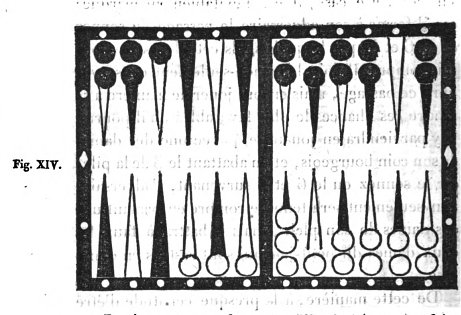

# Exemples de quelques positions auxquelles on peut faire l'application des maximes, ainsi que des avis qui ont été donnés pour bien jouer.

## Lorsqu'on met des dames en demi-case, tâcher d'avoir en sa faveur au moins l'égalité des chances.

LE joueur qui a les dames noires a deux cases dans son grand jan, savoir la huitième et celle du coin; son adversaire a la neuvième case complète, une demi-case sur la sixième flèche, trois dames sur la deuxième et le reste au talon. Ce dernier amène 6 et as; il doit jouer le 6 du talon pour couvrir la demi-case de la sixième flèche; mais il ne doit pas abattre l'as de la pile, car cette dame ne pourrait être battue qu'à vrai par le 6 et 5. Mais s'il joue l'as de la deuxième case, il y a partage pour le 9 par lequel cette dame peut être battue; puisqu'ayant contre lui 5 et 4, il a en sa faveur 6 et 3, il a en outre la chance du sonnez. De tout cela il résulte que cette dernière manière de jouer est plus convenable.

## Ne pas s'exposer à être battu à vrai par les dés que l'adversaire n'a pas pour remplir.

Dans la position respective des jeux que présente la figure VII, le joueur qui a les dames blanches a déjà onze trous et huit points; il a, pour remplir et gagner la partie, vingt chances et par conséquent seize contraires, dont chacune pourrait le mettre dans un danger bien évident de perdre la partie. Dans cet état le joueur aux dames noires, qui a aussi huit points, amène un 6 et as avec lequel il pourrait faire la case de la huitième flèche; mais un examen réfléchi de la position comparée des jeux et de l'état de la partie, lui fera connaître qu'il ne doit pas la faire, Par-là en effet aux vingt chances que son adversaire a déjà pour gagner, il en ajouterait cinq autres, savoir quine, 6 et 5, et 5 et 3, par lesquelles la dame qu'il a en demi-case dans son petit jan à la quatrième flèche, se trouvant battue à vrai, le gain de la partie serait assuré à cet adversaire; tandis que par un de ces trois coups la perte en eût été inévitable, si cette case n'eût pas été faite. Pour éviter de lui fournir une pareille ressource, il doit donc jouer le 6 en portant à la dixième flèche la dame en demi case de la quatrième, et l'as en couvrant la demi case de la deuxième flèche avec celle de la première. Par cette sage prévoyance on évite de donner à l'adversaire des chances que la nature de son jeu lui refuse.

Cet exemple est applicable à la partie à écrire comme à la partie en douze trous.

## Prévoir le coup unique par lequel on peut être battu.

Les joueurs passent mutuellement au jan de retour. Celui qui a les dames blanches a huit points; il a quatre dames sur la neuvième flèche, deux sur la dixième, huit au coin de repos, et une à la deuxième flèche du petit jan de son adversaire. Celui-ci a dix points, et il a dans son grand jan les cases neuvième, dixième, et le coin. Le premier joueur amène 2 et as; il joue sans trop de réflexion son as 'de la neuvième case à la dixième, et son deux de la deuxième flèche au talon du petit jan de son adversaire. C'est mal joué; car, si le coup suivant il amène double deux ( et c'est le seul point qu'il ait à craindre pour découvrir son jeu ), il est obligé de le jouer de la neuvième case au coin, et de laisser une dame découverte à cette neuvième case. Ce coup pouvait d'autant mieux se prévoir qu'il est unique, et l'on eût évité le danger en jouant le 2 et as avec les deux dames surnuméraires de la neuvième case sur les dixième et onzième. Cela prouve qu'il ne faut rien négliger, surtout quand le dé est unique.

## Profiter de la seule chance qu'on a pour obliger l'adversaire à rompre son plein.

Les joueurs ont fait chacun le plein de leur grand jan. Celui qui a les dames blanches a huit points et l'autre en a quatre. Ce dernier a deux dames en surcase sur la septième flèche et une sur la neuvième. Le premier joueur a deux dames surnuméraires à la sixième case et une à la septième, conséquemment il n'y a rien pour l'empêcher de tenir; il est sûr du marqué, quand ce sera à lui à jouer, si le jeu reste ainsi. Le joueur aux dames noires amène 5 et 4, il est obligé de rompre son plein en jouant le 5 avec une des deux dames de sa sixième case. Quant au 4, il paraîtrait assez naturel au premier aperçu, de le jouer avec une des dames surnuméraires de la septième case; mais on doit faire observer qu'alors l'adversaire n'aurait rien qui l'empêchât de tenir, de prendre le trou et de marquer; et c'est ce qu'il faut empêcher. Il convient conséquemment de jouer le 4 avec l'autre dame de la sixième case qui par-là reste ouverte, ce qui donne sept chances pour que le premier joueur rompe son plein. Il n'a en effet pour tenir, en amenant les 6, que 6 et 5, et 6 et 4, qui donnent quatre chances, conséquemment il y en a sept pour rompre.

Quand même il ne manquerait à l'adversaire que trois ou quatre trous pour marquer en grande bredouille, ce serait encore le jeu de lever la case entière de la sixième flèche, pour laisser libre ce passage qui lui offre les chances du 6 et 5, et du 6 et 4, par lesquelles il n'allonge pas réellement son jeu, puisqu'il est obligé de jouer dans le jeu de l'adversaire six points que, dans le cas contraire, il n'aurait pas joués pour raison d'impuissance.

De plus, en supposant que par ce moyen on l'oblige à rompre, il laisse en rompant une dame découverte sur laquelle il est possible de prendre le trou, ou au moins quatre ou six points; et on a le même espoir pour le coup suivant, s'il ne remplit pas une seconde fois : chance qui reste pour lui très incertaine.

En ne levant au contraire qu'une dame de la sixième case, si l'autre joueur amène le 6 il bat cette dame, ce qui ajoute quatre points à ceux qu'il gagne pour tenir, sans que le nombre des chances qu'il a pour tenir le coup suivant se trouve di minué.

Enfin, celui qui est obligé de rompre conserve bien mieux, par cette manière de jouer, la force de son jeu; car si le coup suivant il amène terne ou carme, il peut le jouer sans découvrir la septième case, ce qui est pour lui un grand avantage; et de plus il se ménage la chance du sonnez qui lui assurerait presque infailliblement le gain de la partie, en obligeant son adversaire à passer son coin.

## Quand l'adversaire a un jeu serré, il ne faut rien lu

Il faut, quand on le peut, n'exposer aucune dame à être battue à vrai, si l'adversaire a une disposition de jeu qui lui fait craindre l'enfilade; car on ne doit pas lui fournir l'occasion de se tirer d'affaire.

Par exemple, le joueur qui a les dames noires a un jeu presque passé, néanmoins il a rempli, et a marqué quatre points pour son plein; les trois dames surnuméraires sont placées sur les cases sixième, huitième et onzième; il pourrait tenir encore une fois, mais il n'est pas vraisemblable qu'il tienne deux fois. Dans la supposition qu'il tienne une fois, il se mettrait à huit points, et alors il ne convient pas de lui aider à prendre le trou en lui donnant à battre; il vaudrait même mieux passer une dame si l'on amenait un point assez élevé.

Celui qui a les dames blanches à cinq cases dans son grand jan, la dixième lui manque, il a deux dames à la pile et une sur chacune des deuxième quatrième et cinquième flèches. Il amène 6 et 2. Au premier aperçu, il croit devoir jouer son 6 de la pile, et son 2 de la cinquième case; par ce moyen, il prépare ses dames pour remplir, et ôte une dame qui pouvait être battue à vrai, Mais ce serait mal joué; car dans cette position il ne doit pas chercher à allonger son jeu et à se préparer des chances pour remplir; il doit au contraire ne rien laisser à battre à son adversaire, parce que, si ce qui est très possible, cet adversaire battait et tenait tout à la fois, cela lui donnerait huit points qui, joints aux quatre premiers, lui feraient marquer le trou. Ge joueur aux dames blanches doit donc, pour ne pas exposer ses deux dames à être battues, jouer son 2 de la deuxième sur la quatrième case, et son 6 de la cinquième sur la onzième : par-là il n'expose rien à être battu à vrai, et il est très probable que l'autre joueur ne tiendra pas deux fois, et conséquemment ne pourra prendre le trou.

## Empêcher l'adversaire de passer son coin

Le joueur aux dames blanches qui occupait primitivement la partie inférieure du tablier a terminé son plein dans son jan de retour, il a huit points, il lui reste encore son coin à passer, et il a une dame surnuméraire au coin bourgeois de l'adversaire. L'autre joueur n'a rien, il a fait les trois premières cases de son jan de retour où il cherche à faire son plein, les trois flèches suivantes sont en demi-case, il a son coin à passer, une dame en demi-case sur la dixième flèche, et une sur chacune des sixième, septième et huitième flèches du grand jan opposé. Il amène 4 et 2; craignant d'être battu sur sa dame découverte à la dixième flèche, il la passe tout d'une sur la septième flèche du grand jan de l'adversaire. C'est mal joué, car il devait chercher à gêner le passage du coin du premier joueur pour l'obliger à rompre au coup suivant. En jouant comme il a fait, il ne pouvait le favoriser davantage; car s'il n'eût pas levé la dame en demi-case, il aurait augmenté la difficulté de passer le coin, puisque, outre les onze chances de l'as, il en opposerait encore quatre autres par le 5 et 2 et le 4 et 2, qui, empêchant le passage du coin, forceraient à rompre le plein.

Quoique la dame en demi-case sur la dixième flèche puisse être battue, il n'en peut résulter aucun préjudice pour le joueur à qui elle appartient; car, le beset et le double deux exceptés, cette dame battue ne peut donner à l'adversaire que deux points qui ne complètent pas le trou; et même l'un ou l'autre de ces dés survenant, leur influence serait nulle, puisque, par ces mêmes points, ce joueur obtient le trou par la conservation du plein.

## Ne pas s'exposer inutilement à être marqué de quatre trous au lieu de deux.

Le joueur qui a les dames blanches à dix points, son grand jan plein, et ses trois dames surnuméraires placées, savoir: deux au coin bourgeois et la dernière à la neuvième flèche, position qui indique la certitude du trou, mais en même temps la nécessité de s'en aller en le prenant, quelque point qu'on amène. L'adversaire a cinq cases complètes dans son grand jan, la dixième est vide, le surplus de ses dames est placé, savoir: deux à la troisième flèche, une à la cinquième et les deux autres en surcase à la sixième. Dans cette position cet adversaire amène 4 et 3. Un joueur irréfléchi, occupé uniquement à se procurer un beau jeu et une position avantageuse, croira devoir jouer ce 4 et 3, en mettant tout d'une une dame de la troisième flèche dans la dixième qui est vide. En jouant ainsi il commettra une faute grave, et dont un plus mûr examen lui ferait facilement apercevoir le danger. En effet, si son adversaire amène au coup suivant quine, carme, terne, double deux, 5 et 2, ou 5 et 3, il prendra quatre trous, tandis que dans tout autre cas il n'aurait jamais pu en gagner que deux. D'un autre côte, le beau jeu qu'il croit se préparer pour les coups suivants est une spéculation illusoire, puisque l'autre joueur, quelque point qu'il amène, sera dans la nécessité de s'en aller et de terminer le relevé. Ainsi sans but et sans motif il fournit plusieurs é moyens de prendre quatre trous à son adversaire qui, dans tout autre cas, ne peut jamais en gagner plus de deux. Quelque surprenante que paraisse une semblable imprévoyance, nous pouvons assurer néanmoins que les exemples en sont fréquents parmi les joueurs dont l'expérience n'a pas suffisamment mûri les spéculations.

Le joueur qui a amené 4 et 3 doit donc, par une sage prévoyance, jouer le 4 avec une des dames de ¡la troisième case, et le 3 avec une de celles qui sont en surcase à la sixième flèche : car, en jouant ainsi, il ôte à son adversaire tous les moyens possibles soit de rester, soit de prendre quatre trous. Nous avons rédigé cet exemple pour faire con naître combien il est important de s'habituer à comparer les avantages et les dangers de chaque manière de jouer.

## Lorsqu'il n'y a qu'un ou deux coups de dés qui puissent faire éviter le marque, on doit jouer de manière à se les rendre favorables, si cela est possible.

Le joueur qui a les dames blanches est supposé avoir cinq trous et huit points, son plein terminé et ses trois dames surnuméraires placées à la sixième flèche. Celui qui a les dames noires n'a ni trous ni points. Il a quatre cases dans son grand jan, la sixième et la huitième sont vides; le surplus de ses dames se trouve placé dans le petit jan, savoir: deux au coin bourgeois, une à chacune des troisième et quatrième flèches, les trois autres au talon. Dans cette position le joueur aux dames noires amène 4 et 3. Ce point lui offre un moyen bien séduisant de faire case à la huitième flèche, en y portant la dame de la quatrième et une du coin bourgeois mais. s'il fait cette case, il est inévitablement marqué; car il ferme à son adversaire le passage du sonnez et du 6 et 5, par lesquels seuls cet adversaire pouvait rompre. Il doit donc non seulement conserver libre ce passage, mais encore jouer de manière à se rendre ces chances le plus favorables qu'il pourra. Il y parviendra en jouant le 4 avec une des dames de son coin bourgeois, et en abattant le 3 de la pile : car le sonnez ou le 6 et 5 survenant, l'adversaire non seulement sera tenu de rompre en passant une des dames de son plein, mais il battra à faux les deux dames du petit jan qui sont restées en demi case.

De cette manière, à la presque certitude d'être marqué en bredouille succédera, en faveur du joueur aux dames noires, l'espoir très probable de marquer lui-même son adversaire en bredouille et si ce marqué faisait la différence du postillon, cette différence ferait encore mieux connaître l'utilité de notre précepte, et en général l'importance de s'attacher à bien jouer les décisifs.

## Position dans laquelle le besoin de gagner quatre points pour prendre le trou le coup suivant et s'en aller, est balancé par la crainte d'avoir deux dames battues à faux qui donneraient le trou, et obligeraient de rester.

Le joueur aux dames noires ca cinq cases faites dans le grand jan, la dixième seule est vide, le surplus des dames est à la pile, ou sur les flèches qui en sont les plus rapprochées. Ce jeu par conséquent est très arriérés, comparativement à celui des dames blanches dont le grand jan est plein, à l'exception de la septième flèche qui est en demi-case. Les quatre autres dames occupent les troisième, quatrième et cinquième flèches, et la sixième en surcase. Dans cet état le joueur qui a les dames blan ches amène 6 et as, il marque quatre points, et remplit par l'as. Il lui reste un 6 à jouer; d'un côté il a besoin d'être battu à faux pour arriver à huit points, et s'en aller le coup suivant en prenant le trou; d'autre part de quelque manière qu'il joue son 6, il faut nécessairement qu'il laisse deux dames découvertes. Si ces deux dames sont battues à faux, il sera forcé de prendre le trou, et ne pourra s'en aller, ce qui l'exposera au danger d'une enfilade. Dans cette alternative laquelle des trois dames doit-il enlever pour jouer le 6? Des joueurs irréfléchis n'hésiteraient pas à le jouer avec la dame de la quatrième flèche, croyant par - là éloigner ou affaiblir le danger qu'ils redoutent: mais, s'ils consultaient les calculs, ils reconnaîtraient qu'au lieu d'affaiblir le danger, ils l'augmentent en jouant ainsi. Car, en laissant les dames de la troisième et de la cinquième flèches, sept chances leur donneront le trou' qu'ils ont intérêt de ne pas recevoir, savoir: le nombre 9 qui en produit quatre, les nombres 11 et 12 qui ensemble en produisent trois. En laissant au contraire la dame de la quatrième flèche et celle de la cinquième, il n'existera que six chances qui forceront à marquer le trou, savoir les nombres 10, 11 et 12; il faut même excepter de ces six chances le quine et le sonnez qui donneraient le trou, sans bouger : et alors la permanence des quatre points déjà acquis rendrait le danger presque nul pour les coups sub séquens. L'étude des calculs leur ferait aussi connaître un inconvénient qui mérite bien d'être apprécié; c'est qu'en ôtant la dame de la quatrième flèche, ils se privent de cinq chances que produit le nombre 8 pour recevoir quatre points dont le gain établit leur sécurité, et leur donne la certitude d'obtenir le trou le coup suivant par leur propre dé, et par conséquent la faculté de s'en aller.

## Importance dans certains cas de se préparer un coup qui puisse donner le trou, et par là le droit de s'en aller.

Le joueur qui a les dames noires a son plein fait; ses dames surnuméraires sont placées, l'une au talon et les deux autres sur les première et deuxième flèches de son petit jan; et il a quatre points. Le joueur aux dames blanches n'a pas de points, il à son grand jan plein, à l'exception d'une demi-case qui reste à couvrir à la septième flèche, ses autres dames sont placées, savoir: une à la troisième flèche, deux à la sixième en surcase et la dernière sur le coin de repos.

Dans cette position ce joueur amène 3 et 2 qui ne remplit pas. Il croira peut-être devoir jouer ce coup tout d'une, avec une des dames de la sixième case, afin de se réserver, pour remplir, un point plus élevé; il aurait tort. En effet, s'il joue de cette manière, il n'aura pour le coup suivant aucune chance suffisante pour gagner le trou, et sa perte sera inévitable. Quand même il remplirait de deux manières soit par 4 et as, soit par 3 et as, il n'en retirerait aucun avantage utile, puisque l'adversaire est assuré de prendre le trou avant lui. Il doit donc jouer le 3 avec une des dames de la sixième case, et le 2 avec celle qui est à la troisième flèche; parcé qu'en jouant ainsi, il se donne pour le coup suivant un béset par lequel, remplissant de deux manières, il gagnerait deux trous et le droit de s'en aller. Parlà il se ménage de plus la chance d'être battu à faux sur la dame placée à la cinquième flèche, ce qui lui donnerait quatre points; et il ajoute à la chance du béset celle du 2 et as, par laquelle, remplissant de deux manières, il gagnerait encore les deux trous.

## Prévoir si un coup de dés peut rétablir un jeu qui parait désespéré.

Par l'effet d'une série de dés contraires, le joueur, qui a les dames blanches a quatre dames surnuméraires à son coin de repos, et son plein rompu par la sixième case où il n'a plus qu'une dame, et c'est à lui à jeter les dés. Son adversaire a déjà douze trous ou plus en bredouille avec quatre points de reste, et la faculté de jouer sans rompre, quine et 6 et 5. Ce jeu pourrait paraître sûr, il semble même qu'il n'y ait rien contre; car, comme c'est au joueur anx dames blanches à jeter les dés, s'il amène des 6 il donne à son adversaire des points par l'impuissance de les jouer, et tout autre dé livre passage ou laisse à battre. Maintenant on suppose que ce joueur amène terne, ou 3 et 2, 3 et as, 2 et as, double 2, ou 4 et as. Il semblerait d'abord qu'il devrait jouer de manière à se faire battre le moins possible, on serait dans l'erreur. Il doit au contraire mettre en demi-case les septième et huitième flèches, qui, jointes à celle de la sixième, présentent la chance unique d'être battu à faux par le terne pour pouvoir gagner le trou. Si ce joueur avait quatre points, il devrait se contenter de mettre en demi-case la septième flèche qui, jointe à celle de la sixième, lui donnerait les deux chances de terne et carme pour compléter le trou. De plus, en jouant de la manière indiquée, on fortifie la neuvième case, ce qui, comme on sait, est très avantageux pour contrarier les succès de l'adversaire.

Nous nous bornerons à ce petit nombre d'exemples; ils suffisent pour faire connaître combien, dans des positions critiques et difficiles, il est important et même nécessaire de s'attacher aux maximes que nous avons établies.

