# Les cing tables de combinaisons annoncées dans l'ouvrage, et les tableaux des chances que présentent diverses positions particulières.

## PREMIÈRE TABLE.

Combinaisons des onze points qui peuvent être amenés par différents coups de dés du jeu de Trictrac.

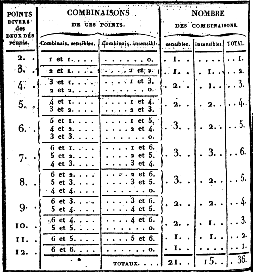

## SECONDE TABLE.

Combinaisons de chacun des six nombres d'un dé réuni successivement à chaque nombre de l'autre dé, et celles résultant de la décomposition de ce nombre.

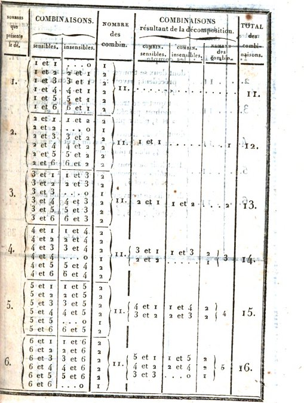

## TROISIÈME TABLE.

Présentant les trente-six chances d'après la méthode décroissante indiquée page 21.

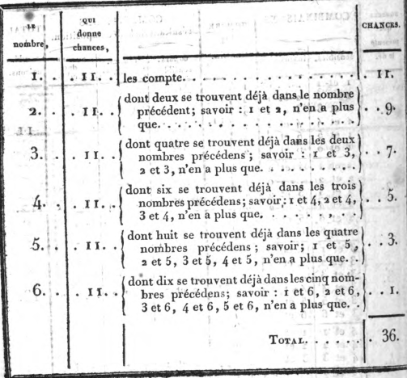

## QUATRIÈME TABLE.

Nombre de chances que l'on a pour achever  son plein, quand il ne reste plus qu'une seule dame à couvrir.

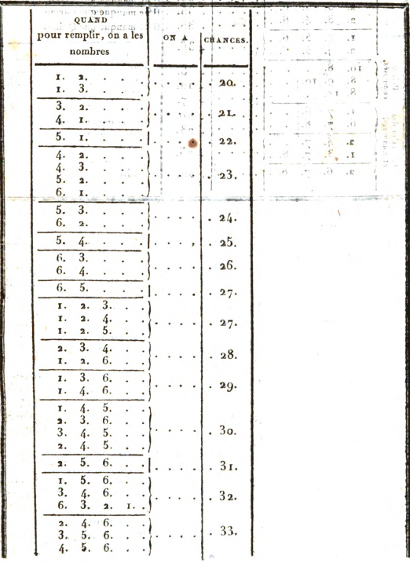
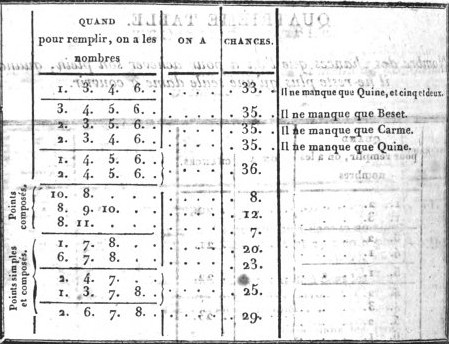

## CINQUIÈME TABLE.

Servant à démontrer l'avantage qu'il y a d'avoir deux demi-cases à couvrir, plutôt qu'une case à faire.

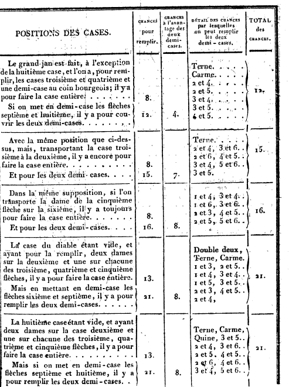
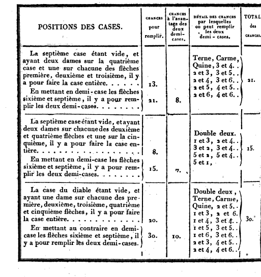

## CALCULS DIVERS.

Nombre des points nécessaires pour faire le plein du grand jan à compter de la pile.

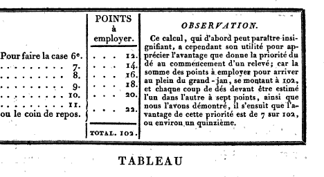

## TABLEAU du nombre des points que l'on a pour tenir lorsque les deux grands jans sont pleins, et que l'on n'a plus qu'une dame à jouer.

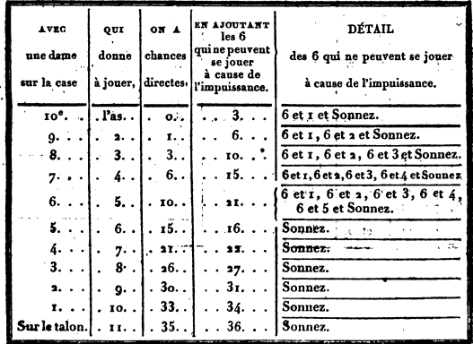

Des chances qu'on a pour conserver le plein avec ou deux ou trois
dames, placées dans différentes positions, lorsque les deux grands-jans
sont respectivement faits.

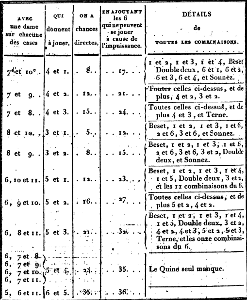

Si l'utilité de ces deux derniers tableaux n'est pas bien sentie par quelques joueurs, nous pensons au moins qu'elle sera appréciée par ceux qui sont accoutumés à soumettre à la justesse des calculs les avantages et les désavantages de chaque position. Ils y trouveront un moyen facile et assuré de se déterminer sur une tenue qui, au simple aperçu, paraîtrait leur présenter une balance à peu près égale de probabilités.

## TABLEAU des chances par lesquelles peuvent être battues à faux les dames en demi-case dans le petit jan, lorsque les deux grands-jans sont faits.

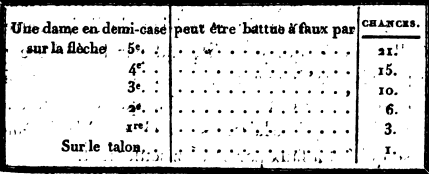

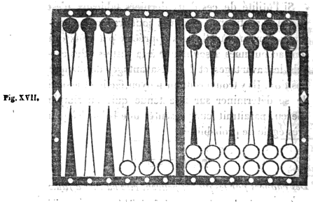

Pour l'intelligence de ce dernier tableau, nous ferons observer que la dame en demi-case sur la cinquième flèche (fig. XVII) peut être battue à faux par les six dames du grand jan de l'adversaire. Celle du coin qui y correspond par le nombre 7 a pour battre six chances, et chacune des cases joignantes a une chance de moins que celle qu'elle précède; ce qui ne laisse qu'une chance à la sixième case qui bat à faux par sonnez seulement.

Cette démonstration suffit pour faciliter l'usage de cette table; car pour l'appliquer aux autres positions, on n'aura qu'à suivre la même progression décroissante d'après la distance et l'éloignement des flèches où se trouverait placée la dame en demi-case.

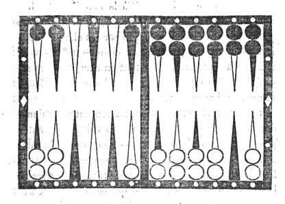

La figure XVIII que nous présentons ici, a pour but d'indiquer la manière dont on doit calculer les diverses chances par lesquelles on peut battre, tant à vrai qu'à faux, une dame exposée en demi-case dans le petit jan. Par exemple, la dame exposée au coin bourgeois, correspondant par le nombre direct 5 à la dixième flèche qui est entièrement vide, peut, lorsque le grand jan opposé se trouve plein, être battue par tous les points qui excèdent le nombre 6. Ces points, comme nous l'avons démontré, produisent vingt et une chances. De ces vingt et une chances neuf seulement battent à vrai; ce sont celles dans la composition desquelles entre le nombre 5 qui y aboutit par le passage ouvert, le seul 5 et as excepté; douze par conséquent la battent à faux.

Si le passage était ouvert à la neuvième flèche, au lieu de l'être à la dixième, cette demi-case ne pourrait être battue à vrai que par les chances dont le nombre 4 fait partie. Ces chances se trouvent réduites à sept, parce qu'il faut en excepter 4 et as, et 4 et 2. Ainsi quatorze chances battraient à faux, et sept seulement à vrai.

En rapprochant ainsi successivement de la dame découverte le passage ouvert, on voit s'augmenter progressivement le nombre des chances qui battent à faux, et diminuer celui des chances qui battent à vrai; en sorte que le passage se trouvant ouvert à la sixième flèche, les chances qui battent à faux s'élèvent à dix-neuf, et celles qui battent à vrai se trouvent réduites à deux.

Si, au lieu de placer la dame en demi-case au coin bourgeois, nous la plaçons sur la quatrième flèche correspondant par le nombre 6 à la dixième qui est vide, les proportions entre battre à vrai et battre à faux ne sont plus les mêmes. La dame, dans cette position, ne peut être atteinte que par les nombres excédant 7, qui ne sont produits que par quinze chances. Neuf de ces chances la battent à vrai; ce sont toutes celles dont le nombre 6 fait partie, le seul 6 et as excepté; ainsi il reste pour la battre à faux six chances seulement.

Si nous supposons le passage ouvert à la neuvième flèche, la dame exposée ne pourra être battue à vrai que par les chances dont le nombre 5 fait partie. Ces chances se réduisent à sept par la nullité du 5 et as, et du 5 et 2: ainsi huit chances battront à faux. En rapprochant, comme dans l'exemple précédent, de la dame découverte, le passage qui aboutit à cette dame, le nombre des chances qui battent à faux s'élève dans la même proportion; et si l'on suppose le passage ouvert à la sixième flèche, il y aura treize chances pour battre à faux contre deux seulement pour battre à vrai.

En portant plus loin ce calcul, et en l'étendant à diverses autres positions, on obtiendra les mêmes résultats proportionnels; d'où l'on doit conclure que plus le passage ouvert est éloigné de la dame découverte, plus la proportion entre battre à vrai et battre à faux se rapproche de l'égalité; et qu'elle s'en éloigne au contraire à mesure qu'on rapproche ce passage, comme on pourra le voir par les deux tableaux suivants.

Ainsi, en supposant d'un côté le plein du grand jan terminé, et de l'autre le plein terminé à l'exception d'une case ouverte, savoir:

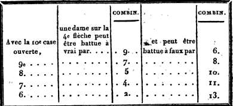

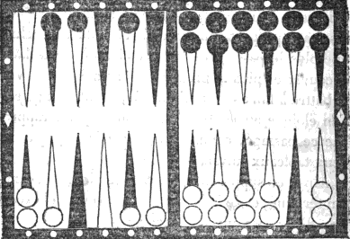

Dans la figure XIX ci-dessus nous supposons le passage également ouvert à la dixième flèche, et deux dames en demi-case dans le petit jan à la quatrième et à la cinquième flèches. La première correspond par le nombre 6 au passage ouvert et la seconde par le nombre 5. Elles ne peuvent être battues ensemble, soit à vrai soit à faux, que par les points qui s'élèvent au-dessus du nombre 7 ; c'est-à-dire par quinze chances. Le seul 6 et 5 bat à vrai l'une et l'autre, parce qu'il est composé des deux nombres directs par lesquels chacune d'elles aboutit au passage. Le seul carme les bat à faux toutes deux, et chacune des douze autres chances bat l'une à vrai et l'autre à faux.

Si nous ouvrons le passage à la neuvième flèche, une des dames y correspondra par le nombre 5 et l'autre par le nombre 4; ainsi elles seront toutes les deux battues à vrai par 5 et 4, qui est la réunion de ces deux nombres. On aura cinq chances pour les battre à faux toutes deux, savoir: sonnez, 6 et 2, et 6 et 3; et par les huit autres chances, on battra l'une à vrai et l'autre à faux. Plus nous rapprocherons ce passage des deux dames en demi-case, plus le nombre des chances par lesquelles on bat à faux les deux dames augmentera, et plus celui des chances qu'on a pour battre l'une à vrai et l'autre à faux diminuera: car elles ne peuvent être battues à vrai toutes les deux ensemble, que lorsque le passage se trouve à la neuvième ou à la dixième flèche.

Nous invitons nos lecteurs à faire l'application de cette méthode aux autres positions : elle ne peut que leur être utile dans un grand nombre de circonstances.

---

Ici se termine la tâche que nous nous sommes imposée en formant le projet de mettre au jour ce traité.

Notre but a été de réunir et de présenter aux amateurs avec ordre, clarté et précision, tous les éléments dont se compose la théorie du Trictrac, en y joignant les instructions propres à en perfectionner la pratique. Nous n'avons rien négligé de ce qui a paru nécessaire à l'exécution de ce plan. Après avoir, par une analyse exacte et détaillée de toutes les combinaisons que produisent les deux dés réunis, posé ainsi les bases de tous les calculs et fait connaître toutes les chances qui en résultent; après avoir, par des méthodes sûres et nouvelles, rendu prompte et facile l'application de ces calculs aux diverses positions, nous avons parcouru la révolution entière du Trictrac, en nous arrêtant successivement à ses différentes phases, qui sont, le petit jan, le grand jan, le jan de retour et la sortie des dames. Nous avons indiqué la conduite qu'exigent ces diverses parties; nous avons exposé les dangers et les avantages que chacune d'elles peut offrir, et nous avons donné les moyens de se garantir des uns et de profiter des autres.

La rédaction du chapitre III, des règles, est dans cet ouvrage ce qui nous a présenté le plus de difficultés. Détruire des abus invétérés, contraires aux principes, souvent à la justice; discerner les règles qui sont restées en vigueur d'avec celles qui sont tombées en désuétude; concilier la sévérité de quelques-unes de ces règles avec les modifications et les tempéraments adoptés presque unanimement dans les sociétés où règnent l'urbanité et la loyauté; combattre des erreurs, quelquefois accréditées par des hommes dont les lumières et l'expérience sont d'ailleurs bien reconnues; lutter par la force des principes et de la raison contre des objections spécieuses et même séduisantes, tels sont les obstacles que nous avons eu à surmonter. Chaque fois qu'il nous a fallu combattre une dissidence d'opinions, nous avons appuyé nos décisions de motifs raisonnés que nous soumettons à l'examen des connaisseurs. Ceux qui consulteront ce traité pourront apprécier le zèle avec lequel nous avons recherché la vérité, et les soins que nous avons pris pour la trouver. C'est à eux à juger si nous avons réussi.

L'exposition que nous venons de mettre sous les yeux de nos lecteurs de tout ce qui appartient à la théorie du Trictrac, et de la résistance que cette théorie ne cesse d'opposer aux caprices du hasard, nous a suggéré la pensée d'ajouter à ce traité un appendice dont l'objet, quoique étranger à la doctrine du Trictrac, pourra néanmoins offrir quelque intérêt aux amateurs qui savent apprécier le mérite de ce jeu, et le préfèrent, par cette raison, à tout autre. Le but de cet appendice est de justifier cette préférence par une comparaison motivée entre le Trictrac et ceux des autres jeux qui concourent plus spécialement aux amusemens des sociétés, même les plus distinguées. Nous avons choisi à cet effet le Backgammon, le Piquet et les Échecs, parce que ce sont ceux qui, par leurs combinaisons et la variété des spéculations qui en dérivent, exigent plus de sagacité et de réflexion de la part des personnes qui y consacrent quelques heures de loisir et de distraction.
