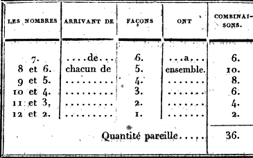

# Chapitre II. Analyse des différentes combinaisons que donnent les deux dés réunis, et figure représentative du Trictrac

POUR l'intelligence des préceptes et exemples, qui sont contenus dans ce traité, on a employé souvent des figures semblables à celle ci-dessus.

La flèche où sont les quinze dames en pile, est appelée le talon ou la pile; les autres sont numérotées suivant l'ordre que les joueurs observent en abattant leurs dames, en commençant dans le petit-jan, depuis 1 jusqu'à 5, qui est le coin bourgeois; et continuant dans le grand-jan, depuis 6 jusqu'à 11, qui est le coin de repos.

On a indiqué dans les figures les points des joueurs, en représentant par de petits ronds les jetons qui servent à les marquer; et le nombre de trous est désigné en bouchant celui où les joueurs doivent avoir le fichet qui les marque dans les bandes qui se trouvent devant chacun d'eux. Dans les bandes latérales on a bouché pareillement le trou qui doit recevoir le pavillon, quand on a voulu désigner le joueur qui l'a de son côté. Lorsqu'il y a plus de deux dames sur une case, un chiffre annonce leur quantité..

## Des combinaisons des dés.

Chaque dé représentant sur chacune de ses six faces un nombre différent, depuis et compris jusques et compris 6, il s'ensuit que les deux dés réunis peuvent donner onze nombres divers, depuis inclusivement jusqu'à 12 aussi inclusivement; car on sent que l'unité qui est indivisible, ne peut être le produit de deux dés réunis. (Voyez la table I, chapitre XV.)

De ces onze nombres il y en a quatre dont chacun ne peut être produit que par un seul et même coup, parce qu'ils ne peuvent être composés que par les mêmes points et par les mêmes éléments. Ainsi le nombre 2 ne peut être formé que par deux as; le nombre 3 ne le peut être que par un 2 et un as, le nombre 11 que par un 6 et un 5, et le nombre 12 que par deux 6. Mais chacun des sept autres nombres peut être produit par différents coups, composés de points ou d'éléments totalement dissemblables. Ainsi le nombre 4 peut arriver par un 3 et un as, ou par un double 2; le nombre 5, par un 4 et un as, ou par un 3 et un 2; le nombre 9, par un 6 et un 3, ou par un 5 et un 4; le nombre 10, par un 6 et un 4, ou par deux 5: d'où il résulte chacun de ces quatre nombres peut être formé par deux coups absolument dissemblables. Quant aux trois autres nombres, chacun d'eux peut être produit par trois divers coups, savoir : le nombre 6, par un 5 et un as, ou par un 4 et un 2 ou par deux 3; le nombre 7, par un 6 et un as, ou par un 5 et un 2, ou par un 4 et un 3;
enfin le nombre 8, par un 6 et un 2, ou par un 5 et un 3, ou par deux 4.

De cette analyse il résulte que les onze nombres que donne la réunion des deux dés par leur diverse composition, peuvent survenir par vingt et un coups différents.

De ces vingt et un coups il y en a six qu'on appelle doublets, parce qu'ils sont produits par la réunion de deux nombres semblables. Ces six doublets ne peuvent arriver que par une seule chance ou combinaison, puisqu'il faut nécessairement que chacun des dés présente la même face: ainsi, pour donner un terne, il faut que l'un et l'autre dé offrent la face du 3. Il n'en est pas de même des quinze autres coups, appelés, par opposition, coups simples, qui sont produits par des points dissemblables. (Les combinaisons produites par ces coups simples sont désignées, dans nos première et seconde tables, par la qualification de sensibles et insensibles.) Prenons pour exemple le 6 et le 4: on sent que le dé qui a donné le 6 aurait pu donner le 4, et que le dé qui a donné le 4 aurait pu donner le 6; ainsi le même coup pouvait arriver par deux chances différentes. Pour rendre plus sensible cette vérité un peu abstraite, on peut supposer que les deux dés soient de couleur différente, l'un blanc et l'autre rouge; qu'en les jetant ils donnent 6. et 4, de manière que le dé blanc présente la face 6, et le dé rouge la face 4; qu'ensuite on les jette de nouveau, et qu'ils donnent encore le même 6 et 4, mais qu'à ce dernier jet le dé blanc présente la face 4, et le dé rouge la face 6: voilà bien le même point produit de deux manières évidemment distinctes et différentes. Pour ajouter, s'il est possible, à la conviction que donne cette démonstration, on peut encore supposer que le joueur qui jette ces deux dés de couleur différente engage le pari que, quelque coup qu'il amène, le plus fort, point sera donné par le dé blanc. Si les dés amènent 6 et 4, de manière que le 6 soit amené par le dé blanc, il gagne son pari. Supposons maintenant qu'offrant la revanche, qui est acceptée avec les mêmes conditions, -il jette une seconde fois les dés, qui donnent encore 6 et 4, mais de manière qu'à ce second coup ce soit le dé rouge qui présente la face 6, et le dé blanc la face 4, ce même joueur qui avait gagné le premier pari perd alors le second. Le même point 6 et 4 est donc bien réellement produit par deux chances essentiellement distinctes et différentes, puisque l'une fait gagner le pari, et que l'autre le fait perdre. Il résulte, de cette démonstration que chacun des quinze coups produits par deux points dissemblables arrive par deux chances bien distinctes, et que par conséquent ces quinze coups en donnent trente, qui, jointes au produit des six doublets, dont.chacun n'arrive que par une chance unique, donnent en total _trente-six chances_.

---

Il est facile de voir qu'un nombre quelconque d'un dé, combiné successivement avec les six nombres de l'autre dé, entre dans la composition des onze chances que donne chaque nombre (voyez la seconde table, chapitre XV): car, en prenant pour exemple le nombre 6, et le combinant d'abord avec le même nombre de l'autre dé, il forme un doublet qui donne une chance unique; puis, le combinant successivement avec les cinq autres nombres, il forme cinq coups, lesquels, comme nous venons de le démontrer, donnent chacun deux chances; ce qui, avec le doublet, fait en total onze chances. Ainsi celui qui, pour couvrir une dame, n'a qu'un nombre direct qui y aboutit, a réellement onze chances pour la couvrir. S'il avait deux nombres directs, il paraîtrait avoir vingt-deux chances: mais, comme un de ces nombres a déjà été compris dans le calcul des onze chances du premier, il faut en déduire pour ce double emploi un coup qui forme deux chances; ce qui en réduit le nombre à vingt. Pour rendre ce calcul plus clair et plus sensible, on peut supposer qu'on a pour couvrir une dame un 6 et un 5: chacun de ces deux nombres isolé donnerait à la vérité onze chances; mais ces deux nombres réunis n'en donnent que vingt, parce que dans le calcul des chances du 6 se trouve le 6 et 5, et que dans le calcul des chances du 5 se trouve le 5 et 6; ce qui fait évidemment un double emploi. Pour éviter ce double emploi, lorsqu'on a deux nombres directs, on compte le premier pour onze, et le second seulement pour neuf. Si on a trois nombres directs, comme il y a double emploi sur le second et double emploi sur le troisième, on compte le premier pour 11, le second pour 9, et le troisième pour 7. On ôte de la même manière deux points pour chaque nombre direct que l'on a de plus, parce qu'il se trouve un double emploi de plus; ce qui donne la progression décroissante de II, 9, 7, etc., conformément à la troisième table, chapitre XV. Enfin, pour continuer cette analyse, et ne rien laisser à désirer à cet égard, on doit faire observer qu'un nombre quelconque (l'as seul excepté) est susceptible de se diviser et de se décomposer en deux nombres élémentaires dont la réunion forme ce même nombre: par exemple, le nombre 6 peut se décomposer en un 5 et un as, en un 4 et un 2, ou en deux 3. Cette division ajoute cinq chances aux onze qu'il donnait déjà. Il en résulte que celui qui n'a, pour couvrir une dame, qu'un 6 direct, a réellement seize chances au lieu des onze indiquées ci-dessus.

Le point de 5 se décompose en un 4 et un as, ou en 3 et un 2, ce qui fait quatre chances de plus; ainsi ce point donne quinze chances au lieu de onze.

Le nombre 4 se décompose en un 3 et un as, ou en double 2, ce qui fait trois chances de plus; ainsi ce point donne quatorze chances au lieu de onze.

Le nombre 3 se divise en un 2 et un as; ainsi il donne treize chances au lieu de onze.

Enfin le nombre 2 se divise en deux as; il donne donc douze chances au lieu de onze.

Ainsi, sur les trente-six combinaisons qui appartiennent aux deux dés,

- le 6 en a .... 16
- le 5 en a .... 15
- le 4 en a .... 14
- le 3 en a .... 13
- le 2 en a .... 12
- le 1 en a .... 11

Pour simplifier ce calcul, et pour savoir de suite combien chaque nombre d'un dé combiné avec les divers nombres de l'autre dé donne de chances effectives, tant directement que par sa décomposition, il faut ajouter 10 à chacun des nombres 1, 2, 3, 4, 5 et 6. De cette manière on trouvera les onze, douze, treize, quatorze, quinze et seize combinaisons du tableau ci-dessus.

On appelle chances directes, celles que fournissent chacun des six nombres d'un dé aboutissant directement à une flèche quelconque; et par opposition chances indirectes, celles qui sont le produit de deux nombres joués _tout-d'une_. Il résulte de là que celui qui, pour remplir, n'a que le point de 7, pas de chances directes, mais qu'il a six chances indirectes.

## Analyse des dés

_Méthodes pour connaître, par un aperçu prompt et facile, le nombre de
chances qu'on a pour remplir quand il ne reste plus qu'une demi-case à
couvrir._

### Première méthode.

Cette méthode est fondée sur la progression décroissante 11, 9, 7, etc., dont nous venons de donner la démonstration....

Lorsqu'on n'a qu'un nombre direct pour remplir, on ajoute 10 à ce nombre; le total donne le nombre des chances par lesquelles on peut remplir, savoir : les onze chances inhérentes à chaque nombre plus celles produites par la décomposition de ce nombre.

Si l'on a deux nombres directs, on compte vingt chances, savoir: onze pour l'un de ces nombres, et neuf seulement pour l'autre à cause du double emploi, comme nous l'avons déjà expliqué; en ayant toujours soin d'ajouter les produits de la décomposition de ces nombres, sauf les doubles emplois résultant de cette décomposition (Voyez l'analysé ci-dessus). Ainsi le joueur qui, pour couvrir une demi-case, a un 6, plus un 5, compte vingt-sept chances; savoir, onze pour l'un de ces nombres et neuf pour l'autre; plus, pour la décomposition du 6 par 4 et 2, et par terne trois chances (le 5 et as faisant double emploi) : en y joignant la décomposition du 5 par 3 et 2, et par 4 et as, qui donne quatre chances, cette réunion forme un total de vingt-sept chances. S'il avait un 6 et un 3, il n'aurait que vingt-six chances, savoir vingt pour les deux dames directes; plus, pour la décomposition. du 6 par 4 et 2, et par 5 et as, quatre chances (le terne faisant double emploi); plus, la décomposition du 3 par 2 et as.

**Utilité de cette méthode dans deux autres cas.**

Cette progression décroissante a sur toutes les autres méthodes l'avantage bien important de servir à faire connaître non seulement les chances que l'on a pour remplir, quand il ne reste plus à couvrir qu'une demi-case, mais encore à faire apercevoir, au premier examen, les chances qu'on a pour battre, par les points directs, les dames exposées en demi-case.

Elle est encore très utile pour faire connaître, au premier aperçu, le nombre de chances qui s'opposent au passage du coin à l'époque du jan de retour. Par cette méthode en effet on aperçoit de suite que l'as, qui, dans tous les cas, est un obstacle au passage du coin, donne onze chances contre ce passage; qu'il y en a vingt, si l'adversaire a encore une de ses flèches garnie de dames; vingt-sept s'il a deux
flèches garnies, etc.

### Seconde méthode pour connaître le nombre de l'on a pour remplir, lorsqu'il ne reste plus qu'une demi-case à couvrir.

Cette méthode, qui n'est applicable qu'au cas particulier que nous indiquons, pourra paraître préférable à la précédente, parce que l'opération qu'elle exige est plus simple et plus prompte, et qu'elle n'a pas besoin, comme les précédentes, d'une opération subséquente pour la décomposition de chacun des nombres, ce qui exige plus de travail, et peut être sujet à des oublis.

On prend pour base du calcul qui est à faire, ou le nombre 16 ou le nombre 18, suivant la quantité des dames que l'on a pour remplir, ainsi que nous allons l'expliquer.

Si l'on a deux nombres directs aboutissants à la demi-case, on établit pour base du calcul le nombre 16, auquel on ajoute la quantité numérique de chacun de ces points directs; si l'un d'eux se trouve être la moitié de l'autre, on ajoute une unité : ces quantités réunies forment le nombre exact des chances qu'on a pour remplir. Ainsi, ayant pour remplir l'as et le 2, on compte d'abord 16, plus 3 pour les quantités réunies de ces deux points, plus 1, parce l'as est la moitié de 2; ce qui fait un total de vingt chances que ces deux points directs donnent pour remplir.

Si l'on a trois nombres aboutissants directement à la demi-case, on compte d'abord 18; on y ajoute la quantité numérique de chacun des points aboutissants, plus une unité, si l'un des points se trouve être la moitié d'un des autres points; enfin on ajoute encore deux unités de plus, lorsque deux des nombres directs réunis sont égaux en quantité au troisième. Ainsi, en supposant qu'on ait pour remplir les nombres 1, 2 et 3, on compte d'abord 18, et l'on y ajoute ensuite trois, plus deux, plus un; on ajoute encore une unité, parce que 1 est la moitié de 2, plus deux autres unités, parce que 2 et I réunis sont égaux à 3: ainsi on aura dans cette position vingt-sept chances pour remplir, savoir: dix-huit d'une part, plus six montant des quantités numériques réunies de ces trois points directs, plus trois unités pour les rapports indiqués que ces points ont entre eux.

Si l'on a quatre nombres directs, on reprend pour base du calcul le nombre 16, comme on l'a fait pour deux nombres directs. Mais, comme il est plus prompt et plus facile de chercher les nombres qu'on a pour ne pas remplir, que ceux qui sont favorables au plein, nous pensons que dans cette position une méthode est inutile.

Soit qu'on suive l'une ou l'autre de ces méthodes, il faut, pour connaître exactement le nombre des chances que l'on a pour remplir, avoir égard à celles que pourraient donner les deux points réunis, toujours en évitant les doubles emplois. Si, par exemple, on avait pour remplir un 4 et un 2, qui donnent vingt-trois chances, et qu'on eût encore une dame qui par le nombre 7 aboutît tout-d'une, il faudrait ajouter deux autres chances au vingt-trois ci-dessus; car on pourrait aussi remplir par le 6 et as, dans la composition duquel n'entrent comme élément ni le 4 ni le 2. On doit faire observer que le 4 et 3, et le 5 et 2, qui forment également le nombre 7, feraient double emploi, puisqu'ils sont déjà compris dans le premier calcul. Dans cette position on aurait done vingt-cinq chances au lieu de vingt-trois.

qu'offrent les différentes positions pour remplir d'une manière, lorsqu'il ne reste plus qu'une dame en demi-case à couvrir, nous allons en donner une qui fait connaître, par un calcul prompt et facile, combien on a de chances pour couvrir de deux manières cette demi-case. Nous terminerons par l'exposition d'un calcul qui fait connaître avec la même facilité le nombre de chances qu'on a pour remplir lorsqu'il reste une ease entière à faire.

### Méthode pour connaitre combien on a de chances pour remplir de deux manières, lorsqu'il ne reste plus qu'une demi-case à couvrir.

Si l'on a quatre nombres aboutissant directement à la demi-case, on prend pour base du calcul le nombre 24; on déduit de ce nombre autant d'unités qu'il se trouve de points qui sont la moitié d'un des autres; on en déduit en outre quatre unités si deux des nombres sont égaux en quantité à l'un des deux autres nombres. Ce qui reste, après ces déductions faites, indique le nombre des chances qu'on a pour remplir de deux manières.

Soit pour exemple 6, 4, 2 et 1. On compte d'abord 24, on en déduit deux unités, parce que 1 est la moitié de 2, et parce que 2 est la moitié de 4; on déduit en outre quatre unités, parce que 4 et 2 réunis sont égaux au nombre 6. La somme des soustractions à faire se montant à 6, il reste dixhuit chances pour remplir de deux manières.

Autre exemple: Si l'on a pour remplir les nombres directs, 4, 3, 2 et 1, on n'aura pour remplir de deux manières que quatorze chances; car, prenant pour base le nombre 24, il faut en déduire d'abord deux unités, parce que 1 est la moitié de 2, et 2 la moitié de 4 il faudra déduire en outre huit autres unités, parce que 1 et 2 réunis sont égaux au nombre 3, et pareillement les nombres 3 et 1 réunis sont égaux au nombre 4: ainsi, la quantité à soustraire étant de 10, il ne reste, comme nous l'avons indiqué, que quatorze chances.

Si au contraire ces quatre nombres directs étaient composés d'un 6, d'un 5, d'un 4 et d'un 3, on aurait pour remplir de deux manières vingt-trois chances, parce qu'il n'y aurait à déduire qu'une seule unité pour le 3, qui se trouve être la moitié de 6; les autres motifs de déduction ne se rencontrant pas dans cette position.

Si l'on n'a pour remplir que trois nombres directs, on prend pour base du calcul le nombre 12 au lieu de 24; on fait, s'il y a lieu, les mêmes déductions que celles précédemment indiquées.

Soit pour exemple 6, 4 et 2, on soustrait d'abord du nombre 12 une unité, parce que 2 est la moitié de 4; et de plus quatre unités parce que 4 et 2 réunis sont égaux au nombre 6: ainsi il reste sept chances pour remplir de deux manières.

Autre et dernier exemple: Soient les nombres. directs 5, 3 et 1. Cette position donne pour remplir de deux manières douze chances, parce qu'elle n'offre rien qui donne lieu à aucune soustraction.

Si enfin l'on n'a pour remplir que deux nombres directs, on prend pour base du calcul le nombre 4, sur lequel on déduit une unité si un nombre est la moitié de l'autre.

La comparaison de ces différents exemples entre eux nous fournit une observation que nous ne devons pas négliger, c'est que les méthodes, quoique fondées sur des calculs, varient dans leur application selon la diversité des positions. Ainsi lorsqu'il s'agit de remplir d'une manière, en couvrant une demi-case, le calcul nous indique que les nombres les plus élevés sont les plus favorables, parce qu'ils fournissent une plus grande quantité de chances. Dans les exemples au contraire que nous venons de citer, nous voyons une réunion de nombres bien inférieurs offrir, pour remplir de deux manières, beaucoup plus de chances que n'en offre la réunion de nombres supérieurs en quantité. Avec 6, 5 et 1 on n'a que huit chances pour remplir de deux manières; avec 6, 4 et 2 on n'en a que sept, et cependant avec 5, 3 et 1 on en a douze. Il résulte de là que dans le calcul pour remplir de deux manières, l'avantage ne consiste pas dans l'élévation des nombres aboutissants, mais dans les rapports qu'ils ont entre eux.

Nous nous emparons en même temps de cette observation pour faire remarquer combien la connaissance des calculs est nécessaire pour bien jouer ce jeu, et le grand avantage que celui qui les possède, et qui en a l'habitude, a, dans certaines circonstances, sur celui qui les ignore. En effet, supposons un joueur en qui cette connaissance sera suppléée par un aperçu facile et ordinairement assez juste; plaçons ce joueur dans la position ci-dessus indiquée, c'est-à-dire où ayant nécessairement besoin, pour éviter de perdre le marqué ou la partie, de remplir de deux manières, il a l'option de se donner les nombres directs 6, 4 et 2, ou bien les nombres directs 5, 3 et 1; nous croyons pouvoir affirmer, sans témérité, que ce joueur ne balancera pas à préférer la première position. Son aperçu et l'habitude lui font croire que 6, 4 et 2 donnent plus de chances pour remplir que n'en donnent 5, 3 et 1; il est pourtant dans une grande erreur, puisqu'au lieu de douze chances favorables, il ne s'en donnerait que sept. Cette différence est bien considérable sans doute, mais il est difficile de la saisir sans la connaissance des calculs.

Pour ne rien omettre de ce qui appartient à la justesse et à l'exactitude de cette méthode, il faut observer qu'au produit des calculs qu'elle indique, on devrait ajouter le nombre des chances que pourrait fournir une dame aboutissante par les deux points réunis à la demi-case qui reste à couvrir, toujours en faisant distraction des doubles emplois indiqués dans les méthodes précédentes.

### Méthode pour connaître, par un calcul très simple, le nombre des chances qu'on a, soit pour faire une case entière, soit pour battre le coin de l'adversaire.

Cette méthode consiste à multiplier par lui-même le nombre des flèches garnies de dames qui aboutissent directement, soit à la case qui reste à faire, soit au coin de l'adversaire. Du produit de cette multiplication on soustrait autant d'unités qu'il se trouve de ces flèches qui ne sont garnies que d'une seule dame; ce qui reste, après cette soustraction, indique la quantité des chances que l'on a, soit pour remplir d'emblée, soit pour battre le coin de l'adversaire. A l'égard du coin, on observera que le joueur doit écarter de ce calcul les deux dames qui garnissent son propre coin, et n'y comprendre que les surnuméraires, s'il y en a.

Exemple: On suppose qu'un joueur a quatre dames aboutissantes directement à une case vide; que de ces quatre dames une seule est couverte, et que les trois autres sont en demi-case. Dans cette position il doit multiplier 4 par 4, ce qui donne 16; sur ce produit il fait soustraction de trois unités pour les trois dames en demi-case; il a donc treize chances pour faire la case. Si au lieu de quatre dames directes il n'en avait que trois, dont deux seulement seraient couvertes, il multiplierait 3 par 3, et déduirait une unité sur 9, qui est le produit de cette multiplication, il lui resterait huit chances pour faire sa case. Il est facile de faire à tous les autres cas l'application de ce calcul.

Pour battre le coin, le calcul est absolument le même, si ce n'est, comme nous l'avons déjà fait observer, que le joueur n'y comprend pas les deux dames qui garnissent son propre coin, mais seulement celles qui s'y trouvent placées en surcase. Ainsi, s'il a trois dames dans son coin, il comprend dans le calcul la troisième qui est surnuméraire, et est considérée comme une demi-case; s'il en a quatre, il comprend dans le calcul les deux surnuméraires qui sont regardées comme case entière. 

Exemple on suppose qu'un joueur ait son coin garni de trois dames, plus deux dames en demicase aux sixième et septième flèches, plus une case entière à la huitième; il doit compter 4 fois 4 font 16, sur quoi il déduit trois unités pour les deux. dames en demi-case, et pour celle qui est en surcase dans son coin; il a par conséquent treize chances pour battre le coin. Il en aurait quatorze s'il y avait deux dames surnuméraires au coin, parce qu'il n'aurait à déduire que deux unités sur seize.

Cette méthode sert également à faire connaître le nombre des chances qu'on a pour prendre son coin naturellement; car cette prise du coin doit s'assimiler à une case entière qui est à faire..

Nous avons cru devoir supprimer comme inutile la méthode que nous avions donnée dans la première édition, pour connaître le nombre des chances qu'on a pour prendre son coin soit naturellement, soit par puissance; parce que cette méthode, qui présente des calculs compliqués et des exceptions, nous a paru pouvoir être suffisamment suppléée par l'usage. Cette suppression a déterminé nécessairement celle de la table qui y était jointe, et qui en complétait la démonstration.

Il résulte de l'analyse des dés que nous venons de donner

1° Que 

2°. Que les combinaisons vont graduellement en augmentant depuis 2 jusqu'à 7, et qu'elles vont en diminuant depuis 7 jusqu'à 12; que conséquemment en prenant le nombre 7 pour le point intermédiaire, on trouve que les nombres soit ascendants, soit descendants, qui se correspondent, c'est-à-dire qui sont à une égale distance de 7, sont produits par le même nombre de combinaisons. Ainsi 6 et 8 offrent chacun cinq combinaisons; 9 et 5 en offrent chacun quatre, etc.

3° Que de tous les nombres amenés par deux dés, c'est le nombre 7 qui arrive le plus souvent. Il est le seul qui soit produit par six combinaisons; les autres ne le sont que par une, deux, trois, quatre et cinq. Il n'est pas de nombres élémentaires qui ne puissent entrer dans la composition du nombre 7; ce qui n'arrive pas aux autres nombres. L'as, par exemple, ne peut entrer dans la composition du nombre 8; l'as et le 2 ne peuvent entrer dans la composition du nombre 9, etc.

Il est nécessaire de se bien pénétrer de cette démonstration, et des calculs qui l'établissent; car ce sont ces calculs qui le plus souvent doivent diriger le joueur, et fixer son incertitude sur la manière de jouer chaque coup.

Cependant il ne suffit pas, pour se décider à jouer de telle ou telle manière, de connaître que le nombre des chances favorables excédera celui des chances contraires, il faut encore faire entrer en considération les dangers ultérieurs auxquels on pourrait être exposé, et les suites désastreuses qui pourraient en résulter. On ne doit pas s'occuper uniquement du coup présent, mais il faut porter en même temps une attention prévoyante sur l'avenir; car il est de certaines positions où la prudence exige qu'entre les différentes manières de jouer un coup, on préfère celle qui offrira, en faveur de l'adversaire, la majorité des chances. On ne manquera pas de faire observer ces cas particuliers, et de les appuyer d'exemples, à mesure que les matières que l'on aura à traiter en fourniront l'occasion.

