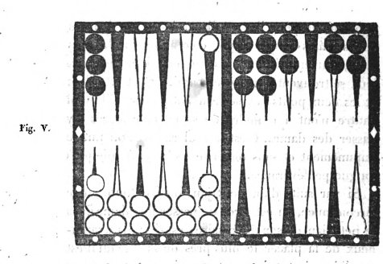

# Chapitre IX. Le petit jan.

### Cas où l'on peut entreprendre le petit jan.
FAIRE le plein du petit jan, c'est-à-dire garnir de cases entières les flèches qui, le composent, est le premier but que puisse se proposer le joueur au commencement de la partie ou de chaque relevé, lorsque les dés qu'il amène paraissent favorables à cette entreprise. Pour se livrer à cette tentative, il faut en général que les premiers points soient très faibles, et ne se portent pas au delà des trois ou quatre premières flèches. Pour y persévérer, il faut que les coups suivants soient tels, que les points amenés s'arrangent naturellement dans le petit jan, de manière à en garnir successivement les cases. Si, dans les premiers coups, on amène des points qui forcent à porter plusieurs dames hors du petit jan, il faut se hâter d'y renoncer, et l'abandonner aussitôt pour s'occuper de prendre son coin et préparer son jeu pour le grand jan.

### Avantages et dangers du petit jan.
Le petit jan offre, il est vrai, quelques avantages, mais ces avantages sont faibles, si on les compare avec les dangers auxquels il expose. Le succès d'un petit jan se borne le plus souvent à prendre un trou simple, car rarement on l'obtient double. A cet avantage, il est vrai, on peut en joindre deux autres plus importants : le premier, d'ôter à l'adversaire le pavillon lorsqu'il l'a; le second, de pouvoir s'en aller en prenant le trou, et détruire ainsi les grandes espérances' que donnaient à cet adversaire une position très favorable et un jeu très - avancé. Mais, quand ces avantages ne se réalisent pas, quand après avoir fait son petit - jan, au lieu d'obtenir le trou on le perd au contraire, on se trouve exposé à des suites qui peuvent porter le plus funeste préjudice. On peut par exemple être forcé, pour la conservation de son plein, de passer une ou deux dames dans le petit - jan de l'adversaire, ce qui, outre la privation de ces dames qui deviennent inutiles, fournit à cet adversaire des moyens fréquents et presque assurés de les battre. On peut encore être longtemps à prendre son coin, et alors ce coin se trouve exposé à être souvent battu par l'autre joueur qui a pu et dû garnir son grand jan de plusieurs cases et demi-cases. Un succès tardif est presque toujours dangereux, et une trop longue persévérance peut devenir trèspréjudiciable. En effet, pour conserver le plein, on est le plus souvent forcé d'exposer dans son grand jan deux et même trois dames découvertes qui offrent à l'adversaire de nombreuses chances pour prendre le trou; et, comme nous venons de le dire, souvent on est forcé à passer dans le petit jan de cet adversaire une ou plusieurs dames, ce qui entraîne les plus funestes conséquences.

### Quand il faut y renoncer.
De cet exposé on doit conclure qu'il ne faut jamais, dans cette tentative, lutter avec obstination contre la contrariété des dés; qu'il faut renoncer à faire son petit jan dès que cette contrariété se manifeste; et que l'on doit surtout, lorsqu'il est sur le point de s'achever et qu'il ne convient plus de le faire, s'ôter par la manière de jouer, toute possibilité de remplir le coup suivant.

On doit encore renoncer à l'entreprise d'un petit jan, quoiqu'il offre d'assez belles apparences, lorsque l'adversaire a huit ou dix points. Dans cette position le succès même est dangereux, car en supposant qu'on réussisse à faire son petit jan, et même à le conserver au coup suivant, il est à craindre que, pour cette conservation, on ne soit forcé d'exposer dans son grand jan, une ou plusieurs dames en demi-case qui donneraient à l'adversaire des moyens presque assurés de prendre le trou. Alors on serait menacé de toutes les suites funestes que présente un petit jan désastreux.

On ne doit pas non plus persévérer à le faire, lorsqu'il est probable qu'en le faisant, on ne pourrait pas conserver deux fois, surtout lorsque l'adversaire a déjà son coin, et un jeu très avancé.

### Quand il faut éviter de faire le petit jan.
Lorsqu'au commencement d'un relevé, l'un des joueurs a déjà six trous au moins, et par conséquent le marqué acquis, l'autre seulement deux ou trois trous, ce dernier doit éviter de se livrer à la spéculation du petit jan, quelque favorables que paraissent être les premiers points qu'il amène. La raison en est que le bénéfice d'un petit jan se bornant presque toujours à un trou ou deux; et celui qui les a obtenus se trouvant forcé, hors les cas les plus rares, à s'en aller, pour ne pas s'exposer à des suites désastreuses, il rendrait presque certaine, par cette spéculation, la perte d'un marqué qu'il aurait pu au contraire défendre avec succès, s'il n'eût pas entrepris le petit jan.

Dans cette position, un motif cependant peut quelquefois rendre très utile, peut même commander l'entreprise du petit jan; c'est lorsque l'adversaire a le pavillon, et que la différence des trous entre l'un et l'autre joueur est si considérable que celui qui en a le moins, ou même qui n'en a pas encore, ne peut, avec un espoir fondé, aspirer au marqué. Alors, bornant son ambition à ôter le pavillon, il doit, si le petit jan se présente sous une apparence favorable, le tenter, et chercher dans cette spéculation l'unique succès que, dans ce cas, il lui soit permis d'espérer.

### Conduite à tenir pour y faire le plein.
Mais enfin, si la nature des points porte nécessairement à l'entreprendre et à en poursuivre la chance, la conduite à tenir pour y réussir est fort simple; elle consiste à mettre à bas chacun des points pour bien garnir toutes les flèches, et lorsqu'il n'en reste plus qu'une à remplir, à se donner, pour y parvenir, le plus grand nombre possible de chances. Il ne faut point, par la crainte d'être battu, faire des revirades, c'est-à-dire découvrir une dame près de la pile pour en couvrir une plus éloignée, car on diminue par ce moyen le nombre des chances favorables.

### Différentes chances et manières de remplir.
On peut remplir à ce jan, comme à tous les autres jans, d'une, de deux ou de trois façons par coup simple, et de deux seulement par doublet. On ne remplit que d'une façon, lorsqu'on ne peut couvrir la dernière demi-case que par un des nombres directs, ou par la réunion des deux nombres, en jouant tout d'une. On remplit de deux façons lorsqu'on peut couvrir cette dernière demi-case par l'un et l'autre nombre direct, ou par l'un des nombres directs et les deux nombres réunis. Enfin on remplit de trois façons, lorsque pouvant la couvrir par l'un et l'autre nombre direct, on peut encore la couvrir tout d'une, ou par les deux nombres réunis. Chaque façon de remplir vaut quatre points par coup simple et six par doublet. Le même bénéfice de quatre ou six points est attribué à chaque coup par lequel on conserve ce plein.

### Conduite à tenir pour la conservation du plein.
Lorsqu'on est parvenu à faire le plein, on doit s'occuper des moyens de le conserver, au moins pendant deux coups, afin d'obtenir le trou et de pouvoir s'en aller; car à moins de hasards bien extraordinaires, et dont les exemples sont fort rares, il ne faut jamais s'exposer à tenir après le trou acquis par un petit jan. Il faut, dès le premier coup par lequel on conserve ce plein, s'attacher à se donner les chances les plus nombreuses et les plus favorables pour le coup suivant. Il ne faut pas surtout, par la crainte de perdre la bredouille des jetons et le bénéfice du double trou, diminuer le nombre des chances qu'on pourrait se donner ; il ne faut s'attacher à conserver cette bredouille que quand on le peut sans danger. Si, pour conserver le plein, on est forcé, comme il arrive souvent, d'exposer dans son grand jan une ou deux dames en demi-case, il faut, si on en a l'option, les placer de préférence sur les flèches qui offriront à l'adversaire moins de chances pour prendre le trou; car on serait par-là, exposé à toutes les suites désastreuses dont nous avons parlé. Lorsqu'on est forcé en conservant, de passer deux dames dans le grand jan et qu'il en reste encore une dans le petit jan, on doit, autant qu'on le peut, éviter de la mettre en surcase au coin bourgeois; car on aurait contre soi, au coup suivant, la majeure partie des chances du nombre 6. Lorsqu'on place des dames dans le grand jan, il faut pareillement avoir attention de les placer de manière à pouvoir s'en servir au second coup, pour conserver en passant dans le petit - jan de l'adversaire, si l'on amène des points avec lesquels on ne pourrait tenir autrement.

### Conduite à tenir pour contrarier le succès d'un petit jan.
Le joueur qui s'aperçoit que son adversaire se livre à la tentative d'un petit jan, dont le succès paraît probable, ne doit négliger aucun des moyens de contrarier ce succès; ces moyens consistent surtout à se préparer toutes les chances qui peuvent lui faire obtenir le trou avant cet adversaire. Il doit d'abord à cet effet garnir, autant qu'il le peut, son grand jan de cases et demi-cases: par-là il multiplie les moyens de battre les dames que l'autre joueur est ordinairement forcé de laisser découvertes dans son petit jan, et dont chacune lui donne un gain de quatre points, tandis que par celles qu'il expose lui-même il n'en perdrait que deux. De plus il se donne une grande facilité pour prendre son coin, ce qui est un avantage bien essentiel en pareille circonstance. Il arrive même de là que, lorsqu'il a pu parvenir à prendre huit points, celui qui entreprend le petit jan est obligé, par la crainte de perdre le trou, d'abandonner son entreprise, ou de jouer les coups qui lui surviennent d'une manière qui en contrarie le succès. Ainsi, par exemple, si l'un des joueurs amène du premier coup 2 et as ou 3 et as, et que l'autre amène ensuite le point de 9 ou de 10, ce dernier ne doit pas hésiter de jouer ce point tout-d'une, afin d'occuper dans le grand jan un poste très avancé qui domine le petit jan, et le mette à portée de battre les dames que le premier joueur, dans les coups subséquens, pourra y étaler. Il arrive souvent que cette position menaçante suffit pour déterminer à en abandonner l'entreprise.

### Cas où les deux joueurs entreprennent le petit jan.
Il arrive quelquefois que les deux joueurs entreprennent concurremment leur petit jan: alors pour l'un comme pour l'autre disparaissent les dangers et les suites funestes qui, comme on l'a dit plus haut, peuvent résulter de cette tentative. Les deux jeux se trouvent à peu près pareillement retardés; et les deux petits-jans se trouvant pleins, ni l'un ni l'autre n'ont à craindre de se trouver forcés d'y passer des dames. C'est le seul cas où l'on puisse impunément et sans témérité se livrer à une plus longue persévérance.

### Tenir éloignée de la pile une dame passée dans le petit jan de son adversaire.
Si par suite d'un petit jan, ou par toute autre circonstance, on est forcé de passer une dame dans le petit jan de son adversaire, est-il plus avantageux de la placer le plus près de la pile qu'il est possible, sitôt qu'on en trouve l'occasion, que de la conserver à une distance éloignée ? Pour l'intelligence de cette question nous donnons l'exemple suivant, figure V.

Si le joueur aux dames blanches a passé une dame de manière qu'elle se trouve placée au coin bourgeois de l'adversaire, et que par la suite il amène 4 et 2, faudra-t-il qu'il s'empresse, pour jouer le 4, d'avancer cette dame près de la pile à la première flèche, ou doit-il préférer de la laisser à la cinquième? Il est certain qu'il doit la laisser à cette cinquième flèche, quoiqu'il y ait pour la battre quatré chances de plus qu'à la première : car ce faible désavantage est plus que compensé par l'augmentation d'embarras et de difficultés que la présence de cette dame à la cinquième flèche fait éprouver à l'adversaire pour l'arrangement de son jeu. En effet, en supposant qu'il ait cinq cases faites dans son grand jan, et le surplus de ses dames ou à peu près à la pile, ce qui arrive le plus communément, car, pour faciliter le passage on a toujours soin d'entretenir dans son petit jan le plus de vide possible, et de passer dans son grand jan le plus de dames possible, qui servent à battre le coin ou les dames découvertes; dans cette supposition donc, il paraît que la dame placée à la cinquième flèche se trouve dans la position la plus avantageuse pour celui à qui elle appartient. Ondoit remarquer que, parmi les coups qui la battent, il en est un grand nombre qui sont plus préjudiciables qu'utiles à l'adversaire. Si, dans l'exemple que présente la figure ci-dessus, le joueur aux dames noires amène quine, il gagnera à la vérité deux trous en battant le coin et la dame exposée dans son petit jan; mais, ne pouvant jouer le quine qu'en doublant son propre coin, il sera, par cette considération impérieuse, forcé de s'en aller. Il perdra ainsi tous les avantages que semblait lui promettre une si favorable position; et l'adversaire à qui appartient cette dame sera garanti de tous les dangers dont il était menacé. S'il amène 6 et 5, il est forcé de jouer tout d'une en surchargeant également son coin.

Les points 5 et 4, 5 et 3,5 et 2 offrent les mêmes inconvénients qui, quoique plus légers, préjudicient nécessairement à l'arrangement du jeu de l'adversaire. S'il amène 4 et as, 3 et as, 3 et 2, 2 et as, ou il met à découvert des dames qui offrent un grand nombre de chances pour être battues, ou si, pour éviter ce danger et diminuer le nombre des chances qu'il redoute, il joue l'un de ces points tout-d'une, afin de n'exposer qu'une dame, il s'ôte les moyens de caser et de faire son jeu. Si le joueur aux dames blanches plaçait au contraire sa dame à la première flèche, il n'y aurait plus à la vérité que onze chances pour qu'elle fût battue; mais aussi l'adversaire ne craindrait pas lui-même d'être battu par cette dame, et n'éprouverait plus aucune contrariété dans l'arrangement de son jeu.

En appréciant ces différentes considérations, il semble qu'il y a un avantage incontestable à tenir le plus loin qu'il est possible de la pile, la dame que l'on a été forcé de passer dans le petit jan de l'adversaire.

### Avantages et désavantages des demi-cases dans le grand jan.
Lorsque le joueur a fait son petit jan, et que son adversaire a pris son coin et a des dames dans son grand jan, cet adversaire, au lieu de faire des cases entières, doit préférer d'y étaler ses dames en demicase, ce qui multiplie les chances pour battre le coin, et peut ôter au moins la bredouille de jetons. Si cependant le joueur avait six points, il pourrait, en battant de deux points seulement une dame en demi-case et en tenant, compléter son trou; dans ce cas son adversaire ne doit pas faire des demicases; il doit au contraire les couvrir s'il en a, ou abattre du bois dans le petit jan.

### Faire des demi-cases dans le petit jan.
Lorsque le joueur, ayant huit points, a fait son petit jan, et qu'il a une ou deux dames dans son grand jan, avec lesquelles il cherche à passer dans le petit jan opposé, pour tenir encore un coup, prendre le trou et s'en aller, l'adversaire doit alors chercher à faire des cases dans son petit jan pour l'empêcher de passer. S'il ne le peut pas, il ne doit pas craindre d'y mettre des dames en demi-case; car, comme il ne faut au joueur que quatre points pour tenir, s'il bat ces dames en demi-case, cela ne lui donne aucun avantage, puisque si elles n'y étaient pas, il pourrait y passer en conservant, ce qui lui vaudrait toujours quatre points. Ainsi on n'est pas plus exposé avec des demi-cases qu'avec des flèches vides; et, en faisant des demi-cases, on a l'avantage d'étendre son jeu, ce qui donne des facilités pour caser, en cas que le joueur ne puisse ni battre ni tenir son plein. Il faudrait jouer tout différemment, et ne rien laisser à battre dans le petit jan, si le joueur avait pris son coin de repos, duquel il peut partir pour battre dans le petit jan. 

### Caser dans le petit jan pour empêcher de passer.
Lorsqu'un joueur qui a fait le plein de son petit jan a déjà huit points, mais avec un jeu tellement avancé qu'il n'a plus d'autre moyen d'obtenir le trou en conservant, que de passer, par l'une de ses ́dames surnuméraires, dans le jeu de l'adversaire, celui-ci doit s'occuper principalement de mettre obstacle à ce passage, et de diminuer le nombre des chances par lesquelles il pourrait s'effectuer, en garnissant, autant qu'il le peut, de cases, quelques-unes des flèches de son petit jan, préférablement à celles de son grand jan. Ainsi, s'il amène un point par lequel il aurait l'option, ou de faire une case dans le petit jan ou d'en faire une dans le grand jan, il doit adopter le premier parti; car la case qu'il ferait dans son grand jan deviendrait presqu'inutile pour empêcher le passage; celle au contraire faite dans le petit jan deviendrait un obstacle pour le point par lequel l'une des dames surnuméraires pourrait y aboutir, et s'opposerait au passage de cette dame par le point aboutissant. Un exemple rendra plus sensibles la justesse et l'utilité de ce précepte. Supposons que le joueur qui a fait son petit jan a ses trois dames surnuméraires placées sur les huitième et dixième cases, et que l'adversaire a dans son grand jan le coin, les sixième et septième cases faites, plus deux demi-cases dans son petit jan sur les troisième et cinquième flèches, Si cet adversaire amène 5 et 3, il doit couvrir par ce point l'une et l'autre des demi-cases de son petit jan, au lieu de faire, comme il le pourrait, la huitième case. En couvrant ces deux dames, il interdit au joueur tout passage par le point de 8 entier, et par le point de 10 aussi entier et par le point de 12, effet que ne pourrait produire aussi complétement la quantité même de cinq cases dans le grand jan, à moins que ce ne fussent les cinq dernières; ce qui ne peut avoir lieu dans l'hypothèse, et à l'époque que nous indiquons. Le même principe peut et doit s'ap pliquer à beaucoup d'autres exemples et positions, qu'il serait superflu de citer.

Mais si celui qui vient de terminer le plein de son petit jan n'a pas de points, ou en a quatre tout au plus, alors l'adversaire doit lui offrir et lui faciliter tous les moyens de passage; il doit tenir en conséquence, autant qu'il est possible, son propre petit jan dégarni de dames, afin que, par suite de la conservation de ce plein, on soit forcé d'y passer les dames surnuméraires, si la nature des points subséquents le permet. Il se ménage, par cette sage prévoyance, tous les avantages que présente une semblable position.
