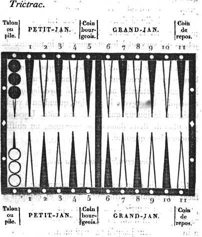
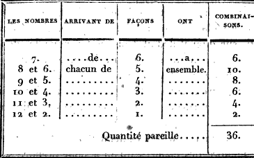

TRAITÉ COMPLET DU JEU DE TRICTRAC,

CONTENANT

LES PRINCIPES ET LES RÈGLES DE CE JEU, ET DES TABLES DE CALCULS QUI NE SE TROUVENT DANS AUCUN DES TRAITÉS PUBLIÉS JUSQU'A CE JOUR;

AVEC FIGURES.

Par N. Guiton l'aîne

SECONDE ÉDITION,

DANS LAQUELLE ON TROUVERA DES ADDITIONS ESSENTIELLES DANS LES RÈGLES, ET DES CHANGEMENTS DANS LA DISTRIBUTION DES MATIÈRES.

SUIVI D'UN TRAITÉ DU JEU DE BACKGAMMON.

A PARIS,

CHEZ BARROIS L'AINE, LIBRAIRE, RUE DE SEINE, N° 10, F. S. G.

M. DCCC. XXII.

# AVERTISSEMENT SUR CETTE SECONDE ÉDITION.

Le succès qu'a obtenu la première édition de ce traité, l'approbation que lui ont donnée les amateurs les plus éclairés, les éloges qu'en ont fait plusieurs journaux, et spécialement celui des Débats du 24 janvier 1817, ont fortifié notre zèle, et nous ont encouragés à donner à cet ouvrage le degré de perfection dont il pouvait être encore susceptible. Loin de nous abandonner aux prestiges d'un amour-propre satisfait, nous avons recherché ce qui pouvait se trouver de défectueux dans la première édition. Nous avons consulté les connaisseurs les plus expérimentés; nous avons recueilli leurs observations et leurs avis; nous nous sommes empressés d'en profiter : c'est le fruit de ce travail que nous offrons dans cette seconde édition.

Les principes et la théorie, ainsi que calculs qui forment la base de cette théorie, n'ont éprouvé aucun changement; ils sont les mêmes, parce qu'ils sont invariables comme la vérité dont ils
émanent.

Plusieurs préceptes nous ayant paru exposés d'une manière incomplète ou trop concise pour être facilement saisis par des joueurs encore inexpérimentés, nous y avons ajouté les détails et les développements que nous avons crus nécessaires pour les mettre à portée des amateurs à l'instruction desquels ils sont destinés.

Nous avons fait quelques corrections dans la rédaction. Nous pensons que dans un ouvrage élémentaire, et dont la matière est par sa nature très abstraite, la clarté du style est surtout essentielle. On ne peut mettre trop de soin et d'exactitude pour éviter toute expression ambiguë, toute phrase obscure, qui, en présentant un sens équivoque, pourraient donner lieu à de fausses interprétations, à des erreurs nous nous sommes appliqués à faire disparaître, dans la rédaction, tout ce qui nous a
paru mériter à cet égard quelque reproche.

Dans l'examen auquel nous nous sommes livrés, le chapitre des règles a principalement fixé notre attention. De nouveaux incidents, presque impossibles à prévoir, font naître à chaque instant de nouvelles difficultés, et donnent lieu à de fréquents débats, où l'intérêt personnel se trouve souvent en opposition avec la justice et la raison; on ne peut donc apporter une trop sérieuse application pour éviter toute erreur qui pourrait devenir une source de contestations. Pénétrés de cette vérité, et ne voulant pas nous en rapporter uniquement à notre jugement, nous avons, dans les cas difficiles, consulté des personnes dont les lumières bien reconnues sur cette matière font autorité. Leurs sages observations nous ont fait reconnaître la nécessité d'ajouter à plusieurs de nos décisions des développements et des motifs capables de dissiper tous les doutes.

Telles sont entre autres les règles intitulées: _Jouer avec quatorze dames : Avertissement qu'on ne marque pas : Ce qui arrive lorsqu'un joueur, pouvant s'en aller, a marqué plus de trous qu'il n'a droit
d'en marquer :_ etc.

Nous avons cru devoir spécialement soumettre à l'examen de ces connaisseurs les règles que nous avons établies sur des questions non encore prévues, et dont la solution par conséquent n'a pu être jusqu'à ce jour appuyée sur aucune autorité, ni sur un usage constant. De ce nombre sont celles qui ont pour titre : Points effacés par joueur qui croit gagner le trou: Jouer avec seize dames: Dame introduite dans un jan où le plein est encore possible: etc. Dans ces cas difficiles et nouveaux, on ne peut appuyer ses décisions que sur une juste application des principes qui y sont analogues: c'est ce que nous avons fait. Aussi avons-nous vu avec satisfaction que ces connaisseurs n'ont pas hésité à autoriser ces règles de leurs suffrages.

Nous avons vu avec la même satisfaction, que les autres règles établies dans la première édition étaient accueillies, adoptées, et faisaient autorité dans les meilleures sociétés [^1].

[^1]: Depuis notre première édition il a paru un petit volume in-12, intitulé _Cours complet du Trictrac_, dont l'auteur qui s'est désigné sous la qualification de _vieil hermite du Morbihan_, a employé, en en changeant seulement la forme, une grande partie de nos calculs, et il prétend les avoir fait connaître le premier. La date de l'impression des deux ouvrages suffira pour constater à qui appartient cette priorité. Du reste nous n'avons rien trouvé dans le sien qui ait pu nous donner seulement l'idée de faire le moindre changement au nôtre.

Ce que cette première édition nous a paru offrir encore de défectueux, c'est une certaine confusion dans la distribution des matières qui composent ce traité. Plusieurs parties nous ont semblé ne pas occuper la place qui convient aux objets qui y sont exposés, ce qui a rendu leur déplacement nécessaire.

Quelques personnes ont regardé comme un inconvénient l'interposition des tables et séries de calculs disséminées dans les différents chapitres, et qui, mêlées avec le texte, interrompaient la suite des instructions; nous avons cru devoir y remédier. Des amateurs qui désirent réunir tous les moyens de conviction, pourraient peut-être croire qu'il eût été plus naturel de laisser ces tables annexées comme exemple à chaque démonstration; mais le plus grand nombre des joueurs se trouvent suffisamment persuadés par une démonstration claire et précise: ils répugnent à s'appesantir sur l'examen d'une table de chiffres, qui ne leur présente que le complément de cette démonstration que leur intelligence a déjà saisie et qui suffit à leur conviction. Pour condescendre à cette répugnance des uns, sans pourtant préjudicier à la satisfaction des autres, et en même temps pour faire disparaître l'espèce de confusion que cette interposition répandait dans le corps de l'ouvrage, nous avons réuni ces différentes tables dans un dernier chapitre. Pour l'utilité de ceux qui voudront les consulter, nous les avons numérotées, et nous avons indiqué, par des renvois, leurs numéros dans chacun des chapitres où sont traitées les matières auxquelles elles sont relatives.

Nous n'avons rien négligé pour rendre ce traité utile et agréable aux amateurs : c'est avec la plus grande confiance que nous le leur présentons.

# Introduction

Un nouveau traité sur le jeu de Trictrac était désiré depuis longtemps par les amateurs, qui n'avaient à consulter que deux ouvrages, l'un intitulé _le jeu de Trictrac_, et l'autre _le grand Trictrac_. Le premier, souvent erroné, presque toujours superficiel, n'offre rien de satisfaisant à ceux qui, épris d'un goût veritable pour ce jeu attrayant, cherchent les moyens de s'y perfectionner.

Le second, plus connu, n'offre, quoiqu'il soit plus étendu que le premier, ni plus de méthode et d'exactitude dans ses détails, ni plus de précision et de vérité dans ses préceptes et dans ses décisions. Il laisse beaucoup à désirer, soit pour la forme, soit pour le fond; le fond; il ne peut servir de guide ni pour la conduite du jeu, ni pour les règles et les lois. Plusieurs coups sur lesquels s'élèvent chaque jour des contestations n'y sont pas prévus. D'ailleurs, depuis que cet ouvrage a paru, des usages successivement introduits et adoptés par un assentiment général ont modifié et même changé tout à fait certaines règles dont un plus sage examen a fait reconnaître les vices; en sorte qu'il y a souvent contradiction entre les décisions que donné ce traité et celles que l'usage a depuis consacrées et converties en lois.

On peut aussi élever contre cet ouvrage un reproche plus grave, c'est la multitude d'erreurs dont il fourmille et quant aux préceptes et quant aux calculs; erreurs d'une évidence si frappante, qu'elles ne peuvent que détruire toute confiance dans les préceptes qu'il donne. Nous nous contenterons de citer, à l'appui de ce reproche, les exemples suivants. Il est dit, page 277, que, pour remplir, les nombres 3 et 2 donnent vingt-cinq chances; cependant ils n'en donnent que vingt et une. Il est dit, page 280, que le 6 et le 5 donnent trente et une chances, tandis qu'ils n'en donnent que vingt-sept; et, plus bas, que trois nombres donnent quarante - quatre chances or tous les nombres réunis n'en peuvent donner que trente-six, ainsi que nous le démontrons par nos tables de calculs. On trouve des erreurs aussi évidentes dans ce qui tient aux préceptes. Les pages 275, 276, 277, 287, 30g et 348 en fournissent la preuve. La partie des lois et des règles est entachée des mêmes vices, ainsi que le reconnaîtront ceux qui voudront s'assurer de la vérité de ces reproches, en parcourant les pages 207, 324 et 338.

Une considération non moins importante a encore contribué à discréditer cet ouvrage; c'est que depuis l'époque où il a été publié, un système contraire à celui qu'il soutient s'est introduit dans la conduite du jeu, et que la bonté de ce nouveau système a été confirmée par une longue et sûre expérience. Dans l'ancien dominaient une prudence et une timidité excessives on se bornait principalement à une exacte et opiniâtre défensive. On n'osait s'exposer à des hasards, même improbables, qui pouvaient entraîner la perte d'un trou, quoiqu'en s'y exposant on pût se procurer une position tellement avantageuse qu'elle offrît l'espoir d'obtenir un grand nombre de trous ou même le gain de la partie. De là résultaient une marche couverte, un jeu serré, entassé, extrêmement retardé et souvent ruiné. Des joueurs moins timides, ou plutôt plus éclairés, ayant reconnu le vice de ce système, en ont adopté un opposé. Ils ont, à l'aide du calcul des probabilités, comparé ensemble les dangers et les avantages, et ils n'ont pas craint de s'exposer aux premiers, lorsqu'ils trouvaient dans les derniers l'espoir d'un ample dédommagement. Le succès a justifié leurs essais : on n'a pas tardé à reconnaître que l'ancienne méthode ne pouvait lutter contre la nouvelle, qui a été généralement adoptée.

Ces motifs nous ont déterminés à mettre au jour ce nouveau traité, dans lequel nous nous sommes attachés à ne présenter aux amateurs que des principes fondés non seulement sur les calculs, mais encore sur une expérience longue et bien réfléchie.

Le Trictrac est un jeu où à la vérité domine le hasard, dont l'influence, s'exerçant sur chaque coup, en détermine les succès ou les revers : mais ce hasard est soumis à des calculs. Pour l'y assujettir, l'habileté consiste à employer à propos la théorie des probabilités. Cette théorie, lorsqu'elle est bien connue et qu'on en sait faire une juste application, peut en partie régler ou au moins modifier cette influence du sort, et rendre probable ce qui par sa nature est incertain: c'est en quoi consiste la science du Trictrac. Il est donc nécessaire d'en bien connaître les différentes chances, d'en étudier les diverses combinaisons, et surtout de n'en jamais négliger l'application, même dans les coups qu'on pourrait croire indifférents,
parce qu'aucun ne l'est réellement. Souvent le sort de toute une partie dépend d'un coup mal joué dans l'origine, et dont le vice influe sur tous les coups suivants. On voit des joueurs se plaindre de la
contrariété du sort et des rigueurs qu'il leur fait constamment éprouver, lorsqu'ils ne devraient imputer leurs revers qu'à leur négligence; car les mêmes coups qui leur sont si contraires et si désavantageux eussent peut-être été très favorables, si ces joueurs n'eussent pas eux-mêmes préparé la ruine de leur jeu par une conduite fautive et en opposition avec les véritables principes.

Cette observation tend à prouver combien est nécessaire et indispensable la connaissance des principes, et spécialement celle des calculs qui en sont la base. En consultant nos tables de combinaisons, les joueurs connaîtront avec certitude et facilité les chances qui, dans les différentes positions, leur seront ou contraires ou favorables. Ces tables pourront être utiles même aux joueurs les plus exercés, parce qu'elles sont accompagnées de méthodes simples et faciles pour faire, par un prompt aperçu, l'application des combinaisons que donne chaque position; méthodes qu'on ne trouve dans aucun des traités précédents, et
dont plusieurs n'étaient pas encore connues.

Il s'élève tous les jours des difficultés et des contestations sur la décision de coups qui n'ont pas été prévus. On se trouve alors forcé de consulter l'usage, et de s'en rapporter à l'arbitrage de juges dont les opinions sont quelquefois aussi discordantes que les usages mêmes sur lesquels elles sont fondées; d'où il arrive que le même coup, jugé aujourd'hui de telle manière, le sera demain tout différemment. C'est pour obvier à cet inconvénient que l'on a eu soin de recueillir dans le chapitre des règles tous les coups nouveaux et non prévus dont on a pu avoir connaissance, et d'en donner la décision, après s'être bien assuré de l'opinion unanime d'un grand nombre de joueurs dont les lumières reconnues rendent le
témoignage décisif.

Dans la division des matières qui composent· ce traité on a suivi l'ordre et la distribution qui ont paru les plus naturels, et qu'indique la marche même de ce jeu. On a donné le vocabulaire général des termes spécialement usités au Trictrac, avec une définition détaillée de chacun de ces termes, et on l'a dégagé de tous ceux qui sont tombés en désuétude. On a ensuite analysé les chances que produisent les points réunis des deux dés combinés entre eux. Cette analyse est suivie de l'exposition de différentes méthodes qui servent
à faire connaître promptement le nombre des chances favorables ou contraires que l'on a dans les différentes positions. A cette exposition succède le chapitre qui contient les règles du jeu. Ce chapitre est suivi d'une description, complète de la partie en douze trous, de la partie à écrire et de celle à tourner, avec des observations sur la grande bredouille. Enfin on a successivement, et dans des chapitres séparés, présenté toutes les instructions relatives au petit-jan, au coin de repos, au grand-jan et au jan de retour. A la suite de ces instructions on a réuni les maximes générales qui ont paru importantes; on les a appuyées d'exemples propres à en faire sentir la justesse et l'utilité.

Le dernier chapitre contient la réunion de toutes les tables de calculs, qui sont la base de nos principes et de nos préceptes; car c'est sur la connaissance des combinaisons qu'est fondée la théorie du Trictrac. Celui qui possède bien cette théorie peut atteindre le dernier degré de perfection; c'est une boussole qui ne peut l'égarer. En insérant dans ce traité cette suite de tables, fruit d'un long et pénible travail, nous ne nous sommes pas dissimulé que plusieurs amateurs éprouveront de la répugnance à se livrer à l'étude de ces calculs, et qu'ils aimeront peut-être mieux adopter de confiance les principes que nous avons établis. Cette préférence pourrait même être justifiée jusqu'à un certain point par l'exemple de joueurs qui, sans connaître les calculs, mais à l'aide seulement d'un aperçu juste et facile, sont parvenus à une force qui approche de la perfection. Nous pouvons assurer ces amateurs qu'en adoptant nos principes et en s'y conformant, ils ne seront pas trompés dans leur confiance. Ces principes sont fondés sur des calculs dont nous garantissons la justesse et l'exactitude, et que nous ne craignons pas de soumettre à l'examen des connaisseurs. Nous les invitons cependant à ne pas se livrer à la même insouciance à l'égard des calculs de la troisième table et de la méthode indiquée à la fin du chapitre II, p. 31, pour faire une case et pour battre le coin. Ces calculs sont simples, faciles à saisir, et surtout de la plus grande utilité dans toutes les positions.

Au jeu de Trictrac, ainsi que dans les sciences et les arts d'une bien plus haute importance, la théorie, quoique nécessaire, est néanmoins insuffisante si elle n'est accompagnée de la pratique et d'une expérience habituelle. Cette pratique rend familière l'application des principes indiqués par la théorie ; elle fait connaître les vices et les inconvénients des faux systèmes. C'est par l'habitude que l'on acquiert ce prompt et facile aperçu qui fait saisir à l'instant même l'ensemble et la connexité des combinaisons les plus complexes; ce qui serait impossible à celui qui ne posséderait que la théorie. Ainsi l'une et l'autre se prêtent un mutuel appui; l'une et l'autre concourent à l'instruction du joueur. La théorie sans la pratique, la pratique sans la théorie, ne peuvent former que des joueurs médiocres.

Celui qui désire faire des progrès à ce jeu doit préférer de se mesurer avec des joueurs qui lui sont supérieurs. C'est en méditant sur la manière dont ils jouent les: coups difficiles ou décisifs; c'est en recherchant les motifs qui déterminent dans telle et telle circonstance leur manière de jouer, et en comparant leur méthode avec la sienne, qu'il peut se perfectionner et arriver au but où il aspire. Au contraire, avec un joueur ou inférieur ou même de sa force, il ne peut espérer de faire aucun progrès, parce qu'il n'a plus d'objet de comparaison. Il n'a rien qui excite son émulation, qui intéresse et pique sa curiosité et son désir de s'instruire. Il pourra même s'accoutumer à négliger des principes dans lesquels il n'est pas encore bien affermi, et contracter ainsi l'habitude de jouer de caprice la plupart des coups, sans égard pour les calculs et les probabilités. C'est à prévenir et à corriger une si funeste négligence que tendent les vérités et les maximes que nous avons essayé de développer dans cet ouvrage, et dont nous ne pouvons trop recommander l'observation aux amateurs du Trictrac, à ceux qui ont un véritable désir d'y parvenir à une certaine force. Le but que nous nous sommes proposé dans cette entreprise a été de seconder le goût de ces amateurs, de leur aplanir les difficultés qu'offre ce jeu, auquel on s'attache avec d'autant plus de prédilection qu'on le connaît mieux et qu'on s'y exerce davantage. Nous nous sommes attachés surtout à éviter dans l'exposition de nos préceptes cette sécheresse, cette prolixité, qui éteignent le désir et l'ambition de s'instruire par le dégoût qu'elles inspirent. Nos voeux seront pleinement satisfaits si nos efforts obtiennent les suffrages des connaisseurs.

# CHAPITRE PREMIER.

_Vocabulaire des termes techniques spécialement adoptés pour le jeu de Trictrac, avec leur définition._

_A bas._ On dit mettre à bas lorsqu'on joue son coup avec une ou deux dames, prises à la pile: dans le premier cas, on dit simplement mettre une dame à bas; dans le second, on dit mettre tout à bas. On dit aussi avoir du bois à bas, lorsqu'on a plusieurs dames placées dans son petit-jan, pour caser dans le grand.

_Adouber._ On dit j'adoube, terme de précaution dont on se sert pour avoir la liberté de toucher ses dames sans être obligé de les jouer, ou sans encourir le risque d'être mis à l'école pour avoir omis de marquer les points qu'on pourrait gagner.

Ce mot doit être prononcé avant de rien toucher; autrement il ne pourrait garantir de la peine attachée à la faute qu'on aurait commise.

Lorsqu'après avoir dit j'adoube, on a déplacé, joué ou abandonné une dame, on ne peut jouir du même privilège pour la seconde dame, à moins qu'on ne répète le mot j'adoube.

_Aller, s'en aller._ Lorsqu'un joueur prend un trou par l'effet de son propre dé, il a le droit de rompre le jeu et de s'en aller, c'est-à-dire que de part et d'autre on remet toutes les dames à la pile, pour continuer la partie. Lorsqu'on reçoit le trou par le coup de dés de l'adversaire, on ne jouit pas de la faculté de s'en aller. Celui qui s'en va a la priorité du dé pour recommencer.

_Bandes._ On appelle ainsi les quatre bordures qui entourent le tablier, et celle du milieu, qui le partage en deux parties égales, Les bandes qui se trouvent devant chaque joueur sont percées de douze trous chacune. A mesure qu'on prend un trou, on y place le fichet; les bandes latérales sont percées chacune de deux trous, pour recevoir le pavillon.

_Battre._ On bat une dame lorsqu'elle est découverte, et qu'on amène un point avec lequel, soit par un des nombres directs, soit par l'un et par l'autre, soit enfin par les deux nombres réunis, on pourrait couvrir cette dame avec une ou plusieurs des siennes.

On peut battre d'une, de deux ou de trois façons.

On bat d'une façon lorsqu'on ne peut couvrir cette dame découverte que par un des nombres directs ou par les deux nombres réunis, c'est-à-dire en jouant tout d'une; on bat de deux façons lorsqu'on peut la couvrir avec l'un et l'autre nombre directs, ou avec un des nombres directs et les deux nombres réunis; enfin on bat de trois façons lorsque, pouvant la couvrir par l'un et l'autre nombre, on le peut encore par les deux nombres réunis. Pour chaque façon on marque deux points, si l'on bat par un coup simple ou composé de deux points différents, et quatre si c'est par un doublet, lorsque la dame battue se trouve placée dans l'un des grands-jans si au contraire elle est placée dans l'un des petits jans, chaque façon vaut quatre points par coup simple, et six par doublet.

On doit observer qu'on ne peut battre de trois façons que par un coup simple, le doublet, par sa nature, ne pouvant en produire que deux, puisqu'il est formé par deux nombres semblables.

On bat ou les dames, ou le coin de son adversaire, ou les deux coins.

Battre à vrai, battre à faux. On bat toujours à vrai lorsqu'on ne bat que par l'un des nombres directs; mais on peut battre à faux lorsqu'on bat par les deux nombres réunis ou tout d'une. C'est ce qui a lieu lorsque pour arriver à la dame découverte il n'y a pas dans le jeu de l'adversaire de passage ouvert, c'est-à-dire de case vide, ou seulement en demi-case; et que les flèches, où viennent aboutir l'un et l'autre nombre directs, sont garnies de plusieurs dames. Ainsi, par exemple, si l'on amène 5 et 4, et qu'on ait une dame qui puisse atteindre par le nombre 9 une des dames découvertes de l'adversaire; si l'un des deux points, ou 5 ou 4, porte sur une case vide de l'adversaire ou sur une demi-case, on bat à vrai : mais, si au contraire le 5 et le 4 portent l'un et l'autre sur une case de l'adversaire garnie de plusieurs dames, on bat à faux; et cet adversaire gagne autant de points qu'en eût gagné le joueur, s'il eût battu à vrai.

Nota. Quoiqu'on ne puisse, comme on l'expliquera par la suite, dédoubler les deux dames de son coin, et qu'elles ne puissent être déplacées que simultanément, néanmoins, comme la batterie n'opère point un déplacement réel, mais seulement fictif, on peut battre en partant du coin comme de toute autre case.

_Battre le coin._ Lorsqu'on a son coin, et que celui de l'adversaire est vide, on bat le coin de l'adversaire toutes les fois qu'on amène un point avec lequel on pourrait y faire case, et l'occuper sans dédoubler son propre coin. Comme la faculté de l'occuper est interdite, dans quelque circonstance que ce soit, au lieu d'en user, on le bat: ce qui vaut quatre points quand c'est par coup simple, et six points par
doublet.

_Battre les deux coins._ On bat les deux coins, soit à vrai, soit à faux. On les bat à vrai lorsqu'au commencement du jeu ou d'un relevé, n'ayant encore que deux dames à bas, et les deux coins étant vides, il survient un coup par lequel on pourrait placer une de ces deux dames dans son propre coin, et l'autre dans celui de l'adversaire : ce qui vaut quatre points quand c'est par coup simple, et six par doublet. Mais si, dans cette circonstance, le coin de l'adversaire se trouvait plein, on battrait à faux, et on perdrait
autant de points qu'on en, eût gagné en battant à vrai.

Celui qui bat les deux coins n'ôte pas à l'adversaire le droit de les battre à son tour, aux mêmes conditions.

Enfin on bat aussi le coin, lorsqu'ayant pris le sien avec deux dames qui sont les seules abattues, on amène le coup suivant un ou deux as ce qui vaut quatre points lorsqu'il n'y a qu'un as, et six quand il y en a deux. Mais, dans ce cas, si le coin de l'adversaire était plein, on battrait à faux, et on perdrait autant de points qu'on en aurait gagné en battant à vrai. Ce coup s'appelait autrefois _jan de mézéas_ ; mais cette dénomination est aujourd'hui peu usitée, et elle est presque tombée en désuétude.

_Bois._ Ce mot désigne les dames abattues de la pile, et disposées pour faire des cases. On dit mettre du bois à bas, avoir du bois à bas.

_Bredouille._ Terme dont on se sert pour exprimer que les douze points qui forment le trou ont été pris de suite et sans interruption, ou bien, si c'est à la partie à écrire, que les trous qui complètent le marqué ont été aussi pris de suite. Dans le premier cas, on prend deux trous au lieu d'un; dans le second, le marqué se paie double ou quadruple, ainsi qu'il sera expliqué au chapitre VIII de la partie à écrire.

On appelle aussi bredouille le double jeton dont se sert celui qui marque des points en second. Il garde le double jeton tant que la série n'est pas interrompue par les points que prend l'adversaire; il l'ôte aussitôt qu'elle est interrompue.

A la partie à écrire, la marque qui sert à constater la série des trous pris en second, s'appelle pavillon où étendard; elle se met à l'endroit où se place le fichet lorsqu'on n'a pas encore de trous. On l'ôte pareillement aussitôt que la série est interrompue par les trous que prend l'adversaire : c'est ce qu'on appelle _débredouiller_.

_Cases._ On appelle ainsi les flèches (voyez ce mot) qui marquent les vingt-quatre divisions du tablier. On appelle case vide une flèche qui est totalement dégarnie de dames; demi-case, celle qui n'est garnie que d'une dame; case entière, celle qui est garnie de deux dames; surcase, une dame placée sur une case déjà complète; et enfin cases alternes, celles entre chacune desquelles il y a une flèche vide. On appelle communément _case du diable_ la septième flèche, en partant de la pile, pour exprimer la difficulté qu'on éprouve souvent à la faire, surtout lorsqu'elle reste la dernière. On appelle aussi case de l'écolier, la dixième qui précède le coin, vu l'empressement que des joueurs inexpérimentés montrent pour faire cette case, qu'il est quelquefois dangereux de faire trop tôt, et presque toujours avantageux de réserver pour la dernière. On dit faire fausse case lorsque, par erreur, on place une ou deux dames à une flèche autre que celle où elles doivent aboutir par le point amené. (Voyez le chapitre III des règles.)

_Coin._ Chaque joueur en a deux : l'un dans le petit-jan, à la cinquième flèche, près la bande de séparation; l'autre dans le grand-jan, à la dernière flèche. Le premier s'appelle coin bourgeois, et le second s'appelle coin de repos.

_Conserver ou tenir son plein._ C'est pouvoir jouer son coup sans dégarnir aucune des cases qui forment le plein, dans quelque jan que ce soit le cas contraire s'appelle rompre son plein.

_Consolation._ On se sert de ce terme à la partie à écrire, comme au piquet, pour exprimer le nombre de jetons que le joueur qui est marqué paie au delà de ceux qu'il doit en raison du nombre de trous dont il est marqué.

_Coups carrés._ On appelle ainsi les points qui sont composés de deux nombres pairs.

_Doublet._ On nomme ainsi tout point composé de deux nombres semblables; et on nomme, par opposition, coup simple celui composé de deux nombres dissemblables. Chaque doublet a une dénomination
particulière.

- Les deux as s'appellent.. _béset_.
- Les deux deux s'appellent.. _double-deux_.
- Les deux trois s'appellent.. _terne_.
- Les deux quatre s'appellent.. _carme_.
- Les deux cinq s'appellent.. _quine_.
- Les deux six s'appellent.. _sonnez_.

Toute dame battue par doublet, le coin et les coins battus par doublet, le plein fait ou conservé par doublet, valent deux points de plus que par coup simple.

_École._ C'est le nom que l'on donne à la faute que commet un joueur en ne marquant pas les points qu'il a, ou en marquant des points qu'il n'a pas. La première s'appelle école d'omission, ou par moins; la seconde, école par trop. (Voyez au chapitre III des règles la définition des différentes écoles, et tous les détails qui y sont relatifs.)

_Emblée._ Terme consacré pour exprimer que par un même coup de dés on fait une case entière, en plaçant à la fois deux dames sur une flèche vide. Si cette case est la dernière, on dit alors qu'on remplit d'emblée.

_Enfilade._ Être enfilé se dit lorsque le jeu est tellement ruiné et délabré, qu'il en résulte la perte d'une nombreuse série de trous, et même de la partie.

_Faute._ On appelle ainsi toute erreur portant préjudice au joueur qui la commet, sans qu'il en résulte aucune peine contre lui.

_Fichet._ C'est une petite cheville qui sert à marquer les trous que l'on gagne.

_Fleches._ Chacune des quatre parties du tablier est partagée en six divisions, qui sont marquées par des flèches de couleurs différentes, ordinairement verte et blanche, posées alternativement : en sorte que, si le talon de l'un des joueurs est sur une flèche verte, celui de l'autre joueur est sur une flèche blanche. Chacune de ces flèches s'appelle aussi case. (Voyez ce mot.) Cette variété de couleur n'est pas sans motif et sans utilité; elle sert à connaître plus promptement et plus facilement la portée où doit aboutir chaque point, soit pour placer les dames, soit pour battre. Il résulte de leur position alternative que, par un nombre pair, la dame placée sur une couleur quelconque doit porter sur une flèche de même couleur; et par un nombre impair, au contraire, sur une flèche de couleur différente ce qui, quand on en a l'habitude, rend l'aperçu beaucoup plus prompt.

_Impuissance_. Ce mot exprime l'impossibilité où l'on se trouve de jouer ou l'un des points amenés, ou l'un et l'autre de ces points. Si l'on n'en peut jouer qu'un, on est marqué de deux points; et si l'on ne peut jouer ni l'un ni l'autre, on est marqué de quatre, qu'on les ait amenés par doublet ou par coup simple: c'est le seul cas où le doublet n'établit aucune différence dans la marque des points.

_Jan._ La totalité du tablier est partagé en quatre divisions, et chacune d'elles s'appelle jan. Chacun des joueurs en a deux; l'un s'appelle petit-jan, c'est celui où la pile est placée; l'autre s'appelle grand-jan.

_Jan de retour._ On appelle ainsi chacun des petits jans, lorsque chaque joueur, continuant à parcourir le tour du tablier, vient réciproquement placer ses dames dans le petit-jan de son adversaire, pour y faire son plein.

_Jan de six tables ou de trois coups._ Lorsqu'un joueur, au commencement. de la partie ou d'un relevé, a amené, par ses deux premiers coups, des points avec lesquels il a garni quatre des six premières flèches; si, par les points amenés au troisième coup, il peut garnir les deux autres, il marque quatre points: c'est ce qu'on appelle faire le jan de six tables. Il n'est cependant pas tenu de garnir effectivement les six flèches; mais il a l'option de jouer le dernier coup de la manière qu'il juge la plus convenable à ses intérêts.

_Jeter les dés._ C'est les lancer hors du cornet pour déterminer le point qu'on aura à jouer. (Voyez au chapitre III des règles ce qui concerne le jet du dé.)

_Jeton._ Il y en a trois que l'on place, en commençant, à la bande, entré les deux piles, et qui servent ensuite à marquer les points.

_Jouer pour tout._ Se dit au jan de retour du coup par lequel on sort les dernières dames, et qui sert en même temps de premier coup pour la reprise, quand on se détermine à rester.

_Marquer, un marqué, avoir le marqué._ Se dit à la partie à écrire, lorsqu'un des joueurs ayant déjà au moins six trous acquis, l'un ou l'autre s'en va ; alors le marqué est consommé au profit de celui qui a le plus de trous, et on en recommence un autre. Mettre dedans. C'est le terme dont on se sert dans le cas où, n'ayant plus qu'une case à faire pour achever le plein, et ne pouvant, par le point amené, faire la case entière, on peut néanmoins y placer, et on y place effectivement une dame seule en demi-case.

_Partie._ On dit: partie simple, lorsqu'on ne prend qu'un seul trou; et partie double, lorsque prenant douze points de suite, on marque deux trous au lieu d'un.

_Partie ordinaire ou en douze trous, partie à écrire, etc._ (Voyez le chapitre VIII qui traite de ces différentes parties.)

_Passage._ On entend par ce terme une flèche vide, sur laquelle porte un des nombres directs du point amené par un joueur, lorsqu'il veut passer dans le jan de l'adversaire. Pour battre il y a passage, quoique la flèche ne soit pas entièrement vide, pourvu qu'elle ne soit garnie que d'une seule dame.

_Passer des dames._ Dame _passée_ se dit de toute dame qu'on est forcé de porter au delà des flèches qui restent à remplir, alors elle ne peut plus servir à faire le plein.

__Pavillon._ (Voyez le mot _Bredouille_.)

_Pile_ est synonyme de talon. C'est la flèche où, au commencement de chaque partie ou de chaque relevé, chaque joueur place ses quinze dames, et les met en pile.

_Pile de misère._ On se sert de ce terme pour désigner le cas où, ayant rompu son grand-jan, on se trouve forcé, par la contrariété du dé, d'empiler ses quinze dames à la dernière flèche, sans avoir pu, en passer une seule dans les jans de son adversaire. Autrefois celui qui la faisait gagnait quatre points en la terminant par coup simple et six par doublet; il gagnait les mêmes points à chaque coup tant qu'il la conservait; mais, contre toute raison et justice, l'usage actuel prive celui qui la fait de ce léger dédommagement.

_Plein._ Se dit d'un jan quelconque lorsque toutes les flèches de ce jan sont garnies de cases entières. Points. Pour acquérir le trou il faut avoir douze points. A mesure qu'on en gagne on les marque avec les jetons. Celui qui marque les premiers points les marque avec un seul jeton; celui qui en prend en second les marque avec deux jetons, et il en ôte un lorsque l'adversaire, reprenant des points, interrompt la série.

Pour marquer deux points on place le jeton de son côté devant la seconde flèche en partant de la pile; pour quatre points, devant la quatrième; pour six points, près la bande du milieu du côté du petit-jan; pour huit points, au delà 'et auprès de cette bande dans le grand-jan; pour dix points, à la bande latérale entre les deux coins de repos. La progression des points que l'on gagne est toujours en nombre pair.

_Puissance.__ On se sert de ce mot pour exprimer le privilège que l'on a, lorsque le coin de l'adversaire est vide, de prendre le sien propre par mêmes dés avec lesquels on pourrait faire case dans le coin de l'adversaire.

_Remplir._ Synonyme de _faire son plein__. (Voyez ce mot.)

_Remplir en passant._ (Voyez cet article au chapitre VI des lois du plein.)

_Relevé._ Lorsqu'un joueur ayant pris le trou s'en va, chacun relève ses dames, les remet à la pile, et la partie continue. Cela s'appelle un relevé.

_Revirer, revirade._ C'est faire une case avancée en portant sur une flèche vide deux dames, dont une a été prise d'une case déjà faite.)

_Revirade double._ C'est dédoubler deux cases pour en former une autre plus avancée, ou bien déplacer une case entière pour la porter sur une flèche plus éloignée.

_Rompre les dés._ C'est arrêter et brouiller les dés de l'adversaire lorsqu'il les jetté, mais avant qu'ils soient fixés et qu'aucun des points soit connu..

_Sans bouger_, se dit lorsqu'il arrive un coup par lequel, ayant déjà des points, on prend ou on reçoit douze ou vingt-quatre points, pour lesquels on marque des trous, sans rien changer à la marque des points que l'on avait déjà.

_Sortir des dames._ Expression qui, quoique vicieuse et contraire aux principes de la grammaire, est néanmoins adoptée au trictrac pour exprimer spécialement la mise des dames hors du tablier, lorsqu'on termine le jan de retour. On dit pareillement _entrer une ou plusieurs dames_, lorsque, dans le cours d'un jan où l'on tend à faire le plein, on passe dans ce jan pour les y mettre en demi-case passe ou en surcase.

_Tablier._ On nomme ainsi les deux tables du trictrac, dont chacune est divisée en six flèches de chaque côté.

_Talon._ (Voyez _Pile_, qui est synonyme.)

_Tenir, ne pas s'en aller_. Le joueur qui marque un ou plusieurs trous, provenus des points de ses dés, peut s'en aller, comme il peut tenir, c'est-à-dire continuer. Quand les points avec lesquels il obtient le trou proviennent du dé de l'adversaire, il est obligé de tenir.

_Tout-d'une._ C'est jouer avec une seule dame les nombres réunis des points que l'on a amenés.

# CHAPITRE II.

_Analyse des différentes combinaisons que donnent les deux dés réunis, et figure représentative du Trictrac_

POUR l'intelligence des préceptes et exemples, qui sont contenus dans ce traité, on a employé souvent des figures semblables à celle ci-dessus.

La flèche où sont les quinze dames en pile, est appelée le talon ou la pile; les autres sont numérotées suivant l'ordre que les joueurs observent en abattant leurs dames, en commençant dans le petit-jan, depuis 1 jusqu'à 5, qui est le coin bourgeois; et continuant dans le grand-jan, depuis 6 jusqu'à 11, qui est le coin de repos.

On a indiqué dans les figures les points des joueurs, en représentant par de petits ronds les jetons qui servent à les marquer; et le nombre de trous est désigné en bouchant celui où les joueurs doivent avoir le fichet qui les marque dans les bandes qui se trouvent devant chacun d'eux. Dans les bandes latérales on a bouché pareillement le trou qui doit recevoir le pavillon, quand on a voulu désigner le joueur qui l'a de son côté. Lorsqu'il y a plus de deux dames sur une case, un chiffre annonce leur quantité..

## Des combinaisons des dés.

Chaque dé représentant sur chacune de ses six faces un nombre différent, depuis et compris jusques et compris 6, il s'ensuit que les deux dés réunis peuvent donner onze nombres divers, depuis inclusivement jusqu'à 12 aussi inclusivement; car on sent que l'unité qui est indivisible, ne peut être le produit de deux dés réunis. (Voyez la table I, chapitre XV.)

De ces onze nombres il y en a quatre dont chacun ne peut être produit que par un seul et même coup, parce qu'ils ne peuvent être composés que par les mêmes points et par les mêmes éléments. Ainsi le nombre 2 ne peut être formé que par deux as; le nombre 3 ne le peut être que par un 2 et un as, le nombre 11 que par un 6 et un 5, et le nombre 12 que par deux 6. Mais chacun des sept autres nombres peut être produit par différents coups, composés de points ou d'éléments totalement dissemblables. Ainsi le nombre 4 peut arriver par un 3 et un as, ou par un double 2; le nombre 5, par un 4 et un as, ou par un 3 et un 2; le nombre 9, par un 6 et un 3, ou par un 5 et un 4; le nombre 10, par un 6 et un 4, ou par deux 5: d'où il résulte chacun de ces quatre nombres peut être formé par deux coups absolument dissemblables. Quant aux trois autres nombres, chacun d'eux peut être produit par trois divers coups, savoir : le nombre 6, par un 5 et un as, ou par un 4 et un 2 ou par deux 3; le nombre 7, par un 6 et un as, ou par un 5 et un 2, ou par un 4 et un 3;
enfin le nombre 8, par un 6 et un 2, ou par un 5 et un 3, ou par deux 4.

De cette analyse il résulte que les onze nombres que donne la réunion des deux dés par leur diverse composition, peuvent survenir par vingt et un coups différents.

De ces vingt et un coups il y en a six qu'on appelle doublets, parce qu'ils sont produits par la réunion de deux nombres semblables. Ces six doublets ne peuvent arriver que par une seule chance ou combinaison, puisqu'il faut nécessairement que chacun des dés présente la même face: ainsi, pour donner un terne, il faut que l'un et l'autre dé offrent la face du 3. Il n'en est pas de même des quinze autres coups, appelés, par opposition, coups simples, qui sont produits par des points dissemblables. (Les combinaisons produites par ces coups simples sont désignées, dans nos première et seconde tables, par la qualification de sensibles et insensibles.) Prenons pour exemple le 6 et le 4: on sent que le dé qui a donné le 6 aurait pu donner le 4, et que le dé qui a donné le 4 aurait pu donner le 6; ainsi le même coup pouvait arriver par deux chances différentes. Pour rendre plus sensible cette vérité un peu abstraite, on peut supposer que les deux dés soient de couleur différente, l'un blanc et l'autre rouge; qu'en les jetant ils donnent 6. et 4, de manière que le dé blanc présente la face 6, et le dé rouge la face 4; qu'ensuite on les jette de nouveau, et qu'ils donnent encore le même 6 et 4, mais qu'à ce dernier jet le dé blanc présente la face 4, et le dé rouge la face 6: voilà bien le même point produit de deux manières évidemment distinctes et différentes. Pour ajouter, s'il est possible, à la conviction que donne cette démonstration, on peut encore supposer que le joueur qui jette ces deux dés de couleur différente engage le pari que, quelque coup qu'il amène, le plus fort, point sera donné par le dé blanc. Si les dés amènent 6 et 4, de manière que le 6 soit amené par le dé blanc, il gagne son pari. Supposons maintenant qu'offrant la revanche, qui est acceptée avec les mêmes conditions, -il jette une seconde fois les dés, qui donnent encore 6 et 4, mais de manière qu'à ce second coup ce soit le dé rouge qui présente la face 6, et le dé blanc la face 4, ce même joueur qui avait gagné le premier pari perd alors le second. Le même point 6 et 4 est donc bien réellement produit par deux chances essentiellement distinctes et différentes, puisque l'une fait gagner le pari, et que l'autre le fait perdre. Il résulte, de cette démonstration que chacun des quinze coups produits par deux points dissemblables arrive par deux chances bien distinctes, et que par conséquent ces quinze coups en donnent trente, qui, jointes au produit des six doublets, dont.chacun n'arrive que par une chance unique, donnent en total _trente-six chances_.

---

Il est facile de voir qu'un nombre quelconque d'un dé, combiné successivement avec les six nombres de l'autre dé, entre dans la composition des onze chances que donne chaque nombre (voyez la seconde table, chapitre XV): car, en prenant pour exemple le nombre 6, et le combinant d'abord avec le même nombre de l'autre dé, il forme un doublet qui donne une chance unique; puis, le combinant successivement avec les cinq autres nombres, il forme cinq coups, lesquels, comme nous venons de le démontrer, donnent chacun deux chances; ce qui, avec le doublet, fait en total onze chances. Ainsi celui qui, pour couvrir une dame, n'a qu'un nombre direct qui y aboutit, a réellement onze chances pour la couvrir. S'il avait deux nombres directs, il paraîtrait avoir vingt-deux chances: mais, comme un de ces nombres a déjà été compris dans le calcul des onze chances du premier, il faut en déduire pour ce double emploi un coup qui forme deux chances; ce qui en réduit le nombre à vingt. Pour rendre ce calcul plus clair et plus sensible, on peut supposer qu'on a pour couvrir une dame un 6 et un 5: chacun de ces deux nombres isolé donnerait à la vérité onze chances; mais ces deux nombres réunis n'en donnent que vingt, parce que dans le calcul des chances du 6 se trouve le 6 et 5, et que dans le calcul des chances du 5 se trouve le 5 et 6; ce qui fait évidemment un double emploi. Pour éviter ce double emploi, lorsqu'on a deux nombres directs, on compte le premier pour onze, et le second seulement pour neuf. Si on a trois nombres directs, comme il y a double emploi sur le second et double emploi sur le troisième, on compte le premier pour 11, le second pour 9, et le troisième pour 7. On ôte de la même manière deux points pour chaque nombre direct que l'on a de plus, parce qu'il se trouve un double emploi de plus; ce qui donne la progression décroissante de II, 9, 7, etc., conformément à la troisième table, chapitre XV. Enfin, pour continuer cette analyse, et ne rien laisser à désirer à cet égard, on doit faire observer qu'un nombre quelconque (l'as seul excepté) est susceptible de se diviser et de se décomposer en deux nombres élémentaires dont la réunion forme ce même nombre: par exemple, le nombre 6 peut se décomposer en un 5 et un as, en un 4 et un 2, ou en deux 3. Cette division ajoute cinq chances aux onze qu'il donnait déjà. Il en résulte que celui qui n'a, pour couvrir une dame, qu'un 6 direct, a réellement seize chances au lieu des onze indiquées ci-dessus.

Le point de 5 se décompose en un 4 et un as, ou en 3 et un 2, ce qui fait quatre chances de plus; ainsi ce point donne quinze chances au lieu de onze.

Le nombre 4 se décompose en un 3 et un as, ou en double 2, ce qui fait trois chances de plus; ainsi ce point donne quatorze chances au lieu de onze.

Le nombre 3 se divise en un 2 et un as; ainsi il donne treize chances au lieu de onze.

Enfin le nombre 2 se divise en deux as; il donne donc douze chances au lieu de onze.

Ainsi, sur les trente-six combinaisons qui appartiennent aux deux dés,

- le 6 en a .... 16
- le 5 en a .... 15
- le 4 en a .... 14
- le 3 en a .... 13
- le 2 en a .... 12
- le 1 en a .... 11

Pour simplifier ce calcul, et pour savoir de suite combien chaque nombre d'un dé combiné avec les divers nombres de l'autre dé donne de chances effectives, tant directement que par sa décomposition, il faut ajouter 10 à chacun des nombres 1, 2, 3, 4, 5 et 6. De cette manière on trouvera les onze, douze, treize, quatorze, quinze et seize combinaisons du tableau ci-dessus.

On appelle chances directes, celles que fournissent chacun des six nombres d'un dé aboutissant directement à une flèche quelconque; et par opposition chances indirectes, celles qui sont le produit de deux nombres joués _tout-d'une_. Il résulte de là que celui qui, pour remplir, n'a que le point de 7, pas de chances directes, mais qu'il a six chances indirectes.

## Analyse des dés

_Méthodes pour connaître, par un aperçu prompt et facile, le nombre de
chances qu'on a pour remplir quand il ne reste plus qu'une demi-case à
couvrir._

_Première méthode._

Cette méthode est fondée sur la progression décroissante 11, 9, 7, etc., dont nous venons de donner la démonstration....

Lorsqu'on n'a qu'un nombre direct pour remplir, on ajoute 10 à ce nombre; le total donne le nombre des chances par lesquelles on peut remplir, savoir : les onze chances inhérentes à chaque nombre plus celles produites par la décomposition de ce nombre.

Si l'on a deux nombres directs, on compte vingt chances, savoir: onze pour l'un de ces nombres, et neuf seulement pour l'autre à cause du double emploi, comme nous l'avons déjà expliqué; en ayant toujours soin d'ajouter les produits de la décomposition de ces nombres, sauf les doubles emplois. résultant de cette décomposition (Voyez l'analysé ci-dessus). Ainsi le joueur qui, pour couvrir une demi-case, a un 6, plus un 5, compte vingt-sept chances; savoir, onze pour l'un de ces nombres et neuf pour l'autre; plus, pour la décomposition du 6 par 4 et 2, et par terne trois chances (le 5 et as faisant double emploi) : en y joignant la décomposition du 5 par 3 et 2, et par 4 et as, qui donne quatre chances, cette réunion forme un total de vingt-sept chances. S'il avait un 6 et un 3, il n'aurait que vingt-six chances, savoir vingt pour les deux dames directes; plus, pour la décomposition. du 6 par 4 et 2, et par 5 et as, quatre chances (le terne faisant double emploi); plus, la décomposition du 3 par 2 et as.

_Utilité de cette méthode dans deux autres cas._

Cette progression décroissante a sur toutes les autres méthodes l'avantage bien important de servir à faire connaître non seulement les chances que l'on a pour remplir, quand il ne reste plus à couvrir qu'une demi-case, mais encore à faire apercevoir, au premier examen, les chances qu'on a pour battre, par les points directs, les dames exposées en demi-case.

Elle est encore très utile pour faire connaître, au premier aperçu, le nombre de chances qui s'opposent au passage du coin à l'époque du jan de retour. Par cette méthode en effet on aperçoit de suite que l'as, qui, dans tous les cas, est un obstacle au passage du coin, donne onze chances contre ce passage; qu'il y en a vingt, si l'adversaire a encore une de ses flèches garnie de dames; vingt-sept s'il a deux
flèches garnies, etc.

_Seconde méthode pour connaître le nombre de l'on a pour remplir, lorsqu'il ne reste plus qu'une demi-case à couvrir._

Cette méthode, qui n'est applicable qu'au cas particulier que nous indiquons, pourra paraître préférable à la précédente, parce que l'opération qu'elle exige est plus simple et plus prompte, et qu'elle n'a pas besoin, comme les précédentes, d'une opération subséquente pour la décomposition de chacun des nombres, ce qui exige plus de travail, et peut être sujet à des oublis.

On prend pour base du calcul qui est à faire, ou le nombre 16 ou le nombre 18, suivant la quantité des dames que l'on a pour remplir, ainsi que nous allons l'expliquer.

Si l'on a deux nombres directs aboutissants à la demi-case, on établit pour base du calcul le nombre 16, auquel on ajoute la quantité numérique de chacun de ces points directs; si l'un d'eux se trouve être la moitié de l'autre, on ajoute une unité : ces quantités réunies forment le nombre exact des chances qu'on a pour remplir. Ainsi, ayant pour remplir l'as et le 2, on compte d'abord 16, plus 3 pour les quantités réunies de ces deux points, plus 1, parce l'as est la moitié de 2; ce qui fait un total de vingt chances que ces deux points directs donnent pour remplir.

Si l'on a trois nombres aboutissants directement à la demi-case, on compte d'abord 18; on y ajoute la quantité numérique de chacun des points aboutissants, plus une unité, si l'un des points se trouve être la moitié d'un des autres points; enfin on ajoute encore deux unités de plus, lorsque deux des nombres directs réunis sont égaux en quantité au troisième. Ainsi, en supposant qu'on ait pour remplir les nombres 1, 2 et 3, on compte d'abord 18, et l'on y ajoute ensuite trois, plus deux, plus un; on ajoute encore une unité, parce que 1 est la moitié de 2, plus deux autres unités, parce que 2 et I réunis sont égaux à 3: ainsi on aura dans cette position vingt-sept chances pour remplir, savoir: dix-huit d'une part, plus six montant des quantités numériques réunies de ces trois points directs, plus trois unités pour les rapports indiqués que ces points ont entre eux.

Si l'on a quatre nombres directs, on reprend pour base du calcul le nombre 16, comme on l'a fait pour deux nombres directs. Mais, comme il est plus prompt et plus facile de chercher les nombres qu'on a pour ne pas remplir, que ceux qui sont favorables au plein, nous pensons que dans cette position une méthode est inutile.

Soit qu'on suive l'une ou l'autre de ces méthodes, il faut, pour connaître exactement le nombre des chances que l'on a pour remplir, avoir égard à celles que pourraient donner les deux points réunis, toujours en évitant les doubles emplois. Si, par exemple, on avait pour remplir un 4 et un 2, qui donnent vingt-trois chances, et qu'on eût encore une dame qui par le nombre 7 aboutît tout-d'une, il faudrait ajouter deux autres chances au vingt-trois ci-dessus; car on pourrait aussi remplir par le 6 et as, dans la composition duquel n'entrent comme élément ni le 4 ni le 2. On doit faire observer que le 4 et 3, et le 5 et 2, qui forment également le nombre 7, feraient double emploi, puisqu'ils sont déjà compris dans le premier calcul. Dans cette position on aurait done vingt-cinq chances au lieu de vingt-trois.

qu'offrent les différentes positions pour remplir d'une manière, lorsqu'il ne reste plus qu'une dame en demi-case à couvrir, nous allons en donner une qui fait connaître, par un calcul prompt et facile, combien on a de chances pour couvrir de deux manières cette demi-case. Nous terminerons par l'exposition d'un calcul qui fait connaître avec la même facilité le nombre de chances qu'on a pour remplir lorsqu'il reste une ease entière à faire.

_Méthode pour connaitre combien on a de chances pour remplir de deux manières, lorsqu'il ne reste plus qu'une demi-case à couvrir._

Si l'on a quatre nombres aboutissant directement à la demi-case, on prend pour base du calcul le nombre 24; on déduit de ce nombre autant d'unités qu'il se trouve de points qui sont la moitié d'un des autres; on en déduit en outre quatre unités si deux des nombres sont égaux en quantité à l'un des deux autres nombres. Ce qui reste, après ces déductions faites, indique le nombre des chances qu'on a pour remplir de deux manières.

Soit pour exemple 6, 4, 2 et 1. On compte d'abord 24, on en déduit deux unités, parce que 1 est la moitié de 2, et parce que 2 est la moitié de 4; on déduit en outre quatre unités, parce que 4 et 2 réunis sont égaux au nombre 6. La somme des soustractions à faire se montant à 6, il reste dixhuit chances pour remplir de deux manières.

Autre exemple: Si l'on a pour remplir les nombres directs, 4, 3, 2 et 1, on n'aura pour remplir de deux manières que quatorze chances; car, prenant pour base le nombre 24, il faut en déduire d'abord deux unités, parce que 1 est la moitié de 2, et 2 la moitié de 4 il faudra déduire en outre huit autres unités, parce que 1 et 2 réunis sont égaux au nombre 3, et pareillement les nombres 3 et 1 réunis sont égaux au nombre 4: ainsi, la quantité à soustraire étant de 10, il ne reste, comme nous l'avons indiqué, que quatorze chances.

Si au contraire ces quatre nombres directs étaient composés d'un 6, d'un 5, d'un 4 et d'un 3, on aurait pour remplir de deux manières vingt-trois chances, parce qu'il n'y aurait à déduire qu'une seule unité pour le 3, qui se trouve être la moitié de 6; les autres motifs de déduction ne se rencontrant pas dans cette position.

Si l'on n'a pour remplir que trois nombres directs, on prend pour base du calcul le nombre 12 au lieu de 24; on fait, s'il y a lieu, les mêmes déductions que celles précédemment indiquées.

Soit pour exemple 6, 4 et 2, on soustrait d'abord du nombre 12 une unité, parce que 2 est la moitié de 4; et de plus quatre unités parce que 4 et 2 réunis sont égaux au nombre 6: ainsi il reste sept chances pour remplir de deux manières.

Autre et dernier exemple: Soient les nombres. directs 5, 3 et 1. Cette position donne pour remplir de deux manières douze chances, parce qu'elle n'offre rien qui donne lieu à aucune soustraction.

Si enfin l'on n'a pour remplir que deux nombres directs, on prend pour base du calcul le nombre 4, sur lequel on déduit une unité si un nombre est la moitié de l'autre.

La comparaison de ces différents exemples entre eux nous fournit une observation que nous ne devons pas négliger, c'est que les méthodes, quoique fondées sur des calculs, varient dans leur application selon la diversité des positions. Ainsi lorsqu'il s'agit de remplir d'une manière, en couvrant une demi-case, le calcul nous indique que les nombres les plus élevés sont les plus favorables, parce qu'ils fournissent une plus grande quantité de chances. Dans les exemples au contraire que nous venons de citer, nous voyons une réunion de nombres bien inférieurs offrir, pour remplir de deux manières, beaucoup plus de chances que n'en offre la réunion de nombres supérieurs en quantité. Avec 6, 5 et 1 on n'a que huit chances pour remplir de deux manières; avec 6, 4 et 2 on n'en a que sept, et cependant avec 5, 3 et 1 on en a douze. Il résulte de là que dans le calcul pour remplir de deux manières, l'avantage ne consiste pas dans l'élévation des nombres aboutissants, mais dans les rapports qu'ils ont entre eux.

Nous nous emparons en même temps de cette observation pour faire remarquer combien la connaissance des calculs est nécessaire pour bien jouer ce jeu, et le grand avantage que celui qui les possède, et qui en a l'habitude, a, dans certaines circonstances, sur celui qui les ignore. En effet, supposons un joueur en qui cette connaissance sera suppléée par un aperçu facile et ordinairement assez juste; plaçons ce joueur dans la position ci-dessus indiquée, c'est-à-dire où ayant nécessairement besoin, pour éviter de perdre le marqué ou la partie, de remplir de deux manières, il a l'option de se donner les nombres directs 6, 4 et 2, ou bien les nombres directs 5, 3 et 1; nous croyons pouvoir affirmer, sans témérité, que ce joueur ne balancera pas à préférer la première position. Son aperçu et l'habitude lui font croire que 6, 4 et 2 donnent plus de chances pour remplir que n'en donnent 5, 3 et 1; il est pourtant dans une grande erreur, puisqu'au lieu de douze chances favorables, il ne s'en donnerait que sept. Cette différence est bien considérable sans doute, mais il est difficile de la saisir sans la connaissance des calculs.

Pour ne rien omettre de ce qui appartient à la justesse et à l'exactitude de cette méthode, il faut observer qu'au produit des calculs qu'elle indique, on devrait ajouter le nombre des chances que pourrait fournir une dame aboutissante par les deux points réunis à la demi-case qui reste à couvrir, toujours en faisant distraction des doubles emplois indiqués dans les méthodes précédentes.

Méthode pour connaître, par un calcul très simple, le nombre des chances qu'on a, soit pour faire une case entière, soit pour battre le coin de l'adversaire.

Cette méthode consiste à multiplier par lui-même le nombre des flèches garnies de dames qui aboutissent directement, soit à la case qui reste à faire, soit au coin de l'adversaire. Du produit de cette multiplication on soustrait autant d'unités qu'il se trouve de ces flèches qui ne sont garnies que d'une seule dame; ce qui reste, après cette soustraction, indique la quantité des chances que l'on a, soit pour remplir d'emblée, soit pour battre le coin de l'adversaire. A l'égard du coin, on observera que le joueur doit écarter de ce calcul les deux dames qui garnissent son propre coin, et n'y comprendre que les surnuméraires, s'il y en a.

Exemple: On suppose qu'un joueur a quatre dames aboutissantes directement à une case vide; que de ces quatre dames une seule est couverte, et que les trois autres sont en demi-case. Dans cette position il doit multiplier 4 par 4, ce qui donne 16; sur ce produit il fait soustraction de trois unités pour les trois dames en demi-case; il a donc treize chances pour faire la case. Si au lieu de quatre dames directes il n'en avait que trois, dont deux seulement seraient couvertes, il multiplierait 3 par 3, et déduirait une unité sur 9, qui est le produit de cette multiplication, il lui resterait huit chances pour faire sa case. Il est facile de faire à tous les autres cas l'application de ce calcul.

Pour battre le coin, le calcul est absolument le même, si ce n'est, comme nous l'avons déjà fait observer, que le joueur n'y comprend pas les deux dames qui garnissent son propre coin, mais seulement celles qui s'y trouvent placées en surcase. Ainsi, s'il a trois dames dans son coin, il comprend dans le calcul la troisième qui est surnuméraire, et est considérée comme une demi-case; s'il en a quatre, il comprend dans le calcul les deux surnuméraires qui sont regardées comme case entière. 

Exemple on suppose qu'un joueur ait son coin garni de trois dames, plus deux dames en demicase aux sixième et septième flèches, plus une case entière à la huitième; il doit compter 4 fois 4 font 16, sur quoi il déduit trois unités pour les deux. dames en demi-case, et pour celle qui est en surcase dans son coin; il a par conséquent treize chances pour battre le coin. Il en aurait quatorze s'il y avait deux dames surnuméraires au coin, parce qu'il n'aurait à déduire que deux unités sur seize.

Cette méthode sert également à faire connaître le nombre des chances qu'on a pour prendre son coin naturellement; car cette prise du coin doit s'assimiler à une case entière qui est à faire..

Nous avons cru devoir supprimer comme inutile la méthode que nous avions donnée dans la première édition, pour connaître le nombre des chances qu'on a pour prendre son coin soit naturellement, soit par puissance; parce que cette méthode, qui présente des calculs compliqués et des exceptions, nous a paru pouvoir être suffisamment suppléée par l'usage. Cette suppression a déterminé nécessairement celle de la table qui y était jointe, et qui en complétait la démonstration.

Il résulte de l'analyse des dés que nous venons de donner

1° Que 

2°. Que les combinaisons vont graduellement en augmentant depuis 2 jusqu'à 7, et qu'elles vont en diminuant depuis 7 jusqu'à 12; que conséquemment en prenant le nombre 7 pour le point intermédiaire, on trouve que les nombres soit ascendants, soit descendants, qui se correspondent, c'est-à-dire qui sont à une égale distance de 7, sont produits par le même nombre de combinaisons. Ainsi 6 et 8 offrent chacun cinq combinaisons; 9 et 5 en offrent chacun quatre, etc.

3° Que de tous les nombres amenés par deux dés, c'est le nombre 7 qui arrive le plus souvent. Il est le seul qui soit produit par six combinaisons; les autres ne le sont que par une, deux, trois, quatre et cinq. Il n'est pas de nombres élémentaires qui ne puissent entrer dans la composition du nombre 7; ce qui n'arrive pas aux autres nombres. L'as, par exemple, ne peut entrer dans la composition du nombre 8; l'as et le 2 ne peuvent entrer dans la composition du nombre 9, etc.

Il est nécessaire de se bien pénétrer de cette démonstration, et des calculs qui l'établissent; car ce sont ces calculs qui le plus souvent doivent diriger le joueur, et fixer son incertitude sur la manière de jouer chaque coup.

Cependant il ne suffit pas, pour se décider à jouer de telle ou telle manière, de connaître que le nombre des chances favorables excédera celui des chances contraires, il faut encore faire entrer en considération les dangers ultérieurs auxquels on pourrait être exposé, et les suites désastreuses qui pourraient en résulter. On ne doit pas s'occuper uniquement du coup présent, mais il faut porter en même temps une attention prévoyante sur l'avenir; car il est de certaines positions où la prudence exige qu'entre les différentes manières de jouer un coup, on préfère celle qui offrira, en faveur de l'adversaire, la majorité des chances. On ne manquera pas de faire observer ces cas particuliers, et de les appuyer d'exemples, à mesure que les matières que l'on aura à traiter en fourniront l'occasion.

# CHAPITRE III.

_Contenant les lois et les règles concernant les dés, la marque des points, les dames, et les écoles._

Le jeu de Trictrac veut être joué avec une stricte et rigide observation de toutes les règles que l'usage et la raison ont consacrées ;. s'en écarter, c'est ouvrir un vaste champ aux difficultés, aux contestations. Les règles ont des bornes fixes et certaines qu'on ne peut dépasser, l'indulgence et la tolérance n'en ont pas; les premières ne varient pas, les secondes n'ont aucune stabilité : tel qui vient de se montrer indulgent pour une très légère faute, réclamera, le moment d'après, la même faveur pour une faute beaucoup plus grave, et de laquelle dépendra quelquefois le sort de la partie. Rien d'arbitraire dans les règles; tout l'est au contraire dans les modifications qu'on y veut apporter : si l'on se plaint aujourd'hui de leur sévérité, parce qu'on en est la victime, demain on se louera de cette même sévérité, parce qu'on aura l'occasion de l'appliquer à son avantage. Ce qui doit surtout, dans l'observation des règles, détourner d'adopter un pareil relâchement, c'est qu'il fait nécessairement contracter l'habitude d'une certaine négligence irréfléchie dans la conduite du jeu, laquelle peut devenir très préjudiciable lorsqu'on a l'occasion de jouer avec des personnes qui n'adoptent pas le même système de tolérance. A tous ces motifs il s'en joint un autre bien déterminant, c'est qu'on doit considérer que cette rigueur dans les lois, et cette gravité dans les peines attachées aux fautes, ont pour but principal d'opposer un frein à la mauvaise foi, et de déjouer les spéculations auxquelles elle pourrait se livrer, si elle n'était contenue par la crainte de ces mêmes peines. On croit donc donner à tous les amateurs de ce jeu un avis très utile, en les invitant à se soumettre sans répugnance à la rigidité de ses lois.

Quelques joueurs ont trouvé qu'il n'y avait pas assez de sévérité dans certaines règles, comme dans celle concernant l'école des deux jetons, l'augmentation d'école, etc. Nous leur répondrons que toutes nos règles sont fondées, non seulement sur les véritables principes avec lesquels il n'en est aucune qui ne soit en harmonie, mais encore sur l'équité la plus scrupuleuse, et que nous ne nous sommes jamais écartés de ces bases. En général il faut que les joueurs se soumettent à la rigueur des règles établies et reçues, parce que cette soumission écarte tout arbitraire, et pose des bases fixes et invariables, qui préviennent ou terminent les contestations; mais il ne faut pas que ces règles soient d'une rigidité tellement sévère, qu'elles donnent lieu à des tracasseries, à une sévérité outrée, qui quelquefois provoque l'aigreur et détruit l'aménité qui doit régner dans la société. Des règles qui auraient ce défaut déplairaient à des joueurs qui aiment à jouer loyalement et avec un noble désintéressement, même lorsqu'ils jouent gros jeu de semblables règles seraient repoussées de toute société honnête et choisie ; elles n'y pourraient être reçues. Ainsi, puisqu'on invite à ne pas s'écarter des règles, on doit en éloigner tout ce qui pourrait répugner à la délicatesse des joueurs de bonne société, pour qui elles deviendraient inutiles, parce qu'ils ne pourraient se résoudre à en exiger l'observation.

On remarquera peut-être que parmi les règles que nous allons donner, se trouvent des préceptes dont l'infraction n'entraîne aucune peine, et qui pourraient paraître plus convenablement placés au chapitre des maximes; tels que ceux qui ont pour titre : _Avantage d'attendre que le coup soit joué pour marquer l'école. Attendre que le joueur ait marqué les points qu'il gagne en battant à vrai, pour marquer ceux qu'il donne en battant à faux, etc._

Mais nous observerons qu'il nous a paru plus utile de les rattacher aux règles auxquelles ils tiennent par leur nature, que de les insérer dans un chapitre où ils seraient comme isolés, et ne fixeraient pas également l'attention.

## Règles concernant les dés.

_Priorité du dé._ Au commencement de la partie un des joueurs jette les dés pour déterminer la primauté; elle appartient à celui qui se trouve avoir de son côté le plus fort point, et il joue le dé qui a été amené. A chaque relevé cette primauté appartient de droit à celui qui s'en est allé. A la partie à écrire, l'usage généralement adopté attribue la priorité du dé à celui qui vient de marquer; lorsqu'il y a un refait, celui qui avait eu la primauté au marqué précédent, doit l'avoir encore au refait.

_Rejouer les doublets._
Lorsqu'au commencement de la partie, les dés jetés pour décider la primauté, donnent un doublet, on doit retirer les dés, et non pas jouer ce doublet de part et d'autre, comme plusieurs joueurs le prétendent et le pratiquent. Car si, par exemple, on amenait deux sonnez de suite, comment chacun des joueurs jouerait-il le second ? Prendrait-il son coin par puissance? Mais pour user de ce droit, il faut que le coin de l'adversaire soit vide; or, les deux coins que l'on prendrait simultanément, ne peuvent être considérés ni comme vides, ni comme pleins. En supposant même qu'ils les prissent tous deux par puissance (ce qui serait absurde), si le troisième coup donnait un beset, ils devraient donc marquer chacun 6 points; car l'un et l'autre coin seraient battus à faux par double as; et même dans ce cas, leur droit étant égal, auquel des deux appartiendrait la bredouille des jetons? De cette observation, il résulte évidemment que les doublets amenés en commençant ne doivent être joués ni par l'un ni par l'autre joueur, et qu'il faut tirer les dés de nouveau.

_Manière dont les dés jetés._
Les dés doivent sortir du cornet ensemble et du doivent être même jet; autrement le coup n'est pas bon et se recommence : ils doivent être jetés avec une force suffisante pour être répercutés par l'une des bandes, ou au moins par les dames qui y sont contiguës.

Le dé qui par hasard touche la main de l'adversaire est bon, à moins qu'il n'ait reçu de cette main une impulsion.

_Dé couvert ou hors du tablier._
Lorsqu'un des dés est posé sur l'autre, le coup pas bon; il en est de même lorsque l'un d'eux sort du tablier en les lançant, ou bien se pose sur l'une des bandes dans tous ces cas, on doit jeter de nouveau les dés.

_Dé incliné_
Lorsqu'un des dés se trouve incliné contre l'une des bandes ou contre les dames, de manière qu'il ne porte pas pleinement sur sa base, et qu'il soit en partie appuyé et soutenu par la bande ou les dames, le coup n'est pas bon, il doit être recommencé. Lorsqu'un dé est incliné sur les jetons, il est toujours bon pour le point que présente la face la plus apparente.

_Épreuve pour le dé incliné._
Lorsqu'un dé est posé sur une dame contiguë à la bande, et qu'il touche cette bande, pour connaître s'il est bon, et vérifier s'il n'est pas en partie soutenu et appuyé par la bande, celui qui a intérêt que le dé soit bon doit écarter de la bande, avec précaution, la dame sur laquelle le dé est posé et la tirer en avant. Si le dé reste sur la dame il est bon, parce qu'il est évident qu'il est entièrement soutenu par sa base. S'il tombe, il est mauvais, parce qu'il est prouvé par sa chute que la bande aidait à le soutenir. Le droit exclusif de faire cette épreuve appartient nécessairement à celui pour qui le point présumé est favorable; car celui qui a un intérêt contraire pourrait, ou par négligence, ou par mauvaise foi, tirer la dame de manière à faire tomber le dé, quoiqu'il fût bon.

_Dé pirouettant : comment on doit le fixer._
Si, après avoir lancé les dés, l'un d'eux tourne longtemps et pirouette sur un de ses angles, l'un ment on doit des joueurs peut, d'accord avec l'autre, le fixer, en l'arrêtant avec le fond du cornet; mais il faut éviter de le pousser avec le cornet, comme le font quelques joueurs, car cette impulsion pourrait le faire sauter hors du tablier. Si cela néanmoins arrivait, l'autre joueur aurait l'option, ou de faire recommencer le coup entier, ou de ne faire retirer que le dé sorti du tablier; ear, un joueur de mauvaise foi, voyant que le dé déjà fixé présente un point qui lui est défavorable, pourrait faire sauter, par une forte impulsion, le dé qui pirouette, afin d'annuler le coup entier.

_Pourquoi on ne peut fixer le dé pirouttant que d'un commun accord._
Ce qui fait qu'on ne peut arrêter et fixer le dé pirouettant que d'un commun accord, c'est qu'il tant que d'un arrive quelquefois, quoique très rarement, que ce dé qui pirouette, lorsqu'il a été lancé avec force, va, dans son tournoiement, frapper fortement une des bandes, ou une des dames qui le renvoie avec la même force. Si dans cette réaction il est porté sur l'autre dé, il peut, par son choc, changer la face qui présentait d'abord ce dé, 'qui, par exemple, après avoir donné le 5, donnera ou le 4 ou le 3; et, dans ce cas, c'est le dernier point connu qui est bon, parce que le changement survenu est le produit naturel et la suite du lancement des dés, sans qu'aucune cause étrangère y ait influé. Or, il pourrait arriver qu'un joueur de mauvaise foi, pour qui le premier point est favorable, sans attendre le consentement de l'autre joueur, s'empressât de fixer le dé, pour empêcher le changement que pourrait produire le choc de ces dés, s'il avait lieu. 

_Pendant qu'un dé pirouette, ne pas enlever l'autre_
Par le même motif on ne doit pas, tant qu'un qu'un dé pirouette, ôter, comme le font plusieurs joueurs, l'autre dé du tablier, jusqu'à ce que le dé pirouettant soit fixé.

De même, si celui qui a fixé le dé pirouettant, lui avait donné un impulsion telle qu'en heurtant l'autre dé, il en eût changé la face déjà connue, le premier point que présentait ce dé serait toujours valable, et on tirerait l'autre dé seulement. L'adversaire n'aurait le droit de faire tirer de nouveau les deux dés que dans le cas où le dé pirouettant aurait été arrêté et fixé, contre sa volonté clairement manifestée soit du geste, soit de la voix.

_On ne doit pas enlever les dés avant le coup joué._
On ne doit pas relever les dés avant que le coup soit joué, ou au moins avant que les points amenés aient été nommés et bien reconnus par l'un et l'autre joueur, parce que si celui qui a mal vu le dé, fait erreur en jouant son coup, on est à portée de vérifier cette erreur par la présence du dé; et alors celui qui la commet, en jouant un autre point que celui amené, subit la peine de la fausse case. Si, au contraire, les dés ne sont plus dans le tablier, la vérité reste incertaine : le joueur peut contester et récuser le témoignage de son adversaire; ou si ce témoignage est appuyé de celui des spectateurs, celui qui fait l'erreur peut s'excuser sur ce qu'on lui a ôté les moyens de la rectifier, puisque la présence des dés dans le tablier était le seul moyen de la lui faire reconnaître. Alors il ne fait pas faute, et il doit seulement jouer son coup conformément au point reconnu par les spectateurs.

_Cas où celui qui fait erreur n'est pas excusable._
Cette excuse cependant ne serait point admise, s'il y avait contradiction entre la manière dont il a joué le coup et la marque des points. Si, par exemple, il a réellement amené 6 et 2, avec lequel il bat une dame qui lui donne quatre points, et qu'après les avoir marqués il joue 6 et 3, point par lequel il n'aurait pas battu, il n'est plus excusable; il ne peut pas prétexter une prétendue ignorance qui se trouve incontestablement démentie par la marque des points.

Si la partie se jouait sans spectateurs, et qu'il s'élevât quelque contestation sur les points amenés par les dés, le témoignage du joueur qui les a jetés prévaudrait, parce que, dans ce cas, l'impossibilité de la vérification provenant du fait de celui qui a enlevé les dés, il doit subir la peine de sa faute et s'y soumettre.

_Nommer les points._
L'usage exige qu'en nommant les points on commence toujours par le plus fort; ainsi on doit dire six et cinq plutôt que cinq et six.

_Ne pas jeter les dés avant que l'adversaire ait achevé de jouer son coup._
Il ne faut pas jeter les dés avant que l'adversaire ait achevé de jouer son coup; car alors il pourrait le jouer sur un dé connu et avec sécurité. Beaucoup de joueurs, connaissant l'habitude qu'a l'adversaire de jeter ainsi le dé avant le coup terminé, affectent, en jouant, une lenteur qui n'a d'autre but que d'attendre que l'impatience de l'autre joueur le détermine à jeter le dé, afin d'en profiter et de jouer à coup sûr. Il faut se tenir bien en garde contre un piège aussi dangereux, et s'accoutumer à opposer à ces joueurs autant de patience qu'ils affectent de lenteur; laquelle cessera bientôt, lorsqu'ils auront reconnu qu'elle leur est inutile.

_On n'a pas le droit de couvrir les dés lancés._
Quelques joueurs, lorsqu'ils ont eu l'imprudence de jeter ainsi les dés avant le coup consommé, cherchent à en prévenir les suites en couvrant les dés avec leur cornet, afin d'empêcher l'adversaire de connaître les points amenés: mais ils n'ont pas ce droit. Lorsque les dés sont lancés et fixés dans le tablier, ils appartiennent à l'un comme à l'autre joueur; et l'un comme l'autre à le droit d'en connaître les points. Celui qui a commis la faute doit se soumettre à tous les inconvénients qui en sont la suite.

_Rompre les dés._
Un usage accrédité depuis longtemps, et qui, chez les anciens joueurs, n'a eu vraisemblablement pour cause que le dépit ou la superstition, accorde la faculté de rompre les dés. Quoi qu'il en soit de cet usage, puisqu'il existe, nous devons en donner les règles.

On peut rompre ou avec la main, ou avec le cornet, ou même de la parole, lorsqu'on croit n'avoir pas le temps de le faire autrement; c'est néanmoins une faculté dont on doit user rarement, parce que trop de fréquence ne pourrait que fatiguer le joueur, et peut-être l'offenser. La civilité prescrit la discrétion qu'on doit y mettre; elle prescrit aussi de ne jamais se permettre de rompre, lorsqu'on est en gain, à moins pourtant que la trop grande précipitation du joueur ne rende cette mesure indispensable.

Si l'on jette les dés avant que l'adversaire ait joué Dés touchés. son coup, et qu'ils viennent à toucher sa main, le coup est bon; à moins qu'ils ne les repousse avec cette main, ce qui indiquerait, ou ferait présumer l'intention de rompre, et en serait l'équivalent. De même aussi un dé est toujours bon, quoiqu'en le lançant il ait touché le corps de l'adversaire, s'il retombe dans le Trictrac par l'effet de la réaction, et non par l'impulsion qu'aurait pu lui donner l'adversaire.

## Règle concernant la marque des points

(Voyez au Vocabulaire la manière de marquer les points.)

_Marque des points._
Les points acquis en battant à vrai se marquent avant ceux donnés en battant à faux. Par exemple, chaque joueur a dix points, le premier joueur jette les dés, et bat à vrai son adversaire de deux points, et à faux de deux autres points; il commence par marquer le trou pour ses deux points, et efface les dix points de son adversaire, qui marque ensuite les deux points donnés par l'adversaire en battant à faux.

Les points que l'on gagne à raison de l'impuissance où est l'adversaire de jouer tout ou partie de son dé, se marquent après les autres. Exemple: les joueurs ont chacun dix points et leur plein; le premier amène un dé qui le fait tenir par impuissance, et qui lui vaut quatre points avec lesquels il marque un trou, démarque les dix points de son adversaire, et reste alors son adversaire marque les deux points pour le dé qui n'a pu être joué; mais, comme il marque en dernier, il ne peut profiter des dix points qu'il avait pour prendre un trou, puisqu'ils ont été effacés.

_Quand on perd le droit de prendre la bredouille de jetons._
Si celui qui doit marquer ses points avec deux jetons, ne les marque par mégarde qu'avec un seul, il peut se reprendre s'il s'en aperçoit, en y joignant le jeton oublié, tant qu'il n'a pas joué ses dames, s'il marque en premier, ou jeté les dés, s'il marque en second dans le cas contraire il perd le droit de la bredouille; mais l'adversaire n'en peut pas profiter, c'est-à-dire que, dans ce cas, aucun des joueurs ne peut prendre la bredouille.

_Même règle pour la bredouille des trous._
La même chose s'observe à l'égard de celui qui, gagnant la partie bredouille, la marque seulement simple. Il ne peut être envoyé à l'école, parce qu'on n'envoie point à l'école d'un trou; mais dès qu'il a joué, il n'est plus reçu à dire qu'il a oublié de marquer la partie double: le trou est perdu pour les deux joueurs.

_Règle pour le pavillon._
Il n'en est pas de même du pavillon; celui qui a oublié de le prendre y est toujours admis, lorsqu'il est reconnu par l'un et l'autre joueur qu'il n'y a pas eu interruption dans la série des trous qu'il a pris.

__Débredouiller._
Quand on débredouille son adversaire, il faut être attentif à ôter la bredouille; mais il n'en est pas de la bredouille comme des écoles, on peut l'ôter le coup d'après, quand on s'en souvient, sans que celui qui l'avait puisse se prévaloir de l'oubli. La loyauté demande même que celui qui avait la bredouille l'ôte lui-même, quand celui qui devait le faire l'a oublié.

_Attendre que le joueur ait marqué les points qu'il gagne en battant à vrai, pour marquer ceux qu'il donne en battant à faux._
Le joueur qui, par le même coup, est battu à vrai et à faux, ne doit pas marquer les points qu'il gagne en étant battu à faux avant que l'adversaire ait mar qué ceux qui lui sont acquis en battant à vrai.

_Quand on gagne un trou, effacer les points de l'adversaire._
Si ce joueur, étant battu à vrai et à faux, gagnait le trou par ce même coup, il ne doit pas le marquer avant que l'adversaire ait marqué les points qu'il gagne en battant à vrai, à moins qu'il n'en reçoive de lui l'avertissement; car il serait possible que cet adversaire, ne s'apercevant pas qu'il bat à vrai, fît école; auquel cas celui qui a marqué le trou trop précipitamment, serait déchu du droit de marquer cette école à son profit.

Celui qui gagne un trou doit lui-même enlever du tablier non seulement ses jetons de marque, mais aussi ceux de l'adversaire: autrement il s'exposerait à ne pas profiter des écoles que pourrait faire cet adversaire. On suppose que celui-ci a quatre points, et que par le coup qui donne le trou, il est battu à faux de quatre autres points; il serait possible qu'il ne s'en aperçût pas; or, dans ce cas, si le joueur gagnant le trou avait négligé d'enlever et de remettre le jeton qui marquait les points, il ne pourrait y avoir lieu à marquer cette école, puisque les points se trouveraient déjà marqués.

Celui qui perd son trou ne doit pas non plus s'empresser d'effacer lui-même ses points. Cette précipitation peut fournir matière à quelque erreur ou contestation; car le joueur qui marque le trou, ne voyant plus dans le tablier d'autres jetons que les siens, pourrait être fondé à croire qu'il gagne le trou double, et en conséquence le marquer.

Ces négligences auxquelles, à la vérité, ne sont attachées aucunes peines, doivent pourtant être soigneusement évitées, pour prévenir toute erreur ou difficulté; et d'ailleurs la régularité du jeu le prescrit ainsi.

## Règles concernant les dames.

_On doit jouer toutes les dames touchées._
Toute dame touchée doit être jouée, s'il y a possibilité, à moins qu'avant de la toucher on n'ait dit _j'adoube_. Cette précaution, au surplus, ne sert qu'à pouvoir sans inconvénient soulever la dame pour s'assurer de sa position, et connaître sur quelle flèche elle est placée, ou pour assurer cette position. lorsqu'elle se trouve incertaine entre deux flèches.

Si, après avoir dit j'adoube, on portait et abandonnait une dame sur une flèche autre que celle où aboutit le point qu'on doit jouer, la précaution deviendrait inutile, et on serait sujet à la peine de la fausse-case. (voyez le mot _j'adoube_, page 1).

_Exception pour la pile._
Si, sans avoir dit _j'adoube_, on soulève plusieurs dames de la pile, on ne peut être tenu à en jouer qu'une, parce qu'on présume qu'on a pu être trompé par l'épaisseur des dames, ou par leur adhérence entre elles; ce qui arrive quelquefois. Mais si le joueur touche son talon sans intention présumée d'en jouer une dame (intention caractérisée par le soulèvement d'une des dames), il ne peut être tenu de jouer les dames touchées.

_Dame posée sur une autre dame._
Quand une dame a été enlevée de sa place et posée sur autre dame (ce qui ne peut arriver que lorsqu'on a l'intention bien évidente de faire avec ces deux dames une case entière), il est incontestable qu'on est obligé de jouer celle sur laquelle on a placé la première dame, parce que si cette dame n'a pas été touchée la main même du joueur, ce qui est très difficile à présumer, elle l'a été médiatement, c'est-à-dire par la dame que tenait la main du joueur; et que, par conséquent, l'intention de la jouer est manifestée de manière à ne donner lieu à aucun doute: ainsi c'est bien le cas d'appliquer le principe de dame touchée, dame jouée.

_Dame mal posée et abandonnée._
Lorsqu'on abandonne une dame sur une flèche autre que celle où le point doit aboutir, soit en deçà, soit au delà, cette dame reste entièrement à la discrétion de l'adversaire. Il peut, selon que son intérêt l'exige, ou la laisser à la place à laquelle elle a été posée, ou la mettre à sa vraie place, ou même obliger de jouer, avec cette dame, le coup entier tout d'une, s'il y a possibilité. Mais ce droit de faire jouer tout d'une n'a lieu que dans le cas seulement où cette dame aurait été portée au delà du nombre le plus fort; car, si elle eût été portée en deçà, il ne resterait que l'option, ou de la laisser à la place à laquelle elle a été posée, ou de la mettre à celle à laquelle elle aboutit véritablement. Si l'un des deux points avait d'abord été joué régulièrement, on ne pourrait exiger que le coup entier fût joué tout d'une avec la seconde dame, quoique cette dame eût outrepassé le point qui restait à jouer. On n'a plus aucun droit à exercer sur cette première dame, puisqu'elle a été bien jouée; on ne peut en avoir que sur le point qui a été joué subséquemment, puisque c'est sur ce point seul que l'erreur a eu lieu.

Ainsi, lorsqu'un joueur qui a amené 5 et 4, a d'abord placé le 4 régulièrement, si avec la seconde dame il pose un 6 au lieu du 5, l'adversaire a seulement l'option, ou de laisser cette dame à la flèche où elle a été indûment placée, ou de la faire rétrograder; mais non de faire jouer le coup tout d'une, quoiqu'avec cette dame on ait outrepassé le point le plus fort.

_Une dame abandonnée ne peut être déplacée._
Lorsque pour jouer l'un des points amenés, on a posé et abandonné une dame sur une flèche, et qu'on se repent ensuite de n'avoir pas joué préférablement l'autre point avec cette même dame, on n'y est plus admis; elle doit rester à la place où elle a été posée pour jouer le premier point, et elle n'en peut sortir que pour servir à jouer, si on le veut, les deux points tout d'une. Ainsi, par exemple, si l'on amène 5 et 3, et qu'on ait d'abord joué le 3 avec une dame qu'on a abandonnée sur la flèche où ce nombre aboutissait, et qu'on reconnaisse qu'il aurait été préférable de jouer le 5 avec cette même dame, on ne le peut plus.

_Fausse case._
Si, pour faire une case entière, on enlève deux dames dont une n'aboutit pas à cette case, et qu'on s'aperçoive de l'erreur avant de les avoir posées et abandonnées, on est à la vérité forcé de les jouer; mais on a le choix de le faire de la manière qu'on jugera la moins désavantageuse. Si, au contraire, elles ont été posées et abandonnées l'une et l'autre. sur la flèche où l'on a intention de faire case, l'adversaire a le droit de les faire jouer à son plus grand avantage, soit en les mettant l'une et l'autre en surcase, soit en les étalant découvertes sur deux flèches vides, soit en faisant jouer avec une le coup tout d'une, et remettant l'autre à la place d'où elle est sortie, quand une des deux a outrepassé le nombre le plus fort du point amené. Par exemple, si l'on avait joué 4 et 3, au lieu de 5 et 4, on ne pourrait pas être obligé à jouer tout d'une, parce qu'aucune des dames n'a outrepassé le plus fort point. En vain celui qui a commis la faute objecterait-il qu'un des deux points se trouve bien joué, et aboutit réellement par une des dames à la flèche en question, et que le droit arbitraire de l'adversaire ne peut et ne doit s'exercer que sur la seule dame qui ne peut y aboutir par l'autre point. A cette objection on oppose que les deux dames ayant été enlevées, placées et abandonnées ensemble, ont concouru simultanément à la faute d'une manière indistincte et inséparable; et qu'elles doivent par conséquent, l'une comme l'autre, être à la disposition de l'adversaire.

La rigueur de cette règle, et le danger auquel exposent les fausses cases, font connaître avec quel soin et quelle attention réfléchie on doit chercher à se garantir de cette faute, qui presque toujours est l'effet d'une trop grande précipitation. C'est par cette raison que la prudence a suggéré à certains joueurs la très sage et très utile précaution, lorsqu'ils ont une case à faire, de ne lever et poser chaque dame que l'une après l'autre. Par ce moyen ils atténuent les suites de l'erreur qu'ils pourraient commettre; car si cette erreur a lieu sur la première dame posée, il est à présumer qu'ils s'en apercevront avant d'avoir placé et abandonné la seconde; et alors ils joueront cette seconde dame de manière, sinon à corriger entièrement cette erreur, du moins à la rendre moins fatale. Si au contraire la première se trouve posée à sa vraie place, et qu'on se trompe seulement sur la seconde, la peine à subir ne peut concerner que cette seconde; l'adversaire n'ayant aucun droit à exercer sur la première, qui séparément a été bien jouée, et à l'égard de laquelle par conséquent tout est consommé. Conformément à ce principe, un joueur qui aurait couvert une demi-case avec une dame qui n'y aboutirait pas, serait tenu de mettre cette dame à là place qu'elle doit occuper; mais il conserverait le droit de couvrir cette demi-case avec la dame qui y aboutirait par le nombre qui reste à jouer. Ainsi l'adversaire doit attendre que la seconde dame soit jouée, parce que c'est de la manière dont elle le sera que dépend la consommation de la faute.

Quand un joueur ne s'aperçoit de la fausse case qu'après avoir jeté son dé, il ne peut plus réclamer contre le coup, qui par-là se trouve con sommé.

De tout ceci on doit conclure combien il est essentiel de ne pas perdre de vue le jeu de l'adversaire, pendant qu'il joue le coup qu'il vient d'amener, afin de pouvoir connaître et rectifier à temps les erreurs qu'il peut commettre. On ne peut exercer cette surveillance active et réciproque qu'en s'assujettissant, de part et d'autre, à ne jeter les dés qu'après que l'adversaire a achevé de jouer son coup. Autrement il arrive que chacun jouant simultanément, et étant occupé par conséquent de son propre jeu, on ne peut porter son attention sur celui de l'adversaire.

Un joueur qui aurait joué, dans son propre jeu, celui de ses points, par lequel seul il pouvait passer au retour, et qui et qui ne pourrait pas ensuite jouer le deuxième dé, peut être forcé de remettre la dame jouée à sa première place, et de jouer celle qu'il peut passer au retour. Cependant l'adversaire a le droit de laisser le coup tel qu'il a été joué; et, dans ce cas, il marque deux points pour l'impuissance de jouer l'un des nombres amenés.

Il n'en serait pas de même dans le cas que nous allons citer. Si un joueur dont le plein est fait, avait encore deux dames surnuméraires avec lesquelles il pourrait jouer 6 et 5 sans rompre, et qu'amenant ce point, il jouát d'abord le 5 avec la dame qui doit jouer le 6, ce qui le mettrait dans l'impossibilité de jouer la totalité de son point, l'adversaire aurait l'option, ou de laisser le coup tel qu'il a été joué (et alors il marquerait deux points. pour l'impuissance), ou de faire jouer le 6 avec la dame qui n'avait joué qu'un 5, et le point de 5 avec l'autre dame surnuméraire. Mais il ne pourrait, sous le prétexte de faire jouer la totalité du coup, obliger à rompre le plein, en exigeant qu'on passat, s'il y avait possibilité, une des dames du plein dans son jeu. Car pour exercer ce droit, il serait obligé de remettre la dame mal posée à la place qu'elle 'occupait; or, en le faisant, il rétablirait le joueur qui a commis la faute dans la puissance de jouer tout son point sans être obligé de rompre.

_On ne peut placer des dames dans les jans dont l'adversaire peut faire le plein._
Dans aucun cas, et pour quelque motif que ce soit, on ne peut placer une dame dans l'un des jans de l'adversaire pour y séjourner, tant qu'il y a possibilité d'y faire le plein; on peut seulement y emprunter le passage pour arriver tout d'une à l'autre jan.

Néanmoins il peut arriver, et il arrive quelquefois, que par une inadvertance commune aux deux joueurs, l'un d'eux entre une de ses dames dans le jan de l'adversaire, lorsque celui-ci pourrait encore remplir. Si cet adversaire ne réclame pas, et jette son dé, l'erreur est consommée, et le coup ne peut être réformé pour le présent. Mais si, après ce coup joué, il conserve encore la faculté de remplir, et s'aperçoit en même temps de la faute qui a été commise, il peut obliger celui qui occupe indûment son grand-jan, à l'évacuer par le coup subséquent, en exigeant qu'il passe dans l'autre jan, si cela est possible, la dame qui a été irrégulièrement placée. Si le point amené s'oppose à cette évacuation et la rend impossible, il a le droit d'empêcher qu'il soit introduit dans son grand-jan une autre dame, sous quelque prétexte que ce soit; car ce serait aggraver le mal, et même le rendre irréparable.

Nous croyons devoir appuyer cette décision d'un exemple qui en rendra l'application plus sensible et plus facile.

---> pdf p. 82

![[graphic][merged small][merged small]](data/content-0035.png)

L'état des jeux figurés dans ce tableau présente, du côté des dames
blanches, la septième et la dixième flèche entièrement vides, trois
dames en surcase à la sixième flèche, deux au coin, et une seulement en
surcase sur chacune des huitième et neuvième. Le côté des dames noires
présente le plein fait, une dame surnuméraire à la septième flèche, et
les deux autres à la dixième et au coin. Dans cette position réciproque,
celui qui a les dames noires amène 4 et 2, qui l'oblige à rompre son
plein; mais ne s'apercevant pas que l'adversaire peut encore remplir,
il croit conserver, marque 4 points, et joue son 4 et 2 en portant la
dame surnuméraire de sa septième flèche à la dixième flèche vide de son
adversaire. Celui-ci, partageant

![[ocr errors]](data/content-0036.jpg)

Fig. II.

Jouer avec une dame de moins.

![[ocr errors]](data/content-0037.png)

la même erreur, ne réclame pas contre cette infrae tion, et jette le dé
qui lui donne 6 et as. En por tant són as de la huitième à la neuvième
flèche, il s'aperçoit de la faute qui a été commise, parce qu'il voit
alors qu'il a encore la faculté de remplir. Mais le coup étant
consommé, il ne peut, pour le présent, en exiger la réforme. Celui qui a
les dames noires jette de nouveau son dé, et amène 6 et 5. Il pourrait
avec ce point conserver son plein, en pas sant dans le petit-jan de
l'adversaire une des dames surnuméraires qui restent tant à sa dixième
flèche qu'à son coin; mais cet adversaire, pour recouvrer la faculté de
remplir dont il a été irrégulièrement privé, a le droit de l'obliger à
jouer le 6 avec la dame qui occupe mal à propos sa dixième flèche, et de
rompre son plein pour jouer le 5, puisque c'est la seule manière dont
peut s'opérer l'évacuation justement réclamée.

Cet exemple n'est applicable qu'au grand-jan; car si une dame avait
été introduite dans un petitjan où le plein serait encore possible, et
que la contravention se trouvat couverte par la consommation du coup,
elle y resterait nécessairement, la faute ne pouvant être réparée,
puisqu'il n'existerait aucun moyen de sortir cette dame.

Lorsqu'un joueur est reconnu n'avoir que quatorze dames, il a le droit
de faire rentrer, aussitôt qu'il s'en aperçoit, la quinzième dame dans
son jeu ; mais la place qu'elle y doit occuper varie suivant

les différentes positions de ce jeu au moment où l'absence est
reconnue.

Si le talon est encore garni d'une ou plusieurs dames, celle qui rentre
doit incontestablement y être placée; si le talon est vide, elle doit
être placée sur la flèche du petit-jan déjà occupée par une ou plusieurs
dames, la plus voisine du talon.

Si le petit-jan est totalement dégarni, elle ne peut être mise qu'au
coin de repos, s'il est plein; ou, s'il ne l'est pas, sur la case la
plus rapprochée

de ce coin.

Si le jan de retour est avancé au point que toutes les dames se trouvent
déjà passées dans le jeu de l'adversaire, elle doit occuper dans le
grandjan de ce jeu la flèche déjà garnie de dames la plus près du coin;
ou enfin, si toutes les dames se trouvent placées dans le jan de sortie,
on la place en surcase dans ce jan sur la flèche la plus distante de la
bande de sortie, quand il n'est plus possible d'y faire le plein. Si
au contraire il y avait encore possibilité de remplir, elle doit être
placée sur la flèche la plus rapprochée de la bande de sortie déjà
garnie de surcase. Dans tous ces cas la rentrée de cette dame ne peut
être profitable au joueur à qui elle appartient.

La sévérité que la règle prescrit pour la rentrée de cette dame est
justifiée, et même commandée par la nécessité de prévenir tout ce qui,
dans cette circonstance, pourrait devenir préjudiciable à l'ad

versaire. Elle tend en même temps à déjouer les spéculations astucieuses
auxquelles des joueurs qui se seraient aperçus de l'absence de leur
dame, pourraient se livrer, en retardant sa rentrée jusqu'au moment où
ils trouveraient l'occasion de la rendre favorable et utile à leurs
intérêts. Nous allons citer un exemple qui fera connaître combien cette
rentrée, si elle n'était pas régularisée avec sagesse et prévoyance,
pourrait devenir avantageuse à l'un des joueurs, et par conséquent
préjudiciable à l'autre. On suppose qu'au moment où l'absence de
cette dame est reconnue, le joueur auquel elle appartient a déjà déjà
son grand-jan' garni de cases, à l'exception de la sixième flèche, où
se trouve une dame en demi-case; les trois autres dames sont placées au
petit-jan sur les quatrième et cinquième flèches', ce qui jusqu'alors
ne lui donne pour remplir que vingt chances. Si, en rappelant au jeu la
dame absente, on devait la placer au talon, comme le prétendent quelques
joueurs, le nombre des chances, par cette nouvelle posi tion, se
trouverait porté à vingt-huit au lieu de vingt. La différence serait
encore plus sensible, si les trois dames, au lieu d'être distribuées
sur les quatrième et cinquième flèches, se trouvaient réunies sur une
seule; comme, par exemple, au coin bourgeois. Cette position en effet ne
donnerait que onze chances pour remplir, au lieu que la rentrée de la
dame, si on la plaçait au talon,

་་་་་

(

en fournirait vingt-trois. En plaçant au contraire cette dame de la
manière que la règle le prescrit, elle n'améliore en rien la position
de celui à qui elle appartient; elle n'offre ni préjudice ni avantage
pour l'un comme pour l'autre des joueurs.

La principale raison que donnent ceux qui veulent placer au talon cette
dame rentrante, est que son absence n'ayant pu être préjudiciable qu'à
celui à qui elle appartient, et que le talon, sa place naturelle, étant
celle qui est la plus avantageuse pour sa rentrée, il n'y a pas de
motifs a vouloir l'en priver. Mais nous ferons observer que si cette
dame n'eût pas été absente, elle aurait pu se trouver seule au talon,
et être battue à vrai par sonnez; qu'elle aurait été de même exposée à
être battue, si elle eût été jouée sur une flèche plus avancée. Le
joueur qui a fait faute doit donc être exposé à toute la rigueur de la
règle.

Par une conséquence qui dérive du principe que la rentrée de la dame
absente ne doit en aucune manière devenir préjudiciable à l'adversaire,
si cet adversaire, après avoir gagné un trou qui lui permet de s'en
aller, se détermine à rester sur l'examen de la position des jeux :
quoiqu'il ait joué son coup en conséquence de cette détermination, il
peut néanmoins s'en aller, si l'absence de cette dame est reconnue
avant que l'autre joueur ait jeté les dés pour le coup suivant,
lorsqu'il voit que cette rentrée rend sa tenue défavorable.

![[ocr errors]](data/content-0038.png)

Si l'adversaire amenait un coup qui battît à faux la dame en demi-case
du petit-jan sur laquelle doit être placée la dame rentrante, il aurait
le droit, s'il s'apercevait de l'absence de cette dame, d'exiger sa
rentrée immédiate, qui, couvrant la demi-case, le garantirait du
préjudice que lui causerait cette demi-case battue à faux.·

Si ce même joueur battait cette dame à vrai, et qu'alors celui à qui la
dame manque voulût la faire rentrer, cette rentrée ne pourrait avoir
lieu qu'après le coup marqué et joué.

![[ocr errors]](data/content-0039.png)

Citons encore, à l'appui de la règle, une autre des spéculations dont
nous avons parlé.

Un joueur qui n'a que quatorze dames, et dont le jeu est dans un état
de ruine qui présente les apparences d'une grande bredouille presque
inévitable, s'apercevant de l'absence de sa quinzième dame, pourrait
dissimuler, et attendre, pour la réclamer, une occasion où sa rentrée
pourrait lui fournir un moyen de s'opposer efficacement au succès de la
grande bredouille dont il est menacé. Cette occasion aurait lieu,
lorsqu'ayant déjà évacué les trois premières cases de son grand-jan, il
ne lui resterait plus que les trois dernières; parce qu'alors, faisant
rentrer sa dame, et la plaçant en surcase sur la neuvième flèche, il
fortifierait par-là l'obstacle que ces trois dernières cases opposent
au succès des grandes bredouilles dont elles sont le plus souvent
l'écueil, lorsqu'on peut les conserver entières. C'est

1

ce que la règle a sagement prévu, en voulant que la dame rentrante ne
puisse occuper d'autre place que le coin de repos, lorsque toutes les
dames se trouvent déjà passées dans le grand-jan.

Il y a une grande différence entre le cas où un joueur est reconnu
n'avoir que quatorze dames, et celui où il est reconnu jouer avec
seize. Le premier cas n'entraîne pas, comme le dernier, la nullité de
ce qui a précédé : il ne produit pas même la nullité du relevé courant;
1° parce que c'est une faute du joueur qui ne s'est pas aperçu de
l'absence de sa dame; 2° parce qu'il est difficile de constater
l'époque de cette absence qui peut être très-récente: enfin parce
qu'un joueur de mauvaise foi pourrait facilement, en soustrayant une de
ses dames, annuler ou une partie ou un relevé qui lui auraient été
défavorables.

La question que nous venons de résoudre nous amène naturellement à faire
observer combien est utile l'usage pratiqué par la plupart des joueurs
de placer leurs dames, au talon, après un relevé, de manière à
reconnaître de suite si leur nombre est complet.

Jouer avec

une dame de

Lorsqu'un joueur est reconnu jouer avec seize dames, l'adversaire a le
choix, ou d'annuler toute plus. la partie, soit qu'on la joue en douze
trous, soit qu'on la joue à écrire; ou de la continuer dans l'état où
elle se trouve, en supprimant la seizième dame. Cette suppression se
fait en ôtant une dame

du talon, s'il y en a encore; s'il n'y en a plus, en ôtant, au choix
de l'adversaire, une de celles placées dans le petit-jan; et si le
petit-jan est entièrement vide, en ôtant, toujours au choix de
l'adversaire, une de celles qui se trouvent en surcase au grandjan. Si
cependant l'erreur était reconnue au commencement de la partie,
c'est-à-dire au premier relevé, et lorsqu'il reste encore au moins
deux dames au talon du joueur qui en a seize, cette option ne pourrait
avoir lieu; car il n'existerait aucun motif pour annuler tout ce qui a
précédé. Comme il n'y aurait encore eu alors que quatorze dames qui
eussent été jouées, il serait constant que la présence de la seizième
n'a pu influer en aucune manière sur tout ce qui a précédé.

La règle exige la présence de deux dames au talon pour prévenir
l'objection que pourrait opposer l'adversaire s'il n'y en avait
qu'une. Il serait en effet possible que cette dame étant seule eût été
précédemment battue à faux par un sonnez, et eût par conséquent
préjudicié à cet adversaire.

Quelques joueurs ont élevé des doutes sur la validité de cette décision
en ce qui concerne la partie à écrire; ils conviennent que l'option
d'annuler, attribuée à l'adversaire, est incontestable à la partie en
douze trous; mais ils pensent qu'à la partie à écrire, cette option ne
pourrait s'exercer qu'à l'égard du marqué courant, et non à l'égard
des marqués précédents; parce que rien ne constate que cette

seizième dame ait existé au jeu pendant le cours des marqués qui sont
terminés, ni que sa présence ait influé sur leurs résultats. Cette
opinion présente une inconséquence frappante; car si l'on a le droit
d'annuler toute la partie, lorsqu'on la joue en douze trous, on doit
jouir également du droit d'annuler toute la partie, lorsqu'elle se
joue à écrire. Les marqués sont un fragment de la partie à écrire, comme
chaque relevé est un fragment de la partie en douze trous: or, si l'on
a le droit d'annuler tous les relevés de cette dernière, pourquoi
n'aurait-on pas le droit d'annuler tous les marqués de la première? En
vain objecte-t-on que rien ne constate à quelle époque de la partie
cette seizième dame a été introduite; nous répondons d'abord que cette
objection est applicable à la partie en douze trous comme à celle à
écrire : en second lieu que, puisque rien ne constate le moment où cette
dame a été introduite, on a le droit de supposer qu'elle a existé dans
le jeu dès le commencement de la partie, et que par conséquent sa
présence a pu influer sur tout ce qui a précédé. Comment, en effet,
cette dame aurait-elle été introduite pendant le cours de la partie, à
moins qu'on ne suppose qu'elle l'a été frauduleusement? une pareille
supposition fournirait un motif bien plus grave pour annuler tout ce qui
a été fait. Il n'en est pas de jouer avec une dame de plus comme de
jouer avec une dame de moins: dans ce dernier cas, la dame absente peut
avoir été

Chaque joueur, chan

jetée hors du trictrac par un acte involontaire, un mouvement
inconsidéré; et son absence peut être récente. D'ailleurs cette dame ne
peut être préjudiciable qu'à celui qui en est privé. Une dame de plus,
au contraire, ne peut être introduite au milieu d'une partie que par un
acte positif et volontaire; et son introduction est aussi utile à célui
qui s'en sert, qu'elle est préjudiciable à son adversaire.

Voyez l'observation qui termine l'article intitulé: Jouer avec une
dame de moins.

Au jan de retour, lorsque de part et d'autre les geant de da- dames
sont passées dans les jans opposés; si l'un des nes par l'ef- joueurs
croyant gagner le trou, qu'il ne gagne pas retour, dis- effectivement,
rompt le jeu pour s'en aller, il fait de l'adversai- école des points
qui lui manquent pour avoir le siennes pro- trou, quoique les dames
qu'il a touchées pour

pose de celles

re comme des

pres.

rompre le jeu et les remettre à la pile, ne soient pas ses propres
dames, mais celles de son adversaire. Dans ce cas il est forcé de jouer
dans son jeu les dames correspondántes à celles qu'il a indûment
touchées dans le jeu de l'adversaire, c'est-à-dire que si, par
exemple, il avait touché, pour les enlever, des dames placées aux
quatrième et cinquième cases, il devrait jouer celles qui dans son jeu
se trouveraient pareillement placées aux quatrième et cinquième cases.

Quelques joueurs ont élevé contre cette décision une difficulté
résultant, suivant eux, de ce qu'on

ne fait école que lorsque l'on touche ses propres
dames, et non lorsque l'on touche celles de son
adversaire; mais cette objection ne doit être consi-
dérée
que comme une vaine subtilité. Le joueur
en effet qui, dans cette position, marque le trou,
et rompt le jeu en relevant les dames de son ad-
versaire, manifeste bien évidemment l'intention de
s'en aller; il fait le seul acte par lequel cette inten-
tion peut recevoir son exécution; et lorsqu'il s'en
va, les dames de son adversaire deviennent les
siennes propres, puisque elles doivent former sa
nouvelle pile: c'est donc un acte qui détermine la
possession qu'il en prend,

Écoles.

Une école a lieu toutes les fois qu'on ne marque Définition. pas les
points qu'on a, ou lorsqu'on marque des

points qu'on n'a pas. Dans l'un comme dans l'autre

cas,

l'adversaire marque à son profit ou les points omis, ou ceux qu'on a
marqués de trop: la première de ces écoles s'appelle école d'omission,
ou par moins, la seconde, école par trop.

que

le préjudice de

École par moins plus

que l'école par

trop.

Par cette définition on voit l'école par moins est double de celui qui
résulte de préjudiciable l'autre école : car non-seulement elle prive
le joueur qui la fait d'un bénéfice qui lui était acquis, mais encore
elle attribue ce même bénéfice à l'adversaire. En sorte que si, par
exemple, chacun des

Époque

sont consom

méès.

joueurs a six points, et que l'un d'eux, gagnant six autres points,
omette de les marquer; au lieu de prendre le trou, il le donne à
l'adversaire: ce qui fait, de la perte au gain, une différence de deux
trous, et même de trois, si l'un ou l'autre se trouvait avoir la
bredouille. L'école par trop au contraire ne porte qu'un préjudice
simple : car si elle donne à l'adversaire un bénéfice auquel il
n'avait pas droit; au moins elle ne prive pas celui qui la fait d'un
bénéfice qui lui fût acquis.

L'école par omission est consommée du moment où les écoles où celui qui
la fait a jeté les dés, si les points omis proviennent du coup de
l'adversaire; ou bien du moment où il a touché ses dames, s'ils
proviennent de son propre coup; et dans ce dernier cas l'école serait
pareillement consommée, lors même que par erreur ce joueur aurait, pour
jouer le coup, levé une des dames de l'adversaire, au lieu de lever une
des siennes; parce que l'intention et la volonté de jouer le point
qu'il a amené sont suffisamment manifestées par l'enlèvement d'une
dame quelconque. Cette erreur a surtout lieu au jan de retour, où le
mélange des dames de couleurs différéntes, nécessité par la marche de ce
jan, doit la rendre plus fréquente.

L'école par trop est irrévocablement consommée, lorsque le joueur qui
la fait a posé et abandonne son jeton; car on ne peut jamais reculer un
jeton; on peut seulement l'avancer, lorsqu'avant

de toucher ses dames, ou de jeter les dés, on s'aperçoit qu'on a
marqué moins de points qu'on n'en avait. Il faut marquer les écoles
par trop, avant de jeter les dés pour le coup suivant, sans quoi on n'y
est plus reçu; et celui qui aurait marqué plus de points ou de trous
qu'il ne devait en marquer acquiert alors le droit de les garder, par
le risque qu'il a couru de porter la peine de son erreur si l'autre
s'en fût aperçu.

Lorsqu'un joueur par inadvertance, croyant gagner le trou, ou que son
adversaire le gagne luimême, ou enfin par tout autre motif, démarque les
points qui lui étaient précédemment acquis, et remet son jeton à la
bande sans marquer le trou, s'il reconnaît son erreur avant d'avoir
jeté les dés, ou joué ses dames, il est admis à les reprendre, en
remettant son jeton à la place qu'il' occupait. Si au contraire le
coup était consommé lorsque l'erreur est reconnue, les points effacés
seraient perdus, et le joueur qui les a démarqués serait réputé en avoir
fait l'abandon; mais il n'encourrait pas la peine de l'école.
Cependant si, en démarquant ses points, au lieu de mettre le jeton à la
bande, il le posait et l'abandonnait à une place qui indique la marque
de deux ou quatre points, il ne serait plus admis à réparer cette
erreur, quoiqu'il n'eût ni marqué le trou, ni jeté les dés, ni joué
ses dames; il devrait remettre son jeton à la place qu'il occupait; et
l'adversaire aurait le droit de marquer l'école des points.

Points effa

cés,mal à pro

pos.

qui manquaient pour avoir le trou, et de ceux qui auraient été marqués
de reste. La raison en est que ce qui caractérise l'école par trop, ce
qui la consomme irrévocablement, c'est l'abandon du jeton en marquant
des points quelconques, indépendamment de la marque du trou; cet acte en
effet équivaut à la marque du trou, et la suppose.

A cette opinion quelques joueurs en opposent une contraire; ils
prétendent que le déplacement du jeton remis à la bande, sans avoir
marqué le trou, et même avant d'avoir jeté les dés ou joué les dames,
n'est plus réparable; que le joueur qui a commis la faute perd les
points qu'il avait; ou, s'il á marqué des points de reste, qu'il doit
rester à cette dernière marqué, sans qu'il en résulte, dans l'un et
l'autre cas, aucune école aú profit de l'adversaire.

Ainsi par ce système celui qui, en portant son jeton à la bande, a fait
un acte qu'on ne peut et ne doit considérer que comme un simple abandon
de ses points, serait traité plus défavorablement que celui qui a commis
une école réelle, et a marqué effectivement des points qu'il ne gagnait
pas, en plaçant par exemple son jeton à la marque de deux points, ce qui
équivaut à la marque d'un trou et deux points de reste. Le premier
perdrait la totalité de ses points, le second n'én perdrait qu'une
partie: inconséquence inadmissible. Il y a plus, ce joueur qui a enlevé
son jeton et l'a remis à la

bande, aurait un moyen infaillible d'échapper à la perte qu'on veut
lui imposer, ou du moins de la rendre bien plus légère; car le coup
n'étant pas encore consommé, il marquerait le trou et deviendrait
par-là incontestablement soumis à la peine de l'école, qui ne pourrait
être autre que de lui faire effacer ce trou et remettre son jeton à la
marque de dix points; alors l'adversaire marquerait deux points
d'école, ainsi qu'on doit le pratiquer à l'égard de celui qui a
marqué indûment des points de reste.

Les partisans de ce système l'appuient d'une objection spécieuse: la
faculté, disent-ils, accordée au joueur qui a effacé ses points, de les
reprendre, peut induire son adversaire dans une erreur préju diciable;
car cet adversaire, n'ayant plus à craindre les huit ou dix points
qu'on vient d'effacer, peut se déterminer avec confiance à exposer des
dames en demi-case ou à mettre dedans, s'il est sur le point de
remplir; ce qu'il n'aurait pu faire sans témérité, si la marque de dix
points eût subsisté: or, en admettant la faculté de les reprendre, sa
confiance serait trompée, et il se trouverait exposé à a perte presque
certaine du trou; ce qu'il avait grand intérêt d'éviter.

la

Pour répondre à cette objection et la détruire, il suffit de rappeler le
principe bien reconnu, et non contesté, que toutes les fois qu'un
joueur a été induit en erreur par un acte quelconque de son ad

:

versaire, il rentre dans tous ses droits, et il est reçu à réformer ce
que l'induction en erreur l'a déterminé à faire ainsi dans ce cas le
joueur trompé a la faculté incontestable de jouer son coup de nouveau.
Il n'en faut pas davantage pour faire disparaîtré l'objection, et
maintenir l'autorité de la décision que nous avons donnée.

Trous démarqués mal à propos.

Si un joueur qui gagne un ou plusieurs trous, au lieu de les marquer en
avançant son fichet, le fait au contraire rétrograder, et démarque par
distraction ses anciens trous; si même il les démarque tous en mettant
son fichet au repos, ce joueur est admis à reprendre les trous démarqués
mal à propos, ainsi que ceux nouvellement gagnés, quand même il aurait
marqué des points de reste, pourvu toutefois que le coup ne soit pas
consommé; car s'il avait joué ses dames, ou jeté les dés, alors il ne
pourrait reprendre que les trous anciennement acquis, et non ceux
nouvellement gagnés. S'il y avait contestation à l'égard des premiers,
on s'en rapporterait sur ce point au témoignage des spectateurs, s'il
y en avait; ou à défaut de ce témoignage, à l'affirmation de
l'adversaire.

Les deux cas que nous venons de citer sont assimilés à celui où un
joueur ayant à marquer un ou plusieurs trous et des points de reste, se
contente

de marquer les points, mais oublie de marquer les

trous.

- C'est un usage consacré par un assentiment général et qui a acquis
force de loi, qu'un joueur qui gagne des points par le coup qu'il
amène, mais qui, par le même coup, donne le trou à son adversaire, au
lieu de marquer les points qu'il gagne, se contente d'avertir qu'il
ne marque pas; et cet avertissement équivaut à la marque réelle avec le
jeton des points gagnés : car, par la marque du trou, ils seraient
effacés aussitôt que marqués. Cet avertissement suffit pour priver
l'adversaire de la bredouille des jetons, s'il l'a; et alors il ne
peut marquer que le trou simple. Mais si ce joueur qui a averti, parce
qu'il croyait donner le trou, ne le donne pas effectivement, a-t-il le
droit, après son coup joué, et lorsqu'il reconnaît son erreur, de
reprendre les points qu'il n'a pas marqués, en prétendant que son
avertissement équivaut à une marque véritable, la supplée et produit le
même effet? Non, il n'a pas,. et ne peut avoir ce droit; car
l'avertissement n'est reçu comme équivalent à la marque réelle, que
dans le cas où l'on donne effectivement le trou; mais, lorsqu'on ne le
donne pas, il ne peut produire le même effet. Le motif qui a fait
admettre cet usage, a été de ne pas marquer inutilement des points qui
seraient aussitôt effacés, et dans cette circonstance ce motif n'existe
pas. Cet avertissement sert seulement à constater qu'on a vu et re

![[ocr errors]](data/content-0040.png)

![[ocr errors]](data/content-0041.png)

![[blocks in formation]](data/content-0042.png)

marque pas, donne, ou que l'on croit don

ner le trou.

connu les points gagnés, et qu'il n'y pas, à cet égard, omission
véritable. Par cette considération, s'il n'y a pas école, il y a
faute; et l'erreur commise en croyant donner le trou qu'on ne donne
pas, prive nécessairement des points qu'on s'est abstenu de marquer
par suite de cette erreur. Il suit de là, que si l'adversaire a la
bredouille des jetons, il la conserve malgré l'avertissement.

![[ocr errors]](data/content-0043.png)

Mais il en est autrement si le joueur qui croit donner le trou, le gagne
lui-même. Supposons, par exemple, qu'ayant quatre points, et son adver
saire huit, il batte, par son coup de dés, deux dames à vrai, mais
qu'il croie en battre une à vrai et l'autre à faux, et avertisse en
conséquence qu'il ne marque pas; alors son adversaire a le droit de
marquer quatre points d'école qui lui donnent le trou. En effet
l'avertissement prouve indubitablement que le joueur qui s'est
abstenui de marquer, n'a reconnu et n'a cru gagner que quatre points,
et qu'il n'en aurait marqué que quatre, s'il eût marqué avec des
jetons, parce qu'il a cru l'une des dames battue à faux. Or
l'avertissement, en suppléant la marque réelle, ne peut avoir plus
d'effet que n'en aurait eu la marque elle-même. Le seul effet qu'il
puisse produire est d'ôter à l'adversaire la bredouille de jetons,
s'il l'a, et de l'obliger à marquer le trou simple; parce qu'à cet
égard il supplée effectivement la marque, et constate que partie des
points gagnés ont été bien reconnus.

![[ocr errors]](data/content-0044.png)

• Le développement que nous avons donné à cette décision, et les motifs
dont nous l'avons appuyée, nous ont paru nécessaires pour combattre et
détruire l'opinion de quelques joueurs qui prétendent que, dans le
premier des cas énoncés, le joueur qui a averti, croyant donner le trou
qu'il ne donne pas, a le droit, en vertu de cet avertissement, de
reprendre les points qu'il s'est abstenu de marquer. Les motifs que
nous avons donnés suffisent pour prouver la fausseté de cette opinion.

A l'égard de l'autre cas (telui où le joueur croyant donner le trou,
le gagne lui-même), les opposans à notre décision conviennent que celui
qui s'est contenté d'avertir, n'a pas à la vérité le droit de prendre
le trou, parce qu'il est bien prouvé qu'il n'a pas reconnu la
totalité des points qu'il gagnait; mais ils prétendent qu'il peut se
mettre à dix points, et que par conséquent il ne fait école que des deux
points qui manquent pour achever le trou. Suivant eux, s'il est prouvé
qu'il n'a pas vu les huit points qu'il gagnait, il n'est pas prouvé
qu'il n'en a pas vu six; et ainsi il ne doit faire école que de deux
points. Ce système est tout à la fois injuste et inconséquent; car,
d'un côté, il fait produire à un avertissement vague et indéfini plus
d'effet que n'en aurait produit la marque réelle; et de l'autre, il
fournit le moyen de couvrir des fautes qu'on aurait pu commettre en
marquant avec des jetons. En effet, si celui qui

.

![[ocr errors]](data/content-0045.png)

avertit, voit plus ou moins de points qu'il n'en gagne effectivement;
si même, n'en gagnant pas du tout, il croit néanmoins en gagner, il
échappe, par cet avertissement, aux écoles qu'il aurait encourues en
marquant avec le jeton. C'est donc un usage abusif contre lequel les
règles n'offrent aucune garantie. Ne pourrait-on pas en prévenir les
effets en convenant que le joueur, en avertissant qu'il ne marque pas,
sera tenu de spécifier le nombre de points qu'il s'abștient de
marquer? Si le joueur qu'on a averti de prendre le trou ne verti de
pren- l'avait pas, mais le marquait néanmoins sur l'averdre le trou,
ne tissement qui lui en est donné, l'adversaire pourrait, s'il s'en
apercevait à temps, le lui faire effacer, en le réduisant aux points
qu'il avait; mais il ne pourrait marquer l'école, parce qu'il est
lui-même la cause de l'erreur. Cependant il est possible que ce joueur,
par un acte de mauvaise foi, marque, sur cet avertissement, le trou,
quoique s'apercevant de l'erreur; mais il est possible aussi qu'il le
marque de bonne foi: il n'est donc pas juste qu'il devienne victime
d'une faute dont il n'est pas l'au

Le joueur

qui est à tort a

peut être mis à l'école.

On ne peut profiter d'une

a occasionée.

teur.

En général il est reçu en société qu'on ne peut erreur qu'on profiter
d'une erveur qu'on occasionne; ainsi toute parole, tout acte capable
d'induire l'adversaire en erreur, donne lieu à la réforme, de la part
de cet adversaire, des fautes qu'il aurait pu commettre par suite de
cette induction. Si, par exemple, un

joueur ayant jeté son dé, l'adversaire dit: vous n'avez rien; et que
s'en rapportant à cette parole, le joueur néglige de se livrer à un
examen plus attentif, et oublie de marquer des points qu'il gagne
effectivement; non-seulement ce joueur, s'il reconnaît son erreur,
n'encourt pas la peine de l'école, mais il a le droit, même après son
coup joué, de marquer les points qu'il a omis. L'erreur provoquée par
l'adversaire ne peut, ni profiter à cet adversaire, ni priver un joueur
loyal et trop confiant d'un bénéfice qui lui est légitimement acquis;
ainsi dès qu'il s'aperçoit qu'il a été trompé, il rentre dans la
plénitude de son droit, et en recouvre l'u*sage.

![[ocr errors]](data/content-0046.png)

Le but principal qu'on se propose dans l'établissement des règles,
doit toujours être de frustrer la mauvaise foi et la déloyauté du fruit
de leurs manœuvres insidieuses; or, si le joueur trompé était déchu du
droit de marquer les points qu'il gagne, quoique l'adversaire qui a
causé l'erreur ne pût en marquer l'école, cette privation serait
encore un appât suffisant pour un adversaire astucieux.

Voyez, pour l'application de ce principe, l'article intitulé: Points
effacés mal à propos, p. 69.

pas école.

Le déplacement du fichet pour marquer. des Le fichet détrous qu'on n'a
pas, ne fait pas école, parce qu'en placé ne fait principe, pour faire
école et pour qu'elle soit consommée, il faut avoir touché ou ses dames
ou ses jetons à l'égard même de ces derniers, il faut

Trou sans

bouger.

Celui qui

ne joue pas,

reur lève ses

pas école.

les avoir placés et abandonnés; car tant qu'ils sont en main, ou qu'on
les touche, on peut les reculer, si on s'aperçoit de l'erreur.

Un joueur qui, par un seul coup de dés, gagne douze points, et qui, au
lieu de marquer le trou sans bouger, le marque en remettant à la bande
le jeton qui marquait les points qu'il avait précédemment, fait école
de la totalité de ces points.

Lorsqu'un joueur, croyant que son adversaire et qui par er- qui prend
le trou va s'en aller, lève quelquesdames, ne fait unes de ses dames
pour rompre son jeu, il n'est pas, dans le cas où cet adversaire se
détermine à rester, privé du droit de marquer les points qu'on a pu,
par le même coup, lui donner en le battant à faux. Comme ce n'est pas à
lui à jouer, l'action de lever ses dames ne peut tirer à conséquence;
il n'y a que le jet des dés qui, en pareil cas, détermine l'école.

Quand un joueur s'en va par erreur, si l'adversaire

rompt en mê

me temps, le

acquis.

Lorsqu'un joueur, croyant avoir le trou qu'il n'a cependant pas, le
marque, et rompt son jeu pour s'en aller; si l'adversaire, partageant
son ertrou est bien reur, rompt aussi en même temps le sien, le trou est
bien acquis, et le relevé irrévocablement terminé; parce que la rupture
simultanée du jeu de cet adversaire ne peut être considérée que comme un
acquiescement formel et positif qui légitime et consomme le coup.

Pour faire é

cole, il faut dé

Si un joueur, croyant que son adversaire fait école, marquer l'ad
effaçait les points de celui-ci, sans les marquer à

son profit, il ne ferait point école: parce que ce n'est point en
déplaçant les pièces de l'adversaire qu'on fait école, mais bien en
déplaçant les siennes propres.

On ne doit pas s'empresser de marquer ses points ni de jouer ses dames,
lorsqu'il n'y a qu'un point connu, et que l'autre à cause du
tournoiement du dé reste encore inconnu. D'abord on s'expose à faire
faute; ce qui arriverait, si le pirouettement du dé se terminait par un
choc qui changerait la face déjà connue de l'autre dé: de plus, il est
possible que le nombre que présentera le dé qui n'est pas encore fixé
rende vicieuse où la marque anticipée des points, ou la manière dont le
premier a été joué. Par exemple, un joueur qui n'a plus, pour terminer
le plein de son petit-jan, qu'une demi-case à couvrir à la deuxième
flèche, jette ses dés; le premier qui s'arrête présente le nombre 2,
par lequel il remplit indubitablement. Mais s'il s'empresse, avant que
second dé soit fixé, de marquer quatre points et de remplir, il
s'expose à faire école de deux points. En effet, si son dernier dé
présentait encore le nombre 2, il remplirait par doublet, ce qui lui
vaudrait six points au lieu de quatre; mais, ayant déja joué une dame,
il ne serait plus à temps de réformer sa marque, et l'école serait
faite.

le

Autre exemple: Un joueur n'a plus, pour terminer son grand-jan, qu'une
demi-case à couvrir à la sepfième flèche, et il ne lui reste pour la
couvrir qu'une

![[blocks in formation]](data/content-0047.png)

dame au coin bourgeois, et une en sur-case à la sixième flêche. Si après
avoir jeté ses dés, dont l'un présenterait le nombre 2, tandis que
l'autre pirouet terait, il s'empressait de marquer quatre points pour
le 2 connu qui remplit, il s'exposerait à faire école de ces quatre
points, si le dé qui n'est pas encore fixé donnait le nombre six : car
étant obligé de jouer ce nombre six avec la dame du coin bourgeois qui
aboutissait par le nombre deux à la demi-case, il se trouverait dans
l'impossibilité de remplir. Ecole d'é- Il n'y a point école d'école
: il n'y a point école de trou. Ces deux principes sont incontestables;
mais on donne souvent à l'un et à l'autre une fausse interprétation
qui exige un éclaircissement.

cole;

trou.

école de

lieu

D'abord il n'y a pas école d'école, en ce sens seulement que, si on
fait une école que l'adversaire ne veut pas, ou ne croit pas devoir
marquer, il ne peut pour cela être mis lui-même à l'école. A l'égard
des trous, il n'y a effectivement pas à école; mais cela doit
s'entendre seulement du cas où un joueur qui a le trou simple, le
marque double, ou bien l'ayant double le marque simple; car un trou
double comme un simple est la représentation de douze points; la seule
différence, c'est que le premier représente douze points pris sans
interruption, et le second pris avec interruption dans leur série. Le
nombre des points marqués par le trou double et par le trou simple étant
égal, il ne peut donc y avoir lieu à école; mais seulement à faire

il en

démarquer un trou lorsqu'on l'a marqué double, ne l'ayant que simple.
Mais, si un joueur, ayant par son dé trois trous, n'en marque qu'un,
ou si, n'ayant droit d'en marquer qu'un ou deux, marque trois ou
quatre, il fait école de douze points, parce que trois ou quatre trous
sont la représentation de vingt quatre points, et que ne devant en
marquer que douze, il fait école de douze. Il n'y a donc réellement
jamais école de trou.

Il n'y a pas non plus lieu à l'école lorsqu'un joueur, gagnant par le
coup survenu assez de points pour compléter le trou, et même au delà,
déplace son' jeton, le remet à la bande s'il n'a pas de reste, ou
s'il en a, marque ce reste, mais oublie de marquer le trou, parce que
c'est le déplacement du jeton posé à la place qu'il doit occuper, qui
caractérise et constitue véritablement la marque, et non le déplacement
du fichet.

Mais si celui qui gagne un trou sans bouger ne le marque pas,
l'adversaire a le droit incontes-table de marquer l'école de ce trou,
parce que dans cctte hypothèse, comme il n'y a lieu à aucun déplacement
du jeton qui marquait ses points, rien ne caractérise la marque de ceux
qu'il vient de gagner; au contraire tout indique que le joueur ne les a
ni aperçus ni reconnus. Il ne suffit même pas d'avoir déplacé les
jetons de son adversaire, parce que ce n'est pas l'action exercée sur
les jetons de cet adversaire qui constitue la marque et peut y suppléer.

Fausse école.

Si un joueur croyant que son adversaire a fait une école qu'il n'a
réellement pas faite, la marque, ce joueur est lui-même soumis à
l'école : c'est ce qu'on appelle fausse école. Par exemple, le joueur
a trois cases dans son grand-jan, il jette les dés, et par le point
amené il battrait le coin de l'adversaire si lui-même avait le sien;
mais ne l'ayant pas, il joue sans rien marquer. L'adversaire ne
faisant pas attention que le premier joueur n'a pas son coin, l'envoie
à l'école pour n'avoir pas marqué quatre points du coin qu'il croit
être battu; c'est une fausse école le premier joueur doit effacer ces
quatre points et les marquer à son profit.

La règle sur la fausse école a donné lieu à une question dont nous
croyons devoir donner ici la décision.

Un des joueurs a quatre points, l'autre en a dix, celui-ci amène un
coup par lequel il gagne quatre points, il marque le trou et deux points
de reste ; le premier, ne s'apercevant pas comment l'autre gagne ces
quatre points, croit qu'il y a école : en conséquence il démarque le
trou de son adversaire, le remet à dix points, et, rétablissant sa
marque, il ajoute quatre points pour l'école à ceux qu'il avait déjà,
et en marque huit. Celui qui avait marqué régulièrement, et que mal à
propos on voulait mettre à l'école, démontre l'erreur, et reprend son
trou avec les deux points qu'il avait de reste; mais il veut en ajouter
huit pour l'école encourue

par son adversaire. Il prétend que son adversaire, dont les points se
trouvaient anéantis par la marque régulière du trou, s'est mal à propos
placé à huit points, puisqu'il n'avait plus droit de rien marquer;
mais cette prétention n'est point admissible. Car celui qui, en
rétablissant le jeu dans l'état où il était précédemment, s'est placé
à huit points, n'a véritablement fait erreur que de quatre points. Pour
se convaincre de cette vérité, il suffit de supposer que ce joueur, en
rétablissant les choses dans le premier état, eût laissé son jeton à
quatre points qu'il avait précédemment, sans marquer l'école, il
n'aurait certainement rien marqué; il ne fait donc école que de ce
qu'il a marqué au delà de ces quatre points. Lorsque l'un des joueurs
amène un coup par lequel il donne le trou à son adversaire, s'il a
intérêt à l'obliger de marquer ce trou, il doit l'avertir, et lui
imposer cette obligation avant que les dès soient jetés pour le coup
suivant; autrement il est déchu du droit d'obliger à marquer ce trou.
Si pour prévenir l'avertissement, cet adversaire s'empresse trop de
jeter les dés, il faut les rompre, ou manifester son opposition d'une
manière quelconque. Ce qui motive la justice et la nécessité de cette
déchéance, c'est que le joueur qui a l'option et le droit de faire
marquer le trou, doit se déterminer uniquement sur la position
respective et actuelle des jeux et non sur la connaissance des points
qu'amènera son adversaire. Un avantage aussi exa

![[blocks in formation]](data/content-0048.png)

Observa

écoles présu

mées volon

taires ou

dessein.

à

géré, et qui bannirait toute incertitude, serait contraire à l'essence
même de ce jeu, dont tout l'art doit consister dans une sage
combinaison des chances du hasard, et non dans la manière de se
préparer, par des spéculations insidieuses, des moyens de jouer à coup
sûr.

Lorsqu'un des joueurs fait une école, ou par tions sur les moins ou par
trop, dont les résultats présentent lui une grande utilité, on présume
ordinairepour ment, et souvent avec raison, que cette école a été faite
volontairement et à dessein. Cependant il arrive. quelquefois qu'elle
est faite sans intention et parinadvertance. Quoi qu'il en soit,
lorsque cette tentative est fréquemment renouvelée par un même joueur,
elle élève contre sa loyauté de justes soupçons. L'opinion, d'accord
avec la morale, la range dans la classe de ces pratiques astucieuses et
insidieuses que nous avons signalées dans le cours de cet ouvrage comme
réprouvées et bannies de la bonne société, sans aucun égard pour les
motifs spécieux qu'on pourrait alléguer pour les rendre excusables dans
Certaines positions. Un joueur prudent ne saurait être trop attentif à
éviter le piège que présentent de semblables spéculations. Il doit à cet
effet user avec une sage prévoyance des moyens que la règle lui fournit
: ces moyens consistent dans l'option de marquer ou de ne pas marquer
l'école, d'obliger à marquer les points omis, les points omis, ou
d'effacer ceux qui ont été marqués de trop.

On n'est

marquer une

école; mais, quée, elle doit

si elle est mar

Lorsqu'un joueur fait une école, l'adversaire n'est pas obligé de la
marquer; il consulte à cet pas obligé de égard son propre intérêt, et se
décide en conséquence. Mais s'il la marque, il ne peut le faire
partiellement; il est contraint de la marquer dans lité. sa totalité.

Si c'est une école par trop, et qu'on ne juge pas à propos de la
marquer, on se contente d'effacer les points qui ont été marqués de
trop. C'est ici le cas de résoudre une question qui a souvent donné
lieu à contestation.

On suppose qu'un des joueurs a huit points. avec une disposition de jeu
tellement mauvaise qu'il a le plus grand intérêt de ne pas recevoir le
trou, mais de le prendre par son propre dé. Si l'autre joueur fait une
école de quatre points, et que, par erreur, le premier croie que cette
école n'est que de deux points et les marque, son adversaire peut
l'obliger à marquer le trou, et le priver ainsi de l'option de ne pas
marquer l'école. Dans ce cas le premier joueur ne peut prétendre à se
remettre aux huit points qu'il avait auparavant, parce qu'un jeton
déplacé et abandonné ne peut jamais être reculé, et qu'ayant marqué une
partie de l'école, il reste inévitablement soumis à la rigueur de la
règle qui prescrit que l'école doit être marquée dans sa totalité.

L'option de marquer, ou de ne pas marquer une école, a donné lieu à la
question suivante.

l'être en tota

Un des joueurs amène un coup par lequel il bat en même temps à vrai et à
faux; il ne s'aperçoit pas qu'il bat à vrai, et joue sans rien
marquer. L'autre joueur, qui reconnaît l'école, la fait observer, et
marque quatre points seulement, parce que vraisemblablement il ne voit
pas qu'il est battu à faux. Le premier joueur prétend qu'il y a, de la
part du second, école de quatre points, puisqu'il en aurait dû marquer
huit, tant pour l'école qu'il a luimême fait observer en marquant
quatre points, que parce qu'il est battu à faux; mais le second joueur
lui oppose péremptoirement que la règle laisse au joueur, au profit
duquel l'école a lieu, l'option de la marquer ou de ne pas la marquer;
que dans cette occasion, il n'était rigoureusement tenu à marquer que
quatre points, ainsi qu'il l'a fait; que l'observation par lui faite
de l'école encourue par son adversaire ne lui avait point fait perdre
le bénéfice de l'option, et qu'enfin dans cette circonstance, il a
fait tout ce que la règle prescrit.

On ne peut se refuser à l'évidence de ces motifs.

L'obligation de marquer une école dans sa totalité a quelquefois donné
lieu à de fausses interprétations et à de fausses applications du
principe; nous en citerons un exemple, qui souvent a fourni matière à
des contestations.

Un joueur déjà parvenu à huit points a, par la

position de son jeu, le plus grand intérêt à s'en aller, et par
conséquent à obtenir le trou par son propre dé, et non par le fait de
son adversaire; celui-ci essaie de lui tendre un piège pour le priver de
cette faculté. Afin d'y parvenir il feint de tromper, et marque deux
points qui ne lui sont pas acquis; le premier joueur efface ces deux
points dont il marque lui-même l'école, et se met ainsi à dix points.
L'adversaire insidieux, feignant de persévérer dans son erreur, remet à
huit points le premier joueur, et en marque quatre; celui-ci se contente
d'effacer encore ces. quatre points, et se remet lui-même à dix points,
en faisant connaître l'erreur et la démontrant; mais il s'abstient
pru." demment de marquer l'école de ces deux derniers points.
L'adversaire alors prétend que l'école étant dans sa totalité de
quatre points, dont le premier joueur en a déjà marqué deux, il est tenu
de marquer les deux autres, et par conséquent le trou, conformément à la
règle qui veut qu'on ne puisse marquer une école partiellement, et qui
oblige ïinpérieusement celui qui en a marqué une partie, de marquer la
totalité, si on l'exige.

Il est facile de reconnaître, dans cette question, une fausse
application d'un principe incontestable; car, dans l'exemple cité, il
n'y a pas une école de quatre points, mais il y a deux écoles
distinctes de deux points chacune. Le joueur a donc eu le droit de
marquer la première école, sans qu'il en ré

![[blocks in formation]](data/content-0049.png)

Attendre que l'adver

pour marquer

faux.

sultât contre lui l'obligation de marquer la seconde : on ne peut
l'empêcher d'user, à l'égard de la seconde, du droit d'option que la
règle lui accorde.

Lorsqu'un joueur fait une école de points que lui donne son adversaire,
celui-ci a droit de la maraussitôt quer que les dés sont jetés; mais
beaucoup de joueurs attendent très-prudemment que celui qui a fait
l'école ait achevé de jouer son coup, parce qu'après ce coup joué ils
sont plus à portée de décider s'il leur est utile ou non de la marquer.
D'ailleurs celui qui a fait l'école joue souvent son coup sans s'en
apercevoir; et le joue d'une manière touté différente qu'il ne le
jouerait, s'il en était averti auparavant. Par exemple, si celui qui a
fait l'école n'a plus qu'une case à faire pour achever son plein, et
que son adversaire n'ait encore que quatre points, il pourra mettre
dedans, ignorant que cet adversaire'va marquer une école qui le mettra
à huit points; ce que probablement il n'oserait pas faire, si l'école
lui eût été connue avant de jouer

son coup.

Par le même motif, il est prudent de ne' marsaire ait joué quer les
points qu'on gagne en étant battu à faux, ce qu'il bat à qu'après que
l'adversaire a joué son coup; car cela peut souvent influer sur sa
manière de jouer. Il est possible que ne s'apercevant pas des points
qu'il donne, il s'expose imprudemment au danger de perdre le trou; ce
qu'il n'aurait pas fait s'il eût été averti par cette marque trop
précipitée des

points. Il peut de même quelquefois par préoccupation prendre le change,
et faire école en marquant à son profit ce qu'il bat à faux.

points lors

trou.

Celui qui, ayant le trou, oublie, après l'avoir oubli de démarqué, de
démarquer les points qu'il avait, fait marquer ses école d'autant de
points qu'il en a de marqués, dé- qu'on duction faite néanmoins de
ceux qu'il pouvait avoir de reste. Par exemple, si un joueur qui a huit
points, amène un coup qui lui en donne six, et qu'après avoir marqué le
trou il laisse son jeton à la même place, il fait école de six points,
parce qu'il a marqué le trou sans bouger, au lieu de marquer seulement
deux points de reste.

![[ocr errors]](data/content-0050.png)

Peine encourue par ce

les jetons avant de mar

L'usage et la régularité du jeu exigent que l'on marque les trous
qu'on gagne avant de déplacer lui qui enlève les jetons. En effet le
procédé contraire peut donner lieu à des contestations sur l'existence
de la quer le trou. bredouille, dont la vérification n'est plus aussi
facile, lorsque les jetons sont déplacés: il pourrait même donner à un
joueur de mauvaise foi un moyen de couvrir une faute qu'il aurait
commise. Supposons qu'un joueur qui vient de recevoir quatre points par
le dé de l'adversaire oublie, en les marquant, de prendre la
bredouille, et qu'il amène aussitôt un coup qui lui donne huit.points,
il est clair que s'il déplace les jetons avant de marquer le trou, et
qu'il s'aperçoive en même temps de l'omission qu'il a faite, il
pourra marquer double le trou qu'il ne devrait marquer que simple. Vai

On ne peut

nement lui objecterait-on qu'il n'a pas la bredouille, il prouverait
facilement qu'il a pris les douze points de suite, puisqu'il n'y a
pas eu de coup intermédiaire; et si on lui opposait l'oubli qu'il a
fait de prendre la bredouille, il pourrait n'en pas convenir, la preuve
étant anéantie par l'enlèvement des jetons.

Pour prévenir l'abus que nous venons d'indiquer, la règle veut qu'en
cas de contestation sur l'existence ou la non existence de la
bredouille, l'affirmation de l'adversaire fasse cesser toute
incertitude en conséquence cet adversaire a le droit d'exiger que le
trou soit marqué simple, parce que, s'il y a erreur, elle provient du
fait de celui qui a indûment déplacé ses jetons avant de marquer le

trou.

![[ocr errors]](data/content-0051.png)

Lorsqu'un joueur ayant le trou double, ne le plus marquer marque que
simple, il n'est plus admis à rectifier blié lorsqu'on son omission
lorsqu'il a touché ses dames pour

un

trou ou.

a touché ses

dames ou jeté jouer son coup, ou lorsqu'il a jeté les dés; mais s'il
n'a touché que les jetons, il le peut encore.vo

les dés.

Y

Par une conséquence du même principe, celui qui marque le trou simple au
lieu de le marquer double, ou qui oublie de marquer le trou, et lève ses
dames pour s'en aller, ne doit plus être admis à réformer son erreur,
même quand il la reconnaî trait avant de jeter les dés, parce que
l'enlèvement des dames est assimilé à un coup joué.

Celui qui ne • Celui qui marque des points, croyant remplir ou

remplit pas,

conserver, quoiqu'il ne remplisse pas ou ne conserve et qui marque pas,
fait école des points qu'il a marqués.

Si un joueur pouvant remplir ne remplit pas, ou pouvant conserver ne
conserve pas, l'adversaire marque autant de points que ce joueur aurait
dû en marquer.

Si ce joueur, ayant bien reconnu qu'il remplit ou conserve, marque les
points qui lui sont acquis, et que par erreur il lève une dame qui le
mette dans l'impossibilité de remplir, ou le force de rompre, il fait
école; l'adversaire efface les points et les marque à son profit.

Dans l'un comme dans l'autre cas, cet adversaire a le droit d'obliger
ou d'empêcher de remplir ou de conserver, sans que sa détermination à
cet égard change rien à l'école.

La rigueur de cette loi fournit naturellement l'occasion de faire
connaître le danger de l'habitude que contractent certains joueurs,
lorsqu'ils amènent un coup dont l'un des points remplit, de jouer
d'abord celui des deux points qui ne remplit pas; car il arrive
quelquefois que, par distraction, au lieu de jouer le point qui ne
remplit pas, ils jouent celui avec lequel ils doivent remplir. Par
exemple, un joueur amène 5 et 3, et remplit par le 5; si au lieu de
jouer premièrement le 5, il veut jouer d'abord le 3, et que par
distraction au lieu de porter la dame au nombre de 3, il la porté au
nombre 5, il se met dans l'impossibilité de remplir, et s'ex

croyant remplir,fait école. Celui qui ne

remplit pas, ve pas, pou

ou ne conser

vant le faire, fait école.

Précaution prendre pour éviter cette

faute.

1

![[ocr errors]](data/content-0052.png)

Augmentation d'école.

pose à toutes les peines attachées à cette faute. Lorsqu'un joueur,
après avoir fait une école que l'adversaire a marquée, ne reconnaît pas
cette école, et que, croyant au contraire que c'est cet adversaire qui
fait erreur, il démarque les points de cette école et les marque à son
profit, celui-ci, à son tour, démarque les points du joueur, et ajoute à
la première école les points acquis par la deuxième; si ce joueur alors,
persévérant dans son erreur, requiert une explication, on doit la lui
donner, et lui faire connaître en quoi consiste cette erreur. On ne peut
admettre comme loyale et honnête la réticence opiniâtre qu'affectent
certains joueurs, qui se refusent à toute explication, parce qu'ils
espèrent que, le joueur persévérant dans son erreur, ils pourront, par
la continuité d'augmentation d'école, tripler ou quadrupler le
bénéfice de la première. Lorsqu'un joueur qui a huit ou dix points
prement école amène un coup par lequel il en gagne quatre, et des deux
je- qu'oubliant ceux qu'il a déjà, il prend pour les marquer un des
jetons de la bande, l'adversaire a le droit d'ôter l'une des deux
marques, mais il ne peut pour cela marquer l'école. Ce qui caractérise
essentiellement l'école, c'est la marque des jetons: or, le joueur a
bien exactement marqué le nombre des points que lui donne son dé; mais
en les marquant il paraît seulement avoir fait abandon de ceux qu'il
avait déjà, et à cet égard il ne peut être assujetti à d'autre peine
qu'à celle d'en être privé.

Faute nommée impro

tons.

Et même dans cette circonstance, pour que la faute soit irrévocablement
consommée, il ne suffit pas que le joueur qui la commet ait placé et
abandonné le jeton. S'il s'aperçoit de son erreur avant d'avoir joué
son coup, lorsque c'est par son propre dé que les points lui sont
acquis, ou avant d'avoir jeté les dés, si c'est par le point de
l'adversaire, il est encore admis à réparer cette erreur; il peut
remettre à la bande le jeton dont il s'était servi mal à propos, et
marquer avec le premier jeton les nouveaux points qu'il gagne.

Lorsqu'un des joueurs a huit points avec la bredouille, et l'autre
quatre points, si ce dernier amène un coup de dés qui lui donne quatre
autres points, ou même six, il arrive souvent qu'en ôtant la bredouille
de l'adversaire, il se sert du jeton qui indiquait cette bredouille,
pour marquer les nouveaux points qui lui sont acquis; et alors il doit
remettre à la bande le jeton qui marquait ses premiers points. S'il
néglige de le faire, et qu'il joue son coup, il n'est pas pour cela
mis à l'école des deux jetons, et il est encore à temps, même après son
coup joué, de mettre son jeton à la bande. Mais si le coup suivant était
joué et consommé, alors il est soumis à la loi et à la peine de cette
école; car il est nécessaire d'assigner à la tolérance un terme fixe;
autrement des contestations s'éleveraient sans cesse, s'il fallait
remonter à l'origine des coups, et rappeler les faits et les coups
antécédens.

Oubli d'effa

eer les points

re en

mar quant le trou.

Ce coup peut être assimilé à celui où un joueur de l'adversai- qui
marque le trou oublie de démarquer les points de l'adversaire, et les
laisse par inadvertance à leur place. Il est certain et universellement
reçu qu'il est admis à les ôter après avoir joué son coup, et même
après celui de l'adversaire, lorsqu'il est notoire que ces points
n'existent encore que parce qu'on a oublié de les effacer, lorsqu'on
a pris le trou. Ils ne peuvent être acquis et conservés par
l'adversaire, que lorsque la succession de plusieurs coups rend
difficile et litigieuse la preuve de leur origine.

École connue sous la

quer.

Pour qu'une école par omission soit irrévocabledénomination ment
consommée, il faut en principe général et rid'école impossible à mar-
goureux, ainsi qu'on l'a établi dans un article précédent, que celui
qui la fait ait jeté les dés, ou qu'il ait touché ses dames sans avoir
dit j'adoube: mais il peut arriver qu'un joueur omette de marquer les
points qu'il gagne, n'ayant à faire aucun des actes exigés par la
règle pour la consommation. de l'école : c'est ce qui arrive dans
l'exemple suivant, figure III.

![[ocr errors]](data/content-0054.png)

![[graphic]](data/content-0055.png)

D

Le joueur qui a les dames noires a toutes les cases de son grand-jan
pleines, à l'exception de la sixième flèche, qui est vide; le surplus
de ses dames se trouve placé dans le petit-jan, savoir; une seule au
talon, deux à la troisième flèche et une en demi-case sur chacune des
quatrième et cinquième flèches. Celui qui a les dames blanches a son
plein terminé, et ses trois dames surnuméraires dispersées en surcase
sur différentes flèches: ni l'un ni l'autre n'a de points. Dans cet
état celui qui a les dames blanches amène sonnez par lequel

il

gagne douze points, savoir: six pour tenir, et six autres parce qu'il
bat à vrai la dame de l'adversaire placée au talon; mais, ne
s'apercevant pas qu'il bat à vrai, il se contente de marquer six
points, et,

Fig. III.

comme il ne peut jouer son sonnez, il n'a par conséquent aucun acte à
faire qui constitue l'école et la détermine; l'adversaire, privé de
tous moyens de s'en approprier le bénéfice, doit se contenter de
marquer deux trous pour les deux dames battues à faux, et quatre points
de plus pour l'impuissance. Néanmoins, si le joueur qui a fait erreur
venait à la reconnaître avant d'avoir jeté de nouveau ses dés, alors il
aurait le droit de faire effacer les trous de l'adversaire, d'en
marquer deux lui-même, et de s'en aller comme sa position semble
l'exiger. Son droit serait fondé sur le principe qu'on peut marquer en
plusieurs temps les points qu'on gagne, et à mesure qu'on les
reconnaît, jusqu'à ce qu'on ait ou jeté les dés ou touché ses dames.

Cependant cette école serait valablement acquise au profit de
l'adversaire, si celui qui est dans l'impuissance de jouer provoquait
lui-même cet adversaire de jeter les dés pour le coup suivant, parce que
cette provocation manifesterait, et constaterait d'une manière non
équivoque la faute d'omission; elle équivaudrait à la déclaration
qu'il considère le coup comme entièrement consommé à son égard. Il ne
pourrait plus alléguer l'excuse.spécieuse qu'en répondant sur
l'interpellation de l'adversaire qu'il n'avait rien à jouer, vu
l'impuissance, il n'avait pas renoncé à un examen ultérieur pour
connaître s'il battait où non; que même l'empressement intéressé de
l'adversaire à lui faire cette interpellation

l'a distrait et empêché de se livrer à cet examen. Ainsi toute
incertitude cessant à cet égard, l'adversaire aurait incontestablement
le droit de marquer l'école.

Il en est de même lorsqu'un joueur, à qui il ne manquerait que quatre
points pour prendre le dernier trou de la partie, croyant les gagner par
le dé qu'il amène, se lèverait sans toucher à aucune de ses dames, en
disant j'ai gagné. Dans ce cas l'adversaire, n'ayant aucun droit réel
de marquer l'école, parce qu'aucun acte ne la constate et ne la
détermine, n'aurait d'autre ressource que de lui faire reconnaître son
erreur, et de faire continuer la partie.

Si la partie devait être suivie d'une autre, il faudrait attendre que
le joueur qui fait erreur touchât ses dames pour les relever et les
mettre à la pile, parce qu'alors il serait soumis à l'école ; elle
serait acquise à l'adversaire qui, s'opposant à l'enlèvement des
dames, marquerait autant de points qu'il en manquait à l'autre pour
obtenir le trou, et la partie continuerait.

Quelques amateurs opposent à notre décision un système inadmissible et
contraire à tous les principes de ce jeu. Nous croyons devoir en
démontrer l'erreur. Ils prétendent que, dans l'exemple que nous venons
d'exposer, pour consommer l'école et s'en attribuer le bénéfice, le
joueur qui a les dames noires peut, avant de jeter les dés, interpeller
l'autre en lui demandant tout est-il ioué? Si celui

ci répond tout est joué, ou je n'ai rien à jouer; cette réponse
détermine, et constitue l'école au profit de celui qui a fait
l'interpellation, et il acquiert par-là même le droit de la marquer.
Dans ce système on reconnaît la violation de deux principes qui sont la
base des décisions relatives aux écoles; le premier, qui spécifie les
actes nécessaires pour constituer une école et la rendre irréparable; le
second, qui veut que, hors les cas spécifiés dans les règles, la parole
ne soit point obligatoire à ce jeu, et ce cas-ci n'y est pas compris.
Une règle doit être d'une exactitude et d'une précision telle que dans
son application il n'y ait rien d'arbitraire, rien de vague, qui
puisse donner lieu à des interprétations différentes. Jeter les dés,
toucher les dames, abandonner le jeton à une marque quelconque, sont des
actes positifs qui ne sont susceptibles ni d'équivoque ni de diverses
interprétations. La parole au contraire offre toujours quelque chose de
vague, d'incertain; chacun peut lui donner un sens différent; la
réponse à l'interpellation qu'on exige peut se faire en des termes
plus ou moins expressifs, et par conséquent ce moyen ne présente rien de
fixe et d'invariable.

Mais, si l'on considère ce système dans l'intérêt même de
l'adversaire, il paraîtra encore inadmissible. Quel est en effet le
joueur qu'on puisse supposer assez imprudent, assez inconsidéré, pour
hasarder une interpellation dont l'effet presque

assuré doit être de rappeler l'attention du joueur, de provoquer de sa
part un nouvel examen qui lui fera nécessairement reconnaître son
erreur, qu'il s'empressera de réparer, en ajoutant aux points qu'il
avait déjà marqués ceux qu'il n'avait pas d'abord aperçus ? Dans
l'exemple que nous venons de citer, le joueur interpellé marquerait
deux trous et s'en irait; et le joueur aux dames noires, par suite de
son interpellation indiscrète, se trouverait privé non-seulement de deux
trous et quatre points, mais encore de tous les avantages que lui
promettait, pour l'avenir, la position défavorable de l'autre jeu.
Ainsi, au respect qui est dû aux principes, se réunit l'intérêt même de
celui à qui on voudrait attribuer le bénéfice d'une semblable école.
Tout concourt donc à confirmer la disposition de la règle qui déclare
toute école semblable, impossible à marquer.

![[ocr errors]](data/content-0056.png)

Nécessité de s'attacher

tion des

lèvent.

Quelque soin que l'on prenne pour prévoir toutes les difficultés qui
peuvent survenir, et pour re- aux principes cueillir tous les coups
litigieux, chaque jour néan- pour la dirimoins il s'en présente qui
n'ont pas été prévus, cultés qui s'équi n'ont même pas dû l'être.
Plusieurs en effet n'ont pour fondement que. de vaines et futiles
subtilités qui attestent encore plus la mauvaise foi que l'impéritie de
ceux qui élèvent ces contestations. Cependant quelquefois elles sont
soutenues avec tant d'art, appuyées de raisonnemens si spécieux
qu'elles font naître d'abord quelque incertitude,

Premier exemple.

quelque divergence d'opinion parmi ceux à l'arbitrage desquels on les
soumet. Pour écarter le nuage dont on cherche à envelopper ces
difficultés, et les réduire aux éléments les plus simples, il faut
toujours remonter aux principes et aux règles qui sont applicables aux
questions à décider; car c'est dans ces principes qu'on doit en
chercher et en trouver la solution. Les difficultés dont nous allons
rendre compte, et qui, quoique très-simples et très-faciles à résoudre,
ont cependant donné lieu à quelques différences d'opinion, confirment
notre observation.

Le premier des exemples que nous allons citer à l'appui de cette maxime
est bien propre à en faire connaître l'importance. Cet exemple présente
la solution d'une difficulté qui a été soumise à notre décision. Le
concours des circonstances qu'elle présente nous semble y attacher un
intérêt d'autant plus grand, qu'aucune des règles n'y semble
applicable d'une manière assez spéciale pour en déterminer la solution;
et que cette solution, vu les divers incidens que présente l'exemple,
exige l'application de différents principes: c'est ce que nous allons
faire connaître par l'exposition de ce coup.

Pour rendre plus facile l'intelligence des explications que nous nous
proposons de donner, nous joignons un tableau figuratif des deux jeux
qui en fera mieux connaître l'état que la description que nous en
pourrions faire.

![[graphic][subsumed]](data/content-0057.png)

Le joueur aux dames noires, qui occupe la partie supérieure du tablier,
a dans son petit-jan une dame au talon, et il a fait les deuxième,
quatrième et cinquième cases, il a fait dans son grand-jan les septième,
huitième et neuvième cases et celle du coin. Le joueur aux dames
blanches, qui occupe la partie inférieure du tablier, a dans son
petit-jan une dame en demi-case à la troisième flèche, et il a fait sa
case du coin bourgeois, il a fait ses sixième, septième, huitième et
neuvième cases, il a une dame en surcase sur la septième flèche, deux
sur la huitième, et une sur la neuvième.

Dans cette position de l'un et l'autre jeu, celui qui a les dames
blanches amène sonnez; on voit par l'examen de son jeu qu'il n'a
qu'un seul moyen de

Fig. IV.

jouer ce sonnez; ce moyen consiste à prendre son coin naturellement avec
les deux dames du coin bourgeois; mais, au lieu d'en user, il le joue
par inadvertance en prenant son coin par puissance avec les dames de la
sixième flèche. L'adversaire qui s'aperçoit de l'erreur réforme le
coup, et remet les deux dames indûment placées dans le coin sur la
flèche qu'elles occupaient. Alors le joueur aux dames blanches, ne
pouvant jouer son sonnez autrement, prend son coin naturellement.
L'adversaire lui oppose la règle qui prive celui qui, pouvant prendre
son coin naturellement, le prend par puissance, du droit dont il n'a
pas usé de le prendre naturellement; mais le joueur aux dames blanches
combat et détruit cette opposition par le principe incontestable qu'un
joueur ne peut être privé de jouer la totalité de son point, lorsqu'il
y a possibilité. Le joueur aux dames noires, forcé de reconnaître la
vérité de ce principe et de s'y soumettre, exige alors que le coup soit
maintenu tel qu'il a été d'abord joué. Mais on lui objecte qu'ayant
luimême réformé le coup, remis les dames à la place qu'elles
occupaient, et rétabli le jeu dans l'état où il était, il a, par cet
acte, réintégré le joueur aux dames blanches dans le droit, et même dans
l'obligation de jouer son sonnez autrement; et comme la seule manière
possible de le jouer est de prendre le coin naturellement, il ne peut
s'y opposer, et sa réclamation tardive ne peut avoir d'effet.

Cette solution nous semble péremptoire, elle est fondée sur deux
principes également certains et incontestables;, le premier de ces
principes est que, lorsqu'un joueur a réformé un coup joué
irrégulièrement par son adversaire, et qu'il a rétabli luimême les
dames à la place qu'elles occupaient cidevant, il n'est plus admis à
exiger que l'irrégularité primitive soit maintenue, attendu que, par le
rétablissement du jeu au premier état, il manifeste suffisamment son
acquiescement, et même sa volonté que tout ce qui a précédé soit
considéré comme nul et non avenu. Le second principe qui dérive du
premier, est que le coup étant considéré comme nul, celui qui avait
commis l'irrégularité est réintégré, par cette nullité, dans le droit
de jouer la totalité de son point, puisqu'il en a la posşibilité; et
comme, dans le présent exemple, cette possibilité n'existe que d'une
seule manière, savoir: en prenant son coin naturellement, on ne peut
l'empêcher d'en user.

Un joueur battu à faux ne s'en aperçoit pas, il jette son dé, et fait
par conséquent quatre points d'école; par ce coup il bat à vrai et à
faux, il marque quatre points pour la dame qu'il bat à vrai,
l'adversaire en marque huit, savoir: quatre pour l'école, et quatre
parce qu'il est battu à faux: mais marque ces huit points en
bredouille, en a-t-il le droit? Non, car ces points sont composés de

il

![[ocr errors]](data/content-0058.png)

![[ocr errors]](data/content-0059.png)

deux éléments différents, et n'ont pas été acquis si

Second

exemple.

Troisième

exemple,

multanément. Les quatre points d'école doivent être marqués avant les
quatre points que le joueur gagne par son coup de dés; les points au
contraire qu'il donne en battant à faux, résultant du même coup de dés,
doivent être marqués après ceux qu'il gagne en battant à vrai. Si
l'adversaire eût marqué les quatre points d'école dans le temps où il
devait les marquer, la marque de ces quatre points aurait précédé celle
du premier joueur à qui par conséquent aurait appartenu la bredouille,
dont aussitôt il eût été privé par la marque des quatre points qu'il
donne en battant à faux. Pour rendre cette vérité plus sensible, on peut
supposer qu'à l'époque où l'école a été faite, chacun des joueurs
avait déjà huit points; si le joueur qui a fait l'école, et qui par le
coup subséquent a battu à vrai, eût marqué le trou, l'adversaire s'y
serait opposé avec raison; réclamant la priorité à raison de l'école,
il aurait marqué lui-même ce trou en effaçant les huit points que chacun
ayait.

Un joueur, dont l'adversaire a déjà huit points, a son grand-jan plein,
à l'exception de la dixième flèche qui est vide; trois de ses dames
sont placées au coin bourgeois, et les deux dernières sur deux autres
flèches du petit-jan. Dans cet état il amène 5 et as, ne voulant pas
s'exposer à perdre le trou en mettant le 5 en demi-case sur la flèche
vide, il joue tout d'une en portant au coin de repos une des dames de
son coin bourgeois, mais oubliant qu'il a

joué tout d'une, et croyant qu'il lui reste encore l'as à jouer, il
joue cet as dans son petit-jan. L'adversaire prétend que, puisque après
avoir joué la première dame, on a encore joué l'as, cette première dame
ne peut représenter que le 5 qui est un des éléments du coup qui a été
amené, et que par conséquent il a le droit de faire rétrograder cette
dame en la plaçant à la dixième case vide. Cette prétention est-elle
fondée? Non, car c'est un principe bien reconnu que, quand une dame a
été d'abord jouée et abandonnée régulièrement à la place qu'elle doit
occuper, quelque vicieuse que soit la manière dont la deuxième dame est
jouée, on ne peut exercer aucun droit de réforme sur cette première dame
jouée régulièrement : or, ici, la dame qui a été placée au coin de
repos, a bien occupé la place indiquée par la totalité du point 5 et as,
la faute commise d'avoir joué ensuite un as ne peut donc avoir aucune
influence à son égard; et il ne reste à l'adversaire que l'option de
faire remettre la dernière dame à sa place, ou de laisser subsister le
coup tel qu'il a été joué.

La justice de cette décision deviendra encore plus palpable en
établissant une autre hypothèse. C'est celle où l'un des joueurs
n'aurait plus à cou vrir, pour terminer son plein, qu'une dame en
demicase à la septième flèche, on suppose que ce joueur amène 6 et as,
et qu'après avoir marqué quatre points, il couvre cette demi-case avec
une dame

enlevée du talon, ce qui achève le plein régulièrement; mais par
inadvertance, et croyant n'avoir pas joué la totalité de son point, le
même joueur met subséquemment un as à bas dans son petit - jan.
Pourrait-on, dans cette hypothèse, prétendre que ce dernier acte frappe
de nullité le plein précédemment consommé, et contre lequel jusqu'alors
on ne pouvait objecter aucune irrégularité? Assimilerat-on ce coup à
celui où l'on aurait terminé le plein par une fausse case,
c'est-à-dire en couvrant avec une dame qui n'aboutit pas? Pensera-t-on
que le joueur devra être soumis à la même peine dans l'un comme dans
l'autre cas? Une pareille prétention serait inadmissible, et ne
pourrait être adoptée même par les joueurs les plus rigides et les plus
sévères.

Voyez encore les exemples suivants, savoir: le paragraphe à la suite de
la fausse école, ceux à la suite de l'article intitulé: On n'est pas
obligé de marquer une école; si on la marque, elle ne peut l'être
partiellement, et le paragraphe qui suit cet article.

Nous n'avons pas cru devoir signaler dans cé chapitre certaines
manoeuvres, certaines ruses insidieuses que se permettent des joueurs
cupides et peu délicats pour surprendre la bonne foi de leurs
adversaires, et profiter d'erreurs qu'ils ont su préparer adroitement.
Tous ces moyens, qui ne diffèrent de la fraude que par une légère
nuance, sont réprouvés par les sociétés honnêtes, à l'utilité

desquelles cet ouvrage est exclusivement consacré; et nous croirions
démériter dans leur opinion, si nous leur présentions une série de
pareilles spéculations. Dans la rédaction des règles, nous n'en avons
admis aucune que ne puisse adopter la plus. scrupuleuse loyauté, et qui
ne soit en vigueur parmi les joueurs les plus intègres : mais leur
sévérité a des bornes fixées par la raison et la justice; prétendre les
excéder, préparer même des pièges pour avoir le prétexte et l'occasion
d'en faire une application éxagérée, c'est un abus dont le principe ne
peut exister que dans une cupidité immorale. La plus sûre garantie
contre la mauvaise foi des joueurs qui se livrent à de pareilles
spéculations, c'est d'éviter de jouer avec eux,

On ne peut mettre une da

CHAPITRE IV.

Lois du coin de repos.

On ne peut jamais mettre une dame seule dans me seule dans le coin de
repos, on ne peut l'occuper qu'en y plaçant deux dames à la fois. On
ne peut pareillement évacuer son coin qu'en déplaçant les deux dames à
la fois.

son coin.

On ne

Dans aucun cas, ni pour quelque motif que ce Le coin de son soit, on ne
peut occuper le coin de son adversaire

le

adversaire.

Peine

qu'encourt ce

ni par une ni par deux dames; on peut seulement quand il est vide, et
qu'un des points qu'on a amenés y aboutit, emprunter le passage pour
arriver tout- d'une à la flèche, où le point entier aboutit.

On ne peut pas prendre son coin par puissance, lui qui, pou- lorsqu'on
peut le prendre naturellement; cette son coin na- règle ne souffre
aucune exception, pas même celle le prend par qui aurait pour objet la
conservation du plein du

vant prendre

turellement,

puissance.

petit-jan. Si l'on fait erreur à cet égard, l'adversaire a le droit de
faire jouer tout d'une le point amené, si une des dames qu'on a jouée
peut aboutir par ce point à une des flèches vides de son petit-jan. Si
la chose n'est pas possible, la peine pour celui qui a commis la faute
se réduit à être privé de la

faculté qu'il a de prendre son coin naturellement, et il joue à son
option le coup]de toute autre manière. (Voyez pour une exception
l'exemple p. 101.)

Prendre son coin une

Celui qui a évacué son coin peut le prendre une seconde fois, même par
puissance, lorsque celui seconde fois, de l'adversaire est vide."

Pour le surplus des règles relatives au coin, voyez le vocabulaire, aux
mots Battre le coin, Battre les deux coins et Coin.

même par

puissance.

s'en

Conditions

![[blocks in formation]](data/content-0061.png)

TOUTES les fois qu'on obtient le trou par l'effet requises pour de son
propre dé on peut s'en aller, soit qu'on marque réellement ce trou,
soit qu'on oublie de le marquer; mais on ne peut s'en aller si ce trou
est acquis par le dé de l'adversaire.

La parole est obligatoire pour s'en aller

ou pour rester.

(Voyez l'exception au paragraphe, pag. 112.) Quand on dit je m'en
vais, on ne peut plus rester; quand on dit je reste, on ne peut plus
s'en aller. Dans ces cas la parole est obligatoire.

D'après l'usage il y en a deux autres où la parole équivaut aussi à un
acte positif, savoir : l'avertissement qu'on ne marque pas les points
que l'on gagne, lorsque, par le même coup, on donne le trou à
l'adversaire, et le mot je romps, qui équivaut à l'action de rompre
réellement le coup de "dés de l'adversaire au moment où il les jette.

Il serait convenable que, lorsqu'on s'en va, la règle obligeât de dire
je m'en vais avant de toucher à ses dames; mais l'usage contraire a
tellement prévalu, qu'on ne peut à cet égard élever aucune difficulté.
Cependant cet usage offre des inconvénients, et un moyen de couvrir
astucieuse

ment de grandes fautes. Par exemple, un joueur ayant, parce qu'il
remplit, le trou et rien de reste, touche et lève, par erreur, une dame
autre que celle avec laquelle il doit remplir; s'il s'en aperçoit, ce
qui arrive presque toujours avant d'avoir posé cette dame, il échappe à
l'école et aux suites funestes de sa faute en rompant son jeu pour
s'en aller, parce que le trou qu'il a pris lui en donne le droit. Il
en serait de même si, ayant huit points et oubliant, en prenant le trou,
de les démarquer, il s'en apercevait au moment où il prend ses dames
pour remplir, parce que, pour se soustraire à l'école des huit points
qu'il aurait encourue, il mettrait ses dames à la pile pour s'en
aller.

![[ocr errors]](data/content-0062.png)

On ne peut s'en aller lors

Quand on prend un trou, et qu'on a outre ce trou des points de reste,
si on les marque, on n'a qu'on a marplus le droit de s'en aller.

Celui qui a un trou et des points de reste peut déplacer les jetons, et
les déposer à la bande où on les place ordinairement, pendant qu'il
délibère sur le parti qu'il prendra, sans que ce dépôt puisse
préjudicier aucunement à son droit d'option de s'en aller ou de
rester.

Celui qui croit avoir un trou qu'il n'a pas, et qui, après l'avoir
marqué, rompt son jeu pour s'en aller, fait école des points qui lui
manquent pour marquer le trou; et il peut être forcé de jouer, au choix
de son adversaire; celles des dames qu'il a touchées en rompant son
jeu. Ainsi, par exemple,

qué les points qu'on a de reste.

On peut dé

poser les je

tens à la ban

de

pendant

qu'on délibè

re.

Peine qu'enqui, croyant

court celui

avoir le trou,

et ne l'ayant

pas,rompt son jeu pour s'en aller,

Ce qui arrive lorsqu'un

vaut s'en al

plus ou moins de trous qu'il

n'eu gagne.

un joueur qui a déjà six points en gagne quatre en amenant un point par
lequel il peut remplir ou conserver son plein; mais par inadvertance il
marque le trou et rompt son jeu pour s'en aller, l'adversaire alors a
non-seulement le droit de marquer l'école des points qui manquent pour
compléter le trou, mais il a aussi celui d'obliger à jouer les dames
qui ont été touchées et enlevées par le joueur en rompant son jeu,
lorsqu'il y a possibilité de les jouer. Il a même l'option de faire
jouer celles de ces dames touchées qui conviennent le mieux à son
intérêt; d'où il arrive souvent que le joueur qui avait réellement la
faculté ou de remplir ou de conserver, s'en trouve privé par cette
obligation que lui impose l'adversaire; et dans ce cas on ajoute à
l'école des points qui avaient été marqués de trop, celle des points
marqués pour remplir ou con

server.

Si un joueur ayant déjà dix points amène un joueur, pou- coup qui lui en
donne douze, mais que, par erreur, ler, a marqué croyant en gagner
quatorze, il marque trois trous et rompt son jeu pour s'en aller,
l'adversaire a le droit de l'obliger à rester, de le remettre à dix
points en lui faisant effacer deux trous, et de marquer l'école de deux
points. Si l'erreur avait lieu en sens contraire, c'est-à-dire si le
joueur qui a amené un coup par lequel il gagne réellement trois trous,
croyant n'avoir que vingt-deux points, se contente de marquer un trou
et s'en va, on ne peut le forcer

à rester et le soumettre à la peine de l'école; il perd seulement les
deux trous qu'il a omis de marquer, dont il est réputé avoir fait
abandon, et cet abandon ne peut ni ne doit le priver de la faculté de
s'en aller.

La différence que la règle établit, dans ce cas, entre l'école par
moins et l'école par trop, et la rigueur qu'elle prescrit contre la
dernière, nous paraissent justes et nécessaires. Le bénéfice qu'une
école par trop peut donner à celui qui la fait, si elle n'est pas
reconnue, et le préjudice qu'elle porte à l'adversaire, ne permettent
pas de la laisser impunie. Des joueurs de mauvaise foi se livreraient
trop fréquemment à cette tentative, si le succès n'était balancé par
aucun danger. C'est afin de prévenir un tel abus que la règle doit se
montrer sévère, et déterminer une peine dont la rigueur empêche de se
livrer à de pareilles spéculations. Dans l'école par moins au
contraire, celui qui la fait ne porte préjudice qu'à lui-même, et ce
préjudice même devient utile à son adversaire. Il ne serait

donc pas juste d'ajouter à la perte de deux trous que lui fait éprouver
son erreur, la punition d'être privé de la faculté de s'en aller.

Celui qui, au jan de re

tour, prend le trou par le

droit de sor

A la sortie des dames au jan de retour, celui qui lève ses deux
dernières, et qui obtient le trou par les points attribués à cette
chance, a le droit de s'en aller; et ce droit peut lui être utile,
surtout à la partie à écrire, lorsque ce trou lui donne le fer.

tie des dames,

peut s'en al

marqué; parce qu'alors, en s'en allant, il termine ce marqué, lequel
continuerait, s'il n'annonçait pas qu'il s'en va, avant de jeter son
dé pour recommencer le marqué suivant.

![[ocr errors][ocr errors]](data/content-0063.png)

CHAPITRE VI.

Lois du plein.

POUR tout ce qui a rapport aux points que l'on gagne, soit en faisant
le plein, soit en le conservant, ainsi qu'aux différentes manières de
remplir, voir lec hapitre IX du petit-jan, les lois à cet égard étant
les mêmes pour tous les jans.

Lorsque des deux points amenés l'un achève le plein, et l'autre est
impossible à jouer, on remplit nécessairement; mais si, au lieu de
remplir, on peut jouer l'un et l'autre point, on y est forcé, et on ne
remplit pas.

![[blocks in formation]](data/content-0065.png)

Conserver par impuis

Lorsqu'ayant son plein, on ne peut jouer ni l'un ni l'autre des
points amenés, ou lorsque pouvant sance. jouer l'un sans rompre, on ne
peut, de quelque manière que ce soit, jouer l'autre, on conserve par
impuissance.

Jouer le point le plus

Lorsque des deux points amenés on n'en peut jouer qu'un, on est forcé
de jouer le plus élevé, si élevé. cela est possible.

Celui qui remplit par un des points, mais qui est obligé de rompre par
l'autre point, ne remplit pas effectivement, et ne doit rien marquer;
c'est ce qu'on appelle remplir en passant.

Remplir en passant.

Refaire

son plein une

Quand on a rompu le plein de son grand-jan, on

deuxième et peut le refaire une deuxième et même une troiune troisième
sième fois; le profit en est toujours le même que

fois.

pour la première fois : c'est pourquoi, lorsqu'on est obligé de
rompre, et qu'on peut le faire par plus d'un endroit, il faut choisir
celui qui donne le plus de chances pour remplir de nouveau. On doit
prévoir l'obligation où l'on peut être de rompre son grand-jan, et se
conserver au moins une dame dans le petit-jan pour remplir de nouveau.

CHAPITRE VII.

Lois du jan de retour et de la sortie des dames.

La révolution entière du trictrac, lorsqu'elle s'accomplit, et
qu'elle n'est pas interrompue par l'exercice du droit qu'a chacun
des joueurs de s'en aller, consiste à faire parcourir successivement à
toutes ses dames les quatre jans du tablier, pour les sortir enfin par
la bande contiguë aữ talon de l'adversaire : cette sortie a des règles
particulières. qu'on va exposer.

Les lois du plein et de la conservation sont les mêmes au jan de retour,
qu'à tous les autres jans; ainsi on ne s'occupera que des lois
relatives à la sortie.

si

Toutes les dames doivent

dans le petitjan, pour les

Pour jouir de la faculté de sortir des dames hors du tablier, il faut
qu'elles soient toutes passées dans être entrées le petit- jan de
l'adversaire; d'où il résulte, que on n'a plus qu'une dame dans le
jan qui précède, et mettre hors qu'on amène un point par lequel on
puisse entrer cette dame, on peut, après l'avoir entrée, sortir une
dame par l'autre point.

Par exemple, si l'on avait dans le jan qui précède une dame sur la
sixième case, ayant toutes les autres dames entrées dans le petit-jan,
et qu'ame

du tablier.

On peut sortir toutes

aboutissent à

la bande.

nant 6 et 5, on pût remplir par le 5 avec la dame qui est sur la sixième
case, et jouer ensuite le 6 avec une dame surnuméraire au coin
bourgeois, en faisant usage du privilège de la bande, on doit jouer
ainsi, sous peine de l'école.

Lorsque toutes les dames sont entrées, on peut les dames qui à chaque
coup, sortir deux dames, pourvu que, par les points amenés, elles
puissent aboutir l'une et l'autre précisément à la bande de sortie, et
y faire case; car cette bande est dans ce cas considérée comme une
septième flèche.

Ce principe est incontestable, et il est si bien reconnu, qu'il ne nous
resterait rien à ajouter, si nous ne jugions nécessaire de signaler une
décision. qui lui est manifestement opposée. Elle se trouve consignée
dans un ouvrage peu connu, et qui présente plus d'erreurs que de
vérités.

Cette décision porte, 1o que lorsqu'il reste encore une dame à entrer
dans le petit-jan de retour, on est obligé de jouer avec cette dame, en
l'entrant, le plus fort des points amenés;

2o Que tant qu'on n'a pas fait le plein du jan de retour, et qu'on
peut encore le faire, on ne peut jouir du bénéfice de la bande, mais
qu'on est obligé de jouer dans l'intérieur du tablier la totalité de
son point, quoique toutes les dames se trouvent entrées (1).

(1) Une décision à peu près semblable se trouve consignée

![[ocr errors]](data/content-0066.png)

Nous croyons inutile de combattre une décision. si contraire aux usages
reçus, et nous ne nous en occuperions pas, si elle ne nous fournissait
une nouvelle occasion de détromper certains joueurs inexpérimentés qui
adoptent avec une confiance aveugle, même les erreurs qu'ils trouvent
consignées dans des ouvrages imprimés préjugé que nous avons déjà
combattu dans le cours de ce traité, en établissant que dans les coups
litigieux, la véritable, la seule autorité que l'on doive consulter
avec confiance, c'est celle des principes, et non les ouvrages dans
lesquels on trouve de ces décisions. hasardées qui ne peuvent inspirer
d'autre conviction. que celle de l'ignorance, ou au moins de
l'inexpérience de leurs auteurs..

Pour mieux faire connaître les procédés à suivre pour la sortie des
dames, il faut distinguer tous les divers points qu'on peut amener, par
trois dénomi nations différentes, savoir: les points sortans, les.
points excédans, et les points défaillans.

dans un des ouvrages mentionnés au commencement de notre introduction,
et qui est intitulé: Le Jeu de Trictrac. Il est vrai qu'à la fin de
l'article l'auteur ajoute que sa décision n'est pas approuvée à
Paris, et qu'un usage contraire y a lieu. Une pareille décision ne
détermine rien, Jaisse la question indécise, et ne peut produire
d'autre effet que d'ouvrir un vaste champ aux débats et aux chicanes,
que la fixité des règles tend au contraire à prévenir.

Points sortans.

Points ex

cédans.

Points dé

faillans.

Faute

de celui qui

Les points sortans sont ceux, dont le nombre aboutit exactement à la
bande par l'une des dames; alors, quoiqu'on pût jouer ce point dans
l'intérieur du tablier, on a le droit de placer sur la bande les dames
qui se trouvent y aboutir par ces points.

Les points excédans sont ceux qu'on ne peut jouer dans le tablier, et
qui, par leur nombre, aboutissent au delà de la bande; alors on sort
deux des dames les plus éloignées de cette bande.

Les points défaillans sont ceux dont le nombre ne pouvant aboutir par
aucune des dames à la bande, se peuvent jouer néanmoins dans le tablier;
on ne peut sortir des dames par ces points, et on est obligé de les
jouer.

Celui qui, ayant à jouer un point sortant, se prend une da- trompe, et
touche une dame qui, par ce point, peut être jouée dans le tablier, fait
faute, et est obligé de la jouer préférablement à celle par laquelle il
aurait pu sortir.

me pour une autre.

Deux points défaillans réuuis peuvent

point sortant.

Celui qui amène deux points défaillans ne peut sortir aucune dame, à
moins que les deux points former un réunis ne se trouvent aboutir à la
bande. Si, par exemple, un joueur n'a plus que deux dames à sortir,
posées l'une et l'autre sur la pénultième flèche, et qu'il amène
béset, ce sont deux points. défaillans, dont aucun isolément n'aboutit
à la bande, mais réunis ils y aboutissent; ainsi il pourra sortir une
dame. Si au lieu de béset il eût amené 2 et as, l'un aurait été sortant
et l'autre défaillant.

S'il eût amené 4 et as, le premier aurait été excédant, et aurait
sorti; le second aurait été défaillant, et eût été joué dans le tablier.

Points que

gagne celui qui parvient lo premier à sor

dames.

Celui qui parvient le premier à sortir toutes ses dames marque, pour le
coup qui termine cette sortie, quatre points par coup simple, et six par
toutes ses doublet; il doit sous peine d'école les marquer avant de
toucher ses dames pour les remettre à la pile. Il a la priorité du dé
pour la reprise; ainsi il joue deux coups consécutifs. Cependant, comme
il arrive presque toujours que la position des jeux ne laisse aucune
incertitude sur la priorité de la sortie, on convient ordinairement,
pour supprimer un grand nombre de coups inutiles et sans intérêt, que
celui à qui cette priorité est incontestablement acquise, tirera un seul
coup pour déterminer à la fois, et la chance de sortie et le point
qu'il aura à jouer pour la reprise, dans le cas où prenant le trou par
son droit de sortie, il se détermine à rester, c'est ce qu'on appelle
jouer pour tout. A cette reprise chacun garde les points qu'il avait.

Points démarqués en

relevant ses

nent pas lieu

dames ne don

Si l'un des joueurs, en relevant ses dames et les mettant à la pile,
démarquait par inadvertance ses points et jouait avant de s'en
apercevoir, il les perdrait, mais l'autre joueur ne pourrait en marquer
à l'école, l'école. Pour être passible de l'école, il faut ou avoir
marqué des points qu'on n'a pas, ou n'avoir pas marqué des points
qu'on a : or ici, ni l'une ni l'autre de ces alternatives n'a lieu;
il y a seulement abandon des

Difficulté relative à la sortie du jan de retour.

points ci-devant acquis; il n'y a donc pas école, mais simplement
faute.

En terminant ce chapitre, nous croyons devoir donner la solution d'une
difficulté qui s'est élevée quelquefois relativement à la sortie du jan
de re

tour.

On suppose qu'un joueur, ayant dix points, a pour la sortie du jan de
retour une telle avance sur son adversaire, que celui-ci ne peut lui en
contester la priorité; l'usage pratiqué dans ce cas est, ainsi que nous
venons de le dire, de convenir que celui qui a la priorité assurée ne
tirera qu'un seul coup pour la sortie et la rentrée. Celui des joueurs
qui a la priorité, et qui a consenti à. jouer pour tout, gagne
nécessairement le trou, puisqu'il avait déjà dix points; et comme ce
trou lui est acquis par son propre dé, il doit jouir de l'option de
rester ou de s'en aller. Cependant il arrive que des joueurs lui
contestent ce droit et prétendent que par son consentement de jouer pour
tout, il y a renoncé, et qu'il en est déchu comme il le serait si,
après avoir joué son coup pour la sortie il avait jeté le dé une seconde
fois pour le relevé suivant. Cette prétention nous semble entièrement
dépourvue de raison et de justice; on ne peut pas, on ne doit pas
supposer qu'un joueur prenne une détermination et un engagement formel
et obligatoire sur un coup éventuel et très-incertain, surtout lorsque
cet engagement dépend de la nature du dé qui

surviendra, et des avantages ou des dangers qu'il pourra présenter. Le
but essentiel de cette convention est de déterminer par le même coup, la
quantité de points que le joueur gagnera par la sortie, et les points
qu'il devra jouer pour le relevé suivant, s'il se détermine à rester.
Or, il ne peut prendre cette détermination que sur le vu et la
connaissance de ce point. En effet, si dans l'espèce présente, le coup
amené se trouvait être sonnez, il pourrait avoir, et il aurait
réellement, abstraction faite de toute autre considération, un grand
avantage à tenir, puisqu'il aurait quatre points de reste et douze
points à jouer; si au contraire il eût amené 3 et 2, il n'aurait aucun
motif pour tenir, parce que ce point n'offre rien de favorable au
commencement d'un relevé.

Enfin dans toutes les circonstances, la détermination que prend un
joueur de rester ou de s'en aller, doit être la suite d'un examen
réfléchi de ce que peut lui faire espérer ou craindre le coup qui lui
confère le droit de s'en aller; dans cette espèce, au contraire, par
une subversion de tout principe, de toute raison, on prétendrait qu'un
joueur use d'une faculté que la loi lui accorde, avant de connaître le
coup dont la nature doit nécessairement régler l'usage de cette
faculté; il faut convenir qu'un pareil système est inadmissible.

CHAPITRE VIII.

Contenant la description de la partie ordinaire ou · en douze trous, de
la partie à la poule, et des différentes manières dont on peut jouer la
partie à écrire; contenant aussi ce qui concerne la grande bredouille,
et les avantages que l'on peut faire à un joueur faible.

La partie de trictrac se joue, soit en douze trous, soit à écrire. A
l'une comme à l'autre partie, les lois et les règles sont les mêmes;
mais il en est autrement de la conduite du jeu, qui diffère
essentiellement en beaucoup de circonstances. La partie à écrire offre
un intérêt plus grand et plus varié, des positions plus critiques, des
dangers plus, graves, des combinaisons plus compliquées, les fautes y
ont des suites plus funestes, les vicissitudes y ont un caractère plus
important dans leurs résultats. Tel coup qui, à la partie en douze
trous, doit se jouer de telle manière, veut l'être de telle autre à la
partie à écrire; telle tenue qui est bonne à l'une, ne vaut rien à
l'autre. La partie en douze trous peut se gagner et se terminer par les
points que l'adversaire donne en battant à faux, ce, qui n'arrive pas
à la partie à écrire, où l'on ne peut s'en aller que lorsqu'on gagne
le trou par l'effet de son propre dé. A

la partie en douze trous, on pourra, dans certaines positions, défendre
avec persévérance un trou qu'on doit céder et abandonner à la partie à
écrire, pour ne pas s'exposer à un danger plus grave. Par ces motifs,
on s'attachera dans ce Traité uniquement à la partie à écrire, et les
préceptes qu'on y donnera y seront tous principalement applicables. Car
on sent, d'après cet exposé, que celui qui est capable de bien jouer la
partie à écrire, le sera, à plus forte raison, de bien jouer la partie
en douze trous, et que, familiarisé avec des combinaisons plus com
pliquées; on ne peut être arrêté ni embarrassé par des combinaisons plus
simples. uk cbnika, al Nous nous contenterons de donner la description
des différentes manières dont doit se jouer la partie,

![[ocr errors]](data/content-0068.png)

![[merged small][ocr errors]](data/content-0069.png)

La manière la plus simple est celle où la partie est terminée, et le
prix convenu acquis à celui qui

![[blocks in formation]](data/content-0070.png)

མ་,『

La partie à la poule se joue entre trois, quatre,' La poule. et même
cinq joueurs qui conviennent du nombre

de trous qui sera nécessaire pour gagner: Les deux
joueurs qui amènent les plus forts points commen
cent, et l'ordre de remplacement est pareillement
réglé entre les autres joueurs par l'élévation du
point. A mesure qu'un joueur entre, il est obligé
de
payer la contribution convenue, et ce paiement
se renouvelle chaque fois par le joueur rentrant dans
l'ordre primitivement établi. La réunion de toutes

T

Partie en douze trous.

ces contributions se met en masse; cette masse devient le prix du
vainqueur, c'est-à-dire de celui qui a gagné sans interruption tous les
autres joueurs. Ainsi, si les joueurs sont au nombre de quatre, ił: faut
pour que la poule soit terminée, que l'un d'eux gagne de suite trois
parties; il faut en gagner quatre s'il y a cinq joueurs,

De cet exposé, il résulte que lorsqu'un des joueurs a déjà gagné une ou
plusieurs parties, les joueurs vacans ont droit de conseiller celui qui
vient de rentrer, parce qu'ils ont avec lui un intérêt commun, celui
d'interrompre la série nécessaire pour obtenir le gain de la poule.

La partie en douze trous entre deux joueurs peut également avoir lieu
avec des accroissemens de bredouille qui la rendent ou simple ou double,
ou triple ou quadruple. Pour cela on fixe un prix quelconque à la
partie; si l'un des joueurs parvient à douze trous en un ou plusieurs
relevés (ce qui est indifférent). sans que l'adversaire ait pris un
seul trou, il gagne la partie quadruple; c'est-à-dire quatre fois le
prix convenu. Si l'un des joueurs ayant déjà des trous, l'autre joueur
en prend en second, il marque par le pavillon le commencement de la
série, et s'il arrive à douze trous sans qu'elle soit interrompue, il
gagne la partie triple. Si de part et d'autre il n'y a plus de
pavillon, celui qui gagne la partie la gagne double lorsque
l'adversaire n'est pas parvenu à six trous, et simple s'il

1

![[ocr errors]](data/content-0072.png)

y est parvenu. On voit que ces accroissemens, de bredouille ajoutent
beaucoup à l'intérêt de la partie en douze trous, et l'assimilent en
quelque sorte à la partie à écrire.

La partie à écrire consiste en un certain nombre

Á la partie

à écrire, il faut

six trous pour

de marqués dont les joueurs conviennent entre eux. Chaque marqué est
terminé toutes les fois qu'un le marqué. des joueurs ayant six trous au
moins, l'un ou l'autre s'en và.

C

![[ocr errors]](data/content-0073.png)

Marqué simple, dou

![[ocr errors]](data/content-0074.png)

Un marqué peut être simple, double ou qua druple. Il est simple quand le
joueur qui a six trous le ou quaou plus ne les a pas pris de suite; il
est double, druple." quand il les a pris de suite, et on l'appelle
marqué en petite bredouille; il est quadruple quand un des joueurs a
pris au moins douze trous de suite, et on l'appelle alors marqué en
grande bredouille. On ne parle pas de la progression sextuple et
octuple, qui, si elle a eu lieu autrefois, est aujourd'hui totalement
abandonnée. Pour marquer la petite ou la grande bredouille, on se sert
d'un pavillon que l'on place dans le trou où se pose le fichet quand
pas encore de trous; ce pavillon est inutile. quand l'adversaire n'a
encore pris aucun troub Un marqué simple se paie par autant de jetons
que l'on a de trous, déduction faite de ceux de simple. l'adversaire,
et en ajoutant de plus deux jetons; cet excédant se nomme consolation.

on n'a

Marqué

Marqué

Pour le marqué double on reçoit deux jetons pour chaque trou qu'on a,
sur quoi on fait déduc double.

![[ocr errors][merged small][ocr errors][merged small][ocr
errors]](data/content-0075.png)

Su Paris et

tion d'un jeton pour chacun des trous de l'adversaire; on ajoute de
plus quatre jetons de consolation. ༤.་

Pour le marqué quadruple on reçoit quatre jetons pour chacun des trous
que l'on a, sur quoi on déduit un jeton pour chacun de ceux de
l'adversaire; on ajoute huit jetons de consolation.

Si, lorsqu'on s'en va, chacun des joueurs se trouve avoir un nombre
égal de trous, et si ce nombre est de six au moins avec ou sans
bredouille, il y a refait, c'est-à-dire que le marqué est nul. Alors on
le recommence, et celui qui avait eu à ce mar qué la priorité du dé, la
reprend de droit pour le nouveau marqué. Le paiement en est le même, à
l'exception de la consolation qui se paie double, suivant la qualité du
marqué; c'est-à-dire 4, 8 ou 16, au lieu de 2, 4 ou 8. Si au lieu d'un
refait il y en avait deux de suite, la consolation serait triple la même
progression a lieu pour les autres refaits, si le cas arrivait. Celui
qui est marqué, outre le paiement qu'il vient de faire, met hors du
trictrac et de son côté, deux jetons, selon les conventions, pour
indiquer le nombre des marqués que chacun a éprouvés, et pour régler les
paris. Voyez au chapitre XIII l'article intitulé Tenue de circonstance
quand on a le pavillon. robinhoso

soitaun,

(soit

On appelle pari tout marqué qui excèdé le conpostillou. tingent de
chaque joueur; ainsi si la partie est en

![[ocr errors]](data/content-0076.png)

huit marqués, le contingent de chaque joueur étant de quatre, on perd
autant de paris qu'on est marqué de fois au delà de quatre. Le premier
pari, c'est-à-dire le cinquième marqué, s'appelle le postillon, et à
la fin de la partie on paie pour ce postillon vingt-huit jetons; on
n'en paie que huit pour chacun des autres paris.

A qui

appartiennent

marqués.

Les jetons placés hors du trictrac pour indiquer les marqués,
appartiennent à celui qui, à la fin de les jetons des la partie et avant
le paiement des paris, se trouve avoir le plus de jetons. Après s'être
emparé des jetons des marqués qu'on appelle ordinairement la queue des
jetons, il paie ce qui est dû pour le prix des paris, s'il en perd. Si
à la fin de la partie le nombre des jetons est égal de part et d'autre,
les jetons qui ont été placés aux marqués doivent se partager également
entre les deux joueurs : il est des personnes qui se persuadent à tort,
que chacun des joueurs doit retirer ceux qui sont placés de son côté.

![[ocr errors]](data/content-0077.png)

Il est d'un usage presque universel de jouer une queue, c'est-à-dire
une rétribution quelconque dont on convient, au profit de celui qui,
après les paris payés s'il y en a, se trouve gagner définitive

ment.

Ce n'est qu'après les décomptes réglés et terminés de la queue des
jetons et du paiement des paris, qu'on vérifie à qui appartient la
queue définitive.

La queue.

Plusieurs personnes prétendent qu'il en doit être de la queue
définitive comme de la queue des jetons, et que le sort en doit être
réglé avant de procéder au paiement des paris. Pour se convaincre de
l'erreur de cette opinion, il suffit d'établir la différence qui
existe dans la nature de ces deux queues. La première, celle des jetons,
est essentiellement inhérente au jeu; ces jetons sont une portion du
paiement de chaque marqué, la propriété en reste précaire et incertaine
jusqu'au moment où finit la partie, pour appartenir à celui qui se
trouvera avoir le plus de jetons. Les paris tiennent moins
essentiellement à la partie, car on pourrait rigoureusement, par une
convention particulière, les en distraire, et par conséquent leur
paiement ne doit avoir lieu qu'après avoir réglé ce qui concerne la
queue des jetons. Mais la queue définitive au contraire est absolument
étrangère au fond du jeu; c'est un intérêt, un hasard qu'on y ajoute
ou qu'on en retranche à volonté, sans que la partie en éprouve aucune
espèce d'influence. C'est une simple gageure entre les joueurs sur le
gain ou la perte; cette gageure n'a lieu qu'autant qu'elle est
précisément stipulée et convenue. Elle n'a aucune fixité dans la
quotité, elle varie au gré des joueurs, elle a lieu tantôt en fiches,
tantôt en argent, et souvent même les joueurs en fixent le taux à une
valeur très-disproportionnée au prix convenu pour la fiche. Enfin cette
gageure même peut avoir lieu entre l'un des

.

joueurs et des personnes étrangères à la partie : elle ne peut done en
aucune manière influer sur le sort et le résultat de la partie.

La fréquence des discussions qui s'élèvent sur cette question, et la
divergence des opinions ont déterminé à se livrer à ce développement des
principes.

comptés pour une fiche en

gnant.

Lorsque le prix de la fiche est si modique qu'on Cinq jetons ne croit
pas devoir le partager en fractions, l'usage a prévalu contre toute
raison de compter cinq je- faveur du gatons pour une fiche en faveur du
gagnant. Cet usage au surplus ne peut être regardé comme injuste, parce
que l'avantage et le préjudice qui en résultent sont réciproques; tel
qui en est une fois la victime comme perdant, pourra une autre fois en
profiter comme gagnant.

jetons à la fin.

A la partie à écrire, lorsqu'on est sur la fin, Compter ses il faut
savoir à un jeton près quelle est la différence de la perte au gain. Par
la même raison que le joueur a intérêt de le savoir, il doit éviter de
le faire remarquer à son adversaire. Cela est utile nonseulement pour la
queue, mais encore parce qu'un trou fait un jeton, et qu'un jeton fait
souvent une fiche. Cet examen fournit aussi un motif déterminant pour
tenir ou pour s'en aller; car d'une part si les trous qu'on a droit
d'espérer, et dont le gain n'offre presqu'aucune incertitude, ne
changent rien à l'état de la partie, s'ils ne peuvent rien ajouter au
bénéfice déjà acquis, on doit s'en aller. Mais d'un

Eutre quatre

joueurs.

autre côté si un ou deux trous qu'on peut encore obtenir font la
différence de la queue, cette différence suffit quelquefois pour
déterminer à hasarder une tenue un peu incertaine, et même qui compromet
le marqué, parce que la perte à laquelle on s'expose est compensée par
l'espoir d'un bénéfice plus considérable. En pareille circonstance le
choix doit dépendre de la justesse du calcul. Cependant si l'on craint
le postillon, il ne faut pas exposer le marqué; après la grande
bredouille le postillon est le grand épouvantail.

Des différentes manières de jouer la partie
à écrire.

La partie de trictrac en douze trous ne se peut jouer qu'entre deux
personnes, mais la partie à écrire en admet trois ou même quatre.
Lorsqu'elle a lieu entre quatre joueurs, deux se réunissent en société
contre les deux autres. Les intérêts sont communs entre les associés,
l'associé qui ne joue pas a le droit de conseiller celui qui joue, de
délibérer avec lui sur la manière de jouer chaque coup, et de l'avertir
des points qui sont à marquer, etc.; mais cet associé externe ne doit
toucher ni aux dames ni aux jetons, et ne doit placer ou déplacer ni les
uns ni les autres; l'exécution appartient exclusivement à celui qui
tient le dé. La formation des deux sociétés et le choix des associés
entre eux peuvent

se faire de gré à gré, sinon le hasard en décide. Ce dernier moyen même
est d'une justice indispensáble, lorsque des quatre joueurs il y en a
deux plus forts que les deux autres; alors chacun ou des deux faibles ou
des deux forts tire au hasard le droit de choisir son associé dans les
deux joueurs d'une force opposée. Si les forces sont à peu près égales,
et qu'on ne puisse néanmoins s'accorder sur le choix des associés,
alors le hasard en décide; et à cet effet chacun.tire le dé, et ceux qui
ont les deux plus hauts points sont associés ensemble contre les deux
autres. Ce préliminaire terminé, le sort des dés décide également
lesquels des joueurs commenceront; et pour décider ce point chacun des
quatre joueurs prend un dé, le jette sur un cornet renversé, d'où il
retombe dans le tablier du trictrac. Celui de chaque côté qui a amené un
plus fort point que son associé commence la partie, et joue le premier
marqué. A ce premier marqué on tire la priorité du dé, mais aux marqués
suivants cette priorité appartient de droit au joueur restant. Les
joueurs alternent entre eux à chaque marqué; au premier, celui qui a
marqué se retire, et est remplacé par son associé, de manière que,
pendant tout le reste de la partie, chaque joueur se retire après avoir
joué deux marqués,* sauf le dernier coup où celui qui, au commencement,
n'avait joué qu'un seul marqué, termine la partie en jouant le dernier
marqué.

Entre trois personnes la partie peut avoir lieu

Entre trois joueurs.

de deux manières différentes. L'un des joueurs joue seul contre les
deux autres réunis et associés; c'est ce qu'on appelle faire la
chouette. Cet arrangement est trop connu, soit au piquet, soit au
trictrac, pour qu'il soit nécessaire d'en rappeler les détails; on se
contentera d'observer que celui qui fait la chouette a la priorité du
dé au premier coup de la partie, et qu'ensuite cette priorité est
toujours alternative,

Partie à tourner.

小

Il est entre trois joueurs un autre arrangement de partie qu'on appelle
à tourner. Dans cette partie, chacun des trois joueurs joue pour son
propre compte, sans aucune association; nous allons en détailler la
marche et les règles. Chaque joueur doit avoir vingt jetons et une
corbeille de fiches de couleurs différentes. La partie doit se jouer en
neuf, ou en douze, ou même en quinze marqués, parce que le nombre des
marqués doit être tel, qu'il soit divisible par le nombre 3. On
convient de trois places différentes pour placer les jetons qui
indiquent les marqués; chacune de ces places doit être spécialement
affectée à chaque joueur, qui y dépose deux jetons chaque fois qu'il
est marqué. Cet arrangement terminé, on décide par le sort quels sont
les deux joueurs qui joueront le premier marqué; le sort décide
également entre eux la priorité du dé

de ce marqué, à tous les suivants la priorité appartient de droit à celui
qui reste. Celui qui est marqué le premier se retire, et est remplacé
par l'autre joueur. Les paiemens de chaque marqué sont les mêmes
qu'aux autres parties, si ce n'est que celui qui est marqué, outre la
consolation qu'il paye de droit à son adversaire, en paie une égale à
celui qui ne joue pas, c'est-à-dire deux, quatre, ou huit jetons, selon
la nature du marqué; et en cas de refait cette consolation suit, en
faveur de ce joueur vacant, les mêmes progressions que pour le joueur
actif. Le prix des paris est le même qu'aux autres parties,
c'està-dire vingt-huit pour le premier postillon, et huit pour chacun
des autres, mais avec cette différence, qu'il est possible qu'un même
joueur gagne deux postillons, et qu'un même joueur en perde deux. En
supposant que la partie soit en douze marqués, ce qui fait quatre
marqués pour le contingent de chaque joueur, il peut arriver qu'un des
joueurs soit marqué six fois, et que chacun des autres ne le soit que
trois fois; alors chacun de ces derniers gagne évidemment un postillon;
et celui qui se trouve marqué six fois, doit par conséquent leur payer à
chacun vingt-huit jetons. Il en serait autrement, si l'un des joueurs
était marqué six fois, l'autre quatre, et l'autre deux seulement,
parce que dans ce cas les deux paris appartenant à un seul et même
joueur, le paiement suivrait la progression ordinaire. Mais si, des
trois joueurs, deux étaient

Droit de

conseil.

marqués cinq fois, et l'autre deux seulement, alors chacun des joueurs
marqués cinq fois devrait un postillon de vingt-huit jetons. Dans le
premier de ces deux exemples, un même joueur perd deux postillons de
vingt-huit jetons, et dans le second, au contraire, un même joueur en
gagne deux. L'ordre et la règle relatifs au paiement des queues et des
paris, sont les mêmes qu'à l'autre partie; ainsi la queue des jetons
appartient à celui qui, avant le paiement des paris, se trouve avoir
plus de jetons que les autres; et la queue définitive à celui qui, après
le paiement des paris terminé, se trouve avoir le plus fort gain; chacun
des joueurs lui paye le nombre de fiches convenu pour cette queue.

Le joueur externe ou vacant a le droit de conseiller celui des deux
joueurs dont le succès se trouve utile à son propre intérêt;
conséquemment, si l'un des joueurs se trouve menacé de la grande
bredouille, ce joueur externe a presque toujours intérêt de conseiller
celui qui en est menacé; car le bénéfice que donne une grande bredouille
établit une trop grande inégalité entre les fortunes respectives, et
élève un trop grand obstacle aux prétentions que chacun a au gain de la
queue. Si cependant, le joueur menacé de la grande bredouille avait déjà
un bénéfice très-considérable, alors l'intérêt commun étant
d'affaiblir ce bénéfice pour rétablir l'équilibre dans les fortunes,
celui qui ne joue pas devrait conseiller celui qui entreprend la grande

bredouille. Par la même raison, si le joueur vacant est marqué six fois,
l'un des joueurs actifs trois fois, et l'autre deux seulement, celui
qui ne joue pas doit conseiller celui qui n'est marqué que deux fois,
parce qu'il a intérêt que celui qui est marqué trois fois, le soit
encore la quatrième, afin de n'avoir pas à payer deux postillons de
vingt-huit jetons.

Enfin c'est à chaque joueur à calculer ses intérêts, et à se décider,
d'après ce calcul, sur le choix de celui qu'il doit aider de son
conseil.

Cette partie, qui ne doit avoir lieu qu'entre trois joueurs de force
égale ou à peu près, est peu usitée et peu connue. Cependant elle semble
réunir beaucoup d'agrément par la variété et l'opposition des
différents intérêts qu'elle présente. Elle n'a pas l'inconvénient de
la partie à la chouette, qui offre une lutte presque continuelle entre
les opinions des deux associés, qui, quoique unis par un même intérêt,
ont le plus souvent sur les coups difficiles, des sentimens entièrement
opposés. L'un des deux est alors obligé de faire le sacrifice de sa
propre opinion, non sans en ressentir néanmoins une pénible contrariété,
qui devient plus sensible quand l'événement ne justifie pas la manière
de jouer qui a été adoptée. A la partie à tourner, au contraire, chacun
joue pour son propre compte; il est entièrement maître de ses
déterminations; il n'en doit rigoureusement compte à personne. Si le
joueur vacant a quelque rapprochement d'intérêt avec celui qu'il
conseille,

cet intérêt n'est pas tellement identique que ce dernier se croie
obligé de déférer aveuglément à ses conseils, et d'y sacrifier ses
propres idées.

On voit, par la description qui vient d'être donnée de cette partie,
qu'elle offre presque toujours une perte plus considérable que la
partie entre deux joueurs, ou que celle à la chouette. Le plus souvent
un des trois joueurs perd beaucoup, un autre gagne beaucoup, et le
troisième ou gagne ou perd médiocrement. Cet inconvénient, si on le
regarde comme tel, disparaît en convenant d'assigner un prix plus
modique à la valeur de la fiche, et tel qu'il puisse rétablir la
disproportion qu'on remarque entre la perte qu'on peut faire à cette
partie, et celle qui a.communément lieu aux

autres.

Grande bredouille.

Le succès d'une grande bredouille est le plus grand avantage auquel un
joueur puisse aspirer à la partie à écrire; ce succès détermine le plus
souvent le sort de la partie : l'espoir de l'obtenir, ou la crainte
d'en être frappé influent sur la plupart des coups. Celui qui a lieu de
la craindre, parce que son adversaire n'a pas encore de trous, se
refuse souvent à faire une tenue qui, s'il n'était pas arrêté par
cette crainte, lui offrirait des avantages pres, que assurés; celui au
contraire qui y aspire, sans

avoir à la redouter, hasarde souvent une tenue incertaine, mais que
semble justifier l'appât séduisant du prix attaché au succès. C'est
surtout quand ce dernier est près d'arriver au but, que la lutte
devient plus intéressante. C'est alors que, de part et d'autre, on
emploie tous les moyens que suggèrent la prudence et la sagesse des
combinaisons: d'un côté, pour opposer et accumuler des obstacles, et
préparer des écueils contre lesquels viennent souvent se briser les
prétentions et les espérances de l'adversaire; de l'autre, pour les
franchir et en triompher.

Dès l'instant qu'un joueur s'aperçoit que le danger de la grande
bredouille devient imminent, il se résout à tous les sacrifices qui
peuvent l'en garantir; il ne craint plus de s'exposer à perdre un
trou, même le marqué, s'il espère trouver son salut dans ces
sacrifices. Le trictrac n'offre point de plus grand intérêt que cette
lutte, dans laquelle se développent éminemment le talent et la sage
prévoyance des joueurs, la justesse et la précision des calculs; alors
aucune détermination n'est indif.. férente. Rien n'est donc plus utile
et plus important que d'appeler l'attention, des joueurs sur les
observations qui sont principalement applicables à cette matière.

L'espoir ou la crainte de la grande bredouille, le bénéfice ou la perte
considérable qui en résultent, doivent fixer principalement l'attention
des joueurs,

Règles de conduite.

la

et régler la conduite de leur jeu dans la plupart des circonstances.
L'ambition doit être modérée par prudence; il ne faut pas se livrer à
l'entreprise d'une grande bredouille, si, en s'y abandonnant, on
's'expose à en éprouver soi-même le désastre; c'est ce qui peut
arriver, lorsque l'adversaire n'a pas encore de trous; car alors, en
perdant la bredouille, on la lui donne. Mais, lorsqu'on a la bredouille
en second, et que par conséquent on n'a plus à la redouter, on peut
permettre un peu plus d'essor à son ambition. Cet essor cependant doit
être soumis aux règles de la prudence et de la circonspection; il ne
doit pas aller jusqu'à compromettre le marqué, la queue, le postillon
et tous les avantages qui seraient acquis, en se contentant de marquer
en petite bredouille. Il faut de plus le concours de probabilités
apparentes, qui justifient cette entreprise: car cette ambition ne doit
pas être portée jusqu'à une témérité inconsidérée. Nous invitons nos
lecteurs à consulter au chapitre XIII l'article dans lequel sont
exposés les cas où l'on peut se livrer à la tentative d'une grande
bredouille; nous les invitons aussi à consulter les articles du chapitre
XII du jan de retour, dans lesquels sont indiqués les moyens qu'on doit
principalement employer pour s'en garantir ou la faire échouer.

Quels avantages on peut faire à un joueur faible.

Il y a des joueurs qui, reconnaissant leur infériorité, demandent qu'il
leur soit fait avantage; et souvent des discussions s'élèvent sur la
nature de cet avantage qui, de quelque manière qu'on le détermine, est
presque nécessairement ou trop faible ou trop fort. D'un côté il est
extrêmement difficile, pour ne pas dire impossible, d'apprécier avec
une parfaite justesse la nuance qui existe réellement entre la force
relative des deux joueurs; et d'un autre côté il est également
difficile d'apprécier la valeur d'un avantage quelconque, de manière à
le proportionner à la différence réelle qui existe entre les joueurs.
Cette valeur est éventuelle, elle peut être très-considérable, elle peut
être nulle, elle peut enfin être presque nulle. Par exemple, si l'on
fait à un joueur l'avantage de lui passer les écoles, il sera possible
que, dans le cours de la partie, il n'en fasse aucune, et alors
l'avantage est nul; ou il en fera d'indifférentes, et alors il est
insignifiant; ou bien quelquefois le sort d'un marqué, même d'une
grande bredouille, dépendra d'une école qu'on ne pourra marquer, parce
qu'on a renoncé à ce droit, et alors cet avantage est exorbitant. Il en
est de même de la priorité du dé à chaque relevé; il est impossible de
calculer, avec une juste exactitude, l'influence que cette priorité
peut exercer sur le

résultat d'un marqué ou d'une partie. D'un autre côté un tel avantage
serait contraire à l'essence du jeu, car le joueur se décide souvent à
s'en aller, en considération de l'avantage que lui donne la priorité
du dé en recommençant. Il résulte de tout cela qu'on ne doit faire
aucun avantage qui puisse influer sur le fond du jeu, et que, si
absolument on reconnaît devoir en faire, cet avantage doit porter
uniquement sur ce qui est étranger à la partie. Ainsi, par exemple, on
peut convenir d'une certaine quantité de fiches de plus à la queue, au
profit de celui qui est reconnu le plus faible, ou convenir que le prix
de la fiche sera porté à une valeur plus forte par celui qui a la
supériorité, au profit de celui qui ne joue pas aussi bien.

Dans l'explication ci-dessus la question n'est considérée que du côté
de l'intérêt pécuniaire. On n'entend pas interdire les conventions
amiables qui rapprochent un joueur faible d'un joueur fort, de manière
à ce qu'il puisse s'établir entre eux une lutte dans laquelle le plus
faible, aidé par les avantages qu'il reçoit, puisse aspirer à des
succès et en obtenir. Ces conventions sont même nécessaires et
indispensables dans la société, où le jeu est plutôt un amusement
qu'une spéculation intéressée. Mais il est difficile d'en assigner la
latitude, car elle varie autant que les rapports qui existent entre les
forces respectives des joueurs, et ces rapports ne peuvent être
déterminés que par ceux qui ont l'habitude

de jouer ensemble. Ces avantages consistent ordinairement à passer les
écoles, donner la priorité du dé à chaque relevé ou à chaque marqué,
quelquefois fixer cette priorité au 6 et 5 pour le premier coup, ou
donner une fiche et un marqué.

Cependant, si l'on faisait à un joueur plus faible l'avantage de
renoncer à marquer les écoles, cet avantage ne devrait avoir lieu que
pour les écoles par omission, et non pour celles par trop; la raison en
est qu'une école par moins n'est préjudiciable qu'à celui qui la
fait, et qui par-là se trouve privé d'un bénéfice acquis, au lieu que
l'école par trop ne peut nuire qu'à celui qui fait avantage. Si en
effet il ne s'en aperçoit pas à temps pour la réformer, elle demeure
légitimement acquise à celui qui l'a faite; d'où il résulte que ce
dernier y met plus de négligence, et peut même, s'il n'est pas
délicat, la faire volontairement, parce que la faute étant impunie ne
peut que tourner à son avantage, si elle n'est pas reconnue.

Cas où l'on

peut

CHAPITRE IX.

Le petit-jan.

FAIRE le plein du petit-jan, c'est-à-dire garnir entre de cases
entières les flèches qui, le composent, est prendre le petit-jan. le
premier but que puisse se proposer le joueur au commencement de la
partie ou de chaque relevé, lorsque les dés qu'il amène paraissent
favorables à cette entreprise. Pour se livrer à cette tentative, il faut
en général que les premiers points soient très-faibles, et ne se portent
pas au delà des trois ou quatre premières flèches. Pour y persévérer, il
faut que les coups suivants soient tels, que les points amenés
s'arrangent naturellement dans le petit-jan, de manière à en garnir
successivement les cases. Si, dans les premiers coups, on amène des
points qui forcent à porter plusieurs dames hors du petit-jan, il faut
se hâter d'y renoncer, et l'abandonner aussitôt pour s'occuper de
prendre son coin et préparer son jeu pour le grand-jan.

Avantages et dangers du petit-jan.

Le petit-jan offre, il est vrai, quelques avantages, mais ces avantages
sont faibles, si on les compare avec les dangers auxquels il expose. Le
succès d'un petit-jan se borne le plus souvent à prendre un trou
simple, car rarement on l'obtient double. A

cet avantage, il est vrai, on peut en joindre deux autres plus importans
: le premier, d'ôter à l'adversaire le pavillon lorsqu'il l'a; le
second, de pouvoir s'en aller en prenant le trou, et détruire ainsi les
grandes espérances' que donnaient à cet adversaire une position
très-favorable et un jeu très - avancé. Mais, quand ces avantages ne se
réalisent pas, quand après avoir fait son petit - jan, au lieu
d'obtenir le trou on le perd au contraire, on se trouve exposé à des
suites qui peuvent porter le plus funeste préjudice. On peut par exemple
être forcé, pour la conservation de son plein, de passer une ou deux
dames dans le petit - jan de l'adversaire, ce qui, outre la privation
de ces dames qui deviennent inutiles, fournit à cet adversaire des
moyens fréquens et presque assurés de les battre. On peut encore être
longtemps à prendre son coin, et alors ce coin se trouve exposé à être
souvent battu par l'autre joueur qui a pu et dû garnir son grand-jan de
plusieurs cases et demi-cases. Un succès tardif est presque toujours
dangereux, et une trop longue persévérance peut devenir
trèspréjudiciable. En effet, pour conserver le plein, on est le plus
souvent forcé d'exposer dans son grandjan deux et même trôis dames
découvertes qui offrent à l'adversaire de nombreuses chances pour
prendre le trou; et, comme nous venons de le dire, souvent on est forcé
à passer dans le petitjan de cet adversaire une ou plusieurs dames,

ΙΟ

Quand il faut

y renoucer.

Quand il faut

éviter de faire

![[ocr errors]](data/content-0081.png)

ce qui entraîne les plus funestes conséquences. De cet exposé on doit
conclure qu'il ne faut jamais, dans cette tentative, lutter avec
obstination contre la contrariété des dés; qu'il faut renoncer à faire
son petit-jan dès que cette contrariété se manifeste; et que l'on doit
surtout, lorsqu'il est sur le point de s'achever et qu'il ne convient
plus de le faire, s'ôter par la manière de jouer, toute possibilité de
remplir le coup suivant.

On doit encore renoncer à l'entreprise d'un petitjan, quoiqu'il offre
d'assez belles apparences, lorsque l'adversaire a huit ou dix points.
Dans cette position le succès même est dangereux, car en supposant
qu'on réussisse à faire son petit-jan, et même à le conserver au coup
suivant, il est à craindre que, pour cette conservation, on ne soit
forcé d'exposer dans son grand-jan, une ou plusieurs dames en demi-case
qui donneraient à l'adversaire des moyens presque assurés de prendre le
trou. Alors on serait menacé de toutes les suites funestes que présente
un petit-jan désastreux.

On ne doit pas non plus persévérer à le faire, lorsqu'il est probable
qu'en le faisant, on ne pourrait pas conserver deux fois, surtout
lorsque l'adversaire a déjà son coin, et un jeu très-avancé.

Lorsqu'au commencement d'un relevé, l'un des le petit-jan. joueurs a
déjà six trous au moins, et par conséquent le marqué acquis, l'autre
seulement deux ou trois trous, ce dernier doit éviter de se livrer à la
spé

culation du petit-jan, quelque fàvorables que pa-
raissent être les premiers points qu'il amène. La
raison en est que le bénéfice d'un petit-jan se bor-
nant presque toujours à un trou ou deux; et celui
qui les a obtenus se trouvant forcé, hors les cas les
plus rares,
à s'en aller, pour ne pas s'exposer à des
suites désastreuses, il rendrait presque certaine, par
cette spéculation, la perte d'un marqué qu'il aurait
pu au contraire défendre avec succès, s'il n'eût pas
entrepris le petit-jan.

Dans cette position, un motif cependant peut quelquefois rendre
très-utile, peut même commander l'entreprise du petit-jan; c'est
lorsque l'adversaire a le pavillon, et que la différence des trous
entre l'un et l'autre joueur est si considérable que celui qui en a le
moins, ou même qui n'en a pas encore, ne peut, avec un espoir fondé,
aspirer au marqué. Alors, bornant son ambition à ôter le pavillon, il
doit, si le petit-jan se présente sous une apparence favorable, le
tenter, et chercher dans cette spéculation l'unique succès que, dans ce
cas, il lui soit permis d'espérer.

Conduite à tenir pour y

Mais enfin, si la nature des points porte nécessairement à
l'entreprendre et à en poursuivre la faire le plein. chance, la
conduite à tenir pour y réussir est fort simple; elle consiste à mettre
à bas chacun des points pour bien garnir toutes les flèches, et
lorsqu'il n'en reste plus qu'une à remplir, à se donner, pour y
parvenir, le plus grand nombre possible de

Différentes chances et ma

plir.

chances. Il ne faut point, par la crainte d'être battu, faire des
revirades, c'est-à-dire découvrir une dame près de la pile pour en
couvrir une plus éloignée, car on diminue par ce moyen le nombre des
chances favorables.

On peut remplir à ce jan, comme à tous les autres nières de rem- jans,
d'une, de deux ou de trois façons par coup simple, et de deux seulement
par doublet. On ne remplit que d'une façon, lorsqu'on ne peut couvrir
la dernière demi-case que par un des nombres directs, ou par la réunion
des deux nombres, en jouant tout d'une. On remplit de deux façons
lorsqu'on peut couvrir cette dernière demi-case par l'un et l'autre
nombre direct, ou par l'un des nombres directs et les deux nombres
réunis. Enfin on remplit de trois façons, lorsque pouvant la couvrir par
l'un et l'autre nombre direct, on peut encore la couvrir tout d'une,
ou par les deux nombres réunis. Chaque façon de remplir vaut quatre
points par coup simple et six par doublet. Le même bénéfice de quatre ou
six points est attribué à chaque coup par lequel on conserve ce plein.

Conduite à

tenir pour la

du plein.

Lorsqu'on est parvenu à faire le plein, on doit conservation s'occuper
des moyens de le conserver, au moins pendant deux coups, afin d'obtenir
le trou et de pouvoir s'en aller; car à moins de hasards bien
extraordinaires, et dont les exemples sont fort rares, il ne faut jamais
s'exposer à tenir après le trou acquis par un petit-jan. Il faut, dès
le premier coup

par lequel on conserve ce plein, s'attacher à se donner les chances les
plus nombreuses et les plus favorables pour le coup suivant. Il ne faut
pas surtout, par la crainte de perdre la bredouille des jetons et le
bénéfice du double trou, diminuer le nombre des chances qu'on pourrait
se donner ; il ne faut s'attacher à conserver cette bredouille que
quand on

le

peut sans danger. Si, pour conserver le plein, on est forcé, comme il
arrive souvent, d'exposer dans son grand-jan une ou deux dames en
demi-case, il faut, si on en a l'option, les placer de préférence sur
les flèches qui offriront à l'adversaire moins de chances pour prendre
le trou; car on serait par-là, exposé à toutes les suites désastreuses
dont nous avons parlé. Lorsqu'on est forcé en conservant, de passer
deux dames dans le grand-jan et qu'il en reste encore une dans le
petit-jan, on doit, autant qu'on le peut, éviter de la mettre en
surcase au coin bourgeois; car on aurait contre soi, au coup suivant, la
majeure partie des chances du nombre 6. Lorsqu'on place des dames dans
le grand-jan, il faut pareillement avoir attention de les placer de
manière à pouvoir s'en servir au second coup, pour conserver en passant
dans le petit - jan de l'adversaire, si l'on amène des points avec
lesquels on ne pourrait tenir

A

autrement,

Le joueur qui s'aperçoit que son adversaire se livre à la tentative
d'un petit-jan, dont le succès

Conduite

à tenir pour

contrarier le

succès d'un

paraît probable, ne doit négliger aucun des moyens petit-jan.

Cas où les deux joueurs

de contrarier ce succès; ces moyens consistent surtout à se préparer
toutes les chances qui peuvent lui faire obtenir le trou avant cet
adversaire. Il doit d'abord à cet effet garnir, autant qu'il le peut,
son grand-jan de cases et demi-cases: par-là il multiplie les moyens de
battre les dames que l'autre joueur est ordinairement forcé de laisser
découvertes dans son petit-jan, et dont chacune lui donne un gain de
quatre points, tandis que par celles qu'il expose lui-même il n'en
perdrait que deux. De plus il se donne une grande facilité pour prendre
son coin, ce qui est un avantage bien essentiel en pareille
circonstance. Il arrive même de là que, lorsqu'il a pu parvenir à
prendre huit points, celui qui entreprend le petit-jan est obligé, par
la crainte de perdre le trou, d'abandonner son entreprise, ou de jouer
les coups qui lui surviennent d'une manière qui en contrarie le succès.
Ainsi, par exemple, si l'un des joueurs amène du premier coup 2 et as
ou 3 et as, et que l'autre amène ensuite le point de 9 ou de 10, ce
dernier ne doit pas hésiter de jouer ce point tout-d'une, afin
d'occuper dans le grand-jan un poste très-avancé qui domine le
petit-jan, et le mette à portée de battre les dames que le premier
joueur, dans les coups subséquens, pourra y étaler. Il arrive souvent
que cette position menaçante suffit pour déterminer à en abandonner
l'entreprise.

Il arrive quelquefois que les deux joueurs entre

le petit-jau.

prennent concurremment leur petit-jan: alors pour entreprennent l'un
comme pour l'autre disparaissent les dangers et les suites funestes
qui, comme on l'a dit plus haut, peuvent résulter de cette tentative.
Les deux jeux se trouvent à peu près pareillement retardés; et les deux
petits-jans se trouvant pleins, ni l'un ni l'autre n'ont à craindre
de se trouver forcés d'y passer des dames. C'est le seul cas où l'on
puisse impunément et sans témérité se livrer à une plus longue
persévérance.

Si par suite d'un petit-jan, ou par toute autre circonstance, on est
forcé de passer une dame dans le petit-jan de son adversaire, est-il
plus avantageux de la placer le plus près de la pile qu'il est
possible, sitôt qu'on en trouve l'occasion, que de la conserver à une
distance éloignée ? Pour l'intelligence de cette question nous donnons
l'exemple suivant, figure V.

Tenir éloi

une dame pas

sée

gnée de la pile dans le peadversaire.

tit-jan de son

![[graphic][merged small][ocr
errors][subsumed][subsumed]](data/content-0083.jpg)

Si le joueur aux dames blanches a passé une dame de manière qu'elle se
trouve placée au coin bourgeois de l'adversaire, et que par la suite il
amène 4 et 2, faudra-t-il qu'il s'empresse, pour jouer le 4,
d'avancer cette dame près de la pile à la première flèche, ou doit-il
préférer de la laisser à la cinquième? Il est certain qu'il doit la
laisser à cette cinquième flèche, quoiqu'il y ait pour la battre quatré
chances de plus qu'à la première : car ce faible désavantage est plus
que compensé par l'augmentation d'embarras et de difficultés que la
présence de cette dame à la cinquième flèche fait éprouver à
l'adversaire pour l'arrangement de son jeu. En effet, en supposant
qu'il ait cinq cases faites dans son grandjan, et le surplus de ses
dames ou à peu près à la pile,

ce qui arrive le plus communément, car, pour faciliter le passage on a
toujours soin d'entretenir dans son petit-jan le plus de vide possible,
et de passer dans son grand-jan le plus de dames possible, qui servent à
battre le coin ou les dames découvertes; dans cette supposition donc, il
paraît que la dame placée à la cinquième flèche se trouve dans la
position la plus avantageuse pour celui à qui elle appartient. Ondoit
remarquer que, parmi les coups qui la battent, il en est un grand nombre
qui sont plus préjudiciables qu'utiles à l'adversaire. Si, dans
l'exemple que présente la figure ci-dessus, le joueur aux dames noires
amène quine, il gagnera à la vérité deux trous en battant le coin et la
dame exposée dans son petit-jan; mais, ne pouvant jouer le quine qu'en
doublant son propre coin, il sera, par cette considération impérieuse,
forcé de s'en aller. Il perdra ainsi tous les avantages que semblait
lui promettre une si favorable position; et l'adveraire à qui
appartient cette dame sera garanti de tous les dangers dont il était
menacé. S'il amène 6 et 5, il est forcé de jouer tout d'une en
surchargeant également

son coin.

![[ocr errors]](data/content-0084.png)

Les points 5 et 4, 5 et3,5 et 2 offrent les -mêmes inconvénients qui,
quoique plus légers, préjudicient nécessairement à l'arrangement du jeu
de l'adversaire. S'il amène 4 et as, 3 et as, 3 et 2, 2 et as, ou il
met à découvert des dames qui offrent un grand nombre de chances pour
être battues,

Avantages et

désavantages

ses

dans le grand jan.

ou si, pour éviter ce danger et diminuer le nombre des chances qu'il
redoute, il joue l'un de ces points tout-d'une, afin de n'exposer
qu'une dame, il s'ôte les moyens de caser et de faire son jeu. Si le
joueur aux dames blanches plaçait au contraire sa dame à la première
flèche, il n'y aurait plus à la vérité que onze chances pour qu'elle
fût battue; mais aussi l'adversaire ne craindrait pas lui-même d'être
battu par cette dame, et n'éprouverait plus aucune contrariété dans
l'arrangement de son jeu.

En appréciant ces différentes considérations, il semble qu'il y a un
avantage incontestable à tenir le plus loin qu'il est possible de la
pile, la dame que l'on a été forcé de passer dans le petit-jan de
l'adversaire.

Lorsque le joueur a fait son petit-jan, et que son des demi-ca-
adversaire a pris son coin et a des dames dans son grand-jan, cet
adversaire, au lieu de faire des cases entières, doit préférer d'y
étaler ses dames en demicase, ce qui multiplie les chances pour battre
le coin, et peut ôter au moins la bredouille de jetons. Si cependant le
joueur avait six points, il pourrait, en battant de deux points
seulement une dame en demi-case et en tenant, compléter son trou; dans
ce cas son adversaire ne doit pas faire des demicases; il doit au
contraire les couvrir s'il en a, ou abattre du bois dans le petit-jan.

Taire des demi - cases

Lorsque le joueur, ayant huit points, a fait son dans le petit
petit-jan, et qu'il a une ou deux dames dans son

jau.

grand-jan, avec lesquelles il cherche à passer dans le petit-jan opposé,
pour tenir encore un coup, prendre le trou et s'en aller, l'adversaire
doit alors chercher à faire des cases dans son petit-jan pour
l'empêcher de passer. S'il ne le peut pas, il ne doit pas craindre
d'y mettre des dames en demi-case; car, comme il ne faut au joueur que
quatre points pour tenir, s'il bat ces dames en demi-case, cela ne lui
donne aucun avantage, puisque si elles n'y étaient pas, il pourrait y
passer en conservant, ce qui lui vaudrait toujours quatre points. Ainsi
on n'est pas plus exposé avec des demi-cases qu'avec des flèches
vides; et, en faisant des demi-cases, on a l'avantage d'étendre son
jeu, ce qui donne des facilités pour caser, en cas que le joueur ne
puisse ni battre ni tenir son plein. Il faudrait jouer tout
différemment, et ne rien laisser à battre dans le petit-jan, si le
joueur avait pris son coin de repos, duquel il peut partir pour battre
dans le petit-jan. Lorsqu'un joueur qui a fait le plein de son petit-
Caser dans jan a déjà huit points, mais avec un jeu tellement le
petit-janavancé qu'il n'a plus d'autre moyen d'obtenir le cher de
pastrou en conservant, que de passer, par l'une de ses ́dames
surnuméraires, dans le jeu de l'adversaire, celui-ci doit s'occuper
principalement de mettre obstacle à ce passage, et de diminuer le nombre
des chances par lesquelles il pourrait s'effectuer, en garnissant,
autant qu'il le peut, de cases, quelques-unes des flèches de son
petit-jan, préférable

pour empê

ser.

ment à celles de són grand-jan. Ainsi, s'il amène un point par lequel
il aurait l'option, ou de faire une case dans le petit-jan ou d'en
faire une dans le grand-jan, il doit adopter le premier parti; car la
case qu'il ferait dans son grand-jan deviendrait presqu'inutile pour
empêcher le passage; celle au contraire faite dans le petit jan
deviendrait un obstacle pour le point par lequel l'une des dames
surnuméraires pourrait y aboutir, et s'opposerait au passage de cette
dame par le point aboutissant. Un exemple rendra plus sensibles la
justesse et l'utilité de ce précepte. Supposons que le joueur qui a
fait son petit-jan a ses trois dames surnuméraires placées sur les
huitième et dixième cases, et que l'adversaire a dans son grand-jan le
coin, les sixième et septième cases faites, plus deux demi-cases dans
son petit-jan sur les troisième et cinquième flèches, Si cet adversaire
amène 5 et 3, il doit couvrir par ce point l'une et l'autre des
demi-cases de son petitjan, au lieu de faire, comme il le pourrait, la
huitième case. En couvrant ces deux dames, il interdit au joueur tout
passage par le point de 8 entier, et par le point de 10 aussi entier et
par le point de 12, effet que ne pourrait produire aussi complétement la
quantité même de cinq cases dans le grand-jan, à moins que ce ne fussent
les cinq dernières; ce qui ne peut avoir lieu dans l'hypothèse, et à
l'époque que nous indiquons. Le même principe peut et doit s'ap

pliquer à beaucoup d'autres exemples et positions, qu'il serait
superflu de citer.

Mais si celui qui vient de terminer le plein de son petit-jan n'a pas
de points, ou en a quatre tout au plus, alors l'adversaire doit lui
offrir et lui faciliter tous les moyens de passage; il doit tenir en
conséquence, autant qu'il est possible, son propre petit-jan dégarni de
dames, afin que, par suite de la conservation de ce plein, on soit forcé
d'y passer les dames surnuméraires, si la nature des points subséquens
le permet. Il se ménage, par cette sage prévoyance, tous les avantages
que présente une semblable position.

w

CHAPITRE X.

Le coin de repos.

L'EXPÉRIENCE, d'accord avec les principes, prouve combien il est
important de se préparer les moyens de prendre son coin promptement, et
surtout d'obtenir à cet égard la priorité sur son adversaire. Les
succès d'un côté, les revers de l'autre, dépendent le plus souvent de
ce point si essentiel. Le joueur qui parvient le premier à prendre son
coin, joint à l'avantage de battre le coin de son adversaire, celui de
le priver d'un grand nombre de moyens pour prendre le sien, puisqu'il
lui ôte le privilège de la puissance. Il le gêne en outre dans la marche
et la conduite de son jeu, par la crainte que doit lui inspirer un moyen
de battre aussi rapproché, et qui peut atteindre toutes les dames
exposées en demi

case.

Toutes ces considérations prouvent que la principale spéculation qui
doit fixer l'attention d'un joueur, au commencement d'un relevé,
c'est la prise du coin; qu'il doit d'abord se diriger vers ce but
essentiel, et ne rien négliger pour l'atteindre, à moins que la nature
des premiers points ne lui interdise cette spéculation, en lui indiquant
et lui

commandant, pour ainsi dire, celle du petit-jan. On doit donc, dès le
commencement d'un relevé, disposer ses dames de manière à se procurer
le plus grand nombre possible de chances pour prendre le coin, soit
naturellement, soit par puissance. Ainsi, à moins que le jeu de
l'adversaire ne présente une apparence favorable de petit-jan, on doit
moins s'occuper, dans l'arrangement et la disposition de ses dames, de
chercher à battre celles qu'il pourrait exposer, que de multiplier les
chances utiles à la prise du coin.

、

Pour y réussir, il faut, lorsqu'on le peut, entrer dès le second coup,
dans le grand-jan, les deux dames avec lesquelles on a joué le premier
coup; et, au lieu de faire, avec ces deux dames, une case dans le
grand-jan, si le coup en donne la possibilité, on doit préférer de les
étaler l'une et l'autre en demi-case, et à la distance, lorsque le
coup amené le permet, d'une ou deux flèches entre elles. Un exemple
démontrera l'utilité de ce précepte. Supposons qu'un joueur ait amené
au premier coup 5 et 4, qu'il a mis à bas, et qu'au second coup il
amène 4 et 3'; si avec ce 4 et 3 il fait case à la huitième flèche, il
n'aura de coup suivant que deux chances pour prendre son coin, savoir:
terne pour le prendre naturellement, et carme pour le prendre par
puissance. Mais ši, au lieu de faire la case, il joue le 4 en portant à
la neuvième flèche la dame placée au coin bourgeois, et à la septième la
dame placée à la quatrième, il aura

Multiplier les chances fa

vorables à la prise du coin.

Au lieu de

faire une case

dans le grand

jan, étaler les

deux dames en demi-case.

Ne pas les placer contiguès.

deux chances pour prendre son coin naturellement, savoir 4 et 2, et deux
autres pour le prendre par puissance, savoir, 5 et 3.

Si ce joueur, au lieu d'amener 4 et 3, eût amené 4 et 2 il aurait pu
étaler ses deux dames dans le grand-jan de deux manières différentes, ou
en portant à la séptième flèche la dame du coin bourgeois, et à la
huitième celle de la quatrième, mais alors elles se trouveraient
contiguës; ou bien en portant à la neuvième flèche la dame du coin
bourgeois, et à la sixième celle de la quatrième. Cette dernière
disposition des dames est préférable, quoique l'une et l'autre donnent
le même nombre de chances pour prendre le coin; car par la première, où
la contiguité a lieu entre les deux dames, le joueur n'aurait pour
battre les deux coins que trois chances, savoir: carme, et 5 et 3, et
par la seconde il en aurait quatre, savoir: 5 et, 3, et 6 et 2; d'où il
résulte que si la contiguité des dames est indifférente pour la prise du
coin, lorsqu'elles ne sont qu'au nombre de deux, elle est moins
avantageuse pour battre les deux coins. De cette démonstration il
résulte encore qu'une dame placée au coin bourgeois avec une autre
placée dans le grand-jan ne donnent pas une position aussi favorable,
soit pour prendre le coin, soit pour battre les deux coins, que
lorsqu'elles sont toutes deux entrées dans le grand-jan. Car, d'un
côté, celle placée au coin bourgeois, ne pouvant atteindre par un point
direct au coin de

l'adversaire, elle n'est d'aucune utilité pour user du privilège de
la puissance; d'un autre côté, par la même raison, elle ne peut
augmenter le nombre des chances qui battent les deux coins. Une dernière
et importante conséquence de cette démonstration, c'est que deux dames
entrées au second coup, dans le grand-jan, et séparées par l'intervalle
d'une ou de plusieurs flèches, donnent pour le coup suivant huit
chances utiles, savoir: quatre pour prendre le coin, et quatre pour
battre les deux coins.

En exposant ainsi deux dames et même trois en demi-case, pour hâter la
prise du coin, on ne doit point être intimidé par la crainte de perdre
deux ou quatre points: une perte aussi légère ne peut aucunement
balancer les grands avantages que promet et réalise presque toujours la
priorité à laquelle on aspire.

On doit même, en exposant trois dames en demicase, avoir l'attention
d'éviter, autant qu'on le peut, la contiguité de ces dames, parce que
cette contiguité offre moins de chances pour la prise du coin,
lorsqu'il y a lieu à le prendre par puissance.

Si cependant la nature des points qui se succèdent s'oppose au succès
d'une tentative aussi sagement préparée, si la prise du coin se
retarde, si l'adversaire même obtient la priorité, on ne doit pas pour
cela perdre de vue cet objet essentiel : la conduite, la disposition du
jeu doivent toujours

![[ocr errors]](data/content-0086.png)

Avantage des cinquiè

tendre à faciliter cette prisé, et à s'en procurer de nombreux moyens,
sans pourtant s'exposer avec trop de témérité.

Une précaution, entre autres, qu'on ne doit pas

me et sixième négliger, c'est de tenir, autant qu'il est possible,

cases quand

coin.

on n'a pas son le coin bourgeois garni d'une case; parce que cette
case aboutissant au coin par le nombre direct 6, si ce nombre survient
et se répète dans les coups qui se succèdent, on n'est pas obligé de
surcharger les cases du grand-jan, et d'y entasser des dames; mais on
multiplie au contraire les chances utiles à la prise du coin.

numéraires

mières flèches

1

Dames sur Outre l'occupation du coin bourgeois, il est ensur les pre-
core avantageux d'avoir une dame en sur-case sur du grand-jan. une des
premières flèches du grand-jan, parce que, si les points amenés le
permettent, on peut prendre le coin en ne découvrant qu'une seule dame;
et il est rare, à moins d'une extrême urgence, qu'on se détermine à le
prendre, lorsque pour y arriver, il

en faut découvrir deux.

Au surplus la conduite du joueur, dans la disposition de ses dames, doit
dépendre de l'état du jeu de son adversaire et de sa propre position.
Pour arriver le premier au coin, et se donner pour y parvenir un plus
grand nombre de chances, il ne doit pas s'exposer témérairement à la
perte du trou, et peut-être à celle du marqué : la prudence doit
toujours le diriger.

Pour connaître le nombre des chances qu'on a, ou

pour prendre son coin ou pour battre celui de l'adversaire, on doit
consulter la méthode qui y est relative, faisant partie de celles
placées à la suite de l'analyse des dés, page 33.

![[merged small][ocr errors][merged small]](data/content-0088.png)

Le grand-jan peut et doit être considéré comme le pivot sur lequel roule
presque tout l'intérêt d'une partie de Trictrac; c'est le but
principal auquel aspirent les joueurs, et vers lequel se dirige leur
ambition.

![[ocr errors]](data/content-0089.png)

Le petit-jan n'est à proprement parler qu'une espèce d'épisode, une
spéculation passagère, peu lucrative, dangereuse dans ses suites, à
laquelle on ne se livre que lorsqu'on y est contraint par la faiblesse
des points qu'on amène au commencement d'un rélevé; utile seulement en
ce que, par cette tentative, on peut obtenir un ou deux trous, et
anéantir en s'en allant tous les avantages que semblent promettre à
l'adversaire la rapidité de sa marche, et un jeu déjà très-avancé et
bien disposé.

Le jan de retour n'est qu'une suite du grand-jan; e succes de l'un
dépend presque toujours du succès qu'à eu l'autre. Si le jan de retour
offre de grandes difficultés à surmonter, s'il exige une grande
justesse dans les combinaisons, il est néanmoins le plus souvent peu
important dans ses résultats qui se bornent presque toujours à un ou
deux trous,

![[ocr errors]](data/content-0090.png)

et qui ne deviennent plus intéressans que lorsqu'il. s'agit d'obtenir
ou d'empêcher une grande bredouille, ou lorsque le trou auquel on
aspire détermine et achève le marqué. Enfin le petit jan et le jan de
retour ne sont pas très-fréquens; on voit souvent plusieurs marqués se
succéder, et même une partie entière se terminer sans qu'il y ait lieu
ni à un petit-jan, ni à un jan de retour.

Il n'en est pas de même du grand-jan; il est le vrai but vers lequel,
dès le commencement d'un relevé, se dirigent toutes les spéculations
des joueurs. Chacun des coups doit tendre à en assurer le succès; et si
la nature des points et l'inégalité des jeux ôtent à l'un des joueurs
tout espoir de ce succès, il doit s'occuper alors des moyens d'obtenir
le trou, ou au moins huit points, parce que s'il prend le trou il s'en
va, et anéantit ainsi l'avantage de son adversaire. S'il n'arrive
qu'à huit points, il arrête ses progrès, et entrave sa marche par la
crainte où ik le tient de perdre le trou. Enfin les résultats d'un
grand-jan, quoique variables, sont ordinairement très-importans; ils
s'élèvent souvent à trois ou quatre trous, même au marqué; et les
grandes bredouilles sont toujours la suite d'un grand-jan très-heureux,
ou d'un grand-jan très-désastreux.

On voit par cet exposé combien il est essentiel pour un joueur de bien
connaître les principes qui doivent diriger la conduite d'un grand-jan,
et d'en faire une juste et continuelle application. Nous allons

![[ocr errors]](data/content-0091.png)

Préparation du plein.

essayer d'établir ces principes, et d'esquisser le plan de la conduite
qu'il convient de tenir, soit pour préparer le plein, soit au moment
d'y arriver, soit enfin lorsqu'on y est parvenu.

On sent bien qu'une pareille matière est trop étendue pour qu'il soit
possible d'entrer dans tous les détails dont elle est susceptible.
Comment en effet parviendrait-on à présenter des positions qui se
multiplient à l'infini, et dont chacune en particulier peut donner lieu
à une variété innombrable de chances et d'événements? Plus on
s'avancerait dans cette carrière, plus elle semblerait s'étendre et
s'agrandir; plus on aurait dit, plus il resterait à dire, et plus on
laisserait à désirer. Nous nous contenterons donc d'indiquer les règles
générales d'après lesquelles chaque joueur doit se diriger; nous
laisserons à son intelligence et à la justesse de ses idées à en faire
l'application aux cas particuliers. Nous indiquerons aussi les
principaux écueils qu'il doit éviter pour ne pas s'égarer, et faire
naufrage dans sa route. Enfin nous ne cesserons de recommander aux
joueurs de ne jamais dévier des principes, de ne pas perdre de vue cette
boussole salutaire, et de la consulter sans cesse; car si les coups, si
les positions varient, les principes ne varient pas, ils finissent par
triompher tôt ou tard des incertitudes et des caprices du hasard.

Le premier objet dont tout joueur doit s'occuper en commençant un
rélevé, c'est de parvenir à

prendre son coin de repos; et pour obtenir à cet égand la priorité sur
son adversaire, il ne doit pas, eraindre de s'exposer à perdre quelques
points : cette perte légère et d'ailleurs incertaine est plus que
compensée par l'avantage de prendre le coin.. Nous avons déjà fait
connaître combien il est utile d'occuper ce poste important, combien il
est nuisible d'en être privé, et quelle marche il convient. de tenir
pour s'en faciliter les moyens..

Si le dé se refuse aux efforts que l'on fait pour prendre le trou, il
faut avoir soin, autant qu'on le peut, de garnir de cases les sixième,
septième et huitième flèches, et le coin bourgeois, et surtout ce
dernier, parce qu'il aboutit directement au coin de repos par le nombre
6. Par cette position on se donne avec les gros points des moyens
favorables pour prendre le coin; avec les petits points au contraire on
étale sans danger, et même avec avantage, des dammes dans le petit-jan.
Cet étalage est utile pour jouer à son gré les coups subséquens, et pour
avoir le choix sur les moyens de les jouer de la manière la plus
avantageuse. Lorsque la prise du coin est tardive, il est bon de placer
des dames en surcase sur les sixième et septième flèches, parce que,
s'il se présente une occasion de prendre le coin avec ces dames, on le
fait sans danger....

Ce qui doit déterminér encore le joueur à faire, autant qu'il lui est
possible, les sixième, septième, et huitième cases, d'abord et
antérieurement aux

Avantage qu'il y a à faire d'abord les si

xième, septiè

me et huitiè

me cases.

Autres mo tifs détermi

nans pour fai sixième, sep

re d'abord les

tième cases.

tième et hui autres, c'est la difficulté qu'on éprouve à les faire
lorsqu'on les réserve pour les dernières. Cette observation s'applique
surtout à la septième, nommée, par cette raison, case du diable: car, si
cette case reste la dernière à remplir, et que les flèches du petit-jan
ne se trouvent pas garnies de dames tellement placées que les gros
points portent directement sur cette septième flèche, on sera forcé pour
jouer ces gros points de passer des dames; ou si l'on n'en passe pas,
de les rapprocher tellement de cette flèche, qu'on n'aura plus pour la
remplir que les chances des plus petits points. Par exemple, si cette
case étant vide et restant la dernière à remplir, le jeu était disposé
de manière que partie des cinq dames qui restent fût à la pile, et le
surplus au coin bourgeois et en surcase sur la sixième flèche, tous les
coups qui donneraient les points de 6, de 5, de 4 et même de 3,
exposeraient à une ruine prochaine. La huitième case expose encore à une
partie de ces dangers, quoique moins imminens, si, lorsqu'elle reste
vide une des dernières, on n'a pas l'attention de garnir le petit-jan,
autant qu'il est possible, de dames qui y portent par les gros nombres.
La sixième case, lorsqu'elle reste la dernière à remplir entièrement,
offre aussi de grands dangers si le petit-jan se trouve dégarni de
dames, ou lorsqu'elles n'y sont pas placées avantageusement; comme,
par exemple, si elles se trouvaient partie à la pile et le surplus au
coin bourgeois; car alors

tous les coups composés de 5 et de 4 seraient également funestes.

La dixième case a été nommée case de l'écolier, parce que c'est celle
que les joueurs inexpérimentés aspirent à faire avec le plus
d'empressement. Plus occupés de battre que de se procurer des moyens
d'arriver au plein, et de multiplier les chances pour y parvenir, ils
n'aperçoivent d'abord que l'avantage d'établir un moyen de battre
qui, en dominant le jeu de l'adversaire, gêne ses opérations. Mais une
expérience plus réfléchie leur ferait connaître que que cet avantage
apparent est balancé par de graves inconvénients; car si cette case gêne
d'abord le jeu de l'adversaire, en multipliant les moyens de le battre
dans l'un et l'autre de ses jans, elle multiplie aussi les moyens de
le battre à faux dans son petit-jan, à mesure que son grand-jan se
garnit de cases et se remplit. De plus, si l'on fait cette case avant
d'avoir pris son coin, elle retarde la prise de ce coin en diminuant le
nombre des moyens qu'on aurait pu se donner pour le prendre, si, au
lieu de la faire, on eût joué d'une manière plus convenable et plus
régulière. Par exemple, supposons qu'un joueur qui n'a encore que deux
dames à bas, et placées à la sixième et à la septième flèche, amène 4 et
3, et qu'au lieu de jouer ce 4 et 3 tout d'une, en couvrant la dame
placée à la septième flèche, il fasse la case de l'écolier (la
dixième); il n'aura, dans ce dernier cas, pour prendre son coin que
beset, et

![[ocr errors]](data/content-0092.png)

double deux, s'il y a lieu de le prendre par puissance, ce qui ne fera
qu'une ou deux chances. En jouant au contraire de l'autre manière, il
aura 5 et 4 et carme; et même s'il y a lieu à la puissance, 6 et 5 et
quine. Il aura donc ou trois ou six chances, au lieu d'une ou de deux ;
et, comme l'avantage d'obtenir son coin le premier est infiniment
préférable à celui du gain incertain de quelques points, il est clair
qu'en casant à la dixième flèche il aura fait une fausse spéculation,
une vraie spéculation d'écolier. Danger de Un autre inconvénient plus
grave encore, encore, c'est les neuvième que la dixième case et même la
neuvième, lorqu'elles.

faire d'abord

ses.

et dixième ca- sont faites avant celles qui les précèdent, nuisent
souvent au succès du plein, et exposent ainsi à des enfilades
désastreuses. En effet, plus le champ qu'on a à parcourir, pour arriver
à ce plein, est raccourci, plus il est à craindre qu'on ne soit porté,
par une série de gros points au delà des limites de ce champ. Supposons
un joueur, qui après avoir pris son coin, s'est empressé de faire les
neuvième et dixième cases antérieurement aux autres, et de remplir ainsi
la moitié de son grand-jan la plus éloignée du point de départ; si ce
joueur amène une série de quatre à cinq coups composés, de sonnez, de
quine et de 6 et 5, ce qui arrive assez fréquemment, il est certain
qu'il sera obligé, pour jouer les derniers coups, de passer plusieurs
dames au de là de la limite qui lui reste à remplir: alors son jeu se
trouvera totalement ou presque totalement ruiné. Si au contraire,

il eût réservé la dixième case pour la dernière à remplir, il lui
resterait la latitude nécessaire pour placer ses gros points, sans être
forcé à perdre des dames son jeu serait à la vérité raccourci, resserré;
mais il ne serait pas désespéré.

En général il faut, autant qu'on le peut, prévoir les coups même
improbables, et chercher à s'en garantir, lorsqu'ils peuvent causer un
préjudice considérable. Il ne faut pourtant pas porter cette crainte
jusqu'à la pusillanimité, et jusqu'à se précipiter dans un danger
prochain pour éviter un autre danger très-éloigné, et même improbable.
Ainsi, lorsque nous recommandons de ne pas s'empresser de faire la
dixième case et même la neuvième, cette recoinmandation n'est pas
tellement absolue, qu'on en doive conclure qu'il faille toujours les
réserver pour les dernières. Ce conseil, comme tous ceux qu'on peut
donner sur une pareille matière, est toujours subordonné aux
circonstances, aux positions; il en est mille qui commandent
impérieusement de les faire, et on ne doit pas s'y refuser. Il ne faut
pas s'attacher si superstitieusement à cette maxime, qu'on s'obstine
à ne pas faire ces cases, lorsqu'elles peuvent être utiles, que la
position l'exige, et qu'en s'y refusant, on gâterait son jeu, ou
qu'on en retarderait les progrès.

d'avoir du

Ce que nous avons dit jusqu'à présent doit faire Avantage connaître
combien il est essentiel d'avoir toujours; bois à bas. du bois à bas,
c'est-à-dire le petit -ján garni d'un

nombre suffisant de dames placées de manière à multiplier les moyens de
caser dans le grand-jan. Souvent même il arrive que, lorsqu'on amène un
point avec lequel on pourrait faire une case dans le grand-jan, on
préfère avec raison de mettre deux dames à bas, lorsqu'en jouant ainsi
on se prépare un plus grand nombre de moyens pour jouer le coup suivant
à son plus grand avantage. Ainsi, par exemple, si un joueur a quatre
cases dans son grandjan, où il ne reste vides que les septième et
huitième flèches, et deux dames seulement placées dans son petit-jan,
l'une à la deuxième et l'autre à la cinquième flèche; si ce joueur
amène 6 et 3, il pourrait avec les deux dames placées dans son
petit-jan,. remplir la huitième case du grand-jan: mais il doit préférer
de mettre à bas le 6 et le 3. Car, si après avoir fait cette case, et
ayant son petit-jan totalement dégarni, il lui survenait une série de
trois ou quatre coups composés de gros points, son jeu serait ruiné sans
ressource. Mais s'il met à bas son 6 et 3; il se donne des moyens de
jouer sans un grand péril, ou tout, ou partie de ses gros points, et
évite ainsi, ou retarde au moins la ruine de son jeu. Nous nous bornons
à cet exemple dont on peut faire l'applica tion à plusieurs autres
positions; et nous croyons pouvoir établir pour maxime générale, qu'on
doit préférer de mettre deux dames à bas, à l'avantage apparent de
faire une case, si en la faisant, le petitjan reste totalement dégarni.
Souvent par le même

motif, le joueur qui a dans son grand-jan une dame découverte, et qui
pourrait la couvrir en jouant tout d'une soit une dame de la pile, soit
une dame placée dans le petit-jan, préfère avec raison de mettre deux
dames à bas, lorsque ces deux dames peuvent se placer d'une manière
favorable.

![[ocr errors]](data/content-0093.png)

Mais en mettant du bois à bas pour se donner une position plus
avantageuse, il faut le faire avec choix et discernement; il ne faut pas
s'exposer imprudemment à donner à l'adversaire des moyens de prendre
le trou, et d'anéantir, en s'en allant, tous les avantages qu'on
était parvenu à obtenir. Si l'on met une dame à bas, il faut, autant
qu'il est possible, la placer de préférence sur la flèche où elle est
le moins exposée à être battue: on doit choisir celle où les chances se
trouvent à peu près égales pour qu'elle soit battue soit à vrai, soit à
faux. Il faut éviter toute position qui pourrait exposer à de grands
dangers pour l'avenir, car on ne doit pas perdre de vue que la ruine du
jeu est bien plus à craindre d'un trou. que la perte

Les revirades sont souvent fort utiles pour accélérer la marche du jeu;
elles sont même quelquefois préférables à une case entière, parce
qu'elles donnent au jeu une plus belle disposition. L'état respectif
des jeux, l'état de la partie, les rendent quelquefois nécessaires;
mais il ne faut, en général, user de ce moyen qu'avec discrétion et
prudence. Il faut consulter sa position, celle de l'adversaire,

Revirades.

1

le nombre des points que l'on a de part et d'autre; et voir surtout si
le petit-jan est garni de manière à ce qu'on puisse espérer de couvrir
le coup suivant la dame qu'on découvre pour faire la revirade.
Autrement on serait exposé à être battu deux coups consécutifs, d'où
pourrait résulter la perte du trou. Les revirades les plus ordinaires,
et qui, en général, sont les plus favorables, sont celles qui ont lieu
en découvrant la sixième case: cette case en effet ne pouvant être
atteinte que par un seul nombre direct qui est le 6, se trouve moins
exposée à être battue par l'adversaire. De plus on a pour la couvrir un
plus grand nombre de chances; car, en supposant même que toutes les
dames se trouvassent réunies au talon, on aurait le nombre six qui donne
seize chances, ce qui fait près de la moitié des trente-six.

Les revirades qui ont lieu en découvrant la case du diable, ne doivent
se faire qu'avec la plus grande circonspection, et lorsque de fortes
considérations l'exigent absolument, à moins toutefois que le petit jan
ne se trouve garni de dames qui y portent directement par les gros
points. On doit aussi, en se déterminant à les faire, observer si la
dixième flèche de l'adversaire est vide ou pleine; car dans ce dernier
cas on fournirait à cet adversaire un double moyen d'atteindre et par
le 6 et par le 5, non-seulement cette dame découverte, mais même celles
qui le seraient pareillement dans le petit- jan. Les revirades sur les
autres cases n'ont ordinairement

lieu qu'au commencement du relevé ou au moment de remplir. C'est
surtout au commencement du relevé que leur utilité se fait le mieux
sentir, et qu'elles sont le moins dangereuses, parce que les moyens de
battre sont plus éloignés et moins nombreux.

virades.

Les doubles revirades se font en découvrant deux Doubles recases du
grand-jan pour en faire une plus éloignée. Elles sont rares, et n'ont
lieu le plus souvent qu'en découvrant les sixième et septième cases,
lors qu'étant sur le point de remplir, on croit plus utile de faire,
par cette double revirade, la case qui reste vide, que de mettre une
dame dedans. On s'y détermine ordinairement ou parce qu'on croit,
d'après la disposition de son jeu, qu'il sera plus facile de couvrir
ces deux dames d'un seul et même coup que celle qu'on aurait mise en
demi-case à une flèche plus éloignée; ou parce qu'on a intérêt
d'éloigner les dames qui pourraient être battues par l'adver saire.
Mais, pour se décider à faire cette doublé revirade, il est essentiel
que la dixième case dé l'adversaire soit vide; car autrement, le 6 et
le 5 portant sur l'une et l'autre dame, et ouvrant un double passage
pour atteindre les dames exposées dans le petit-jan, un trop grand
nombre de probabilités se réunirait pour la perte du trou

Il est une autre espèce de double revirade qui consiste à pousser une
case entière du grand-jan à une flèche vide plus éloignée. Il est rare
que cette revirade soit utile; c'est le plus souvent une faute

Moment du

plein.

que font les joueurs inexpérimentés, croyant avancer ainsi leur jeu. Par
cette manière, au contraire, non-seulement ils le retardent, mais ils en
resserrent l'étendue, et s'exposent par conséquent à l'influence
funeste des gros points plusieurs fois répétés. Enfin en jouant ainsi
ils se privent des moyens nombreux qu'ils auraient eus de jouer
avantageusement les coups subséquens, s'ils avaient mis deux dames à
bas. On ne doit donc se décider à faire ces doubles revirades, que quand
elles sont absolument nécessaires. Elles le sont, par exemple,
lorsqu'ayant intérêt de défendre le trou, on les emploie comme moyen de
fermer dans le grand-jan, un passage par lequel une dame exposée en
demi-case dans le petitjan pourrait être atteinte, en sorte que ce
passage étant fermé, la dame qui aurait pu être battue à vrai, ne peut
plus l'être qu'à faux. Elles sont encore nécessaires lorsque le
doublet amené et avec lequel se fait cette révirade, ne pourrait être
joué à bas que d'une manière très-défavorable: mais ces exemples sont
extrêmement rares. Enfin on peut et on doit même faire ces revirades,
lorsqu'en les faisant, le jeu reste disposé de manière à offrir la plus
grande sécurité pour les coups suivants;

C'est lorsqu'on n'a plus qu'une case à faire dans le grand-jan, et
que par conséquent on est arrivé au moment du plein, que l'intérêt
redouble de part et d'autre; c'est alors que l'on doit consulter avec
une attention spéciale l'état des jeux, et leur avan

Mettre de

cement respectif. C'est alors, si cet avancement est
à peu près égal de part et d'autre, que chacun des dans
joueurs doit aspirer à mettre dedans le premier, et
éviter de perdre un temps propice, une occasion
favorable: car cette perte peut devenir irréparable.
Il faut calculer et les avantages et les dangers de
cette priorité. On peut même s'exposer, pour se la
procurer, à quelques chances peu nombreuses d'être
battu, quand elles sont compensées par les avan-
tages de cette priorité. On doit comparer le danger
possible auquel on s'expose, avec l'avantage certain
qu'obtiendrait l'adversaire, si cette priorité lui était
abandonnée. Enfin il faut, dans ce moment, éviter
également et une prudence trop timide, et une
confiance trop peu réfléchie. Dans tous les cas, on
doit se régler sur les probabilités qu'offre une juste
application des calculs.

Si l'avancement des jeux est tellement inégal qu'un joueur ne puisse
espérer d'arriver au plein avant son adversaire, alors il doit se
livrer à une sage défensive, c'est-à-dire s'occuper d'opposer à cet
adversaire tous les obstacles, tous les écueils capables de renverser
ses espérances, et même de les convertir en désastres. C'est dans le
petit-jan que doivent se préparer ces écueils, en y exposant des dames
qui puissent être battues à faux, si l'adversaire amène de forts points
qui portent sur ces dames ainsi étalées. Il faut donc, en les exposant,
choisir les flèches qui donnent le plus de chances

Donner à battre à faux

dans le petitun jeu re

jan, lorsqu'on

a

tardé.

![[ocr errors]](data/content-0094.png)

Mettre deux dames en de

se soustraire à

uu plus grand

danger.

pour être battues à faux. Il arrive souvent que ces dames étant
disposées avec prévoyance, le joueur qui remplit ou qui vient de
remplir, perd le trou par un sonnez, un quine, un 6 et 4. Ainsi son jeu
se consommant par les gros points qu'il est forcé de jouer, il se
trouve exposé à ne pouvoir conserver son plein assez longtemps pour
obtenir le trou. Mais si le joueur arriéré ne gagne pas le trou par les
dames battues à faux, il peut obtenir quatre ou huit points qui ôtent la
bredouille des jetons, retardent le marqué, et déterminent souvent le
joueur à s'en aller, malgré la beauté de son jeu; ce qu'il n'aurait
pas fait, s'il n'eût pas battu à faux.

Lorsqu'il reste encore dans le grand-jan deux mi-case, pour flèches
entièrement vides, il est utile en beaucoup de circonstances, il est
même quelquefois nécessaire de garnir, si on le peut, par un seul et
même coup, l'une et l'autre de ces deux flèches de dames en demi-case.
Il arrive même que pouvant faire une de ces cases, on préfère avec
raison de placer une dame dans chacune; et cette préférence est encore
fondée ou sur l'utilité, ou sur la nécessité. Elle est utile lorsque
l'adversaire n'ayant pas encore de points, on a un grand espoir
d'arriver le premier au plein, parce que, toutes choses égales, on a
plus de chances pour couvrir deux dames en demicase, que pour faire une
case entière, ainsi que nous le démontrons par là cinquième table
insérée dans le chapitre XV. Mais cette mesure ex

pose à des dangers, car elle offre souvent à l'adversaire de nombreux
moyens de prendre le trou. Il faut donc, pour y avoir recours, que cet
adversaire n'ait pas encore de points; il faut que la position de son
jeu ne lui donne pas un trop grand nombre de dés directs portant à la
fois sur l'une et sur l'autre flèche, et que les dames exposées en
demi-case ne le soient pas sur des flèches trop rapprochées du jeu
opposé. Il faut, par exemple, qu'elles le soient sur les sixième et
septième, ou tout au plus sur la sixième et la huitième, en supposant
même que l'adversaire ait sa dixième flèche vide le danger sera moindre
si la neuvième l'est pareillement. Enfin il faut encore que le
petit-jan soit garni de manière qu'on ait un assez grand nombre de
chances pour remplir le coup suivant, ou au moins pour couvrir une de
ces dames, surtout celle qui est la plus rapprochée de l'adversaire.

:

Mais toutes ces considérations, tout cet appareil de dangers ne doivent
plus arrêter lorsqu'il existe une urgence qui commande de tout risquer
pour échapper à de grands désastres. Telle est celle résultant de la
position dans laquelle un joueur menacé de la grande bredouille, à son
jeu dans un état de ruine qui présente un danger imminent et prochain,
lorsque celui de l'adversaire offre au contraire les plus grandes
espérances. Ce joueur ainsi menacé doit alors tout risquer; il doit
saisir avec empressement tous les moyens de garnir les deux flèches qui
restent vides; il ne doit pas craindre

Mettre dedans par revirades.

de sacrifier des points, et même des trous, pour arrêter les progrès de
l'adversaire, à qui ces flèches vides fourniraient de grands moyens
d'accroître ses succès et d'en atteindre promptement le terme et le
prix.

Lorsqu'on met une dame dedans au moment de remplir, on doit examiner
attentivement s'il est plus utile de la laisser découverte à la place
où on l'a posée, que de la couvrir par une revirade. Deux objets
doivent spécialement fixer dans cet examen l'attention du joueur :
premièrement le danger de donner le trou, et le nombre des chances qui
réaliseraient ce danger; secondement le nombre comparé des chances
qu'on aurait pour remplir dans l'un ou l'autre cas. Si l'on se
trouve avoir soit en revirant, soit en ne revirant pas, le même nombre
de chances pour remplir, nul doute qu'on ne doive revirer, parce qu'en
s'éloignant, on diminue le nombre des chances par lesquelles on peut
être battu. Si, sans diminuer le nombre des chances pour remplir, on
diminue en revirant, le nombre de celles qui pourraient donner le trou à
l'adversaire, on doit encore incontestablement revirer. Mais si, au
contraire, en revirant on diminuait le nombre des chances pour la perte
du trou, et qu'en même temps on se privât de beaucoup de moyens de
remplir, et surtout des nombres directs, tels que le 6 et le 5, dont
l'influence est si utile quand ils sont favorables, et si nuisible
quand ils sont contraires; alors on devrait s'abstenir de revirer, et
s'exposer plutôt à quelques

chances de plus qui pourraient donner le trou à l'adversaire.

Nous avons inséré dans la quatrième table, chapitre XV, les calculs
indicatifs du nombre des chances qu'on a pour remplir dans les
différentes positions; on peut consulter ces calculs et les étudier,
pour se guider avec certitude dans le choix des moyens qui peuvent
donner le plus grand nombre de probabilités pour remplir.

Lorsque le plein est enfin terminé, on doit s'occuper des moyens de le
conserver le plus longtemps possible, et d'obtenir, en le conservant,
au moins un ou deux trous, si l'état respectif des jeux ne permet pas
d'en espérer davantage. Si le plein est terminé de part et d'autre, la
conduite de chaque joueur doit être différente, et relative à l'état
d'avancement où se trouve son jeu.

![[ocr errors]](data/content-0095.png)

Celui qui a le plus de latitude, c'est-à-dire un plus grand nombre de
points à jouer sans rompre, doit s'exposer, le plus qu'il lui est
possible, à être battu à faux, et disposer ses dames en conséquence,
parce qu'il n'en peut résulter pour lui aucun danger probable. Mais
celui dont le jeu est le plus avancé, et à qui par conséquent il reste
moins de points à jouer sans rompre, ne doit s'exposer à être battu à
faux qu'avec la plus grande circonspection, et autant seulement que
cela lui est nécessaire pour parvenir au trou. Ainsi, lorsqu'il a
quatre points, il ne doit exposer qu'une seule dame en demi-case, parce
que s'il en exposait deux, et qu'elles fussent

Conservation du plein.

Cas où il faut s'exposer

à être battu à garantir.

faux, ou s'en

jan.

Tout entrer

battues l'une et l'autre, il marquerait le trou sans pouvoir s'en
aller : il se trouverait ainsi exposé à toutes les suites qui pourraient
résulter de la supériorité du jeu de l'adversaire. Par le même motif,
lorsqu'il a huit points, il doit s'il le peut, ne laisser aucune dame
exposée à être battue, où, s'il est obligé d'en laisser, préférer
celles qui sont placées à une plus grande distance, afin de diminuer au
moins le nombre des chances qu'il a à redouter. Si l'adversaire se
trouvait aussi avoir huit points, alors il faudrait, s'il était
possible, exposer deux dames, ou au moins une, parce que cet adversaire
prenant nécessairement le trou par le coup qu'il doit jouer, il est
possible que par ce même coup, il donne ou huit points ou quatre points.
Dans le premier cas, il est forcé de s'en aller; dans le deuxième, la
prudence exige souvent qu'il prenne le même parti; ou s'il ne le prend
pas, il reste au joueur qui est battu à faux, et qui reçoit quatre
points, des prétentions probables au trou.

Lorsque le jeu s'avance au point qu'on n'a plus dans le graud- qu'un
espoir faible et incertain de conserver encore deux fois, où même une
seule, un moyen bien utile, et qu'on ne doit jamais négliger pour
prolonger la conservation du plein, c'est de monter, si le dé le
permet, toutes les dames du petit-jan dans le grand-jan, et de les y
placer de manière à se réserver les plus gros points possibles. Par ce
moyen on se réduit à l'impuissance de jouer les 6, ce qui multiplie les
chances pour ne pas rompre. Cet

avantage est bien préférable à celui très-incertain d'ailleurs qu'on
aurait pu obtenir en laissant dans le petit-jan une dame exposée à être
battue à faux, puisque par-là on se serait privé d'un grand nombre de
chances pour conserver le plein.

que

Danger de cette métho

Mais cette manière de jouer peut devenir nuisible à celui qui
l'emploie. Supposons, par exemple, de. les trois dames surnuméraires
entrées dans le grand-jan, y soient placées en surcase sur les sixième
et septième flèches, et que l'adversaire ait un jeu usé de manière à ne
pouvoir plus tenir, il ne manquerait pas de jouer le coup qui lui
surviendrait, en dégarnissant totalement la première flèche de son
grand-jan, afin que le joueur fût forcé de rompre par les 6, sauf le 6
et 5, et le 6 et 4; et même de passer son coin par un sonnez, s'il
survenait ainsi les mêmes 6 qui lui auraient été favorables pour
prolonger la conservation de son plein, en produiraient une plus prompte
rupture.

Quelquefois la conservation du plein du grandjan se prolonge jusqu'à
parcourir, en le conservant toujours, les deux jans de l'adversaire; et
c'est alors que commence l'entreprise du jan de retour, dont la
conduite fera le sujet du chapitre suivant. Nous avons dû nous borner
dans celui-ci à établir des principes généraux dont la théorie est
applicable à toutes les positions particulières : ce sera à chaque
joueur à en faire une juste et sage application. gaul..

CHAPITRE XIL

Jan de retour.

APRÈS avoir exposé les principes qui doivent guider le joueur dans les
deux premières périodes d'une partie de trictrac, il nous reste à
indiquer ceux qui sont spécialement applicables au jan de retour qui en
termine la marche. Nous traiterons successivement ce qui est relatif au
passage dans les jans de l'adversaire, au plein dans le dernier de ces
jans, et enfin à la sortie des dames hors du tablier.

On peut considérer le jan de retour comme la partie du trictrac la plus
difficile; c'est celle qui exige l'attention la plus soutenue,
l'application la plus exacte et la plus rigoureuse des principes fondés
sur le calcul des chances et des différentes combinaisons. Toute,
négligence, même celle qui paraît la plus insignifiante, conduit souvent
à la perte; nul coup n'y peut être regardé comme indifférent; tous
produisent des effets heureux ou pernicieux, selon qu'ils sont bien ou
mal joués, en sorte qu'on pourrait appeler le jan de retour la pierre
de touche de l'art ou de la science du trictrac. Il anéantit souvent
l'espoir des grandes bredouilles qui paraissaient les plus sûres, en
offrant des ressources ines

pérées à ceux qui en étaient menacés. Les révolutions s'y succèdent
plus rapidement, et l'influence des hasards y a des effets plus marqués
et plus inopinés que dans toute autre période. C'est surtout lorsque
d'un côté on aspire à terminer une grande bredouille déjà très-avancée,
et que de l'autre on s'efforce de s'en garantir, que se montre
l'intérêt du jan de retour, et le grand avantage d'un talent
supérieur. C'est alors qu'il importe à l'un comme à l'autre joueur,
de ne pas dévier un moment des principes qui doivent les diriger dans
leurs vues, et vers les buts différents qu'ils se proposent. Dans cette
position celui qui est menacé de la grande bredouille, et qui par
conséquent est présumé avoir rompu le premier les cases de son
grand-jan, doit mettre toute son attention à préparer de loin des
obstacles pour entraver la sortie des dernières cases de son adversaire,
surtout de celle du coin qui est la plus difficile. Celui au contraire
qui aspire au succès de la grande bredouille, doit s'attacher à prévoir
ces obstacles, à se prémunir contre eux, et à se préparer tous les
moyens de les surmonter. C'est donc dans la supposition de cet état de
la partie, que nous nous proposons d'indiquer la conduite que l'on
doit tenir de part et d'autre.

L'importance de la matière exigera que les principes généraux et
essentiels qui y sont relatifs soient développés et motivés de manière à
en démontrer l'utilité et la sagesse, et que l'application en

soit faite à quelques positions principales. Nous laisserons au surplus
à la sagacité et à la méditation des joueurs le soin de les appliquer
aux diverses positions, et aux circonstances variables à l'infini qui
peuvent se présenter.

Lorsque les grands-jans sont achevés, lorsque les pleins sont rompus,
une nouvelle carrière se présente à parcourir pour chacun des joueurs,
un nouveau plein à faire; c'est dans le petit-jan de l'adversaire que
ce plein doit avoir lieu. C'est un nouveau but vers lequel de part et
d'autre se dirigent les vues, les spéculations et l'ambition, Celui
qui a réussi dans le grand-jan aspire à ce nouveau succès; mais, par une
vicissitude qui n'est pas rare, ce succès est quelquefois réservé à
celui qui a échoué dans la première entreprise; deux ou trois coups
favorables d'un côté, défavorables de l'autre, suffisent souvent pour
opérer cette révolution inattendue, et pour convertir en revers
l'espoir le plus apparent.

La route pour arriver au jan de retour est bien différente de celle que
l'on parcourt pour parvenir au plein du grand-jan; les incidens, les
obstacles qui s'y rencontrent sont d'une tout autre nature. Au
grand-jan la route est ouverte et libre; rien ne s'oppose à la marche
du joueur qui ne peut être contrarié que par la crainte d'être battu;
il est, pour ainsi dire, le maître du terrain, et il a le choix des
moyens pour jouer chaque coup. Au jan de re

tour au contraire la plupart des flèches se trouvent garnies et
occupées; les passages sont plus difficiles; et jusqu'à ce que ces
passages se multiplient, et que les flèches se dégarnissent
successivement, chaque coup n'offre presque aucune variété dans la
manière de le jouer.

Opposer des obstacles au passage de l'adversaire, gêner, entraver sa
marche, est done ce qui doit d'abord fixer l'attention des joueurs,
surtout lorsque cet adversaire n'a pas encore rompu son plein; parce
qu'en lui ouvrant un passage, il pourrait en profiter pour prolonger la
conservation de ce plein. C'est alors surtout qu'on ne doit rien
négliger pour lui interdire tout accès, et qu'on ne doit pas craindre,
si la position l'exige, d'exposer deux dames en demi-case, de
sacrifier même un trou, plutôt que de fournir à son adversaire une
chance qui lui assurerait, pour ainsi dire, le succès du jan de retour.
Ainsi, par exemple, si un joueur est obligé de rompre son plein le
premier, et qu'il amène 5 et 4 ou 5 et 3, il doit, au lieu de lever la
case entière du 6, jouer le 5 avec une dame de cette case, et le 4 ou le
3 avec une dame de la septième case, quoique en jouant ainsi il
s'expose à perdre huit points, parce que le passage dont profiterait
l'adversaire lui serait bien plus préjudiciable que cette perte.

Il n'en serait pas de même si le jeu de cet adversaire présentait une
position que les joueurs pru

Gêner le passage.

dens et expérimentés ont toujours soin de se donner le plus qu'il leur
est possible, c'est celle où, passant toutes leurs dames surnuméraires
dans leur grandjan, ces trois dames ou au moins deux se trouvent placées
en surcase à la sixième flèche; parce que, se mettant ainsi dans
l'impuissance de jouer les six, ils étendent beaucoup leurs moyens de
conservation. Dans ce cas le joueur opposé qui se trouve forcé de rompre
doit s'empresser d'évacuer entièrement sa sixième flèche; car, en le
faisant, il rend douteuse la conservation du plein de son adversaire qui
autrement aurait été certaine; et il rend défavorables pour cet
adversaire presque tous les six qui lui auraient été favorables. En
effet supposons, comme nous l'avons dit, que cet adversaire ait ses
trois dames surnuméraires en surcase à la sixième flèche, et le joueur
opposé ses trois dames placées, savoir, deux en surcase à la neuvième et
l'autre à la dixième flèche; si ce dernier amène 5 et as, par lequel il
est forcé de rompre, il est évident qu'au lieu de jouer sur le coin et
son 5 et son as, il doit préférer de jouer l'un et l'autre point avec
les dames de sa sixième flèche. Car en jouant ainsi, l'adversaire, au
lieu d'être. assuré de conserver, sera forcé de rompre par tous les 6,
le seul 6 et 5 excepté : il sera inême forcé de passer son coin s'il
lui survient un sonnez. On peut encore supposer que ce joueur, au lieu
d'avoir deux dames en surcase à la neuvième

flèche, n'en ait qu'une, et que sa troisième dame

surnuméraire soit placée à la cinquième flèche: si dans cette position
il amenait 5 et 3 qui le forcerait également de rompre il devrait, au
lieu de jouer le 5 avec la dame de la cinquième flèche, lever les deux
dames de la sixième, parce qu'ainsi non-seulement il forcerait
l'adversaire de rompre par les 6, mais il aurait de plus l'avantage
d'être battu à faux par tous les 6, le seul 6 et as excepté.

Faciliter le

Celui dont le jeu se trouve le plus avancé, et qui par conséquent a déjà
un plus grand nombre de passage. dames passées ne doit point s'occuper
de gêner les passages de son adversaire. Il doit au contraire les lui
ouvrir et lever ses cases, à mesure qu'il trouve l'occasion de pouvoir
le faire avec sécurité : autrement il se trouverait exposé à éprouver
bientôt luimême les embarras qu'il voudrait susciter à son adversaire.
Il suit de là, que si le joueur le plus avancé a encore quatre cases
entières dans son grand-jan, et qu'il amène 3 et 2, 3 et as, terne,
etc., il doit, au lieu de s'obstiner à disputer encore le passage,
s'empresser de lever par l'un de ces points une case entière;
autrement il pourrait se trouver exposé à de grands embarras, pour jouer
les coups

suivants.

En général il faut tenir pour principe qu'on ne doit s'attacher à
gêner les passages, que lorsqu'on a un jeu plus arriéré que son
adversaire.

Dames sur

Lorsqu'un joueur s'aperçoit que le jeu de son adversaire est tellement
avancé, qu'il ne tardera pour occuper

numéraires

les brèches de l'adversaire.

Opposer des obstacles

au

dames de l'ad

les de son

coin.

pas à être obligé d'entamer les cases entières qui lui restent, il doit
avoir la prévoyance de tenir, s'il le peut, des dames en surcase sur
ses trois dernières flèches. Si en effet cet adversaire se trouve forcé,
comme il arrive souvent, de passer en totalité une de ses cases
intermédiaires, alors le premier joueur a un certain nombre de chances,
pour occuper promptement cette case; et par cette occupation, opposer de
plus nombreux obstacles au passage des dames qui se trouvent placées au
delà. S'il ne peut même occuper cette brèche avec deux dames, il ne
doit pas négliger d'y en placer d'abord une, au risque de perdre deux
points, parce que la présence de cette dame suffit pour empêcher le
passage par les points qui y aboutissent.

Lorsqu'un joueur est menacé d'une grande brepassage des douille
tellement apparente, que son succès n'offre versaire, et presque plus
d'incertitude, la seule ressource sur surtout de cel- laquelle il
puisse compter, la spéculation de laquelle seule peut dépendre son
salut, c'est de s'assurer, s'il le peut, dès le principe de la
rupture de son grand-jan, la conservation de ses trois dernières cases,
savoir, la neuvième, la dixième et le coin. Par-là il oppose pour la
suite, un puissant obstacle au passage des dernières dames de
l'adversaire, et surtout au passage de son coin, obstacle qui très -
fréquemment, devient l'écueil contre lequel viennent échouer les
grandes bredouilles les plus apparentes et les plus menaçantes. Le
calcul des chances sur lequel est éta

bli la troisième table, chap. XV, est applicable à cette sortie du coin.
Comme pour le passer il faut sortir les deux dames à la fois, chaque
flèche de l'adversaire qui est garnie d'une ou de deux dames peut
empêcher de le passer. La première flèche donne contre sa sortie onze
combinaisons, et chacune de celles qui suivent, deux combinaisons de
moins que celle qui la précède, suivant la progression décroissante
indiquée dans cette troisième table; ce calcul s'applique
indistinctement à toutes les positions,

Afin de parvenir à l'exécution de ce plan et d'en assurer le succès,
le joueur menacé d'un tel désastre doit, autant que la nature des coups
le lui permet, placer et accumuler sur la neuvième case le plus grand
nombre possible de dames, et en faire s'il le peut, une sorte de
forteresse qui assure la conservation et l'intégrité des deux autres
cases. Pour parvenir à ce but, il ne doit rien négliger; il ne doit pas
craindre de découvrir des dames, de perdre des points, de se réduire à
l'impuissance de jouer les coups subséquens. Par cette impuissance, il
donne à la vérité des points et même des trous à l'adversaire; mais cet
adversaire ne pouvant s'en aller, reste toujours exposé à venir se
briser à la fin, contre l'écueil qui lui est préparé.

Avantage de garnir la

neuvième ca

se d'un grand

nombre de da

mes surnuméraires.

Se donner, avec les dames passées

Si ce joueur menacé est parvenu à passer une ou deux dames dans les jans
opposés, il doit, les coups suivants, avoir l'attention d'y disposer,
s'il le peut, dans le petit ces dames de manière à se donner des 2 à
jouer jouer, préfé

![[ocr errors]](data/content-0096.png)

des points plus élevés.

rablement à préférablement à tous autres points supérieurs, parce qu'il
multiplie ainsi les moyens de conserver entière cette neuvième case qui
est si importante. Mais, lorsque le passage dans le jeu de son
adversaire devient plus libre, lorsqu'il a déjà un nombre suffisant de
dames qui ont franchi ce passage, il peut et doit même dégarnir cette
neuvième case des dames qui la surchargent, et s'en servir pour
disposer et arranger, son jeu. Cette sage et utile prévoyance est le
plus sûr moyen d'empêcher le succès des grandes bredouilles, et son
efficacité est appuyée de nombreux exemples. En effet, tant qu'on peut
se maintenir dans ces trois cases, on sent combien l'adversaire doit
éprouver de difficultés pour parvenir à passer ses dernières cases.
S'il y parvient, ce n'est le plus souvent qu'en les passant
partiellement, et en exposant par conséquent les dames qui restent
découvertes à être battues.

Obstacles que présen

tent les trois

dernières ca

ses contre le

passage du coin.

![[ocr errors]](data/content-0097.png)

· Mais l'obstacle le plus redoutable que lui fait éprouver cette
position, c'est la difficulté qu'elle oppose au passage de son coin;
car ce coin ne pouvant être évacué qu'en sortant les deux dames
ensemble, il a contre lui vingt-sept chances qui en interdisent le
passage; ou s'il s'est empressé de le passer, l'occupation de ces
trois cases produit huit à neuf chances pour que son coin soit battu,
si, comme il arrive souvent, celui opposé se trouve surchargé d'une ou
deux dames. Il se trouve ainsi placé entre deux écueils également
redoutables.

Nous croyons donc ne pouvoir trop appeler l'attention des joueurs sur
ce précepte essentiel, mais trop souvent négligé.

Nous ajouterons ici une observation qui doit être prise en
considération, c'est que lorsque l'état du jeu ne permet plus de
conserver entières les trois dernières cases, et qu'il exige au
contraire que l'on en sorte une, on doit sortir le coin préférablement
à l'une des deux autres si on le peut, parce que le coin, soit qu'il
soit vide, soit qu'il soit plein, est toujours un obstacle au passage
de celui de l'adversaire, puisqu'il lui oppose la chance de tous les
as.

Passer son coin préféra

blement aux neuvième et

dixième cases.

Éviter de charger son

mes en surca

se, qui en em

sortie.

Après avoir fait connaître l'importance et les difficultés du passage
du coin, nous laisserons à la coin de daprudence des joueurs, d'éviter
tout ce qui pourrait empêcher ou retarder ce passage, lorsqu'il devient
pêcheraient la urgent. Telle serait l'imprévoyance d'y placer alors
une dame en sur-case, car cette dame deviendrait un empêchement pour
passer le coin, si le coup suivant en offrait une occasion favorable.
Par exemple, s'il ne reste plus que la neuvième ou la dixième case et
le coin, et qu'on amène 6 et 2, ou 6 et as; au lieu de relever le 2 ou
l'as sur le coin, en passant le 6 dans l'autre jan, on doit préférer
de jouer tout d'une, en laissant une dame découverte autrement on se
mettrait en surchargeant le coin, dans l'impossibilité de le passer le
coup suivant.

'Pour bien apprécier la difficulté de passer le Nombreuses

combinaisons

sent au pas

qui s'oppo- coin, il faut consulter la troisième table, chap. XV, sage
du coin, en consultant aussi la méthode expositive du nomcomparées a-
bre des chances qu'on a pour battre le coin, page 31,

vec le petit

celles par les

être battu.

nombre de on verra que le danger d'avoir son coin battu par les quelles
il peut dames de l'adversaire n'est pas grand, en comparaison des
chances qui sont contraires à la sortie de ce coin. En supposant par
exemple, que l'adversaire eût trois cases y compris celle du coin, le
joueur ne peut avoir son cojn battu que par quatre chances, tandis que
ces trois cases, et même deux, si le coin de l'adversaire était vide,
forment vingt-sept chances pour en empêcher la sortie. Deux,demicases
offriraient les mêmes obstacles que deux cases entières, parce qu'on ne
peut jamais occuper dans le jeu de son adversaire que des flèches
entièrement

Avantage

de réserver u

vides.

Nous croyons devoir présenter encore une obne case dans servation qui
nous paraît essentielle. Lorsqu'un pour prolon- joueur, ayant déjà neuf
ou dix trous et quatre ou ger la conser- six points, aspire à la grande
bredouille, qu'il a

son grand-jan

vation du

plein.

passé son coin, et qu'il lui reste encore dans son grand-jan une case
entière, il doit éviter de la passer avant d'avoir fait son plein, à
moins qu'il n'y soit contraint par la nature et la position de son
jeu. Comme il a besoin, pour arriver à la grande bredouille, de
vingt-quatre points, il doit se réserver les moyens les plus sûrs de les
gagner, en prolongeant, le plus qu'il lui est possible, la conservation
de son plein. On sent qu'en parvenant à remplir

sans avoir passé les dames qui forment cette case, elles fournissent,
par leur éloignement, de grands moyens pour tenir trois ou quatre fois;
moyens qui ne seraient plus les mêmes, si elles se trouvaient
rapprochées par un passage prématuré.

Lorsque les passages sont devenus libres, lorsqu'on s'occupe
d'arriver au plein, la méthode à suivre pour l'arrangement du jeu est
très-simple et très-facile. Comme dans le petit-jan de l'adversaire on
ne craint pas d'être battu, on est le maître de placer ses dames sur
les flèches, selon qu'on le juge le plus convenable à ses intérêts.
Tout l'art consiste à garnir d'abord, autant qu'on le peut, toutes
les flèches de demi-case, les couvrir ensuite successivement, en
commençant préférablement par celles qui sont le plus rapprochées, et
réservant pour les dernières celles qui sont plus éloignées. On doit
surtout éviter de laisser pour la fin une case entière à remplir, parce
qu'il y a toujours plus de chances pour couvrir deux demicases, que
pour faire une case entière.

Manière de disposer au

jan de retour

les dames dans

le petit-jan de

l'adversaire.

demi-cases.

Ceux qui désireront connaître combien deux Avantage des demi-cases sont
préférables à une case entière, pourront consulter la cinquième table,
chapitre XV. Elle présente le tableau comparatif des chances qu'on
aurait dans différentes positions, ou pour couvrir deux demi-cases, ou
pour faire une case entière. Mais nous devons observer que cette
exposition de deux dames, et la préférence qu'elle mé

![[ocr errors]](data/content-0099.png)

rite, sont principalement applicables au jan de retour, où l'on ne
craint pas d'être battu, et où l'on peut, par conséquent, mettre en
demi-case autant de dames que l'exige la facilité du plein.

Il ne nous reste, pour terminer ee chapitre, qu'à renvoyer à celui des
lois du jan de retour, p. 117, où, en donnant les lois de la sortie des
dames, nous avons indiqué la conduite qu'on doit tenir pour parvenir à
cette sortie, qui est le dernier terme de la carrière que les joueurs
ont à parcourir.

CHAPITRE XIII.

Maximes générales.

OUTRE les principes et les règles qui constituent la science du
trictrac, il est encore des dispositions morales qui, quoique moins
essentielles, moins inhérentes à cette science, doivent néanmoins être
considérées comme des accessoires importans, dont l'observation peut
concourir au succès, et la négligence au contraire devenir
préjudiciable. L'attention, plus ou moins réfléchie, que chaque coup
exige pour être bien joué, la comparaison que doit faire chaque joueur,
par un prompt et sûr aperçu, de la disposition respective des jeux, de
la situation de la partie, des avantages ou inconvénients qu'offrent les
différentes manières de jouer, sont autant d'opérations qui requièrent
un esprit calme et libre de toute préoccupation d'idées étrangères. Si
ce jeu permet quelques distractions, elles ne doivent être que légères;
autrement on s'expose à faire ou des fausses cases, ou des écoles. Ces
fautes sont toujours très-graves, si on les apprécie par les suites qui
peuvent en résulter, quoique l'amour-propre de certains joueurs cherche
à s'en déguiser l'importance, sous le prétexte qu'elles ne
proviennent.

que d'inadvertance et non d'impéritie: mais qu'importent les causes,
si les effets sont également nuisibles?

Nous pensons aussi que ce jeu doit être joué avec une promptitude
modérée; trop de lenteur fatigue et ennuie l'adversaire; elle fatigue
même l'esprit du joueur continuellement livré à des réflexions trop
longues, trop pénibles, et qui ne sont nécessaires que dans certains
coups décisifs, dont la difficulté s'accroît par la complication des
calculs et des combinaisons, et par le grand intérêt qu'ils offrent.
Trop de vivacité a aussi ses inconvénients pour l'un comme pour l'autre
joueur; elle trouble l'un, elle fait faire à l'autre des fautes ou des
écoles. Nous pourrions ajouter, pour dernier conseil, qu'on doit tâcher
de se montrer égal dans l'adversité comme dans la prospérité : quand
l'âme est trop irrascible, quand elle se livre à des émotions trop
violentes, elle devient incapable d'opérations qui exigent une présence
d'esprit constante et soutenue.

Les combinaisons varient suivant la position des jeux. Il est impossible
de donner des préceptes particuliers pour tous les cas qui peuvent
arriver et qu'on ne peut prévoir; on se contentera d'en donner de
généraux, établis sur les probabilités. C'est dans l'ensemble de
l'ouvrage que le lecteur attentif trouvera les règles de conduite
qu'il aura à suivre pour bien jouer, et le germe des réflexions que lui
suggérera la pratique. Malgré l'évidence des rai

sonnemens, il y a des joueurs qui jouent contre la règle, les uns par
témérité, les autres par ignorance. Mais rien ne nuit plus aux progrès
de ceux qui désirent se perfectionner au Trictrac, que de s'obstiner
dans leurs erreurs, en ne jugeant du bien ou mal joué de chaque coup que
par son bon ou mauvais succès, au lieu de fonder leur jugement sur
l'application des principes et des calculs. Ils s'applaudissent, ils
s'extasient sur un coup mal joué, mais qu'un hasard improbable a fait
réussir. Ils opposent cette réussite à la censure raisonnée de leur
manière de jouer, et, refusant de s'éclairer par une expérience suivie,
ils détournent leur attention des occasions bien plus nombreuses où
cette manière vicieuse de jouer peut les entraîner dans des désastres
irréparables : et quand ces désastres arrivent, au lieu de s'en accuser
eux-mêmes, ils en accusent le hasard. Quiconque aspire à bien jouer le
Trictrac doit s'attacher invariablement aux principes, en bien étudier
les calculs, et les prendre pour régulateurs de chaque coup. Il ne faut
pas croire que de cette exactitude scrupuleuse, il résulte une plus
grande lenteur à jouer : l'habitude familiarise tellement avec
l'application des principes et des calculs, que la marche du jeu n'en
est nullement

retardée.

Cette observation est utile pour détruire un faux système trop commun et
qui s'accrédite par l'insouciance de beaucoup de joueurs, c'est de
préférer

Jouer des

deux côtés.

A chaque relevé s'occu

points.

à

de jouer d'inspiration, plutôt que de s'assujettir à la fatigue
d'étudier les calculs, et d'observer les principes.

Il y a des joueurs qui contractent l'habitude de ne jouer que d'un
seul côté, c'est-à-dire en marchant ou de droite à gauche, ou de gauche
à droite. Cette habitude a des inconvénients; car, si la personne contre
qui l'on joue a précisément contracté l'habitude de jouer du même
côté, celui qui est obligé de déférer à l'autre le choix du côté, se
trouve contrarié; et cette contrariété peut influer sur sa manière de
jouer et y nuire. Il est donc préférable de s'accoutumer à jouer
indifféremment de l'un comme de l'autre côté.

Les chances qui doivent principalement fixer per des ha- l'attention du
joueur, au commencement d'un renent lieu levé, et qu'il ne doit pas
perdre de vue, ce sont marquer des celles qui donnent lieu à marquer des
points de part et d'autre, et qui sont communément nommées hasards,
parce qu'elles ne se renouvellent plus dans tout le cours d'un relevé.
Tels sont le jan de sixtables, ou de trois coups, les deux coins battus
à vrai ou à faux, le coin battu à vrai ou à faux par le coup appelé jan
de mézéas. Ces coups échappent d'autant plus facilement à l'attention,
qu'ils sont plus rares: il est donc nécessaire de ne pas les perdre de
vue chaque fois qu'on commence un relevé.

Ne pas jouer tout d'une le

Excepté le cas indiqué p. 149, pour contrarier premier coup le succès
d'un petit-jan, on ne doit pas jouer tout.

d'une le premier coup d'un relevé, il vaut mieux mettre deux dames à
bas. On est, par ce moyen, plus à portée de jouer le deuxième coup
d'une manière avantageuse, soit en entreprenant un petitjan, si la
suite des points y est favorable, soit en prenant, avec ces deux dames,
la position la meilleure pour faire son coin, ou pour battre les deux
coins. Entre plusieurs exemples, on choisit celui où l'on aurait amené
au premier coup 5 et 3; si, après l'avoir joué tout d'une, on amène au
deuxième coup béset, 2 et as, ou 3 et 4, il est évident qu'on s'est
privé d'une chance qui eût été très-favorable au petit-jan. D'un autre
côté, si à ce deuxième coup, on amène un carme, il faut, ou le jouer
tout à bas, ce qui ne laisse rien à espérer pour le coup suivant, ou en
le jouant tout d'une, couvrir la première dame, ce qui est préférable;
mais alors on ne se donne que deux chances. pour prendre le coin, et
deux autres chances pour battre les deux coins. Au contraire, en jouant
tout à bas le 5 et le 3 qu'on a amené le premier coup, on se trouve à
même, par le carme qui suit, de placer une des dames abattues sur la
neuvième flèche, et l'autre sur la septième, ce qui donnera, pour le
coup suivant, quatre chances pour prendre le coin, et quatre autres
chances pour battre les deux coins.

Discerner avec sagesse et prudence quand on doit tenir ou s'en aller,
savoir apprécier avec justesse les avantages et les inconvénients de
l'une ou

Tenues.

l'autre détermination, c'est posséder une des parties les plus
essentielles de la théorie du Trictrac, celle qui exige l'examen le
plus mûr et le plus réfléchi. Une tenue inconsidérée peut causer, et
cause trèssouvent les plus funestes revers, les révolutions les plus
subites et les plus désastreuses. D'un autre côté, se refuser à une
tenue qui offre les probabilités les plus favorables, balancées
seulement par la crainte d'événements possibles à la vérité, mais
invraisemblables, c'est se priver d'un bénéfice presque certain,
c'est renoncer à un avantage présent qu'on aura peut-être peine à
ressaisir. Les faveurs du sort sont toujours compensées par des revers;
si l'on ne sait pas profiter des unes, qu'aura-t-on à opposer à la
rigueur des autres? La véritable prudence consiste à tenir un juste
milieu entre une témérité irréfléchie et une crainte pusillanime. Pour
fixer en pareil cas l'incertitude du choix, on doit consulter
non-seulement la position respective des jeux, mais encore l'état de la
partie: cette dernière considération influe nécessairement beaucoup sur
le choix à faire.

En général, il faut tenir toutes les fois qu'en tenant il y a plus à
gagner qu'à perdre; il faut s'en aller, au contraire, lorsqu'en
tenant il y a plus à perdre qu'à gagner.

En s'attachant invariablement à cette maximè on évitera de compromettre
un marqué acquis, soit simple, soit en bredouille; et cela pour obtenir
un ou deux trous de plus. Mais cet espoir d'un si faible

bénéfice, fût-il même très-probable, peut être détruit par un revers
inattendu. Ce danger est surtout à redouter lorsqu'en perdant la
bredouille on la donne à l'adversaire. Mais d'un autre côté, on ne
négligera pas une tenue qui, sans compromettre le marqué, pourra
néanmoins offrir la perspective d'un bénéfice bien supérieur à la perte
qui pourrait en résulter.

Il est néanmoins un cas où l'on doit se livrer à une spéculation
ambitieuse, en s'exposant à la perte d'une portion du gain acquis,
pour obtenir un bénéfice beaucoup plus considérable. Ainsi, par exemple,
si un des joueurs parvient à neuf ou dix trous en bredouille, son plein
fait et le surplus des dames placé avantageusement dans le petit-jan;
que l'autre joueur au contraire ait déjà son grandjan plein, sauf une
demi-case, et le surplus de ses dames placé de manière qu'il ait
plusieurs chances pour prendre le trou, soit en remplissant de trois
façons ou de deux par doublet, soit en ne remplissant que de deux façons
par un petit point, avec la probabilité de tenir le coup suivant :
comme, par exemple, s'il lui reste à couvrir la dixième flèche, et que
les dames restantes soient sur les sixième, septième, huitième et
neuvième flèches; dans cette position il aura, pour prendre le trou
d'emblée, 2 et ás, 3 et as, béset et double 2, co qui fait six chances.
Il aura de plus pour prendre huit points, en remplissant de deux façons,
et es

Quand il faut

chercher à te

air pour ga gner la grande

bredouille.

pérer tenir le coup d'après, 4 et 3, 4 et 2, 3 et 2, et 4 et as ainsi
la totalité des chances pour perdre la bredouille serait de six dans le
premier cas, et de huit dans le second, sans être assuré de tenir encore
une fois. Mais un calcul bien simple fera connaître que le premier
joueur, dans ce cas, ne doit pas hésiter à tenir et à exposer son
pavillon au hasard de ces quatorze chances; on voit, par la position
respective des jeux, qu'il ne compromet en aucune manière le marqué,
mais qu'il expose seulement la bredouille au hasard de quatorze
chances, tandis qu'il en a vingt-deux qui lui sont favorables. Or,
s'il la perd, que perdra-t-il? Au lieu de recevoir vingt-deux ou
vingt-quatre jetons, son bénéfice se trouvera réduit à neuf ou dix:
ainsi la différence sera de quatorze à quinze jetons. Si, au contraire,
il survient une des vingt-deux chances qui sont en sa faveur, ce premier
joueur arrive infailliblement à la grande bredouille et il reçoit au
moins cinquante-six jetons, c'est-à-dire environ trente-deux de plus
qu'il n'aurait reçu en s'en allant. Ainsi il a d'abord pour lui
vingt-deux chances contre quatorze au plus; et outre cet avantage, il a
celui de ne risquer qu'un contre à peu près deux et demi. Mais si la
perte supposée de ces quatorze à quinze jetons pouvait entraîner celle
de la queue dont, au contraire, le gain aurait été assuré par la marque
de vingt-deux ou vingt-quatre jetons, alors le joueur aurait tort de ne
pas s'en aller; le calcul se

rait en sens inverse, et la spéculation évidemment fausse.

On ne peut pas parcourir et détailler toutes les positions différentes
auxquelles ce calcul est applicable; on a cru qu'il suffisait
d'indiquer une de celles où le joueur, contre qui l'on entreprend la
grande bredouille, a un grand nombre de chances en sa faveur. La
réflexion et l'expérience doivent guider chaque joueur dans toutes les
occasions qui se présenteront de faire une juste application de cette
démonstration.

Au surplus ce calcul réfute victorieusement cet axiome irréfléchi, trop
universellement adopté, qu'on ne fait jamais faute en s'en allant; car
certainement tout le monde conviendra, que dans le cas que nous venons
d'exposer, ce serait une grande impéritie de s'en aller : enfin, on
est toujours trèsrépréhensible de ne pas tenir, avec une position qui
offre un avantage bien supérieur à celui que donne la priorité du dé,
lorsqu'on recommence un

relevé.

Il est encore d'autres circonstances où l'on peut, où l'on doit même
hasarder une tenue incertaine, qui, dans toute autre position, serait
jugée téméraire et inconsidérée. Si, par exemple, à la partie en douze
trous, l'un des joueurs en avait déjà onze et l'autre deux ou trois
seulement, ce dernier ne doit pas hésiter à hasarder une tenue qui
présente des dangers, si elle offre en même temps un cer

Cas où l'on doit hasarder une tenne.

Cas où l'on doit être plus circonspect.

circonstance.

tain nombre de chances qui peuvent lui faire espérer le gain de la
partie; car, s'il s'en va, l'inégalité de cette partie lui laisse un
trop faible espoir; toute sa ressource est donc de se livrer à une
chance qui peut amener une révolution favorable. Par un motif contraire,
celui qui est parvenu à onze trous, doit mettre dans sa tenue la plus
grande circonspection; il ne doit pas exposer un si grand avantage aux
hasards d'une chance et d'un coup de dé qui, quoique improbable, peut,
dans un instant, convertir un gain presque certain en une perte
inévitable.

Tenue de A la partie à écrire celui qui prend un trou, mais qui en s'en
allant serait marqué, doit rester, si en restant il entrevoit
quelqu'espoir, quoique très-incertain et peu probable, d'atteindre son
adversaire, et de faire un refait, ou même de marquer. Si néanmoins
cette tenue était tellement périlleuse qu'elle dût entraîner à une
enfilade qui augmenterait sa perte de dix à douze trous, la prudence
exige qu'il s'en aille, et qu'il se résigne à une perte légère pour
en éviter une plus grande.

Tenue de

circonstance,

Lorsqu'un joueur qui a le pavillon s'en va, si quand on a le son
adversaire a le même nombre de trous que lui, pavillon. il y a
incontestablement refait; car c'est le nombre des trous qui détermine
le marqué, et non la valeur différente que le pavillon attache à chaque
trou. En s'en allant à nombre égal de trous, ilperd l'avantage de son
pavillon; d'où il résulte

que, dans ce cas d'égalité de trous, celui qui a le pavillon se
détermine souvent à faire une tenue incertaine que, dans tout autre cas,
il n'eût pas cru devoir faire.

Il arrive quelquefois aussi qu'un joueur qui prend le trou, mais qui,
par le même coup, en donne deux à son adversaire, se détermine néanmoins
à rester, parce que sa position a un si grand avantage sur celle de
l'adversaire, qu'il est assuré que ce sacrifice de deux trous sera
plus que compensé par le bénéfice qu'il a droit d'attendre de cette
position. A la partie à écrire, celui qui n'a plus qu'un trou pour
arriver au marqué, ne doit pas hésiter en pareil cas à faire ce
sacrifice de deux trous, lorsqu'il est assuré de prendre le suivant. Il
en est même qui portent l'étendue de ce sacrifice jusqu'à celui du
pavillon, préférant un marqué simple, mais certain, à un marqué double;
mais incertain et éventuel.

![[blocks in formation]](data/content-0102.png)

Marquer quand on n'a

lon.

Lorsqu'un joueur prend un trou qui consomme le marqué, s'il n'a pas
le pavillon, ou si l'ayant, la pas le pavilposition des jeux ne lui
présente aucun espoir d'arriver à la grande bredouille, il doit s'en
aller, à moins qu'il ne soit évidemment certain de prendre le trou
suivant, ou bien que le jeu de l'adversaire ne soit dans un tel état de
ruine, que loin d'offrir aucun danger, il présente l'espoir au
contraire de gagner encore un grand nombre de trous,

Cette prudence est surtout nécessaire, lorsque le

S'en aller

quand l'ad

case et demie à faire.

jeu opposé est retardé et arriéré, parce qu'alors celui qui avait le
marqué acquis serait lui-même exposé à être marqué, s'il lui survenait
un ou plusieurs coups de dés contraires; et il éprouverait ainsi une
perte égale, ou peut-être bien supérieure au gain qu'il a imprudemment
compromis. Le bénéfice de quelques trous de plus ne peut compenser le
dommage auquel exposerait un pareil revers; car, la différence d'être
obligé de payer autant qu'on aurait pu et dû recevoir, il faut ajouter
celle d'un postillon, et souvent même celle de la queue.

à

Il est néanmoins une circonstance où celui qui a le marqué peut hasarder
une tenue incertaine, mais qui offre l'espoir très-probable de prendre
encore quelques trous; c'est lorsqu'au dernier marqué la fortune est
tellement balancée entre l'un et l'autre joueur, que le gain de la
queue ne dépend que d'un petit nombre de jetons qu'on peut espérer
d'obtenir en tenant alors la différence de la perte au gain de cette
queue peut être considérée comme une compensation des revers auxquels on
s'expose.

:

Lorsqu'un joueur n'a plus qu'une case à faire versaire a une pour
achever son plein, et l'adversaire, au contraire , une case et demie,
mais avec plusieurs dames disposées de manière que les unes et les
autres aboutissent par quelques nombres directs, tant à la demi-case
qu'à la case vide, si ce premier joueur amène un coup par lequel il
prend le trou,

mais sans pouvoir placer une dame dans sa case vide, il doit s'en
aller; car il est probable que l'adversaire, vu la belle disposition de
son jeu, pourra, le coup suivant, couvrir et mettre dedans, et obtiendra
ainsi la priorité pour le plein, et par suite, les avantages attachés à
cette priorité.

Insuffisance de vingt et un

points à jouer miner à tenir,

pour se déter

et pour espé

ver trois

Un grand nombre de joueurs qualifient de tenue de règle celle où, après
avoir joué le coup par lequel ils obtiennent le trou, il leur reste
encore vingt et un points à jouer avec leurs dames surnu- rer de
conserméraires. Ils prétendent justifier cette tenue, parce coups. que
dans les trente-six combinaisons que donnent les dés réunis, il y en a
vingt et une qui n'excèdent pas le nombre sept; qu'ainsi il est
probable que trois coups consécutifs ne s'élèveront pas dans leur
ensemble au delà de vingt et un points; que par conséquent, ils
conserveront encore trois fois, et obtiendront ainsi le trou. Ce calcul,
véritable dans sa base, et par-là même très-spécieux, est néanmoins
vicieux dans son application; car, en supposant que les points amenés
par les trois coups réunis n'excèdent pas le nombre vingt et un, il est
probable qu'on sera forcé de rompre au dernier de ces coups. Pour se
convaincre de cette vérité, il suffit de faire observer qu'il est
extrêmement rare qu'on emploie utilement pour la conservation du plein
tous les points qui peuvent être amenés.

Toujours ou au moins presque toujours, lorsqu'on est forcé de rompre,
une certaine quantité de

ces points se trouve inutile et sans emploi pour la conservation. Cet
emploi dépend nécessairement de la nature des divers éléments qui
composent un même point. Par exemple, la disposition des dames
permettant de jouer un 5 et 2, on peut se trouver forcé de rompre par 4
et 3; de même que, pouvant jouer 5 et as, on sera forcé de rompre par 4
et 2 et par terne en sorte que dans le premier cas sept points
deviendront inutiles, et six dans le second. On pourrait même présenter
une position dans laquelle ayant douze points à jouer par les trois
dames surnuméraires, on sera forcé de rompre par un point bien
inférieur; c'est ce qui arriverait si, ayant les trois dames
surnuméraires en sur-case à la septième flèche, on amenait un coup dans
la composition duquel il entrerait un 5: ainsi, avec 5 et as on serait
forcé de rompre, malgré les douze points deviendraient inutiles à la
conservation. Il ne suffit donc pas de s'attacher au nombre, il faut
encore avoir égard à la différence des éléments dont chaque nombre se
trouve composé, car c'est cette différence qui rend un point ou
favorable ou contraire à la conservation.

qui

Pour rendre cette vérité plus sensible, nous l'appuierons d'un autre
exemple où un joueur, ayant non-seulement vingt et un, mais même
vingt-deux points à jouer avec ses dames surnuméraires, se trouvera
néanmoins forcé de rompre au troisième coup, quoique les trois coups
réunis ne s'élèvent

dans leur ensemble qu'à vingt et un points. Supposons que ce joueur,
dont le plein est achevé, a ses trois dames surnuméraires placées aux
deuxième, quatrième et cinquième flèches, ce qui lui donne vingt-deux
points à jouer; si ce joueur amène 6 et 4, il devra jouer le 6 en
portant à la dixième flèche la dame placée à la quatrième, et il devra
jouer le 4 en portant à la sixième flèche la dame de la deuxième. Si au
second coup il amène 3 et 2, il devra le jouer en portant encore à la
dixième flèche la dame placée sur la cinquième : ainsi il aura deux
dames en sur-case à la dixième, et une à la sixième. Il reste si xpoints
à amener pour compléter les vingt et un points; mais si dans cette
position ces six points arrivent par un 4 et 2, ou par un terne, il sera
forcé de rompre, et les sept points qui lui restaient à jouer avec les
dames surnuméraires deviendront inutiles à la conservation du plein.

![[ocr errors]](data/content-0103.png)

Nous pourrions multiplier les exemples qui donnent le même résultat, en
parcourant et en présentant successivement les différentes manières dont
ces vingt et un points pourraient se composer mais nous pensons que ce
seul exemple doit suffire pour mettre nos lecteurs à portée d'appliquer
à d'autres cas la démonstration de cette vérité, et pour les détromper
de l'erreur trop accréditée que nous combattons.

On nous objectera peut-être qu'outre la probabilité de tenir trois
coups avec vingt et un points à

Quand on a

six trous con

trois, mettre dedans.

jouer, on a encore la ressource d'être battu à faux par le premier coup
de l'adversaire, ressource plus ou moins assurée d'après les
différentes positions que présente le jeu de cet adversaire, et que dans
ce cas, il suffirait, pour obtenir le trou, de conserver deux fois. Nous
ne disconvenons pas que cette probabilité ne doive entrer en
considération dans la détermination que prend le joueur de tenir, mais
notre but est seulement de combattre le système de ceux qui prétendent
qu'indépendamment de la chance d'être battu à faux, il est
vraisemblable 'qu'avec vingt et un points à jouer, on tiendra trois
coups consécutifs.

Lorsqu'un joueur, sur le point de terminer tre deux ou son plein, a
déjà six trous, et par conséquent le marqué, si son adversaire n'a
encore que deux ou trois trous, ce joueur ne doit pas hésiter à mettre
dedans, ausitôt qu'il en trouve l'occasion favorable; il ne doit pas
se laisser intimider par le danger même apparent de perdre un ou deux
trous. En négligeant l'occasion qui se présente, en temporisant et en
retardant sa marche, il s'exposerait à compromettre un marqué presque
assuré, mais qui cesserait de l'être, s'il se laissait précéder par
son adversaire. La perte d'un ou deux trous doit être considérée comme
nulle et insignifiante, lorsqu'elle tend à assurer un marqué.

Préférer les cases conti

Lorsque, par la nature des dés que l'on a amenés gues aux cases et la
disposition des dames, on a le choix entre

alternes.

plusieurs cases qui se présentent à faire, on doit, toutes choses
égales, faire celles qui se trouvent contigues à d'autres cases,
préférablement à celles qui sont alternes, parce que ces dernières
offrent une position de jeu moins avantageuse. Ainsi, par exemple, si un
joueur a son jeu formé de manière qu'il ne lui reste à remplir dans son
grand-jan que la huitième, la neuvième et la dixième flèches, et qu'il
amène un coup qui lui donne l'option de faire soit la huitième, soit la
neuvième case, il doit préférer la huitième, parce qu'elle est contiguë
à la septième déjà faite, et que les deux flèches qu'il laisse vides
sont également contiguës entre elles. Cette contiguité des flèches vides
offre des moyens bien plus faciles pour les garnir les coups suivants;
car les nombres pairs et les nombres impairs se trouveront
nécessairement aboutir à l'une ou à l'autre. de ces flèches. Si, au
contraire, il fait la neuvième case qui se trouve intermédiaire, il sera
possible que la disposition des dames destinées à garnir ces cases soit
telle, qu'elles n'aboutissent à l'une et à l'autre case que par les
nombres pairs à l'exclusion des impairs, ou par les nombres impairs à
l'exclusion des pairs. De là résulterait la ruine du jeu, și une série
de plusieurs coups continuait à donner les nombres contraires. Ce
précepte néanmoins, comme tous les autres, n'est pas tellement absolu
qu'il n'admette des exceptions; et il peut arriver que, pour des
raisons prépondérantes, on se trouve

Abus qui résulte souvent

de ce qu'on

se réserve le point de 7, en se privant des

obligé de préférer la case alterne, soit pour éviter
de donner le coup complet, soit pour se faire battre
à faux
par l'adversaire, soit enfin par d'autres mo-
tifs déterminans.

Il y a des joueurs qui, n'ayant plus pour parvenir

à achever leur plein qu'une demi-case à couvrir dans leur grand-jan,
s'attachent superstitieusement points directs. à se réserver le point
de 7, parce que, de tous les points que les deux dés amènent, il n'en
est pas qui offrent un plus grand nombre de chances. Leur principe est
très-bon; mais l'application en est souvent fausse, parce que, dans ce
cas comme dans tous les autres, elle est subordonnée aux circonstances
et aux diverses positions.

Si, pour se réserver le point de 7, qui offre six chances, le joueur se
prive d'un dé direct qui lui en donne davantage, il a évidemment tort:
un exemple fera mieux connaître cette vérité.

On suppose que le joueur à qui il ne reste à couvrir qu'une dame placée
à la septième flèche, ait une dame à la sixième, deux à la cinquième et
la dernière au talon, si ce joueur amène terne, et que, pour ne pas se
priver du point de 7, il joue tout d'une le terne avec une des dames
placées à la 'cinquième flèche, il commet une erreur qui lui est
très-préjudiciable. Car, en jouant au contraire un 3 avec la dame qui
est au talon, et l'autre avec une des dames de la cinquième flèche, il
a, pour remplir, un 4 direct qui lui donne cinq chances de plus, sans

se priver d'aucune des chances du nombre 7; puisqu'ayant un 4, un 2 et
un as directs, il a tous les points élémentaires qui entrent dans la
composition du nombre 7, lequel ne peut jamais arriver sans l'un de ces
trois nombres.

Ne pas douner le dé com

Lorsqu'un joueur à son jeu dans un tel état de ruine, qu'il n'offre
plus aucune ressource, son ad- plet. versaire ne saurait mettre trop de
prudence et de circonspection dans sa manière de jouer, pour ne pas
donner à ce joueur une ressource qui n'existe plus dans son jeu. Cet
adversaire doit donc se borner à une exacte et rigoureuse défensive; et,
lorsque la nature des coups le force à exposer quelques dames à être
battues, il doit surtout éviter de donner un coup complet qui, en
donnant le trou, anéantirait les espérances les plus apparentes.

Lorsqu'un joueur a huit points, mais avec un jeu bien inférieur à celui
de l'adversaire, il doit éviter avec le plus grand soin d'être battu à
faux; car s'il l'était, l'adversaire, qui ne serait plus entravé dans
sa marche par la crainte de ces huit points, s'exposerait à perdre
quelques points pour arriver plus promptement à son plein, et pourrait
profiter ainsi de tout l'avantage de sa position. Si au contraire on le
tient longtemps sous l'échec de ces huits points, on le force le plus
souvent à user et ruiner tout-à-fait son jeu, s'il n'a pas la
prudence, en faisant le sacrifice du trou, de prévenir cette ruine avant
qu'elle soit consommée.

![[ocr errors]](data/content-0106.png)

Quand on a huit points, éviter d'être

battu àfaux.

Quand il convient de se

faux.

Quand il faut défendre

bandonner.

Si cependant le premier, celui qui a huit points faire battre à et un
très-beau jeu, se trouvait exposé à la crainte d'une grande bredouille,
il pourrait, il devrait même chercher à être battu à faux, afin
d'écarter au moins le danger d'une perte plus considérable. Lorsque
les deux joueurs ont chacun huit points, le trou ou l'a- et aspirent
l'un et l'autre à prendre le trou, ils se tiennent réciproquement sur
la défensive, évitant de s'exposer à être battus pour ne pas perdre le
trou. Quand cette lutte arrive à son terme, et qu'on ne pourrait la
prolonger sans courir un danger imminent, c'est à celui dont le jeu est
le plus avancé à céder, et à faire le sacrifice du trou. Si cependant,
pour l'un comme pour l'autre, les quatre points qui restent à prendre
consommaient le marqué, et qu'aucun des deux n'eût le pavillon, on
pourrait sans inconvénient prolonger la défense: sauf à perdre quelques
trous de plus en cas de non succès.

Revirade des doublets.

Un grand nombre de joueurs, lorsqu'ils amènent un petit doublet,
préfèrent, au lieu de mettre ce doublet à bas, de le jouer avec une des
cases de leur grand-jan, en poussant cette case à une flèche plus
éloignée. Ils se persuadent sans doute qu'ils avancent leur jeu par ce
moyen, les cases qui leur restent à faire étant moins éloignées de la
pile; mais s'ils sont déterminés par ce motif, ils sont dans une grande
erreur. Ils renoncent par-là à un avantage bien utile et bien précieux,
celui de gar

nir, autant que possible, les flèches du petit-jan,
afin de se trouver en mesure de jouer les coups
qui surviendront de la manière la plus convenable
à l'arrangement de leur jeu, et de n'être pas com-
mandés par la nécessité : ce qui arrive fréquem-
ment lorsque le petit-jan est dégarni de dames. Cette
vérité est si bien connue, que tout joueur habile et
prudent, lorsqu'il n'a dans son petit-jan que deux
dames avec lesquelles il pourrait faire case dans le
grand-jan, préfère souvent à l'avantage de cette
case, celui de mettre deux dames à bas, afin de se
donner un plus grand nombre de chances utiles
pour les coups
suivants. Il faut donc user très-rare-
ment de cette espèce de revirade par doublet,
sauf dans certaines positions telles que celle où,
n'ayant plus qu'une flèche vide dans le grand-jan,
on amenerait un doublet qui la remplirait, en
portant à cette case les deux dames qui sont à la
sixième; ou bien lorsque, craignant d'être battu à
vrai dans le petit-jan, et ayant au contraire intérêt
de l'être à faux, on diminuerait, en faisant une
pareille revirade, le nombre des chances pour le
premier cas, et on les augmenterait au contraire
pour le second.

Passer une dame dans le

pour ne pas serrer son jeu.

Lorsqu'une série de plusieurs dés contraires a rendu la position d'un
joueur tellement périlleuse jan opposé, que son jeu est menacé d'une
ruine prochaine, si ce joueur amène un coup par lequel il puisse passer
une dame dans le petit-jan de l'adversaire, c'est un

?

Ne pas s'exposer inutile

deux trous de

plus.

avantage qu'il doit saisir avec empressement. Car, en jouant dans son
propre jeu, il absorberait entièrement le peu de ressource qui lui
reste; en passant, au contraire, dans le jeu de l'adversaire, il se
réserve des moyens pour jouer plus avantageusement les coups qui
suivront. Il expose, à la vérité, cette dame à être battue; mais elle
peut battre pareillement celles qui se trouvent en demi-case dans le jan
de l'adversaire; elle peut gêner, entraver la conduite et la marche de
son jeu : enfin quels que soient les inconvénients auxquels on s'expose
en passant cette dame, ils disparaissent lorsqu'il s'agit d'éviter
une enfilade et la ruine totale du jeu.

Bien des joueurs commettent une faute qui, ment à perdre quoique le
fruit de l'irréflexion plus que de l'impéritie, est néanmoins
très-grave et très-importante, parce qu'elle les expose à une perte de
deux trous qu'ils auraient pu éviter. L'exposé du cas suivant servira
d'exemple.

Un joueur dont le plein est terminé, et qui est parvenu à huit points, a
dans son petit-jan des dames exposées à être battues à faux: il prend le
parti prudent de les couvrir, afin d'éviter qu'en luj donnant le trou,
on ne le force à tenir. Cette marche annonce de sa part une
détermination bien décidée de s'en aller. Néanmoins malgré cette
détermination connue, les joueurs dont nous parlons ont souvent
l'imprudence d'exposer des dames en demi-case, tant dans leur
grand-jan que dans leur

petit-jan, et courent ainsi le risque de perdre deux trous de plus, sans
que ce danger soit compensé par aucun avantage. Cette faute devient plus
grave lorsque ces trous terminent le marqué.

Est-il avanbandonner à son adversai

tageux d'a

re premier

que relevé ?

C'est une opinion assez généralement adoptée par les joueurs de
trictrac, que le premier trou d'un relevé est peu important, et ils ne
craignent pas de s'exposer à le perdre, pour peu que ce sacrifice trou
de chasoit compensé par quelque avantage, tel que celui d'avancer leur
jeu ou de se donner une position favorable. Il en est même qui portent
cette indifférence jusqu'à offrir à leur adversaire de lui abandonner
le premier trou à chaque relevé; ils fondent leur spéculation sur
l'avantage bien reconnu et bien certain d'avoir le pavillon au premier
trou qu'ils gagnent, et par conséquent,de n'avoir plus à craindre la
grande bredouille. Ont-ils raison, ont-ils tort? Cette question a
souvent été discutée, et de part et d'autre on allègue, à l'appui du
système qu'on défend, des raisons spécieuses. Les uns (les partisans de
l'abandon du trou) disent que celui qui prend le premier trou est
entravé dans sa marche par une double crainte, celle de perdre la
bredouille, et en la perdant de la donner à l'adversaire. Tant que
cette crainte existe, il est nécessairement gêné dans ses
déterminations; il n'ose pas prendre telle position qui lui serait
avantageuse, mais qui l'exposerait, en perdant le trou, à perdre en
même temps la bredouille qui passerait à l'adversaire. Cet adversaire,

![[ocr errors]](data/content-0107.png)

au contraire, s'avance avec plus d'intrépidité, est bien plus libre
dans sa marche, parce que s'il s'expose à perdre le trou, ce trou
n'est qu'un pas de plus vers le marqué, mais ne change en aucune
manière, quant à la bredouille, l'état respectif de la partie. Si, au
lieu de perdre le trou comme il s'y est exposé, il le gagne, il
acquiert le double avantage de n'avoir plus à craindre la grande
bredouille, ni même la petite, et de tenir son adversaire sous l'échec
de cette appréhension. De plus, on ajoute que si celui qui a cédé le
trou en prend un qui lui donne la bredouille, et que l'adversaire lui
ôte cette bredouille par un trou qu'il prend subséquemment, cet
adversaire se trouve privé lui-même de la bredouille qui lui aurait été
acquise, s'il n'eût pas reçu le premier trou.

A ces raisons, on oppose l'avantage bien impor tant de n'avoir besoin
que de cinq trous pour arriver au marqué, soit simple, soit en
bredouille, pendant qu'il en faut six à l'adversaire : et cet avantage
est bien réel,. puisqu'il n'est pas rare de voir un joueur marqué
après avoir pris les cinq premiers trous. Or, ce même joueur eût marqué
en bredouille, dans l'hypothèse où il lui aurait été fait avantage
d'un trou.

S'il fallait établir sur cette question singulière et assez épineuse un
jugement positif, il paraît constant que la cession du trou est plus
onéreuse qu'utile au cédant.

CHAPITRE XIV.

Exemples de quelques positions auxquelles on peut faire l'application
des maximes, ainsi que des avis qui ont été donnés pour bien jouer.

Lorsqu'on met des dames en demi-case, tâcher d'avoir en sa faveur au
moins l'égalité des chances.

![[graphic]](data/content-0109.png)

LE joueur qui a les dames noires a deux cases dans son grand-jan, savoir
la huitième et celle du coin; son adversaire a la neuvième case
complète,

Fig. VI.

Fig. VII.

une demi-case sur la sixième flèche, trois dames sur la deuxième et le
reste au talon. Ce dernier amène 6 et as; il doit jouer le 6 du talon
pour couvrir la demi-case de la sixième flèche; mais il ne doit pas
abattre l'as de la pile, car cette dame ne pourrait être battue qu'à
vrai par le 6 et 5. Mais s'il joue l'as de la deuxième case, il y a
partage pour le 9 par lequel cette dame peut être battue; puisqu'ayant
contre lui 5 et 4, il a en sa faveur 6 et 3, il a en outre la chance du
sonnez. De tout cela il résulte que cette dernière manière de jouer est
plus convenable.

Ne pas s'exposer à être battu à vrai par les dés que l'adversaire n'a
pas pour remplir.

![[graphic][merged small]](data/content-0110.jpg)

![[ocr errors]](data/content-0111.png)

sente la figure VII, le joueur qui a les dames. blanches a déjà onze
trous et huit points; il a, pour remplir et gagner la partie, vingt
chances et par conséquent seize contraires, dont chacune pourrait le
mettre dans un danger bien évident de perdre la partie. Dans cet état le
joueur aux dames noires, qui a aussi huit points, amène un 6 et as avec
lequel il pourrait faire la case de la huitième flèche; mais un examen
réfléchi de la position comparée des jeux et de l'état de la partie,
lui fera connaître qu'il ne doit pas la faire, Par-là en effet aux
vingt chances que son adversaire a déjà pour gagner, il en ajouterait
cinq autres, savoir quine, 6 et 5, et 5 et 3, par lesquelles la dame
qu'il a en demi-case dans son petit-jan à la quatrième flèche, se
trouvant battue à vrai, le gain de la partie serait assuré à cet
adversaire; tandis que par un de ces trois coups la perte en eût été
inévitable, si cette case n'eût pas été faite. Pour éviter de lui
fournir une pareille ressource, il doit donc jouer le 6 en portant à la
dixième flèche la dame en demicase de la quatrième, et l'as en couvrant
la demicase de la deuxième flèche avec celle de la première. Par cette
sage prévoyance on évite de donner à l'adversaire des chances que la
nature de son jeu lui refuse...

Cet exemple est applicable à la partie à écrire comme à la partie en
douze trous.

Fig. VIII.

Prévoir le coup unique par lequel on peut être battu.

![[graphic][merged small][subsumed]](data/content-0112.png)

Les joueurs passent mutuellement au jan de retour. Celui qui a les dames
blanches a huit points; il a quatre dames sur la neuvième flèche, deux
sur la dixième, huit au coin de repos, et une à la deuxième flèche du
petit-jan de son adversaire. Celui-ci a dix points, et il a dans son
grand-jan les cases neuvième, dixième, et le coin. Le premier joueur
amène 2 et as; il joue sans trop de réflexion son as 'de la neuvième
case à la dixième, et son deux de la deuxième flèche au talon du
petit-jan de son adversaire. C'est mal joué; car, si le coup suivant il
amène double deux ( et c'est le seul point qu'il ait à craindre pour
découvrir son jeu ), il est

f

obligé de le jouer de la neuvième case au coin, et de laisser une dame
découverte à cette neuvième case. Ce coup pouvait d'autant mieux se
prévoir qu'il est unique, et l'on eût évité le danger en jouant le 2
et as avec les deux dames surnuméraires de la neuvième case sur les
dixième et onzième. Cela prouve qu'il ne faut rien négliger, surtout
quand le dé est unique.

"

Profiter de la seule chance qu'on a pour obliger l'adversaire à rompre
son plein.

![[graphic][ocr errors][ocr
errors][subsumed][subsumed]](data/content-0113.png)

Les joueurs ont fait chacun le plein de leur grand-jan. Celui qui a les
dames blanches a huit points et l'autre en a quatre. Ce dernier a deux
dames en surcase sur la septième flèche et une sur

Fig. IX.

la neuvième. Le premier joueur a deux dames surnuméraires à la sixième
case et une à la septième, conséquemment il n'y a rien pour l'empêcher
de tenir; il est sûr du marqué, quand ce sera à lui à jouer, si le jeu
reste ainsi. Le joueur aux dames noires amène 5 et 4, il est obligé de
rompre son plein en jouant le 5 avec une des deux dames de sa sixième
case. Quant au 4, il paraîtrait assez naturel au premier aperçu, de le
jouer avec une des dames surnuméraires de la septième case; mais on doit
faire observer qu'alors l'adversaire n'aurait rien qui l'empêchât de
tenir, de prendre le trou et de marquer; et c'est ce qu'il faut
empêcher. Il convient conséquemment de jouer le 4 avec l'autre dame de
la sixième case qui par-là reste ouverte, ce qui donne sept chances pour
que le premier joueur rompe son plein. Il n'a en effet pour tenir, en
amenant les 6, que 6 et 5, et 6 et 4, qui donnent quatre chances,
conséquemment il y en a sept pour

rompre.

Quand même il ne manquerait à l'adversaire que trois ou quatre trous
pour marquer en grande bredouille, ce serait encore le jeu de lever la
case entière de la sixième flèche, pour laisser libre ce passage qui lui
offre les chances du 6 et 5, et du 6 et 4, par lesquelles il n'allonge
pas réellement son jeu, puisqu'il est obligé de jouer dans le jeu de
l'adversaire six points que, dans le cas contraire, il n'aurait pas
joués pour raison d'impuissance.

De plus, en supposant que par ce moyen on l'oblige à rompre, il laisse
en rompant une dame découverte sur laquelle il est possible de prendre
le trou, ou au moins quatre ou six points; et on a le même espoir pour
le coup suivant, s'il ne remplit pas une seconde fois : chance qui
reste pour lui très-incertaine.

En ne levant au contraire qu'une dame de la sixième case, si l'autre
joueur amène le 6 il bat cette dame, ce qui ajoute quatre points à ceux
qu'il gagne pour tenir, sans que le nombre des chances qu'il a pour
tenir le coup suivant se trouve di

minué.

Enfin, celui qui est obligé de rompre conserve bien mieux, par cette
manière de jouer, la force de son jeu; car si le coup suivant il amène
terne ou carme, il peut le jouer sans découvrir la septième case, ce qui
est pour lui un grand avantage; et de plus il se ménage la chance du
sonnez qui lui assurerait presque infailliblement le gain de la partie,
en obligeant son adversaire à passer son

coin.

Fig. X.

Quand l'adversaire a un jeu serré, il ne faut rien lu

![[merged small][graphic]](data/content-0115.jpg)

1

Il faut, quand on le peut, n'exposer aucune dame à être battue à vrai,
si l'adversaire a une disposition de jeu qui lui fait craindre
l'enfilade; car on ne doit pas lui fournir l'occasion de se tirer
d'affaire.

Par exemple, le joueur qui a les dames noires a un jeu presque passé,
néanmoins il a rempli, et a marqué quatre points pour son plein; les
trois dames surnuméraires sont placées sur les cases sixième, huitième
et onzième; il pourrait tenir encore une fois, mais il n'est pas
vraisemblable qu'il tienne deux fois. Dans la supposition qu'il tienne
une fois, il se mettrait à huit points, et alors il

ne convient pas de lui aider à prendre le trou en lui donnant à battre;
il vaudrait même mieux passer une dame si l'on amenait un point assez
élevé.

Celui qui a les dames blanches à cinq cases dans son grand-jan, la
dixième lui manque, il a deux dames à la pile et une sur chacune des
deuxième quatrième et cinquième flèches. Il amène 6 et 2. Au premier
aperçu, il croit devoir jouer son 6 de la pile, et son 2 de la cinquième
case; par ce moyen, il prépare ses dames pour remplir, et ôte une dame
qui pouvait être battue à vrai, Mais ce serait mal joué; car dans cette
position il ne doit pas chercher

轉

allonger son jeu et à se préparer des clrances pour remplir; il doit au
contraire ne rien laisser à battre à son adversaire, parce que, si ce
qui est très-possible, cet adversaire battait et tenait tout à la fois,
cela lui donnerait huit points qui, joints aux quatre premiers, lui
feraient marquer le trou. Ge joueur aux dames blanches doit donc, pour
ne pas exposer ses deux dames à être battues, jouer son 2 de la deuxième
sur la quatrième case, et son 6 de la cinquième sur la onzième : par-là
il n'expose rien à être battu à vrai, et il est très-probable que
l'autre joueur ne tiendra pas deux fois, et conséquemment ne pourra
prendre le trou.

1

![[ocr errors]](data/content-0116.png)

11.

![[merged small][merged small][graphic]](data/content-0117.png)

1

Le joueur aux dames blanches qui occupait primitivement la partie
inférieure du tablier a terminé son plein dans son jan de retour, il a
huit points, il lui reste encore son coin à passer, et il a une dame
surnuméraire au coin bourgeois de l'adversaire. L'autre joueur n'a
rien, il a fait les trois premières cases de son jan de retour où il
cherche à faire son plein, les trois flèches suivantes sont en
demi-case, il a son coin à passer, une dame en demi-case sur la dixième
flèche, et une sur chacune des sixième, septième et huitième flèches du
grand-jan opposé. Il amène 4 et 2; craignant d'être battu sur sa dame
découverte à la dixième flèche,

il la passe tout d'une sur la septième flèche du grand-jan de
l'adversaire. C'est mal joué, car il devait chercher à gêner le
passage du coin du premier joueur pour l'obliger à rompre au coup
suivant. En jouant comme il a fait, il ne pouvait le favoriser
davantage; car s'il n'eût pas levé la dame en demi-case, il aurait
augmenté la difficulté de passer le coin, puisque, outre les onze
chances de l'as, il en opposerait encore quatre autres par le 5 et 2 et
le 4 et 2, qui, empêchant le passage du coin, forceraient à rompre le
plein.

![[ocr errors]](data/content-0118.png)

Quoique la dame en demi-case sur la dixième flèche puisse être battue,
il n'en peut résulter aucun préjudice pour le joueur à qui elle
appartient; car, le beset et le double deux exceptés, cette dame battue
ne peut donner à l'adversaire que deux points qui ne complètent pas le
trou; et même l'un ou l'autre de ces dés survenant, leur influence
serait nulle, puisque, par ces mêmes points, ce joueur obtient le trou
par la conservation du plein.

Fig. XII.

Ne pas s'exposer inutilement à être marqué de quatre trous au lieu de
deux.

![[graphic][ocr errors][ocr errors]](data/content-0119.jpg)

1

Le joueur qui a les dames blanches à dix points, son grand-jan plein, et
ses trois dames surnuméraires placées, savoir: deux au coin bourgeois et
la dernière à la neuvième flèche, position qui indique la certitude du
trou, mais en même temps la nécessité de s'en aller en le prenant,
quelque point qu'on amène. L'adversaire a cinq cases complètes dans
son grand-jan, la dixième est vide, le surplus de ses dames est placé,
savoir: deux à la troisième flèche, une à la cinquième et les deux
autres en surcase à la sixième. Dans cette position cet adversaire amène
4 et 3. Un joueur irréfléchi, occupé

༞མ་

310

uniquement à se procurer un beau jeu et une position avantageuse, croira
devoir jouer ce 4 et 3, en mettant tout d'une une dame de la troisième
flèche dans la dixième qui est vide. En jouant ainsi il commettra une
faute grave, et dont un plus mûr examen lui ferait facilement apercevoir
le danger. En effet, si son adversaire amène au coup suivant quine,
carme, terne, double deux, 5 et 2, ou 5 et:3, il prendra quatre trous,
tandis que dans tout autre cas il n'aurait jamais pu en gagner que
deux. D'un autre côte, le beau jeu qu'il eroit se préparer pour les
coups suivants est une spéculation illusoire, puisque l'autre joueur,
quelque point qu'il amène, sera dans la nécessité de s'en aller et de
terminer le relevé. Ainsi sans but et sans motif il fournit plusieurs é
moyens de prendre quatre trous à son adversaire qui, dans tout autre
cas, ne peut jamais en gagner plus de deux. Quelque surprenante que
paraisse une semblable imprévoyance, nous pouvons as! surer néanmoins
que les exemples en sont fréquens parmi les joueurs dont l'expérience
n'a pas suffisamment mûri les spéculations, up use of

Le joueur qui a amené 4et 3 doit donc, par une sage prévoyance, jouer le
4 avec une des dames de ¡la troisième case, et le 3 avec une de celles
qui sont en surcase à la sixième flècher: car, en jouant ainsi, il ôte à
son adversaire tous les moyens possibles soit de rester, soit de prendre
quatre trous. Nous avons rédigé cet exemple pour faire con

Fig. XIII.

naître combien il est important de s'habituer à comparer les avantages
et les dangers de chaque manière de jouer.

4:1

Lorsqu'il n'y a qu'un ou deux coups de dés qui puissent faire éviter
le marque, on doit jouer de manière à se les rendre favorables, si cela
est possible.

![[ocr errors]](data/content-0121.png)

1 L

![[graphic]](data/content-0122.png)

5

![[ocr errors]](data/content-0123.png)

Le joueur qui a les dames blanches est supposé avoir cinq trous et huit
points, son plein terminé et ses trois dames surnuméraires placées à la
sixième flèche. Celui qui a les dames noires n'a ni trous ni points. Il
a quatre cases dans son grand-jan, la sixième et la huitième sont vides;
le surplus de ses dames se trouve placé dans le petit-jan, savoir: deux
au coin bourgeois, une à chacune des troisième et

quatrième flèches, les trois autres au talon. Dans cette position le
joueur aux dames noires amène 4 et 3. Ce point lui offre un moyen bien
séduisant de faire case à la huitième flèche, en y portant la dame de la
quatrième et une du coin bourgeois mais. s'il fait cette case, il est
inévitablement marqué; car il ferme à son adversaire le passage du
sonnez et du 6 et 5, par lesquels seuls cet adversaire pouvait rompre.
Il doit donc non-seulement conserver libre ce passage, mais encore jouer
de manière à se rendre ces chances le plus favorables qu'il pourra. Il
y parviendra en jouant le 4 avec une des dames de son coin bourgeois, et
en abattant le 3 de la pile 77 car le sonnez ou le 6 et 5 survenant,
l'adversaire non-seulement sera tenu de rompre en passant une des dames
de son plein, mais il battra à faux les deux dames du petit-jan qui sont
restées en demidamos da petit-fan qui so

![[graphic]](data/content-0124.png)

De cette manière, à la presque certitude d'être marqué en pbredouille
succédera, en faveur du joueur aux dames noires, l'espoir très-probable
de marquer lui-même son adversaire en bredouille et si ce marqué faisait
la différence du postillon, cette différence ferait encore mieux
connaître l'utilité de notre précepte, et en général l'importance de
s'attacher à bien jouer les décisifs.

coups

![[ocr errors]](data/content-0125.png)

![[ocr errors]](data/content-0127.jpg)

Position dans laquelle le besoin de gagner quatre points pour prendre le
trou le coup suivant et s'en aller, est balancé par la crainte d'avoir
deux dames battues à faux qui donneraient le trou, et obligeraient de
rester.

![[graphic][subsumed][ocr errors][ocr
errors]](data/content-0128.jpg)

![[ocr errors]](data/content-0129.jpg)

Le joueur aux dames noires ca cinq cases faites dans le grand-jan, la
dixième seule est vide, le surplus des dames est à la pile, ou sur les
flèches qui en sont les plus rapprochées. Ce jeu par conséquent est
très-arriérés, comparativement à celui des dames blanches dont le
grand-jan est plein, à l'exception de la septième flèche qui est en
demi-case. Les quatre autres dames occupent les troisième, quatrième et
cinquième flèches, et la sixième en surcase. Dans cet état le joueur qui
a les dames blan

ches amène 6 et as, il marque quatre points, et remplit par l'as. Il
lui reste un 6 à jouer; d'un côté il a besoin d'être battu à faux pour
arriver à huit points, et s'en aller le coup suivant en prenant le
trou; d'autre part de quelque manière qu'il joue son 6, il faut
nécessairement qu'il laisse deux dames découvertes. Si ces deux dames
sont battues à faux, il sera forcé de prendre le trou, et ne pourra
s'en aller, ce qui l'exposera au danger d'une enfilade. Dans cette
alternative laquelle des trois dames doit-il enlever pour jouer le 6?
Des joueurs irréfléchis n'hésiteraient pas à le jouer avec la dame de
la quatrième flèche, croyant par - là éloigner ou affaiblir le danger
qu'ils redoutent: mais, s'ils consultaient les calculs, ils
reconnaîtraient qu'au lieu d'affaiblir le danger, ils l'augmentent en
jouant ainsi. Car, en laissant les dames de la troisième et de la
cinquième flèches, sept chances leur donneront le trou' qu'ils ont
intérêt de ne pas recevoir, savoir: le nombre 9 qui en produit quatre,
les nombres 11 et 12 qui ensemble en produisent trois. En laissant au
contraire la dame de la quatrième flèche et celle de la cinquième, il
n'existera que six chances qui forceront à marquer le trou, savoir les
nombres 10, 11 et 12; il faut même excepter de ces six chances le quine
et le sonnez qui donneraient le trou, sans bouger : et alors la
permanence des quatre points déjà acquis rendrait le danger presque nul
pour les coups sub

Fig. XV.

séquens. L'étude des calculs leur ferait aussi connaître un
inconvénient qui mérite bien d'être apprécié; c'est qu'en ôtant la
dame de la quatrième flèche, ils se privent de cinq chances que produit
le nombre 8 pour recevoir quatre points dont le gain établit leur
sécurité, et leur donne la certitude d'obtenir le trou le coup suivant
par leur propre dé, et par conséquent la faculté de s'en aller.

Importance dans certains cas de se préparer un coup qui puisse donner le
trou, et par-la le droit de s'en aller.

![[graphic][subsumed][merged small]](data/content-0130.jpg)

Le joueur qui a les dames noires a son plein fait; ses dames
surnuméraires sont placées, l'une au talon et les deux autres sur les
première et deuxième

flèches de son petit-jan; et il a quatre points. Le joueur aux dames
blanches n'a pas de points, il à son grand-jan plein, à l'exception
d'une demi-case qui reste à couvrir à la septième flèche, ses autres
dames sont placées, savoir: une à la troisième flèche, deux à la sixième
en surcase et la dernière sur le coin de repos.

Dans cette position ce joueur amène 3 et 2 qui ne remplit pas. Il croira
peut-être devoir jouer ce coup tout d'une, avec une des dames de la
sixième case, afin de se réserver, pour remplir, un point plus élevé; il
aurait tort. En effet, s'il joue de cette manière, il n'aura pour le
coup suivant aucune chance suffisante pour gagner le trou, et sa perte
sera inévitable. Quand même il remplirait de deux manières soit par 4 et
as, soit par 3 et as, il n'en retirerait aucun avantage utile, puisque
l'adversaire est assuré de prendre le trou avant lui. Il doit donc
jouer le 3 avec une des dames de la sixième case, et le 2 avec celle qui
est à la troisième flèche; parcé qu'en jouant ainsi, il se donne pour
le coup suivant un béset par lequel, remplissant de deux manières, il
gagnerait deux trous et le droit de s'en aller. Parlà il se ménage de
plus la chance d'être battu à faux sur la dame placée à la cinquième
flèche, ce qui lui donnerait quatre points; et il ajoute à la chance du
béset celle du 2 et as, par laquelle, remplissant de deux manières, il
gagnerait encore les deux trous.

Fig. XVI.

Prévoir si un coup de dés peut rétablir un jeu qui parait désespéré.

![[graphic][subsumed]](data/content-0131.jpg)

Par l'effet d'une série de dés contraires, le joueur, qui a les dames
blanches a quatre dames surnuméraires à son coin de repos, et son plein
rompu par la sixième case où il n'a plus qu'une dame, et c'est à lui
à jeter les dés. Son adversaire a déjà douze trous ou plus en bredouille
avec quatre points de reste, et la faculté de jouer sans rompre, quine
et 6 et 5. Ce jeu pourrait paraître sûr, il semble même qu'il n'y ait
rien contre; car, comme c'est au joueur anx dames blanches à jeter les
dés, s'il amène des 6 il donne à son adversaire des points par
l'impuissance de les jouer, et tout autre dé

livre passage ou laisse à battre. Maintenant on suppose que ce joueur
amène terne, ou 3 et 2, 3 et as, 2 et as, double 2, ou 4 et as. Il
semblerait d'abord qu'il devrait jouer de manière à se faire battre le
moins possible, on serait dans l'erreur. Il doit au contraire mettre en
demi-case les septième et huitième flèches, qui, jointes à celle de la
sixième, présentent la chance unique d'être battu à faux par le terne
pour pouvoir gagner le trou. Si ce joueur avait quatre points, il
devrait se contenter de mettre en demi-case la septième flèche qui,
jointe à celle de la sixième, lui donnerait les deux chances de terne et
carme pour compléter le trou. De plus, en jouant de la manière indiquée,
on fortifie la neuvième case, ce qui, comme on sait, est trèsavantageux
pour contrarier les succès de l'adversaire.

Nous nous bornerons à ce petit nombre d'exemples; ils suffisent pour
faire connaître combien, dans des positions critiques et difficiles, il
est important et même nécessaire de s'attacher aux maximes que nous
avons établies.

![[ocr errors]](data/content-0132.png)

CHAPITRE XV.

Contenant les cing Tables de combinaisons annoncées dans l'ouvrage, et
les Tableaux des chances que présentent diverses positions
particulières.

PREMIÈRE TABLE.

Combinaisons des onze points qui peuvent être amenés par différents coups
de dés du jeu de Trictrac.

POINTS
DIVERS

COMBINAISONS

DE CES POINTS.

NOMBRE

DES COMBINAISONS.

les

![[ocr errors][merged small][merged small]](data/content-0133.png)

des DEUX DÉS réunis.

2.

-3.

Combinais. sensibles. Combinais. insensibl. sensibles. insensibles.
TOTAL.

![[ocr errors][merged small][merged small][merged
small]](data/content-0134.png)

![[blocks in formation]](data/content-0135.png)

Tet: 21
I et 3.

![[ocr errors]](data/content-0136.png)

![[ocr errors]](data/content-0137.png)

.

I.

2.

![[ocr errors]](data/content-0138.png)

2.

2 et 2.

![[blocks in formation]](data/content-0139.png)

![[ocr errors][ocr errors][merged small][ocr errors][ocr
errors]](data/content-0140.png)

2.

![[ocr errors][ocr errors][merged small][merged small][ocr
errors]](data/content-0141.png)

3 et 2.

2 et 3.

![[merged small][merged small][merged small][merged
small][merged small][merged small][merged small][merged
small][merged small][merged small][merged small][merged
small][ocr errors][merged small]](data/content-0142.png)

![[blocks in formation]](data/content-0143.png)

3... 3....6.

![[ocr errors]](data/content-0144.png)

2..

![[ocr errors]](data/content-0145.png)

8.

![[merged small][ocr errors][merged small][ocr
errors]](data/content-0146.png)

2 et 6.
3 et 5.

0.

3..

![[merged small][merged small][ocr errors]](data/content-0147.png)

![[merged small][merged small][ocr errors][merged small][merged
small][merged small][merged small][merged small][ocr
errors][merged small][merged small][ocr errors][merged
small][merged small][ocr errors][ocr errors][merged small][ocr
errors][merged small][ocr errors][merged small][merged
small][ocr errors][merged small][merged small][merged
small][merged small][merged small][ocr errors][ocr errors][ocr
errors][ocr errors][merged small][merged small][merged
small][merged small][ocr errors][merged small][merged
small][merged small][merged small][merged
small]](data/content-0148.png)

1

SECONDE TABLE.

чар

Combinaisons de chacun des six nombres d'un dé réuni successivement à
chaque nombre de l'autre dé, et celles résultant de la décomposision de
ce nombre.

![[graphic]](data/content-0150.jpg)

![[ocr errors]](data/content-0151.png)

![[ocr errors]](data/content-0152.png)

![[ocr errors]](data/content-0153.png)

![[ocr errors]](data/content-0154.png)

![[ocr errors]](data/content-0155.png)

![[ocr errors]](data/content-0156.png)

![[ocr errors]](data/content-0157.png)

TROISIÈME TABLE.

Présentant les trente-six chances d'après la méthode décroissanie
indiquée page 21.

![[merged small][ocr errors][merged small][merged small][merged
small][merged small][merged small][merged
small]](data/content-0158.png)

![[merged small][merged small][merged small][merged
small][merged small][merged small][merged small][merged
small][merged small][ocr errors]](data/content-0159.png)

dont deux se trouvent déjà dans le nombre
précédent; savoir : 1 et a, n'en a plus
que.

dont quatre se trouvent déjà dans les deux
nombres précédents; savoir: 1 et 3,
2 et 3, n'en a plus que..

dont six se trouvent déjà dans les trois
nombres précédents; savoir: 1 et 4, 2 et 4,
3 et 4, n'en a plus que.

dont huit se trouvent déjà dans les quatre

nombres précédents; savoir; 1 et 5,
2 et 5, 3 et 5, 4 et 5, n'en a plus que.

dont dix se trouvent déjà dans les cinq nom-
bres précédents; savoir: i et 6, 2 et 6,
3 et 6, 4 et 6, 5 et 6, n'en a plus que.

1

![[merged small][ocr errors][ocr errors][ocr errors][ocr
errors][merged small][merged small][merged small][merged
small]](data/content-0160.png)

![[blocks in formation]](data/content-0161.png)

![[graphic][subsumed][subsumed][subsumed][ocr
errors][subsumed][subsumed][subsumed][subsumed][subsumed][subsumed][subsumed][subsumed][subsumed][subsumed][subsumed][subsumed][subsumed][subsumed][subsumed][subsumed][subsumed][subsumed][subsumed][subsumed][subsumed][subsumed][subsumed][subsumed][subsumed][subsumed][subsumed][subsumed][subsumed][subsumed][subsumed][subsumed][subsumed][subsumed][subsumed][subsumed][subsumed][subsumed][subsumed][subsumed][subsumed][subsumed][subsumed][subsumed][subsumed][subsumed][subsumed][subsumed][subsumed][subsumed][subsumed][subsumed][subsumed][subsumed][subsumed][subsumed][subsumed][subsumed][subsumed][subsumed][subsumed][subsumed][subsumed][subsumed][subsumed][subsumed][subsumed][subsumed][subsumed][subsumed][subsumed][subsumed][subsumed][subsumed][subsumed][subsumed][ocr
errors]](data/content-0162.png)

![[graphic][subsumed][subsumed][subsumed][subsumed][subsumed][subsumed][subsumed][subsumed][subsumed][subsumed][subsumed][subsumed][ocr
errors][subsumed][subsumed][subsumed][subsumed][ocr
errors][subsumed][subsumed][subsumed][subsumed][subsumed][subsumed][ocr
errors][subsumed][subsumed][subsumed][subsumed][subsumed][subsumed][subsumed][subsumed][subsumed][subsumed][subsumed][subsumed][subsumed][subsumed][subsumed][subsumed][ocr
errors][ocr
errors][subsumed][subsumed][subsumed][subsumed][subsumed][subsumed][subsumed][ocr
errors][ocr
errors][subsumed][subsumed][subsumed][subsumed]](data/content-0163.jpg)

CINQUIÈME TABLE.

Servant à démontrer l'avantage qu'il y a d'avoir deux demi-cases
à couvrir, plutôt qu'une case à faire.

![[merged small][merged small][merged small][merged
small][merged small][merged small][merged small][merged
small][merged small][merged small][merged small][merged
small][merged small][merged small][merged small][merged
small][merged small][merged small][merged small][merged
small][merged small][merged small][merged small][merged
small][merged small][merged small][merged small][merged
small][merged small][merged small][merged small][merged
small][merged small][merged small][merged small][merged
small][merged small][merged small][merged small][ocr
errors][merged small][merged small][ocr errors][merged
small][merged small][merged small][merged small][merged
small][merged small][merged small][merged small][merged
small][merged small][merged small][merged small][merged
small]](data/content-0164.png)

![[merged small][merged small][merged small][merged
small][merged small][merged small][merged small][ocr
errors][merged small][merged small][merged small][merged
small][ocr errors][merged small][merged small][merged
small][merged small][merged small][merged small][merged
small][merged small][merged small][merged small][merged
small][merged small][merged small][merged small][merged
small][merged small][merged small][merged small][merged
small][merged small][merged small][merged small][merged
small][merged small][merged small][merged
small]](data/content-0166.png)

CALCULS DIVERS.

Nombre des points nécessaires pour faire le plein du grand-jan à compter
de la pile.

![[merged small][merged small][merged small][merged
small][merged small][merged small][merged small][merged
small][merged small][ocr errors][merged small][merged
small][merged small][merged small][merged small][merged
small][merged small][merged small]](data/content-0168.png)

Du nombre des points que l'on a pour tenir lorsque les deux grands-jans
sont pleins, et que l'on n'a plus qu'une dame à jouer.

![[ocr errors][ocr errors][ocr errors][merged small][merged
small][ocr errors][ocr errors][merged small][ocr errors][ocr
errors][merged small][merged small][merged small][merged
small][merged small][merged small][merged small][merged
small][merged small][merged small][ocr errors][ocr errors][ocr
errors][merged small][merged small][merged small][merged
small][ocr errors][ocr errors][merged small][merged
small][merged small][merged small][merged small][merged
small][ocr errors][ocr errors][merged small][merged
small][merged small][ocr errors][ocr errors][merged small][ocr
errors][merged small][merged small][ocr errors][merged
small][merged small][ocr errors][ocr errors][ocr
errors][merged small][merged small][ocr errors][merged
small][merged small][ocr errors][merged small][ocr
errors][merged small][merged small][ocr errors][ocr
errors][ocr errors][merged small][merged small][merged
small][ocr errors][merged small][merged small][merged
small][merged small][merged small][merged small][merged
small][ocr errors][merged small][merged small][merged
small][ocr errors][ocr errors][ocr errors][merged
small][merged small][merged small][merged small][merged
small][ocr errors][merged small][merged
small]](data/content-0169.png)

TABLEAU

Des chances qu'on a pour conserver le plein avec ou deux ou trois
dames, placées dans différentes positions, lorsque les deux grands-jans
sont respectivement faits.

![[blocks in formation]](data/content-0170.png)

![[ocr errors][merged small][merged small][merged small][merged
small][merged small][merged small][ocr errors][merged
small][merged small][merged small][ocr errors][merged
small][merged small][merged small][merged small][merged
small][merged small][merged small][merged small][ocr
errors][merged small][merged small][merged small][merged
small][merged small][merged small][merged small][ocr
errors][merged small][merged small][merged small][merged
small][ocr errors][ocr errors]](data/content-0171.png)

I et 2, I et 3, i et 4, Beset Double deux, 6 et 1, 6 et 2, -6 et 3, 6 et
4, et Sonnez. Toutes celles ci-dessus, et de plus, 4 et 2, 3 et 2.

Toutes celles ci-dessus, et de plus 4 et 3, et Terne. (Beset, I et 2, I
et 3, 1 et 6, 2 et 6, 3 et 6, et Sonnez. Beset, 1 et 2, 1 et 3, 1 et 6,
Double 2 et 6, 3 et 6, 3 et 2, deux, et Sonnez.

Beset, 1 et 2, I et 3, 1 et 4, I et 5, Double deux, 3 et 2, et les II
combinaisons du 6. Toutes celles ci-dessus, et de plus 5 et 2, 4 et 2.

Beset, 1 et 2, 1 et 3, ret 4, I et 5, Double deux, 3 et 2, 4 et 2, 4. et
3, 5 et 2, 5 et 3, Terne, et les onze combinaisons du 6.

![[blocks in formation]](data/content-0172.png)

Si l'utilité de ces deux derniers tableaux n'est pas bien sentie par
quelques joueurs, nous pensons au moins qu'elle sera appréciée par ceux
qui sont accoutumés à soumettre à la justesse des calculs les avantages
et les désavantages de chaque position. Ils y trouveront un moyen facile
et assuré de se déterminer sur une tenue qui, au simple aperçu,
paraîtrait leur présenter une balance à peu près égale de probabilités.

TABLEAU

Des chances par lesquelles peuvent être battues à faux les dames. en
demi-case dans le petit-jan, lorsque les deux grands-jans sont faits.

![[merged small][merged small][merged small][merged
small][merged small][merged small][merged small][merged
small][merged small][merged small][ocr errors][merged
small][merged small][merged small][merged
small]](data/content-0173.png)

![[graphic][merged small][ocr errors]](data/content-0174.png)

![[ocr errors]](data/content-0175.jpg)

Pour l'intelligence de ce dernier tableau, nous ferons observer que la
dame en demi-case sur la cinquième flèche (fig. XVII) peut être battue à
faux par les six dames du grand-jan de l'adversaire. Celle du coin qui
y correspond par le nombre 7 a pour battre six chances, et chacune des
cases joi

![[ocr errors]](data/content-0176.jpg)

![[ocr errors]](data/content-0177.jpg)

gnantes a une chance de moins que celle qu'elle
précède; ce qui ne laisse qu'une chance à la sixième
case 'qui bat à faux par sonnez seulement.

Cette démonstration suffit pour faciliter l'usage
de cette table; car pour l'appliquer aux autres po-
sitions, on n'aura qu'à suivre la même progression
décroissante d'après la distance et l'éloignement des
flèches où se trouverait placée la dame en demi-

case.

1

![[graphic][subsumed][subsumed]](data/content-0178.png)

La figure XVIII que nous présentons ici, a pour but d'indiquer la
manière dont on doit calculer les diverses chances par lesquelles on
peut battre, tant à vrai qu'à faux, une dame exposée en demi-case dans
le petit-jan. Par exemple, la dame exposée au coin bourgeois,
correspondant par le nombre direct 5 à la dixième flèche qui est
entièrement vide, peut, lorsque le grand-jan opposé se trouve plein,
être battue par tous les points qui excèdent le nombre 6. Ces points,
comme nous l'avons démontré, produisent vingt et une chances. De ces
vingt et une chances neuf seulement battent à vrai; ce sont celles dans
la composition desquelles entre le nombre 5 qui y aboutit par le passage
ouvert, le seul 5 et as excepté; douze par conséquent la battent à faux.

Fig. XVIII.

Si le passage était ouvert à la neuvième flèche, au lieu de l'être à la
dixième, cette demi-case ne pourrait être battue à vrai que par les
chances dont le nombre 4 fait partie. Ces chances se trouvent réduites à
sept, parce qu'il faut en excepter 4 et as, et 4 et 2. Ainsi quatorze
chances battraient à faux, et sept seulement à vrai.

. En rapprochant ainsi successivement de la dame découverte le passage
ouvert, on voit s'augmenter progressivement le nombre des chances qui
battent à faux, et diminuer celui des chances qui battent à vrai; en
sorte que le passage se trouvant ouvert à la sixième flèche, les chances
qui battent à faux s'élèvent à dix-neuf, et celles qui battent à vrai
se trouvent réduites à deux.

Si, au lieu de placer la dame en demi-case au coin bourgeois, nous la
plaçons sur la quatrième flèche correspondant par le nombre 6 à la
dixième qui est vide, les proportions entre battre à vrai et battre à
faux ne sont plus les mêmes. La dame, dans cette position, ne peut être
atteinte que par les nombres excédant 7, qui ne sont produits que par
quinze chances. Neuf de ces chances la battent à vrai; ce sont toutes
celles dont le nombre 6 fait partie, le seul 6 et as excepté; ainsi il
reste pour la battre à faux six chances seulement.

Si nous supposons le passage ouvert à la neuvième flèche, la dame
exposée ne pourra être battue à vrai que par les chances dont le nombre
5

fait partie. Ces chances se réduisent à sept par la nullité du 5 et as,
et du 5 et 2: ainsi huit chances battront à faux. En rapprochant, comme
dans l'exemple précédent, de la dame découverte, le passage qui aboutit
à cette dame, le nombre des chances qui battent à faux s'élève dans la
même proportion; et si l'on suppose le passage ouvert à la sixième
flèche, il y aura treize chances pour battre à faux contre deux
seulement pour battre à vrai.

En portant plus loin ce calcul, et en l'étendant à diverses autres
positions, on obtiendra les mêmes résultats proportionnels; d'où l'on
doit conclure que plus le passage ouvert est éloigné de la dame
découverte, plus la proportion entre battre à vrai et battre à faux se
rapproche de l'égalité; et qu'elle s'en éloigne au contraire à mesure
qu'on rapproche ce passage, comme on pourra le voir par les deux
tableaux suivants.

Ainsi, en supposant d'un côté le plein du grandjan terminé, et de
l'autre le plein terminé à l'exception d'une case ouverte, savoir:

![[merged small][merged small][merged small][merged
small][merged small][merged small][merged small][merged
small][merged small][ocr errors][merged small][merged
small][ocr errors][ocr errors][merged small][merged
small][merged small][merged small][merged small][merged
small][merged small][merged small]](data/content-0179.png)

![[merged small][merged small][merged small][merged small][ocr
errors][ocr errors][merged small][merged small][merged
small][ocr errors][ocr errors][merged small][merged
small][merged small][ocr errors][merged small][merged
small][merged small][ocr errors][merged small][merged
small][merged small][ocr errors][merged small][ocr
errors][merged small][graphic]](data/content-0180.png)

Dans la figure XIX ci-dessus nous supposons le passage également ouvert
à la dixième flèche, et deux dames en demi-case dans le petit-jan à la
quatrième et à la cinquième flèches. La première correspond par le
nombre 6 au passage ouvert et la seconde par le nombre 5. Elles ne
peuvent être battues ensemble, soit à vrai soit à faux, que par les
points qui s'élèvent au-dessus du nombre 7;

c'est-à-dire par quinze chances. Le seul 6 et 5 bat à vrai l'une et
l'autre, parce qu'il est composé des deux nombres directs par lesquels
chacune d'elles aboutit au passage. Le seul carme les bat à faux toutes
deux, et chacune des douze autres chances bat l'une à vrai et l'autre
à faux.

Si nous ouvrons le passage à la neuvième flèche, une des dames y
correspondra par le nombre 5 et l'autre par le nombre 4; ainsi elles
seront toutes les deux battues à vrai par 5 et 4, qui est la réunion de
ces deux nombres. On aura cinq chances pour les battre à faux toutes
deux, savoir: sonnez, 6 et 2, et 6 et 3; et par les huit autres chances,
on battra l'une à vrai et l'autre à faux. Plus nous rapprocherons ce
passage des deux dames en demi-case, plus le nombre des chances par
lesquelles on bat à faux les deux dames augmentera, et plus celui des
chances qu'on a pour battre l'une à vrai et l'autre à faux diminuera:
car elles ne peuvent être battues à vrai toutes les deux ensemble, que
lorsque le passage se trouve à la neuvième ou à la dixième flèche.

Nous invitons nos lecteurs à faire l'application de cette méthode aux
autres positions : elle ne peut que leur être utile dans un grand nombre
de cir

constances.

Ici se termine la tâche que nous nous sommes imposée en formant le
projet de mettre au jour ce traité.

Notre but a été de réunir et de présenter aux amateurs avec ordre,
clarté et précision, tous les éléments dont se compose la théorie du
Trictrac, en y joignant les instructions propres à en perfectionner la
pratique. Nous n'avons rien négligé de ce qui a paru nécessaire à
l'exécution de ce plan. Après avoir, par une analyse exacte et
détaillée de toutes les combinaisons que produisent les deux dés réunis,
posé ainsi les bases de tous les calculs et fait connaître toutes les
chances qui en résultent; après avoir, par des méthodes sûres et
nouvelles, rendu prompte et facile l'application de ces calculs aux
diverses positions, nous avons parcouru la révolution entière du
Trictrac, en nous arrêtant successivement à ses différentes phases, qui
sont, le petitjan, le grand-jan, le jan de retour et la sortie des
dames. Nous avons indiqué la conduite qu'exigent ces diverses parties;
nous avons exposé les dangers et les avantages que chacune d'elles peut
offrir, et nous avons donné les moyens de se garantir des uns et de
profiter des autres.

La rédaction du chapitre III, des règles, est dans cet ouvrage ce qui
nous a présenté le plus de difficultés. Détruire des abus invétérés,
contraires aux principes, souvent à la justice; discerner les règles qui
sont restées en vigueur d'avec celles qui sont tombées en désuétude;
concilier la sévérité de quelques-unes de ces règles avec les modifica

tions et les tempéramens adoptés presque unani

t

A

mement dans les sociétés où règnent l'urbanité et la loyauté; combattre
des erreurs, quelquefois accréditées par des hommes dont les lumières et
l'expérience sont d'ailleurs bien reconnues; lutter par la force des
principes et de la raison contre des objections spécieuses et même
séduisantes, tels sont les obstacles que nous avons eu à surmonter.
Chaque fois qu'il nous a fallu combattre une dissidence d'opinions,
nous avons appuyé nos décisions de motifs raisonnés que nous soumettons
à l'examen des connaisseurs. Ceux qui consulteront ce traité pourront
apprécier le zèle avec lequel nous avons recherché la vérité, et les
soins que nous avons pris pour la trouver. C'est à eux à juger si nous
avons réussi.

L'exposition que nous venons de mettre sous les yeux de nos lecteurs de
tout ce qui appartient à la théorie du Trictrac, et de la résistance que
cette théorie ne cesse d'opposer aux caprices du hasard, nous a suggéré
la pensée d'ajouter à ce traité un appendice dont l'objet, quoique
étranger à la doctrine du Trictrac, pourra néanmoins offrir quelque
intérêt aux amateurs qui savent apprécier le mérite de ce jeu, et le
préfèrent, par cette raison, à tout autre. Le but de cet appendice est
de justifier cette préférence par une comparaison motivée entre le
Trictrac et ceux des autres jeux qui concourent plusspécialement aux
amusemens des sociétés, même les plus distinguées. Nous avons choisi à
cet effet

४

le Backgammon, le Piquet et les Échecs, parce que ce sont ceux qui, par
leurs combinaisons et la variété des spéculations qui en dérivent,
exigent plus de sagacité et de réflexion de la part des personnes qui y
consacrent quelques heures de loisir et de distraction.

LE TRICTRAC COMPARÉ.

Coup d'oeil sur les jeux en général, et comparaison du Trictrac avec
ceux qui sont le plus en vogue dans la société,

Les jeux de hasard ont été inventés par la cupidité; les jeux de société
l'ont été par le désir de s'amuser. C'est la passion qui entraîne
vers les uns, on se livre aux autres pour se procurer un passetemps
agréable. La soif de l'or domine exclusivement dans les premiers,
l'amour-propre et le désir du succès président principalement aux
seconds. Les jeux de hasard sont une peste destructive de la société;
les autres au contraire en sont le lien, et en cimentent l'union, Les
jeux de hasard corrompent la morale, pervertissent la jeunesse,
l'entraînent vers tous les excès; les autres, en l'attachant plus
particulièrement aux sociétés honnêtes, affermissent en elle les
principes qui distinguent et caractérisent ces sociétés, et la mettent à
portée d'y puiser des leçons et de recevoir des exemples utiles. Autant
on doit s'attacher à inspirer aux jeunes gens l'horreur des jeux de
hasard, autant on doit s'efforcer de faire germer en eux le goût des
jeux de

société, qui ne peut que leur devenir salutaire, en les détournant
d'habitudes vicieuses.

L'invention des jeux de hasard n'a pas exigé de la part des inventeurs
un grand effort de génie : les moyens les plus simples, les plus prompts
suffisent à la cupidité, et flattent même davantage l'ardeur impatiente
dont elle est animée. Ceux au contraire qui ont inventé les jeux de
société, ne considérant l'intérêt pécuniaire que comme un accessoire,
un léger stimulant ajouté à l'amour-propre, ont dû y introduire les
combinaisons qui peuvent exercer et occuper agréablement l'imagination,
sans trop la fatiguer, et sans oublier que le jeu doit plutôt être un
délassement qu'un travail de l'esprit. C'est le but que nous semble
atteindre éminemment le jeu de Trictrac. Ses calculs n'ont rien de trop
abstrait, et ses combinaisons sont faciles à saisir, surtout quand, par
un fréquent usage, on est parvenu à se les rendre familières. Il
n'exige pas une attention pénible, il permet même quelques distractions
qui reposent cette attention; enfin ce n'est pas un travail, mais une
véritable récréation. Le hasard et la science y sont dans une opposition
continuelle, et ne cessent de se combattre; souvent le hasard triomphe
de la science, mais plus souvent encore celle-ci domine et maîtrise le
hasard, ou en affaiblit les atteintes. De cette lutte constante
résultent des vicissitudes fréquentes, des catastrophes, des révolutions
imprévues; les plus brillantes espérances

peuvent être déçues, inopinément détruites par un seul coup de dés et
remplacées par le danger le plus menaçant. Aucun jeu, selon nous,
n'offre plus d'événements de ce genre; aussi aucun n'excite un intérêt
plus vif, plus soutenu, plus varié; et il nous paraît à cet égard
l'emporter sur tous ceux qui sont admis dans la société. Pour en
établir la preuve, nous allons essayer de le comparer avec ceux qui y
sont le plus accrédités.

Le Trictrac comparé avec le Backgammon.

Le Backgammon, auquel les Anglais, dit-on, accordent la préférence sur
le Trictrac, ne semble pas à beaucoup près mériter cette préférence; il
est intéressant à la vérité, mais combien cet intérêt est faible comparé
avec celui qu'offre le Trictrac! Au Backgammon, le but consiste à
gagner simple ou double; là se termine tout le succès de la partie. Les
moyens pour y parvenir sont bien plus simples, bien moins compliqués,
bien moins mêlés d'événements et d'incidens. En quoi consiste toute la
partie du Backgammon? Tout le succès de cette partie consiste, pour
chaque joueur, à faire sortir le premier, par le petit-jan qui se trouve
de son propre côté, toutes ses dames placées au commencement sur
différentes flèches, et qui partant de ces diverses positions, doivent
arriver à la bande de sortie. Celui qui sort le premier gagne la partie
: il

la gagne double s'il parvient à sortir ses quinze dames avant que
l'adversaire en ait sorti une des siennes. Cette carrière à parcourir
est souvent traversée et interrompue par des obstacles qui s'élèvent
sur la route. Ces obstacles ont lieu lorsqu'une ou plusieurs des dames
sont battues, c'est-à-dire chassées du tablier pour rentrer dans les
mains du joueur; ce qui arrive lorsqu'un des joueurs peut placer, et
place effectivement, par l'un des nombres qu'il amène, une de ses
dames sur une dame de l'adversaire qui se trouve en demi-case. Cette
dame chassée et remise en main est obligée de recommencer sa carrière;
mais pour la recommencer il faut, que par l'un des nombres amenés, elle
puisse être placée sur une flèche vide, ou sur une dame découverte du
petit-jan de l'adversaire; et tant que cette dame chassée ne peut pas
être placée ainsi, le joueur à qui elle appartient est privé de jouer
les coups qu'il amène. On ne peut disconvenir qu'il ne résulte de là
des incidens fort intéressans et très-variés, des vicissitudes
très-imprévues; mais ces incidens ne peuvent se comparer, ni pour le
nombre, ni pour la variété, ni pour l'intérêt, à ceux qui se
renouvellent sans cesse au Trictrac, lorsqu'il s'agit de combiner sa
marche pour arriver le premier au plein, de calculer les dangers, de
prévenir les écueils qui contrarieraient cette marche, d'apprécier les
avantages qui peuvent résulter de cette priorité, de

combiner ces avantages avec celui de conserver la bredouille ou de
l'ôter à son adversaire, d'arriver jusqu'à la grande bredouille, ou
de s'y soustraire lorsqu'elle paraît imminente, etc. etc Un examen
bien réfléchi et bien impartial, ne doit laisser aucun doute sur la
préférence que mérite le Trictrac.

Le Trictrac comparé avec le Piquet.

Le Piquet est un jeu savant, extrêmement intéressant, et susceptible
d'une grande justesse de calcul; mais si l'on cherche à en approfondir
la science, on reconnaîtra qu'elle consiste principalement dans une
certaine finesse employée à égarer l'adversaire dans ses conjectures,
ou au moins à les rendre trèsincertaines. On dissimule, on cache son
jeu, on cherche à déjouer la sagacité et la pénétration de
l'adversaire; on cherche aussi, et par des conjectures probables, et
d'après les données certaines qu'on a, à connaître ce qui reste
incertain. La sagacité, la justesse des conjectures sont donc les
principales qualités requises à ce jeu et en font tout le succès.
L'écart est soumis à des règles fixes, mais simples, et que ne seconde
pas toujours la rentrée; car c'est sur cette partie du jeu que le
hasard exerce sa plus grande et presque unique influence. Enfin ce qui
doit assurer au Trictrac une préférence incontestable sur le Piquet,
c'est qu'à ee dernier jeu, si l'un des joueurs se trouve en

perte de huit à dix fiches, et de deux ou trois postillons, le reste de
la partie ne lui offre plus aucune ressource et presque aucun intérêt :
il est assuré de perdre la queue et un grand nombre de fiches. Son
courage, son émulation s'éteignent, parce que le maximum du bénéfice
que peuvent lui donner ou le seul coup, ou les deux coups qui restent à
jouer pour terminer la partie, ne peut jamais couvrir une si énorme
perte, ni même la balancer. Au Trictrac, au contraire, le joueur qui se
trouve dans une semblable position ne reste pas encore sans espoir : une
faveur inespérée de la fortune, extrêmement rare à la vérité, presque
miraculeuse, mais néanmoins possible, peut lui offrir une telle suite de
prospérité, qu'il parvienne à une grande bredouille de vingt-quatre et
même trente et quelques trous, ce qui n'est pas sans exemple. Or, d'un
semblable succès résulterait un bénéfice équivalent, et peut-être
supérieur à la perte que lui ont fait éprouver tous les revers
précédents. Cette 'perspective, quelque invraisemblable qu'elle soit,
quelque peu de confiance qu'elle doive inspirer, suffit par cela seul
qu'elle est possible, pour soutenir et l'intérêt et l'espérance. Tant
de motifs. ne permettent pas de contester au Trictrac la préférence
qu'il mérite sur le Piquet, quelque intéres sant, quelque agréable que
soit ce dernier jeu.

Le Trictrac comparé avec les Échecs.

Terminons ce parallèle par celui du jeu des Échecs, le plus beau sans
doute, le plus savant de tous les jeux, mais non pas le plus agréable ni
le plus intéressant par la variété et la nature des événements. A ce jeu
la science est tout, et le hasard n'est rien. Le but est la prise
forcée du roi, car pour ce personnage important la surprise ne peut
avoir lieu, la règle s'y oppose : s'il est en danger on est obligé
d'avertir, et sa prise ne peut avoir lieu que quand il ne reste plus
absolument aucun moyen de l'empêcher. Il faut même que cette prise soit
la suite et l'effet d'un échec; car si dénué de tous ses défenseurs,
et resté seul, on le met dans une position telle que, sans être en
échec, il ne puisse faire un pas sans s'y mettre lui-même, la partie
est nulle. Chaque espèce de pièce a une marche différente, et chacune
est destinée à protéger et à défendre son roi. Le succès dépend de
l'habileté des manœuvres, soit dans l'attaque, soit dans la défense,
et de l'art avec lequel on sait préparer, exécuter et suivre l'une et
l'autre.

Cette très-courte et très-superficielle définition suffit pour faire
connaître combien ce jeu intéresse et exalte l'amour-propre des
joueurs, combien il exige d'attention, à quel point il exerce
l'imagination; car il ne suffit pas de préparer une attaque, il

faut aussi prévoir celles de l'adversaire, s'en garantir, les faire
échouer, observer la marche de chacune des pièces qu'il met en
mouvement, et chercher à conjecturer quels peuvent en être le dessein et
le but. Mais plus ce jeu est attachant, plus il exige d'attention et de
science, plus aussi il fatigue par la continuité soutenue de
l'application et du travail d'esprit qui y sont nécessaires. On ne
peut, par cette raison, le ranger au nombre des jeux récréatifs dans
l'exercice desquels on cherche à se procurer un délassement. Il offre
de plus un très-grand inconvénient, c'est que le hasard n'y exerçant
aucune espèce d'influence, il n'existe aucune compensation qui puisse
entretenir un espoir de succès en faveur de celui des joueurs qui a
quelque infériorité; il doit inévitablement succomber, et dès lors
presque tout interêt cesse pour lui. Il est vrai qu'on peut chercher à
rapprocher les forces respectives. par quelque avantage proportionné, ou
à peu près, à la différence de ces forces: mais cet avantage, quel
qu'il soit, ne peut jamais établir un parfait équilibre; et si cet
adversaire avantagé fait une faute qui lui fasse perdre son avantage ou
l'équivalent, il perd en même temps tout espoir de succès. Au Trictrac,
au contraire, un joueur plus faible ne perd pas de vue qu'il a un
puissant auxiliaire dans le hasard : cette idée soutient son courage,
ranime son émulation. Ce hasard en effet peut lui fournir des ressources
inattendues, soit en lui ren

dant favorables des coups qu'il aurait mal joués, soit en amenant
contre son adversaire une de ces catastrophes qu'on ne saurait ni
prévoir ni empêcher espoir auquel il se livre avec d'autant plus de
confiance, que souvent il se réalise, ce qui entretient et son courage
et son intérêt.

Après avoir passé successivement en revue ces trois jeux, dont la
supériorité sur tous les autres est universellement reconnue, nous
pensons qu'il est inutile de prolonger ce parallèle. En vain quelques
détracteurs du Trictrac, c'est-à-dire ceux qui ne peuvent parvenir à
l'apprendre, ou qui l'ayant appris, ne peuvent sortir de l'état de
médiocrité où les réduit soit leur inaptitude à en saisir les calculs,
soit le défaut de justesse de leurs idées; en vain, disons-nous,
essaient-ils de déprécier le mérite de ce jeu, en se fondant sur le
prétexte que le hasard y exerce une trop grande influence, nous leur
répondrons, en terminant cet ouvrage, que c'est précisément de cette
influence que naît le grand intérêt de ce jeu, et le mérite qui existe à
le bien jouer; car plus cette influence a de pouvoir, plus on a de
satisfaction à s'en rendre, pour ainsi dire, le maître, et à la
soumettre en partie à l'empire des calculs.

![[merged small][ocr errors]](data/content-0181.png)

DU

JEU DE BACKGAMMON.

AVANT-PROPOS.

Tour porte à croire que le jeu du Backgammon

doit aux Anglais son origine et son invention, dont nous ignorons
l'époque. Il a été longtemps presque inconnu en France, et ce n'est
que vers la moitié du siècle dernier que l'on a vu quelques amateurs
français s'y exercer dans nos sociétés; ils en trouvaient, il est vrai,
rarement l'occasion, parce qu'en général on préférait et avec raison
le Trictrac, qu'on était déjà parvenu à jouer avec beaucoup de
perfection. Mais les événements qui se sont succédé depuis un petit
nombre d'années, les circonstances majeures qui ont terminé des guerres
presque continuelles par une alliance politique qui semble promettre une
paix durable, ont fait affluer les Anglais sur notre continent. Les uns
y sont attirés par des relations commerciales, les autres (et c'est le
plus grand nombre) par l'empressement de venir jouir des beautés de
notre climat, et surtout pour

satisfaire leur goût éclairé pour les arts, en visitant notre capitale,
où se trouvent réunis une si immense quantité de chefs-d'œuvre dans
tous les genres, dont nos voisins savent si bien juger et apprécier le
mérite. De cette affluence et des motifs qui la produisent il est
résulté que nous avons adopté, ainsi que le caractère français y est
naturellement porté, une partie de leurs goûts et de leurs usages; et le
Backgammon, participant à la faveur de cette adoption, s'est
insensiblement introduit parmi nos jeux de société, où il a été admis,
soit parce que la simplicité de ses calculs et le nombre limité de ses
combinaisons exigent pour l'apprendre moins d'étude et de travail,
soit parce que notre goût nous porte naturellement vers les nouveautés,
et surtout vers celles qui nous viennent de l'étranger. Quoi qu'il en
soit, nous avons cru dans cet état de choses, satisfaire les amateurs du
Trictrac et ceux du Backgammon, en joignant à notre traité du premier un
traité complet du second. Cette réunion ne peut qu'être utile et
agréable à ceux qui connaissent l'un et l'autre jeu. A l'égard de
ceux qui ne connaissent que l'un des deux, elle pourra leur inspirer le
désir d'apprendre l'autre, avec d'autant plus de raison qu'il existe
entre ces deux jeux d'assez nombreux rapports, et des points de
rapprochement, tant dans la partie des règles que dans l'application de
plusieurs calculs.

Quoique le Trictrac, par l'étendue de ses calculs,

la variété de ses combinaisons et la diversité de ses vicissitudes, ait
une supériorité incontestable sur le Backgammon, on ne peut cependant
disconvenir que ce dernier offre un intérêt plus attachant, exige plus
de justesse et de sagacité dans ses spé culations, que la plupart des
jeux qui font aujourd'hui l'amusement de nos sociétés; et si quelque
considération peut nuire à la préférence qui lui serait due, c'est
qu'il ne peut occuper et amuser que deux joueurs, et qu'il n'est pas
susceptible, par sa nature, d'en admettre un plus grand nombre.

Le traité du jeu de Backgammon le plus généralement connu en Angleterre
est celui publié sous le nom de Hoyle; il se trouve dans un recueil de
traités sur différents autres jeux, tel que celui connu en France sous le
titre d'Académie des jeux. Ce traité sur le Backgammon est
très-superficiel, tant pour les préceptes que pour les règles; il n'en
présente que cinq, et laisse par conséquent beaucoup à désirer à cet
égard. De ce petit nombre de règles deux paraissent se contredire, et
deux autres ne sont qu'ébauchées; nous les avons terminées en y
joignant nos observations.

La partie des calculs est incomplète, et n'offre pas les développemens
convenables pour qu'on puisse les appliquer utilement aux différentes
positions. Ces considérations font d'autant mieux sentir les avantages
que trouveront les amateurs dans la réunion de ce traité du Backgammon
avec celui

du Trictrac; car dans ce dernier tout est prévu, tant pour l'exposition
et l'application des calculs que pour les règles, dont un grand nombre
sont communes à l'un et à l'autre jeu. En consultant le traité du
Trictrac pour tous les cas non prévus, mais analogues au Backgammon, on
suppléera au vide que présente l'ouvrage anglais.

CHAPITRE PREMIER.

Notions préliminaires.

LE Backgammon se joue dans le même tablier que le Trictrac, il se joue
pareillement avec deux dés: chaque joueur a, comme au Trictrac, quinze
dames; les unes sont blanches, les autres sont noires ou vertes. Les
jetons n'y sont d'aucun usage parce qu'il n'y a pas lieu à marquer
des points, ni par conséquent lieu à école. On a des fichets pour
marquer les parties que l'on gagne.

Pour rendre plus facile l'intelligence de nos instructions, nous
plaçons ici un plan figuré du tablier et de la position respective qué
les dames de chaque joueur doivent occuper dans ce tablier au
commencement de la partie, position bien différente de celle qui a lieu
au commencement de chaque relevé du Trictrac, où chacun des joueurs les
met en pile sur la première flèche de son petitjan.

En désignant par des numéros de 1 à 12 le nombre des flèches de chacun
des côtés du tablier, nous avons pensé que cette mesure rendrait plus
faciles à comprendre les explications et développemens que nous
donnerons.

![[subsumed][subsumed][merged small][merged small][merged
small][merged small][graphic][merged
small][subsumed][subsumed][merged small]](data/content-0182.png)

Dans la figure ci-dessus le joueur aux dames noires occupe la partie
supérieure du tablier, et l'autre la partie inférieure. Le premier a sa
table de sortie à sa droite, le second a la sienne à sa gauche. Ces
tablesde sortie sont généralement désignées par la dénomination de
plein, soit que les six cases soient faites, soit qu'elles ne le soient
pas, parce que c'est la table dans laquelle toutes les dames doivent
entrer pour sortir par la bande. Nous emploierons indifféremment l'un
ou l'autre de ces termes. Celui qui a les dames noires les place sur
différentes flèches, de la manière suivante : deux à la flèche de l'as
de son adversaire, cinq à la douzième flèche de la deuxième table de
l'adversaire, trois sur sa hui

![[blocks in formation]](data/content-0183.png)

tième flèche, et cinq sur sa sixième flèche, dans sa table de sortie.
Celui qui a les dames blanches, les place sur les flèches opposées à
celles occupées par l'adversaire et en même nombre.

Le joueur qui a son plein ou sa table de sortie à sa droite, doit
diriger la marche de ses dames de droite à gauche pour les amener à
cette table; l'autre au contraire les dirige de gauche à droite.

La position respective des dames indiquée dans la figure peut être
changée par les joueurs, qui ont la faculté d'établir une position
contraire ; en sorte que celui qui, dans la figure, a sa table de sortie
à sa droite, peut l'établir à sa gauche, et l'adversaire la mettre à
sa droite au lieu de l'avoir à sa gauche. Dans ce cas les numéros
désignés pour chaque flèche dans la figure subiraient le même changement
pour l'intelligence des démonstrations, en sorte que la flèche douzième
deviendrait celle de l'as, et celle de l'as deviendrait la douzième.
Les autres flèches intermédiaires seraient numérotées dans le même sens
et dans le même ordre; de manière que ce qui dans les démonstrations est
indiqué comme la gauche deviendrait la droite, et réciproquement.

De ces différentes positions il résulte que les dames de chacun des
joueurs ont des espaces inégaux à parcourir; deux de ces dames
seulement, celles sur les flèches de l'as, doivent parcourir la
totalité du tablier. Chaque joueur a quatre piles de première

position; et dès le premier coup de dés, de même que pour les suivants,
il peut jouer avec des dames enlevées de celle des piles qu'il juge à
propos.

La partie n'est point, comme au Trictrac, composée de plusieurs relevés
plus ou moins nombreux, un seul la termine. Le but unique de cette
partie consiste à ce que chaque joueur, après avoir fait parcourir à ses
dames les espaces qui les séparent de la table de sortie, parvienne à
les réunir toutes dans cette même table, pour, après cette réunion, les
sortir et les enlever hors du tablier, à mesure que les points amenés le
permettent, en se conformant à cet égard aux lois prescrites au Trictrac
pour la sortie des dames au jan de retour. On peut consulter ces lois
dans notre traité sur le Trictrac, chap. VII, pag. 117.

Quoique les règles pour la sortie des dames soient, comme nous venons de
l'exposer, les mêmes qu'au Trictraç, cependant la méthode et la
conduite à suivre ne sont pas les mêmes. Au Backgammon elle exige des
mesures de précaution et de prévoyance qu'elle n'exige pas au
Trictrac. A ce dernier nul danger à craindre pour cette sortie, la
prudence y est absolument nulle; la nature des points amenés en
détermine seule le succès ou l'écueil. Au Backgammon, au contraire, il
se présente des dangers dont il faut chercher à se garantir. Une
imprévoyance peut causer la perte d'une partie dont le gain autrement
aurait été infaillible. Cer

![[ocr errors]](data/content-0184.png)

gammon, avec

la différence occasionée

par les doublets.

taines positions exigent une prudence qui ne permet pas de sortir toutes
les dames que l'on aurait droit de sortir, c'est ce que nous
développerons dans les instructions sur la conduite du jeu.

Calculs du Les calculs qui dérivent de l'analyse des dés, Trictrac
appliqués au Back- dont nous avons donné la démonstration et le tableau
dans le chapitre second de notre traité du Trictrac, sont applicables au
Backgammon pour connaître les probabilités qu'offrent, dans les
diverses positions, les différentes manières de jouer. Nous pensons
qu'il est utile et même nécessaire aux amateurs du Backgammon, de bien
connaître les calculs, afin d'en pouvoir faire une juste application,
surtout dans les coups où leur utilité est d'une plus grave importance.

Nous devons cependant faire observer que la règle du Backgammon exigeant
que chaque doublet se joue double, c'est-à-dire qu'au lieu de jouer
deux fois le nombre élémentaire de chaque doublet, ce nombre élémentaire
soit joué quatre fois; ainsi pour un sonnez on joue vingt-quatre points
au lieu de douze, pour un béset quatre points au lieu de deux, etc., il
en résulte nécessairement une différence dans le nombre des chances que
donne chaque point combiné. Par exemple, le nombre 3, qui au Trictrac ne
peut être atteint que par treize chances, le peut être par quatorze au
Backgammon, parce que le béset, se jouant double, parvient aussi au
nombre 3. Le nombre 4 peut pareil

lement être atteint par béset, ce qui lui donne quinze chances au lieu
de quatorze. Il en est de même du nombre direct 6 qui au lieu de seize
chances, en donne dix-sept, parce que pour le double deux on joue quatre
deux, et que par le troisième deux on arrive au nombre 6.

Les nombres 8, 9, présentent également dans la combinaison des chances
la même différence d'une chance de plus; car, outre les cinq chances
pour arriver à 8 par les deux nombres réunis, ou en jouant tout d'une,
on a encore le double deux qui, joué double, parvient au nombre 8. Outre
les quatre chances qu'offre le point de 9, on a de plus le terne par
lequel on arrive à 9. Et enfin pour le point de 12, au lieu d'une
chance unique on en a trois; savoir, le sonnez, le carme et le terne,

Nous réunissons dans le tableau suivant les nombres pour lesquels cette
différence existe.

![[ocr errors]](data/content-0185.png)

![[ocr errors]](data/content-0186.png)

346

Le nombre 3 a 14 chances au lieu de 13.
Le nombre 4 a 15
Le nombre 6 a 17
Le nombre 8 a

Le nombre 9 a
Le nombre 12 a

6

5

![[merged small][ocr errors]](data/content-0187.png)

![[ocr errors]](data/content-0188.png)

![[ocr errors]](data/content-0189.png)

![[ocr errors][ocr errors]](data/content-0190.png)

14.

16.

5.

4.

A l'aide de ces calculs un joueur peut connaître promptement et
facilement combien il a de chances, soit pour battre une des dames de
l'adversaire, soit

pour rentrer les dames qu'il se trouve avoir en main, en faisant
néanmoins déduction des obstacles qu'opposent les cases de
l'adversaire, lorsqu'il s'en rencontre d'intermédiaires entre la
flèche sur laquelle doit s'opérer sa rentrée et celles qui la
précèdent. Ainsi, par exemple, s'il n'a pour rentrer sa dame que la
quatrième flèche, il n'a que onze chances pour cette rentrée; il en
aurait vingt, si la deuxième flèche se trouvait pareillement vide ou en
demi-case, parce que, pouvant encore rentrer par le deux, cette faculté
accroît de neuf chances le nombre de celles qui sont favorables à cette
rentrée. Si les quatre premières flèches étaient vides ou en demi-case,
le joueur aurait trente-deux chances pour rentrer la dame qu'il a en
main, savoir : onze pour l'as, neuf pour la deuxième flèche, sept pour
la troisième et cinq pour la quatrième, suivant la progression
décroissante dont nous avons donné la démonstration dans notre traité du
Trictrac, au chapitre II de l'analyse des dés, page 19, que nous
invitons les joueurs de Backgammon à consulter. Nous les invitons aussi
à consulter la ⚫ méthode que nous indiquons dans ce traité pour
connaître, par un prompt aperçu, le nombre des chances qu'offrent les
différentes positions pour faire une case que certaines circonstances
rendent importante. Mais, en faisant usage de cette méthode, ils ne
doivent pas perdre de vue la différence qui, dans certains cas, peut
résulter de la

survenance des doublets, dont chaque point élémentaire se joue quatre
fois. Cette méthode fait partie de celles que nous avons indiquées au
chapitre II du traité de Trictrac, page 31.

Enfin nous pensons que la connaissance et l'étude de tous les différents
calculs qu'offre ce traité ne peuvent qu'être très-utiles au
Backgammon pour toutes les positions auxquelles ils sont applicables.

CHAPITRE II.

Règles.

Règles du Les règles du Trictrac, concernant les dés, les Tictrac ap-
dames et leur sortie, sont applicables au BackgamBackgammon. mon, sauf
les exceptions que nous indiquerons. Les

plicables au

doublets conservent la même dénomination qu'au Trictrac; il n'y a à
leur égard d'autre différence, qu'en ce qu'au Backgammon on joue le
double des points que présente ce doublet. En conséquence, pour un terne
on joue douze points, vingt-quatre pour un sonnez, et ainsi des autres.

Tous les incidens auxquels peut donner lieu le jet des dés, leur
position après le jet, etc., sont soumis aux lois établies pour le
Trictrac. Nous nous bornerons donc dans ce chapitre à exposer les règles
qui sont particulières au Backgammon et étrangères au Trictrac, et
celles qui, ayant rapport à l'un et à l'autre, en diffèrent néanmoins
en quelques points.

On appelle chaque coup de dés au Backgammon, ainsi qu'au Trictrac, en
désignant chacun des nombres qui le composent, et non la totalité du
point, parce que, à l'un comme à l'autre jeu, on a l'option de jouer,
ou chacun des nombres séparément et

avec des dames différentes, ou les deux nombres réunis avec une seule
dame.

Au Backgammon on ne peut jouer un des nombres de son point sur une
flèche occupée par une case de son adversaire; il faut que ce nombre
aboutisse ou à une flèche vide, ou à une flèche garnie seulement d'une
dame en demi-case. Dans ce dernier cas la dame sur laquelle porte ce
nombre est battue et chassée du tablier, soit que le joueur se fixe sur
cette flèche, soit qu'il continue sa marche pour jouer avec la même
dame l'autre nombre. Ainsi on peut par un même coup de dés battre, ou
(ce qui est synonyme) chasser du tablier deux dames de l'adversaire; on
en peut même chasser quatre, si on amène un doublet dont le point
élémentaire, se jouant quatre fois, peut aboutir ou par une même dame,
ou par différentes dames à autant de dames en demi-cases.

Dames bat

tues.

Rentrer les dames en

La dame ou les dames chassées doivent rentrer dans le tablier par la
table du plein de l'adver- main. saire. Elles restent dans la main du
joueur à qui elles appartiennent, et ce joueur ne peut, jusqu'à ce que
cette rentrée soit consommée, et qu'il ne lui reste plus de dames en
main, jouer les points. qui lui surviennent avec aucune de ses autres
dames. Cette rentrée ne peut avoir lieu que lorsque les points amenés
aboutissent directement soit à une flèche vide, soit à une flèche en
demi-case du plein de l'adversaire, soit à une flèche déjà occupée par

Primauté du dé au Trictrac.

Primauté du dé au Backgammon.

le joueur. Si le dé s'oppose à la rentrée, le joueur est privé de jouer
les points qui y sont contraires.

En usant de l'expression dames en main, dames rentrées dans la main,
pour désigner les dames qui ont été battues et chassées du tablier, nous
n'entendons pas que ces dames doivent rester et résider réellement dans
la main du joueur à qui elles appartiennent; elles doivent au contraire,
à mesure qu'elles sont chassées, être placées en évidence au milieu du
tablier, pour qu'on n'oublie pas de les rentrer, et plus spécialement
encore, afin que l'adversaire puisse régler et diriger la conduite de
son jeu, sur le nombre connu des dames qui sont à

rentrer.

Au Trictrac, pour déterminer entre les joueurs la priorité du dé au
commencement d'une partie, l'un d'eux, après avoir mis les dés dans
un cornet, les lance vers la bande opposée; cette priorité appartient à
celui qui se trouve avoir de son côté le dé qui présente le point le
plus élevé, et il joue le coup produit par ce jet des dés. Si les points
présentés par l'un et l'autre dé sont les mêmes, on recommence
l'épreuve.

Au Backgammon l'usage adopté est différent. Chacun des joueurs met un
dé dans son cornet, et le lance; celui dont le dé présente le nombre le
plus élevé obtient la priorité; mais, au lieu de jouer le point que
produisent les deux dés réunis,

il les reprend, les lance de nouveau, et joue le coup que produit ce
second jet.

C'est aux joueurs à établir par une convention particulière celle des
deux méthodes qu'ils préfé

reront.

Obligation de jouer une

Au Trictrac, pour être obligé de jouer une dame, il suffit de l'avoir
touchée; au Backgammon, il faut dame. l'avoir ou déplacée ou même
soulevée.

Pour qu'une dame soit jouée, il faut, comme au Dame jouée. Trictrac,
qu'elle soit placée et abandonnée.

Ainsi le prononce Hoyle dans la seconde règle, mais dans la cinquième il
dit :

«Lorsqu'un joueur s'est trompé en jouant son « coup de dés, si son
adversaire a tiré les dés, il << n'est pas au pouvoir des joueurs de
rien changer, « à moins qu'ils n'en conviennent d'un commun ac« cord.
>> (Décision qui est conforme aux principes.)

De cette dernière règle l'on doit conclure que si l'adversaire n'a
pas jeté les dés, celui qui s'est trompé peut rectifier son erreur.

Les renseignemens que nous avons pris à ce sujet nous ont convaincu que
tel est l'usage observé en Angleterre, quand le joueur s'est trompé
sur une seule dame, dans ce cas il la remet sans difficulté sur la
flèche où elle devait être posée. Mais, lorsqu'il y a eu deux dames mal
jouées, on applique la règle de rigueur qui est observée au Trictrac.
Nous ne connaissons pas la raison qui peut autoriser la tolérance de la
première décision; car, si le joueur

Dames mal jouées et faus

e case.

fait une erreur, elle doit être punie. Nous supposons qu'il amène un
point qui n'aboutit pas à une dame en demi-case qu'il a intérêt de
couvrir, mais que néanmoins il la couvre son adversaire a bien le droit
de remettre à sa vraie place la dame qui a été mal jouée; mais s'il ne
s'en aperçoit pas, la dame reste couverte, et le joueur profite de la
faute qu'il a commise soit volontairement, soit involontairement. Il y
a plus: un joueur de mauvaise foi pourrait battre une dame en demi-case,
en jouant un autre point que celui amené, ce qui occasionerait à
l'adversaire un grand préjudice, s'il ne s'en apercevait pas, et
peut-être même la perte de la partie. Des joueurs peu délicats se
livreraient souvent à de pareilles tentatives, s'ils n'étaient pas
retenus par la crainte de la peine.

Il est donc de toute justice que la dame mal jouée soit entièrement à la
discrétion de l'adversaire, qui pourra lui appliquer toute la rigueur
de la règle, dont une des dispositions est de lui faire jouer le coup
tout d'une, si elle a outre-passé le nombre le plus fort du point
amené.

D'après la citation que nous venons de faire, l'on voit que la règle
cinquième est en contradiction avec la seconde, puisque la dame mal
jouée a été réellement abandonnée. Les Anglais répondent à cette
observation que, n'ayant pas été abandonnée sur la flèche où le point
amené aboutissait, le joueur conserve le droit de l'y mettre. Pour que

cette raison fût valable, il faudrait qu'elle fit dans la règle le
sujet d'une exception : et d'ailleurs pourquoi ne serait-on pas aussi
rigoureux pour une dame mal jouée qu'on l'est pour deux dames? Pour
les dames mal posées et abandonnées, ainsi que pour les fausses cases,
voyez les règles du Trictrac, p. 50. Les fautes provenant de fausses
cases ou dames mal placées sont couvertes par la consommation la
consommadu coup, laquelle a lieu aussitôt que l'adversaire a jeté les
dés pour le coup suivant; alors il n'est plus admis à exiger aucune
réforme, à moins qu'elle ne se fasse d'un commun accord.

Fautes couvertes par

tion du coup.

privilège

que l'on

se

Au Trictrac on est obligé par les lois de la sortie des dames au jan de
retour, chap. VII, pag. 117, de crée à la sorjouer la totalité de son
point dans l'intérieur du tie des dames. tablier lorsque cela est
possible. On ne peut, par la manière dont on joue l'un des nombres, se
mettre dans l'impossibilité de jouer l'autre autrement que comme point
excédant; mais au Backgammon les Anglais se permettent de se créer ce
privilège, dont le traité de Hoyle ne fait aucune mention. Il n'est
fondé que sur un usage abusif dont l'origine est inconnue, et qui nous
semble exiger une réforme. Pour rendre cette vérité plus sensible, nous
croyons devoir présenter les exemples suivants.

Premier exemple. Un joueur a une dame à la sixième flèche de sa table de
sortie, plusieurs autres à la quatrième, et le surplus aux cases de
l'as et de la deuxième flèche. Si dans cette position ce joueur amène 5
et 3, quoiqu'il pût jouer la totalité

de son point dans l'intérieur du tablier, il est néanmoins admis à
jouer d'abord le 3 à la troisième flèche avec la dame placée à la
sixième, et sortir ensuite pour le 5 une dame de la quatrième comme
point excédant.

Deuxième exemple. Un joueur lève ses dames à la fin de la partie, il a
deux dames sur la flèche de l'as, autant sur la deuxième, trois sur la
troisième et une sur la sixième; il amène 6 et 3 qu'il joue avec la
dame de la sixième et une de la troisième flèche, il ne laisse pas de
dame en demi-case, et il ne craint pas d'être battu par son adversaire
qui a une dame en main.

Maintenant, en supposant les jeux dans la même position, avec la seule
différence qu'au lieu d'avoir trois dames sur la troisième flèche, le
joueur n'en a que deux, il amène encore 6 et 3; pour ne pas exposer une
dame en demi-case, il commence à jouer son 3 avec la dame placée à la
sixième flèche qu'il porte à la troisième, et avec cette même dame il
joue ensuite le 6.

L'on voit que le même coup est joué de deux manières différentes,
suivant l'intérêt du joueur qui, pour ne pas être exposé à avoir une
dame en demi-case, au lieu d'employer neufoints en portant ses dames
sur la bande, n'en emploie que six. Une pareille manière de jouer
n'est pas reçue en France; elle est contraire aux principes du jeu, qui
veulent que l'on joue la totalité de son point, ou tout ce qu'il est
possible d'en jouer. Ainsi les

joueurs observeront à cet égard les règles du Trictrac.

Pour prouver qu'un pareil privilège est contraire aux principes du jeu,
et qu'il le dénature, surtout pour un arrière-jeu dont il détruit tout
l'intérêt, nous allons citer l'exemple suivant.

.21

Troisième exemple. Un joueur a levé toutes ses dames, excepté deux qui
sont à sa deuxième flèche et une à sa troisième, son adversaire a une
dame sur la flèche de l'as. Le joueur amène 6 et as; il commence à
jouer son as avec sa dame de la troisième flèche qu'il met en surcase à
la seconde, et il lève cette même dame pour jouer le 6. Par cette
manière de jouer il évite de mettre en demi-case les deux flèches de
l'as et du 2, ce qu'il aurait été obligé de faire s'il se fût
conformé à nos règles.

Nous pensons que les amateurs éclairés adopteront une règle qui est
conforme aux principes du jeu, qui est égale pour tous les joueurs, et
qui ne présente pas les inconvénients de celle observée par les Anglais.

Il est un cas qui ne peut avoir lieu au Trictrac, et qui peut au
contraire se présenter au Backgammon, c'est celui où l'impuissance de
jouer le point amené sur la bande de sortie est causée par la présence
d'une case de l'adversaire dans cette même table de sortie. L'exemple
suivant fera mieux connaître cette exception.

Le joueur qui opère sa sortie a plusieurs dames

Impuissance de jouer lors de la sortie

des dames.

Jouer avee quatorze da

mes.

sur la sixième flèche de cette table, et le surplus placé sur la flèche
de l'as et sur la deuxième, et l'adversaire a une case sur la
troisième; si le joueur, dans cette position, amène terne, il est
empêché par la présence de cette case de porter à la bande de sortie les
dames placées à la sixième flèche, parce que chacun des éléments qui
composent ce poin taboutit directement à la troisième flèche occupée par
la case de l'adversaire. Malgré cette impuissance il ne peut jouir du
bénéfice des points excédans, en jouant ce terne avec les dames placées
à la deuxième flèche; parce que cette impuissance n'est pas absolue,
elle est seulement relative; elle ne provient pas de la nature du dé,
mais d'un obstacle qu'oppose l'adversaire. Dans ce cas, celui qui
amène terne est privé de le jouer.

Lorsqu'un des joueurs pendant le cours de la partié est reconnu
n'avoir que quatorze dames, la partie se continue et s'achève dans cet
état. Celui à qui appartient la dame absente ne peut la faire rentrer,
mais il n'encourt aucune peine. Ainsi le prononce le traité anglais que
nous avons sous les yeux, donnant pour motif le préjudice que cette
absence cause infailliblement au joueur à qui la dame appartient.

Nous avons fait un examen approfondi de l'utilité ou du préjudice qui
pouvait résulter pour l'un ou l'autre joueur de l'absence d'une
dame; cet examen nous a convaincus qu'il peut exister des

circonstances et des positions où cette absence pourrait être
avantageuse au joueur à qui la dame appartient, et auquel par conséquent
la faute doit être imputée. Cette observation est applicable au cas où
les joueurs rentrent toutes leurs dames dans leur plein sans battre.

D'ailleurs, quand on s'apercevra de l'absence de la dame qui manque,
l'on ne pourra pas toujours savoir quelle est la cause qui l'a fait
disparaître; l'on peut supposer que c'était une dame en main qui n'a
pas été rentrée. Un joueur de mauvaise foi pourrait user de ce moyen
pour se procurer le gain de la partie; il pourrait même soustraire une
dame de son jeu pour se procurer un avantage quelconque, si la règle se
contentait de laisser continuer la partie avec quatorze dames, ce qui
serait pour lui un avantage et non une punition; car son adversaire ne
pourrait pas adopter une autre dé

cision.

Supposons qu'un joueur de mauvaise foi ait trois dames en main, que par
son premier coup de dés il en rentre deux, et qu'ensuite il amène
sonnez par lequel il ne peut rentrer, ce joueur, feignant de n'avoir
plus de dame en main, jouerait son sonnez avec les deux dames rentrées,
avancerait son jeu, et gagnerait la partie. Il est à croire que
l'origine de cette faute restera inconnue, et que fût-elle connue, la
position des jeux la rend irréparable. D'après tous ces motifs il est
donc de

Dames indûment levées

a une dame e main.

toute justice qu'on ait le droit, soit d'annuler la partie, si cela
convient, soit de la laisser continuer avec quatorze dames.

Nous pensons que le plus grand nombre des amateurs anglais,
reconnaissant la justice des motifs qui ont dicté notre décision,
adopteront notre règle, quoiqu'elle soit contraire à leurs usages.

Lorsqu'un joueur, ayant une dame en main à la par celui qui fin de la
partie, lève par erreur des dames avant d'avoir rentré celle qu'il
avait en main, la règle anglaise dit qu'il doit rentrer toutes ces
dames indûment levées, comme celle qui est en main. Cependant il y a des
positions où l'adversaire aimera mieux que le joueur n'ait qu'une
dame à rentrer que d'en avoir plusieurs. En effet, si cet adversaire a
toutes ses dames dans son plein dont il occupe les cases, excepté celles
de l'as et du 2, et que le joueur s'établisse sur ces deux flèches,
l'adversaire sera vraisemblablement obligé, en levant ses dames, d'en
laisser en demi-case qui peuvent être battues, et qui l'exposent à
perdre la partie. Il doit donc avoir le choix, ou de faire rentrer
toutes les dames indûment levées, ou de les faire remettre à la place
qu'elles occupaient, et de faire rentrer la dame en main, si les points
amenés par le dernier coup de dés le permettent.

Dames indûment levées

Il en est de même lorsqu'un joueur lève indûpar celui qui ment des
dames, quoiqu'il n'ait pas encore entré toutes ses da- dans sa table
de sortie toutes celles qu'il a dans les

n'a pas entré

plein.

autres parties du tablier. Dans ce cas son adver- mes dans son saire a
l'option, ou de lui faire mettre en main ces dames indûment levées, ou
de les faire remettre à la place qu'elles occupaient, et faire jouer le
dernier coup de dés, en faisant rentrer la dame qui était en main, si
les points amenés le permettent.

Faute de colui qui, ayant une dame en main, joue

son coup sans

Si un joueur, oubliant de rentrer une dame qu'il a en main, joue un ou
plusieurs coups dans son jeu, l'adversaire a le droit de lui faire
mettre en main les dames qu'il a indûment jouées, ou de les la rentrer.
faire remettre à la place qu'elles occupaient, et de faire rentrer la
dame qui était en main, si les points amenés par le dernier coup de dés
le permettent.

Ces deux dernières règles sont nouvelles, elles n'ont jamais été
prévues ni dans les traités ni par l'usage; elles sont conformes aux
principes, et elles seront vraisemblablement accueillies et observées.

Telles sont, outre les règles communes au. Trictrac et au Backgammon,
celles qui sont spécialement applicables à ce dernier jeu.

L'on a déjà vu que le traité de Hoyle ne nous a pas été d'un grand
secours, et qu'il ne nous a fourni que des lumières très-imparfaites.
La plus grande partie des coups litigieux n'y sont pas prévus, d'où il
arrive que les. difficultés qui s'élèvent sur ces coups demeurent
soumises à des décisions arbitraires et variables. Pour obvier à cet
inconvénient, nous avons établi les règles qui manquaient, et, à
l'égard de celles qui sont communes

1

au Trictrac et au Backgammon par l'analogie qui existe entre eux, à
certains égards et sur plusieurs points, on doit, comme nous l'avons
déjà dit, consulter notre traité du Trictrac au chapitre III, des
règles.

Pour tous les cas qui offraient des incertitudes et des difficultés,
nous avons eu soin de recueillir les lumières et les avis des amateurs
les plus instruits et les plus exercés à la pratique de ce jeu; c'est
d'après leurs avis, leurs observations et même les réformes qu'ils
nous ont indiquées, que nous avons adopté et consigné dans ce traité le
tableau de ces règles.

Les Anglais n'ont pas d'ouvrage sur le jeu du Backgammon dans lequel
les règles soient parfaitement détaillées. C'est en partie l'usage qui
les a établies; de là vient qu'elles ne sont pas uniformes, et
qu'elles varient en raison des habitudes que l'on a contractées dans
les différentes sociétés où on le joue. Nous ne connaissons aucun traité
complet sur ce jeu; nous croyons que le nôtre est le premier qui aura
paru, ce qui a été pour nous une raison de plus pour méditer nos
décisions, surtout lorsqu'elles se sont trouvées en contradiction avec
les usages qui existent en Angleterre depuis un temps immémorial. Dans
ce cas nous avons eu soin de les accompagner des motifs qui nous ont
décidés à les adopter.

Si les amateurs sont de notre avis, ils s'y confor

meront, et adopteront une réforme dont ils trouveront les bases justes
et raisonnables, et qui ne leur présente pas les inconvénients que nous
avons signalés dans les règles que nous avons cru devoir changer. Il est
vraisemblable que cette réforme s'introduira peu peu, et que l'on
finira par abandonner ces anciennes règles pour en adopter de nouvelles
voulues par la raison et l'équité.

à

Nous croyons que les amateurs français ne feront aucune difficulté
d'adopter toutes nos règles : cependant, lorsqu'ils joueront avec des
Anglais, ou avec des étrangers qui suivent l'usage'anglais, ils feront
bien de se mettre préalablement d'accord sur les règles qu'ils devront
observer.

Nous invitons les joueurs qui ne connaissent pas nos calculs à les
étudier, et à s'accoutumer à en faire l'application. L'habitude leur
en rendra l'usage facile, et cet usage les guidera pour leurs
décisions, ce qui augmentera l'intérêt que présente ce jeu; intérêt
qu'accroît la connaissance des calculs et l'attachement aux principes,
parce qu'on peut ainsi se rendre compte de sa manière de jouer et la
justifier.

Ce qui détermine le gain de la partie.

Partie sim

CHAPITRE III.

Instructions et maximes.

Le but unique qu'on se propose au Backgammon, est de parvenir le
premier à sortir du tablier la totalité de ses dames. A ce succès est
attaché le gain de la partie. On la gagne simple si l'adversaire a
sorti lui-même quelques-unes de ses dames; on la gagne double si, au
moment où l'on sort ses dernières dames, l'adversaire n'a encore pu
sortir aucune des siennes. C'est cette partie double que les Anglais
appellent gammon.

Le paiement double est généralement adopté ple et double, parmi eux;
cependant quelques joueurs, par des conventions particulières, paient le
gammon triple: en France on ne connaît que le paiement double.

Comment se jouent les parties,

L'accord que les joueurs feront entre eux de payer la partie gammon
double ou triple, les guidera sur le parti qu'ils devront prendre pour
jouer prudemment, en se contentant de la partie ordinaire, ou pour
élever leurs prétentions au gammon, si les dangers auxquels ils
s'exposent sont compensés par le bénéfice attribué au gain de cette
partie.

On joue ordinairement en trois trous. Chaque

partie se marque par un trou; celui qui le premier obtient trois trous
gagne. L'on joue aussi, mais plus rarement, en deux trous que l'on
peut gagner, soit par deux parties simples, soit par une partie double.
Quelquefois aussi l'on convient de ne jouer qu'en un seul trou; dans
ce cas les joueurs doivent se mettre préalablement d'accord sur le
paiement de la partie double.

Puisque la priorité de sortie est le seul but vers lequel on tend,
toutes les spéculations des joueurs doivent se diriger vers ce but
unique. Ils doivent en conséquence s'occuper des moyens d'accélérer la
marche de leur jeu, et en même temps éviter tout ce qui pourrait
entraver cette marche, la retarder et anéantir des progrès déjà
très-avancés. Ils doivent aussi, en se garantissant des écueils qu'on
pourrait leur opposer, s'occuper des moyens d'en préparer à
l'adversaire. Ils ne doivent pas toujours céder à l'illusion que leur
présente un avantage apparent, tel que de battre et chasser une dame,
lorsque cet avantage peut avoir des suites défavorables et tourner à
leur préjudice. Ils ne doivent pas sacrifier le gain presqu'infaillible
d'une partie simple, à l'espoir incertain d'une partie double. Il
faut comparer ces avantages avec les dangers qui peuvent en résulter.
Enfin la prudence et la prévoyance doivent diriger la conduite de leur
jeu : telle est la matière des instructions que nous donnons dans ce
chapitre.

Cas où il ne

faut pas por

Au commencement de la partie on ne doit se

ter ses pré- proposer pour but que de la gagner simple, et

tentions à la

partie double. jouer les premiers coups en conséquence. On ne peut
porter ses prétentions à la partie double que lorsqu'on a, par une
série de points avantageux, bien disposé son jeu, dont l'arrangement
permet de se livrer à un semblable espoir. L'on ne doit donc pas, comme
fait Hoyle, donner le conseil de jouer, au commencement de la partie,
les premiers coups de dés d'une manière pour gagner la partie simple,
et d'une autre pour la gagner double: c'est comme si au Trictrac l'on
voulait jouer d'abord pour gagner la grande bredouille.

dont on doit

Pour l'instruction de nos lecteurs nous mettrons sous leurs yeux le
tableau suivant qui indique la manière dont doit être joué chacun des
coups qui peuvent survenir au commencement d'une partie. Cette
instruction, fondée sur l'expérience et les principes, est pratiquée
par les amateurs les plus exercés et les plus éclairés.

Manière Beset en faisant la cinquième et la septième case. jouer les
pre- Double deux en faisant la quatrième case de son plein, et en
faisant la onzième avec deux des

miers coups

de dés.

cinq dames du coin de l'adversaire.

Terne en faisant les troisième et cinquième cases de

son plein,

Carme en faisant la cinquième case de l'adversaire, et en jouant deux
des cing dames du coin de l'adversaire.

Quine en faisant sa troisième case avec deux des cinq dames du coin de
l'adversaire.

Sonnez en faisant sa septième case et la septième case de l'adversaire.

6 et as en faisant sa septième case.

6 et 2, tout-d'une avec une des dames de la flèche de l'as de
l'adversaire.

6 et 3, comme dessus.

6 et 4, comme dessus.

6 et 5, comme dessus.

5 et 4, comme dessus.

5 et 3, en faisant la troisième case de son plein. 5 et 2, avec deux des
cinq dames du coin de l'ad

versaire.

5 et as, en jouant le 5 avec une des cinq dames du coin de
l'adversaire, et l'as avec une des dames de son as.

4 et 3, avec deux des cinq dames du coin de l'ad

versaire.

4 et 2, en faisant la quatrième case de son plein. 4 et as, en jouant le
4 avec une des cinq dames du coin de l'adversaire, et l'as avec une
dame de son as.

3 et 2, avec deux des cinq dames du coin de l'adversaire.

3 et as, en faisant la cinquième case de son plein. 2 et as, en jouant
le 2 avec une des cinq dames du coin de l'adversaire, et l'as avec une
dame de son as.

Résultat des

instructions.

En mettant à bas l'as dans la table de l'adversaire, on a l'espoir
d'amener, en deux ou trois coups de dés, 2 et as, 3 et 2, 4 et 3, 6 et
5 qui donnent la facilité de faire une case, et procurent une position
avantageuse, ce qui gêne l'autre joueur pour étaler des dames en
demi-case dans la table suivante.

En mettant en demi-case la flèche de l'as et la deuxième dans la table
de l'adversaire on ne court pas grand risque d'être battu, car ces
deux cases que l'adversaire pourrait faire ne lui seraient pas
très-avantageuses; on regarde comme perdues les dames que l'on place
sur l'une et l'autre de ces flèches, parce qu'elles ne peuvent plus
servir à jouer des points élevés.

Il résulte de ces instructions sur la manière de jouer le premier coup
de la partie, que les points. 8, 9, 10, 11, doivent être joués
tout-d'une avec une dame de la flèche de l'as de l'adversaire. Par
cette manière on avance son jeu, on a l'espoir de mettre successivement
en sûreté les deux dames de la flèche de l'as, on gêne même la marche
de l'adversaire. Enfin, la dame qu'on expose en demicase ne peut être
battue que par un nombre de chances bien inférieur à celles par
lesquelles on ne

![[ocr errors]](data/content-0194.png)

bat pas.

Mais lorsque le premier joueur a joué ainsi, l'adversaire amenant les
mêmes points, doit les jouer

différemment, si la dame qu'il mettrait en demi

case était exposée à être battue par les nombres directs, non-seulement
des dames placées au coin, mais encore de celles que le premier joueur
vient d'avancer dans sa seconde table en jouant toutd'une.

Le joueur amène 6 et 2, il le joue tout-d'une avec une des cinq dames
du coin, cette dame en demi-case à la cinquième flèche est exposée à peu
près aux mêmes chances pour être battue, que celle qui aurait été jouée
tout-d'une de la flèche de l'as de l'adversaire. Si cette dame à la
cinquième flèche est battue, en la rentrant dans la table de
l'adversaire, l'on se trouve y avoir trois dames, ce qui est un
désavantage par le retard qu'occasionerait cette troisième dame; mais
si elle n'est pas battue, qu'on puisse la couvrir le coup d'après, et
que l'on parvienne ensuite à faire sa septième case, on a alors quatre
cases contiguës, ce qui est une position avantageuse qui oppose à
l'adversaire des obstacles pour faire sortir ses dames. Si, au
contraire, c'est la dame qui aurait été mise en demi-case sur la
neuvième flèche qui est battue, le joueur à qui elle appartient, en la
rentrant dans la table de son adversaire, n'y aurait que deux dames; le
seul désavantage qu'il éprouverait serait le retard occasioné par cette
rentrée. Il faut prendre en considération ces différentes observations
pour se décider dans sa manière de jouer.

A

1

Les coups de dés, les plus favorables qu'on puisse

![[blocks in formation]](data/content-0195.png)

coups de dés.

les meilleurs amener au commencement d'une partie, sont béset et
sonnez. Avec le béset on assure les cinquième

Avantage de

quième case.

et septième cases, ce qui fait de suite quatre cases contigues qui
entravent le passage des deux dames de l'adversaire. Avec le sonnez on
fait sa septième case, ainsi que celle de l'adversaire de cette manière
on avance son jeu sans s'exposer.

doit

Le joueur, après avoir amené sonnez, profaire la cin- fiter de la
première occasion qu'il aura de faire sa cinquième case; et, en raison
de la position avantageuse dans laquelle il se trouve, s'il ne peut
faire case à cette cinquième flèche, il doit y mettre une dame en
demi-case qu'il a l'espoir de couvrir le coup d'après, s'il n'est
pas battu, ce qui lui formerait quatre cases liées. Il doit alors
chercher à faire une cinquième case contiguë, soit dans son plein, soit
dans la table à côté; s'il y réussit, il est presque assuré de gagner
la partie.

![[ocr errors]](data/content-0196.png)

Cette manière de jouer suppose que l'adversaire a ses dames sur la
flèche de l'as, car, s'il en avait fait deux demi - cases, il ne
conviendrait pas de mettre une dame à la cinquième flèche, parce
qu'elle serait trop exposée à être battue. Si cependant cette dame en
demi-case à la cinquième flèche était battue, elle ne peut porter un
grand préjudice au joueur, parce qu'il a beaucoup de facilités pour la
rentrer, et qu'il a l'espoir de la mettre en sûreté sur la case qu'il
a faite à la septième flèche de son adversaire.

1

Cette cinquième case est très-essentielle; chaque joueur, qui a grand
intérêt à la faire dans son plein, n'en a pas un moindre à faire celle
de son adversaire.

rer son jeu.

Les joueurs doivent avoir grand soin de ne pas Ne pas serserrer leur jeu
dans aucun cas, c'est-à-dire de ne pas mettre plusieurs dames sur les
deuxième et troisième cases de leur plein; car cette manière de jouer
leur ôte les moyens de faire les cases les plus avantageuses, qui sont
les premières, savoir, les sixième, cinquième, etc., attendu que les
quatre premières cases contigues forment une position plus avantageuse
que cinq cases qui ne seraient pas Lorsque l'on met une troisième dame
dans le plein de son adversaire, on doit préférablement la placer sur la
cinquième flèche, ou la quatrième, ou enfin la troisième, pour ne pas
être exposé à perdre dans le plein double. On doit surtout éviter de
mettre une quatrième dame dans cette table, à moins qu'on ne veuille
jouer pour un arrière-jeu.

liées.

Quelle place

on doit préférer lorsqu'on

entre une troi

sième dame

de l'adver

saire.

mes pour caser ou battre.

Lorsque l'on a mis en main deux dames de son Étaler des daadversaire,
et que l'on a déjà trois cases faites dans son plein, il est bon
d'étaler dans la table joignante plusieurs dames, soit pour faire une
nouvelle case dans cette table du plein, soit pour être à portée de
battre les dames rentrantes. Lorsqu'une dame rentre, si l'on ne peut
la battre qu'en exposant soimême une dame en demi-case, pour déterminer
si l'on usera ou non de cette faculté, on doit comparer

Exception quand on vise à la partie simple.

les deux jeux. Si celui de l'adversaire est garni de cases qui opposent
trop d'obstacles à la rentrée des dames, le joueur ne doit pas
s'exposer à se faire battre, parce que ses dames ne pourraient rentrer
facilement.

Il y a cependant une exception à ce précepte, c'est lorsque, jouant
pour la partie simple, on a l'espoir très-apparent et très-probable de
la gagner en s'abstenant de battre. Il serait imprudent dans ce cas de
s'exposer à de nouveaux hasards, et de rendre incertain ce qui semble
assuré.

CHAPITRE IV.

Préceptes.

"

Mettre en demi-case les

deux dames de l'as de l'adversaire.

LORSQU'UN joueur met en demi-case les deux dames qui sont sur la flèche
de l'as de l'adversaire, elles ne sont pas dans un danger imminent
d'être battues, parce qu'en général il ne convient à l'adversaire de
les battre que lorsqu'il peut faire case; car, s'il laissait des dames
en demi-case, elles seraient exposées à être battues par le joueur qui
rentre, par cette table, les dames remises en main. Il n'y a pas
beaucoup de danger à mettre des dames en demi-case dans une autre table
que celle de sa sortie, lorsque l'adversaire a des dames en main; car,
comme il doit les rentrer d'abord, il est plein. incertain qu'il
rentre, comme il est incertain qu'il batte. On se décide plus aisément
à jouer de cette manière, lorsque le point par lequel on est exposé à
être battu, est le même que celui par lequel l'adversaire peut rentreř.

Il ne convient pas en général de battre une dame de l'adversaire dans
sa propre table de sortie, quand on ne peut faire case, parce que l'on
est exposé à être battu par la dame rentrante; cependant, si

Mettre en demi-case des dames dans d'autres tables

que celles du

Quand il convient de

battre une dame dans son

plein.

Faire des ca

éloignées de

l'on est obligé d'étaler soi-même des dames en demi-case dans la table
joignante, et si elles sont exposées à être battues par des nombres
directs, on doit lever et mettre en main la dame en demicase qui est
dans la table du plein. Dans l'un et l'autre cas le danger d'être
battu est le même; mais, en mettant la dame de l'adversaire hors du
jeu, on a l'espoir qu'elle ne rentrera pas. On prend ce parti plus
aisément, quand on a plusieurs cases dans son plein, et en raison des
chances plus ou moins nombreuses qu'on a pour couvrir, aux coups
suivants, la dame qui est exposée en demi-case, et surtout quand, avec
cette dame, on en a battu deux en demi-case de l'adversaire.

Il est généralement avantageux, quand on fait ses contigues des cases
dans son plein, de préférer, si on en la bande de a le choix, celles qui
sont les plus éloignées de la bånde extérieure, et contigues à des cases
déjà

sortie.

faites; car,
si l'adversaire se trouve avoir une dame
à rentrer, il ne pourra effectuer cette rentrée que
par un point faible; et ce ne sera que par un point
élevé qu'il pourra la passer, ou de suite ou le coup
subséquent, dans la table joignante où elle se trouve
exposée à être battue de nouveau. Si, au contraire,
il avait la faculté de rentrer par le nombre 5 ou par
le nombre 4, il pourrait le coup suivant, à l'aide
d'un point élevé, avancer cette dame rentrée jusque
dans sa table, où elle se trouverait moins exposée
à être battue et plus en sûreté.,

Lorsque l'on a réussi à faire plusieurs cases conti

case',

4

Quand on a

des cases con

surcases, bat

dans son

![[ocr errors]](data/content-0198.png)

![[ocr errors]](data/content-0199.png)

![[ocr errors]](data/content-0200.png)

guës dans son plein, et qu'on a des dames en surtigues et des soit dans
cette table, soit dans celle joignante, tre une dame on ne doit pas
négliger de battre, lorsqu'on le peut, plein. la dame de l'adversaire
qui se trouverait exposée en demi-case dans cette même table, surtout
lors-> que de son côté cet adversaire a un jeu ouvert et serré; car, si
cette dame chassée ne rentre pas le coup suivant, on est presque assuré
de couvrir de suite celle qu'on a exposée pour battre la dame mise en
main. Si, au contraire, elle rentre, on a l'espoir de la battre de
nouveau; et, si par cette ren- und trée on était soi-même battu, faute
d'avoir pu cout vrir, contre toute probabilité, le jeu de l'adversaire
se trouvant ouvert, la rentrée serait facile. Si l'adversaire avait
encore en main une autre dame, ce serait un motif plus urgent pour se
déterminer à battre, car cette seconde dame pourrait, le coup suivant,
servir à couvrir la première, et à établir's par conséquent une case
dans cette table de sortie, ce qui par la suite deviendrait très
préjudiciable. Comme le joueur trouve les passages ouverts, en cas
qu'il soit battu, s'il peut battre sur son chemin des dames restées en
demi-case, alors il a l'espoir" de gagner la partie double

![[ocr errors]](data/content-0201.png)

![[ocr errors]](data/content-0202.png)

![[ocr errors]](data/content-0203.png)

Il est plus avantageux pour le joueur doн Téjeu est le plus avancé, que
dans la table par laquelle il doit opérer sa sortie, son adversaire
n'ait dames que s'il en'avait davantage; car par des deux

qu

que deu

no bo Avantageo pour le joueur!

qui opère sa sortie defnʼarla voir que deuxv 19dames de desire

son ple

Ne pas battre quand on ne

dames il a moins à craindre d'être battu, et il dispose mieux son jeu.

Quand on a un jeu plus avancé que son advervise qu'à la saire, et que
conséquemment on a la probabilité partie simple. d'avoir levé ses dames
avant lui, lorsqu'on ne vise: qu'à la partie simple, quoique l'on pût
battre une de ses dames en demi-case, il ne convient pas de le faire;
car cette dame battue, en rentrant, pourrait gêner le joueur, au lieu
que, ne craignant aucune dame de son adversaire, il n'est pas contrarié
pour la sortie des siennes.

Choix à fai

re en mettant

une dame en demi -case

l'adversaire.

de

Lorsque le joueur rentre une dame, ou que quelque autre manière il est
obligé d'en laisser une dans le jeu de en demi-case, et qu'il a le
choix des flèches, il doit préférer celle qui est la plus désavantageuse
à son adversaire. Cet adversaire ayant intérêt de battre cette dame
aussitôt qu'elle sera rentrée, le joueur doit la faire rentrer par le
point le plus bas, c'està-dire plutôt sur la flèche de l'as que sur la
deuxième flèche, sur la deuxième que sur la troisième, et ainsi de
suite, parce que, comme nous l'avons déjà fait observer, les dames que
l'on est obligé de jouer sur ces flèches sont censées perdues, et l'on
éprouve un grand désavantage en ayant son jeu serré d'un côté, et
ouvert d'un autre...!

Quand on

![[ocr errors]](data/content-0204.png)

de per

creator,Lorsque l'on craint de perdre la partie double, dre double
parce qu'on a un jeu très-retardé, on doit spécialeche de l'ad- ment
s'attacher à gêner la marche de l'adversaire, ...et à l'empêcher de
disposer ses dames de la manière

gener la mar

versaire. 07

![[ocr errors]](data/content-0206.png)

la plus avantageuse à l'avancement de son jeu. Ainsi, si l'on avait
encore deux dames placées sur la flèche de l'as de l'adversaire, il
serait utile d'y en laisser toujours au moins une sans s'inquiéter de
retarder soi-même sa marche de quelques points; la présence de ces deux
dames ou même d'une seule peut empêcher cet adversaire de s'avancer et
de prendre des positions favorables dans sa table de sortie, parce
qu'il sera retenu par la crainte d'être battu. Si cependant un coup de
dés élevé offre au joueur la possibilité de ne pas perdre la partie
double, il ne doit plus chercher à battre, mais il doit avancer son jeu.

1

Lorsqu'on vient de battre une dame de l'adversaire, et que par le même
coup on se trouve dans le cas d'exposer une dame en demi-case dans la
table contigue à celle par laquelle cette dame chassée doit rentrer, on
doit préférer, si on en a le choix, celle des flèches où la dame qu'on
expose ne pourrait être atteinte par la dame rentrante que par un
doublet. Ainsi, par exemple, si la quatrième flèche de rentrée était
ouverte, le joueur qui mettrait une dame en demi-case sur la huitième
flèche ne serait exposé à être battu que par le carme qui n'offre
qu'une seule chance, au lieu que si cette dame se trouvait placée sur
la septième, elle pourrait être battue par le 4 et 3; sur la neuvième
flèche, par le 5 et 4, qui sont l'un et l'autre le produit de deux
chances; il en serait de même de la dixième flèche.

D

Quand il faut n'exposer la

dame en demicase qu'au

doublet.

[.

Quand il faut

l'exposer au

Mais si cet adversaire, au lieu d'une dame en main

le carme,

coup simple. en avait deux, alors on devrait éviter d'exposer une dame
sur la huitième flèche, parce que, par l'une et l'autre dame rentrant,
la dame exposée sur la huitième flèche se trouverait nécessairement
battue, vu la faculté inhérente aux doublets de jouer quatre fois le
nombre élémentaire qui les compose. Au contraire, sur toute autre flèche
de cette même table, elle serait en sûreté, parce que l'une et l'autre
dames ne peuvent rentrer à la fois, et atteindre la seconde table que
par le carme. En se conformant à ce précepte toutes les fois que
l'adversaire a deux dames en main, on ne doit pas craindre d'étaler
ses dames en demi-case, non-seulement pour battre celles en demi-case
qui seraient dans la table contiguë à celle du plein, mais encore pour
faire de nouvelles cases dans cette table de sortie.

ser son jeu

cases.

Bien dispo- Par exemple, le joueur a fait les cases de son pour faire
des plein, à l'exception de celle de l'as qui est vide, il a fait en
outre la septième case, il a deux dames en surcase sur la cinquième et
une sur la quatrième flèche, il amène 2 et as; pour augmenter les
chances qu'il a pour caser, il doit jouer l'as avec une dame de la
septième et le 2 avec une de la cinquième flèche. On verra par notre
méthode pour faire case (traité du Trictrac, page 31), qu'avant
d'avoir joué son 2 et as, il n'avait que huit chances pour faire la
case de l'as, et qu'après l'avoir joué il en a vingt. Nous pensons
que cet exposé suffit

pour faire sentir au joueur l'importance du calcul que nous indiquons.

Avantage d'avoir plu

en main.

Un joueur qui se trouve dans une position à perdre la partie double, a
généralement plus d'a- sieurs dames vantage d'avoir un grand nombre de
dames en main que d'en avoir peu, pour être à même d'attendre
jusqu'aux dernières dames que l'adversaire met hors du jeu; position
qui le forcera vraisemblablement à en laisser une, exposée en demi-case.
Alors le joueur a l'espoir de la battre, et de sauver la partie double;
ressource qu'il n'aurait pas, s'il n'avait que deux dames en main,
qui seraient vraisemblablement rentrées avant que l'adversaire eût
relevé ses dernières dames.

1

Dans les préceptes on donne des instructions générales, car il est
impossible de prévoir tous les cas et toutes les positions où l'on peut
se trouver. Nous laissons à la sagacité des joueurs à se déterminer
suivant les circonstances. Par exemple, si au commencement d'une partie
un joueur amenait quine deux fois de suite, ce qui lui procurerait un
jeu avancé, l'adversaire doit employer tous ses moyens pour opposer des
obstacles au passage des deux dames de la flèche de l'as, en
s'étendant et en faisant des cases; car si le premier joueur amenait de
gros doublets ou des points élevés qui lui permissent d'avancer ses
deux dames, il gagnerait certainement, au lieu que sa position perdra
ses avantages, si l'adversaire réussit à lui opposer des obstacles.

![[ocr errors]](data/content-0207.png)

![[blocks in formation]](data/content-0208.png)

Instructions pour l'entrée et la sortie des dames.

soit

Quand on entre des dames dans son plein, il faut pour gagner la partie,
soit pour ne pas ļa perdre double, tâcher de perdre le moins possible de
points en entrant sur les premières flèches. Quand on ne peut pas entrer
sur les premières flèches, il faut mettre ses dames dans la table
joignant celle de sortie, parce que toutes celles qui y sont placées
peuvent entrer par des points directs. C'est une observation
très-essentielle, car le gain comme la perte d'uue partie dépendent
souvent de un ou deux points.

1

Lorsqu'un joueur entre ses dames dans la table de son plein, et que son
adversaire a une case établie dans cette table, ou qu'il a encore des
dames en main, le joueur doit éviter alors tout ce qui pourrait obliger
par le point subséquent à laisser une dame en demi-case qui serait
exposée à être battue et chassée. Pour parer à ce danger, il faut
surtout avoir attention, autant que le dé le permet, que les flèches de
la table de sortie se trouvent garnies de dames en nombre pair, et
éviter qu'elles y soient réunies en nombre impair; car, dans ce dernier
cas, on pourrait souvent se trouver forcé, par la nature du point, de
laisser une dame découverte. Il vaut mieux retarder la sortie des dames
que de contrevenir à cette règle de prudence, dont

En levant ses dames, ga

doublets.

l'observation est de la plus essentielle importance. Quand, à la fin de
la partie, on lève ses dames, si l'un des joueurs a un jeu plus avancé
que l'autre, gner par des ce dernier doit chercher son salut dans
l'espoir des doublets. Il doit calculer si un ou plusieurs doublets
élevés peuvent le faire gagner, et conséquemment il lui convient de ne
pas sortir une dame de la troisième ou deuxième flèche, et de jouer ses
points des sixième ou cinquième flèches, qui, étant allégées, permettent
de jouer avantageusement un quine ou un carme, qui différemment auraient
été joués dans l'intérieur du tablier. Par exemple, si le joueur a
quatre dames dans son plein, savoir: une sur chacune des deuxième,
troisième, quatrième et sixième flèches, et si son adversaire en a
seulement deux dans le sien, placées sur les deuxième et troisième
flèches, ce dernier a tous les as pour ne pas gagner par son premier
coup de dés: c'est donc onze chances qu'il a contre lui. Le joueur
jette les dés, et amène 3 et as, il doit jouer les deux dames des
quatrième et sixième flèches sur la troisième. Si son adversaire amène
un as, le joueur a l'espoir, pour gagner, d'amener terne, carme, quine
ou sonne. Quand il aurait sorti une dame par le coup précédent, il lui
en serait resté trois, qui, ne pouvant sortir que par quine ou sonnez,
au lieu de quatre chances ne lui en auraient donné

![[ocr errors]](data/content-0209.png)

![[ocr errors]](data/content-0210.png)

![[ocr errors]](data/content-0211.png)

![[ocr errors]](data/content-0212.png)

CHAPITRE V.

Arrière-jeu.

Lorsqu'un joueur lutte avec désavantage contre un jeu plus avancé et
mieux disposé que le sien, il n'a d'autre espoir de gagner qu'en
cherchant à porter la majeure partie de ses dames dans le plein de son
adversaire, pour se former un nouveau jeu. C'est ce qu'on appelle un
arrière-jeu, attendu que ces dames rentrées devant parcourir la totalité
du tablier pour arriver à la bande de sortie, ce jeu l'on cherche à
former est très-arriéré. Nous allons entrer dans quelques détails sur
les positions où il convient à un joueur de l'entreprendre, et sur la
conduite qu'il doit tenir pour se le rendre profitable.

que

L'arrière-jeu est en général le résultat d'une mauvaise situation, il
ne s'entreprend que comme une dernière ressource pour rétablir un jeu
désespéré. Les joueurs consommés savent le mettre en pratique et à
propos. Il est regardé comme la partie du Backgammon la plus difficile,
et qui exige le plus de prévoyance: celui qui le joue bien possède les
talens et la science qui caractérisent le bon joueur. Souvent les jeux
les mieux disposés se trou

![[ocr errors]](data/content-0213.png)

vent détruits, soit par la contrariété du dé, soit par la marche savante
de l'adversaire, qui emploie tous ses moyens pour en empêcher le succès
et faire échouer les combinaisons les mieux calculées. Nous allons
détailler les principes généraux qui doivent servir de guides pour la
conduite du jeu; nous donnerons quelques exemples pour en faire
l'application. Mais ce n'est que par la pratique que les joueurs
acquerront l'expérience nécessaire pour bien jouer; car il est
impossible d'entrer dans tous les détails qui peuvent résulter de
l'arrièrejeu, dont les positions sont multipliées à l'infini....

Quand un joueur se trouve dans la situation que nous venons d'indiquer,
la seule spéculation qui lui offre une ressource contre la perte de la
partie est celle de l'arrière-jeu. Pour en recueillir l'avantage, il
doit se faire battre, autant qu'il est possible, afin qu'il puisse en
entrant ses dames occuper le plein de l'adversaire par des cases
contiguës. Il doit même battre une ou deux dames à son adversaire pour
se donner les moyens de se faire battre le plus de dames possible, afin
de rendre son arrière-jeu plus long et plus fort.

En cherchant à établir plusieurs cases dans le plein de l'adversaire,
il doit préférer de caser sur les flèches de l'as, la deuxième et la
troisième; en se laissant battre, il se prépare des moyens de sortir
avec les dames qu'il met en surcase en rentrant, ce qui prolonge, par
la rentrée de ses dames

![[ocr errors]](data/content-0214.png)

battues, la force et le maintien de son arrière-jeu, il ne doit battre
les dames de son adversaire, étalées en demi-case, qu'autant qu'il se
procure parlà de nouveaux moyens d'allonger son jeu en se faisant
battre.

On se détermine à entreprendre un arrrière-jeu, orsque l'on a un jeu
retardé, tandis que l'adversaire a le sien très-avancé. Supposons que
celui qui entreprend l'arrière-jeu a fait trois cases dans le plein de
son adversaire, savoir: celle de l'as, la deuxième et la quatrième, ou
celle de l'as, la deuxième et la cinquième; et que son adversaire a
fait les trois autres cases, ainsi que celles contigues de la table
joignante, de manière à presque enfermer le premier joueur; il faut
alors que ce premier joueur tâche de faire les cases sixième, cinquième
et quatrième de son plein. Le jeu étant ainsi disposé, ce qui est une
suite naturelle de sa marche ordinaire, ce joueur a lieu d'espérer
qu'il parviendra à battre son adversaire, à sauver la partie double, et
peutêtre même à gagner la simple.

Quand dans le cours de la partie on a eu, par des circonstances qui
arrivent fréquemment, beaucoup de dames en main, et qu'en les rentrant
on s'établit dans le plein de son adversaire par deux ou trois cases,
c'est ce qu'on appelle arrière-jeu, attendu la marche rétrograde que
l'on est forcé d'adopter: cette position dans la table de
l'adversaire l'oblige naturellement à exposer des dames en

4

de

demi-case. Il faut donc, dans cette situation de jeu, s'exposer
constamment à être battu, plutôt que s'exposer à rompre les cases
établies dans cette table de sortie. L'adversaire aura la même
attention de ne pas rompre les premières cases qu'il doit avoir faites
dans son plein; car, s'il était forcé de les rapprocher de la bande,
son jeu étant ouvert dans cette table, les cases qu'il peut avoir
établies chez le joueur pour le gêner n'auraient plus la même
importance, attendu que ce joueur aurait la facilité de rentrer par les
points élevés, et qu'en conséquence il ne courrait pas, le risque de se
trouver renfermé. Si, dans le commencement de la partie, un des joueurs
a été forcé, par suite de la mauvaise dispo-› sition de son jeu,
d'entrer deux dames en demicase dans le plein de son adversaire où il
occupe déjà la flèche de l'as par deux dames, il doit chercher à se
faire battre deux autres dames, pour tâcher d'établir deux ou trois
cases chez son adver saire, et commencer ainsi un arrière-jeu. Pour
maintenir ces trois cases, il ne doit pas s'exposer à serrer son jeu,
c'est-à-dire à pousser en avant les cases qu'il aurait pu établir sur
ses sixième, cinquième et quatrième flèches; car, si ces cases étaient
ouvertes, et les dames passées sur les flèches i rapprochées de la
bande, l'adversaire n'aurait plus rien à craindre de l'arrière-jeu,
puisqu'il pourrait rentrer facilement, et qu'il ne serait pas exposé à
être renfermé. je icitantia stros zarb big si

Un joueur qui a commencé à établir un arrièrejeu d'une belle apparence,
et qui en même temps a deux ou trois cases dans son plein, par exemple,
les sixième et cinquième, et qui, en raison des dames qu'il a battues,
a retardé le jeu de son adversaire, au point d'être lui-même le plus
avancé, doit alors abandonner son arrière-jeu, pour lier de nouvelles
cases à celles déjà faites dans son plein, et pour renfermer son
adversaire. Quand il y sera parvenu, il suivra la marche indiquée par
cette position.

Un joueur qui veut établir un arrière - jeu, cherche quelquefois à se
faire battre en mettant des dames en demi-case sur ses cinquième et
septième flèches; si ces dames n'étaient pas battues, qu'il pût les
couvrir par son premier coup de dés, et qu'ensuite il amenât des points
favorables à la rentrée des dames qu'il a dans le plein de son
adversaire, ce serait alors le cas d'abandonner son arrière-jeu,' pour
se former un jeu avancé.

Le principe que nous venons d'établir pour ne pas serrer son jeu est
essentiel; nous ne saurions trop appeler l'attention des joueurs sur
son obser vation. Ainsi celui qui entreprend l'arrière-jeu doit bien
ménager son jeu, et employer tous les moyens qui lui donneront le plus
de longueur. Ces moyens sont de se faire battre le plus qu'il pourra,
au point de porter ses quinze dames chez son adversaire, s'il le peut;
dans cette situation il n'est point exposé

![[ocr errors]](data/content-0216.png)

ega

à porter des dames sur ses flèches de l'as et du 2, qui deviendraient
inutiles, et qui, en lui ôtant la force de son jeu, lui feraient perdre
l'espoir de gner la partie. Ce joueur tâchera alors de former six cases
contiguës pour rentrer toutes ses dames dans son plein.

Lorsqu'un joueur a réussi à former six cases contigues, quoique la
marche qu'il doit suivre pour rentrer toutes ses dames dans son plein,
en conservant la contiguité de ses six cases, soit assez facile, nous
croyons utile d'en donner l'exposé,

Le joueur devra toujours former une nouvelle case en avant sur la flèche
joignante, en rompant la dernière de ses cases contiguës. Lorsqu'il ne
pourra réussir à faire case sur cette flèche joignante, il y mettra une
dame en demi-case, qu'il tâchera der couvrir le coup suivant, soit avec
une des dames surnuméraires, soit en rompant la dernière de ses cases
contiguës. Dans tous les cas il ne doit pas conserver sept cases. En
faisant une nouvelle case en avant, il rompra la dernière case en
arrière, soit, la a qu'elle lui serve pour faire cette nouvelle case,
soit qu'il en mette les dames en surcase. Il avancera successivement de
cette manière, et parviendra ainsi à rentrer ses quinze dames. En
supposant que la dame qu'il mettrait en demi-case fût battue, il
n'éprouverait aucun tort, puisqu'il a toute, facilité pour rentrer.

![[ocr errors]](data/content-0217.png)

Le joueur à l'arrière-jeu, ayant mis en main une

Quand on a six cases con

tigues, les ren rompre.

trer sans les

dame de son adversaire qui en a déjà levé onze à douze, n'a d'espoir
de gagner qu'en mettant encore au moins une autre dame en main; à cet
effet il doit, s'il le peut, conserver chez son adversaire la case de
l'as complète, pour se réserver la faculté, quand il aura fait son
plein, à deux cases près, d'ôter une des dames de cette case de l'as,
pour donner à son adversaire l'occasion de rompre la case qu'il doit
avoir dans son plein, en battant une des deux dames exposées en
demi-case, ce qui donnera la facilité, en rentrant cette dame, de
rencontrer celles en demi-case de l'adversaire. Pour réussir à mettre
en main ces deux dames, le joueur aura soin de battre celle renfermée
dans son jeu par une dame, et d'en mettre une autre en demi-case sur la
dernière flèche vide pour que l'adversaire puisse les battre, et
fournir par leur rentrée le moyen de mettre en main celles en demi-case
de cet adversaire. Le joueur doit faire usage de toutes les ressources
que lui présente son jeu pour arriver à son but, et celle que nous
venons d'indiquer est une dernière qu'il ne doit pas négliger.

Exemples de quelques positions particulières.

-Premier exemple. Le joueur aux dames blanches a cinq dames sur chacune
de ses sixième, quatrième et deuxième flèches, le joueur aux dames
noires a ́ dans la même table trois dames sur chacune des

autres flèches, savoir: celles de l'as, la troisième et la cinquième,
trois autres sur sa sixième flèche, et les trois dernières sur la
huitième dans la table à côté.

L'avantage du jeu est à peu près égal de part et d'autre, cependant le
jeu du dernier joueur ést celui qui exige le plus de prévoyance pour en
tirer parti; car son adversaire, qui a entré toutes ses dames dans son
plein, doit seulement tâcher, en les mettant hors du jeu, de ne pas
s'exposer à en laisser en demi-case. L'autre joueur doit chercher
d'abord à faire ses cinquième et quatrième cases: en cas de réussite,
il doit jouer deux dames de la cinquième case de son adversaire, pour le
forcer, s'il amène un as, à y mettre lui-même une dame en demi-case. Si
elle est battue, elle donnera au joueur aux dames noires la plus grande
probabilité pour gagner la partie.

Deuxième exemple. On suppose que les joueurs ont leurs dames placées de
la manière suivante, savoir: l'un a trois dames sur sa sixième flèche,
trois sur sa huitième, et trois sur chacune des cases de l'as, deuxième
et troisième de son adversaire qui a ses dames placées exactement de la
même manière. Dans cette situation il paraît que, à dé égal, c'est le
joueur qui jouera le mieux qui devra gagner la partie.

Celui qui joue le premier doit s'occuper d'abord de faire case à la
cinquième flèche de son adversaire. S'il y réussit, il doit mettre en
demi-case

autant de dames qu'il pourra pour que son adversaire soit tenté de les
battre; car chaque fois que ce joueur en aura une de battue, il y
trouvera son avantage, parce que cela retarde son jeu. Par la même
raison il ne doit battre aucune de celles de son adversaire. Il
cherchera à avoir trois dames sur la flèche de l'as et autant sur la
deuxième flèche, dans le plein opposé, parce que si elles lui servent à
battre, ces cases resteront entières. Alors il aura l'espoir d'établir
dans les autres tables six cases contiguës qui empêcheront son
adversaire de faire rentrer ses dernières dames dans son plein.

En comparant la situation respective des jeux, s'il trouve que son
adversaire est le plus avancé, il exposera des dames en demi-case pour
qu'elles soient battues, et qu'en rentrant il puisse, à son tour,
battre la dame que cet adversaire pourrait avoir dans son plein.

Troisième exemple. Le premier joueur a levé treize de ses dames, et il a
les deux autres en main; le second joueur à ses quinze dames dans la
table de son adversaire, savoir : trois sur chacune des sixième,
cinquième, quatrième et troisième flèches, deux sur la seconde et une
sur celle de l'as. Celui-ci doit jouer de manière à faire rentrer ses
quinze dames dans son plein, en faisant toujours six cases contiguës,
jusques à ce que le premier joueur se soit avancé, en faisant case avec
ses deux dames rentrées, ce qui doit presque toujours arriver.

Alors le second joueur cherchera à mettre des dames en demi-case pour
être battues par les points de l'as, du 2 ou du 3, même par ces trois
nombres à la fois, dont un battra vraisemblablement; et
vraisemblablement aussi ce second joueur battra au moins une dame de son
adversaire.

Si le premier joueur avait trouvé l'occasion de faire rentrer dans son
jeu une de ses deux dames, son adversaire tâchera de lier six cases pour
renfermer l'autre dame; et lorsqu'il ne lui restera plus que deux
cases à faire dans son plein, il devra battre la dame renferme mettant
une dame en

en

demi-case, sur chacune des deux flèches qui restent à remplir; parce que
si l'une de ces deux dames est battue, il s'en servirá pour tâcher de
mettre en main celle qui s'est échappée. Il suivra constamment cette
marché, jusqu'à ce qu'il réussisse à battre cette dame', sans quoi il
n'a pas d'espoir de gagner. Il ne doit pas balancer à rompre une de
ses cases, s'il ne peut parvenir autrement à son but. Il faut aussi
qu'il tâché de ne pas laisser à son adversaire la chance de rentrer par
un doublet, comme carme, quine ou sonnez; mais au contraire qu'il lui
donne toujours à battre par les points de l'as, du 2 ou du 3.

Quatrième exemple. Le joueur aux dames noires a déjà levé treize de ses
dames, et il a été obligé de laisser les deux dernières en demi-case sur
ses deuxième et troisième flèches.

་

Le joueur aux dames blanches a deux dames sur la flèche de l'as de son
adversaire, et il a six cases contiguës, dont une seulement à la sixième
flèche de son plein, et les cinq autres dans la table joignante. C'est
à lui à jouer, il amène 2 et as: il ne doit battre qu'une des dames en
demi-case, parce que s'il battait les deux, elles pourraient faire case
en rentrant, le joueur aux dames blanches serait gêné pour l'entrée de
ses dames, et il serait forcé de rompre ses six cases contiguës:
inconvénient qu'il n'a pas à craindre lorsqu'il n'y a qu'une seule
dame, parce qu'il peut la battre en conservant la contiguité de ses six
cases. Lorsque son jeu se formera dans son plein, et qu'il n'aura plus
à faire que les deux dernières cases, il battra la dame de l'adversaire
qui doit y être rentrée, et tâchera d'avoir sur ses deux flèches deux
dames en demicase sans rompre ses six cases liées; ce qui lui donnera
l'espoir d'avoir une dame battue avec laquelle il cherchera à mettre
en main la seconde dame de son adversaire. Quand il y sera parvenu, il
fermera son jeu, et alors il aura la probabilité de gagner la partie. Il
suivra constamment cette marehe jusqu'à ce qu'il réussisse, quand même
il serait obligé de rompre plusieurs de ses six cases pour se faire
battre; car, s'il ne met pas en main la seconde dame de l'adversaire,
il n'a aucun espoir de succès. Cependant si le joueur avait été forcé,
comme cela peut arriver, de mettre en main les deux dames de

son adversaire, avant d'avoir casé dans son plein, et si en rentrant
elles avaient fait une case dans son

jeu, le joueur aux dames blanches lui ouvrira le passage, en laissant
une dame en demi-case qui, étant battue, lui servirait à chercher à
reprendre la dame qui s'échappe.

Les avis sont partagés sur le parti que doit prendre le joueur aux dames
blanches. Quelques amateurs, prétendent qu'il ne doit pas balancer à
battre les deux dames au lieu d'une seule, parce que si ces deux dames
forment une case dans son jeu, la présence de cette case offre moins
d'inconvénient que la dame à battre, car on réussira vraisemblablement
à la faire rompre, comme nous venons d'en indiquer les moyens : au lieu
que si l'on ne bat qu'une dame, lorsque l'on cherchera à mettre en
main la seconde, elle sera vraisemblablement toujours sur la flèche de
l'as, où il sera difficile de l'atteindre; car l'on n'aura que onze
chances pour la battre, tandis qu'il y en aura vingt-cinq pour qu'elle
ne soit pas battue.

Les joueurs apprécieront les motifs des deux déterminations, et
adopteront celle qu'ils croiront la meilleure.

Ces deux derniers exemples présentent deux cas à peu près semblables :
l'un où le joueur à l'arrièrejeu lutte contre deux dames qui sont en
main, et l'autre contre deux dames qui sont dans le jeu, et qu'il peut
battre. La conduite qu'il doit suivre dans

les deux cas tend au même but, qui est de finir par mettre en main les
deux dames de son adversaire. Dans le dernier exemple les avis sont
partagés, puisqu'il y a des amateurs qui pensent qu'il ne doit battre
qu'une dame, quoiqu'il puisse en battre deux. Cependant il y a des cas
où le joueur ne doit pas balancer à mettre en main les deux dames quand
il le peut; c'est ce que nous établissons par la démonstration
suivante.

Cinquième exemple. L'adversaire du joueur à l'arrière-jeu a levé
toutes ses dames, excepté deux sur la case, de l'as et deux autres que,
par son dernier coup de dés, il a été forcé de laisser en demi-case sur
les flèches voisines. Si le joueur ne battait qu'une dame, l'autre
serait sauvée par le premier coup de dés favorable qui permettrait de la
mettre sur la 'case de l'as. Dans ce cas, le joueur ne doit pas
hésiter à battre les deux dames s'il est possible, sans quoi il ne peut
aspirer au gain de la partie; car les dames sur la case de l'as sont
dans la position la plus favorable pour sortir du tablier.

Sixième exemple. Le joueur aux dames blanches joue en avançant de la
manière ordinaire : le joueur aux dames noires a quatorze dames placées
sur la flèche de l'as de son adversaire, et une à la deuxième flèche;
c'est à lui à jouer. On demande quel est le joueur qui doit espérer de
gagner: on répond que c'est celui aux dames blanches, parce que, si son
adversaire n'amène pas un as pour faire

une deuxième case, chance qui est contre lui dans la proportion de 25
contre 11, le joueur aux dames blanches cherchera à mettre en main la
dame qui est sur cette seconde flèche, soit en y faisant case, soit en y
laissant lui-même une dame en demicase. Mais si le joueur aux dames
noires fait la deuxième ou la troisième case, il a dans ce cas un grand
avantage sur son adversaire.

Malgré l'improbabilité d'une pareille position, le but de l'exemple
est de faire sentir aux joueurs l'intérêt que l'un a d'établir deux
cases, et celui que l'autre à d'y mettre obstacle.

"

Septième exemple. Si un joueur, ayant mis en main la dernière dame de
son adversaire, rentre toutes les siennes dans son plein, il doit tâcher
de faire toutes ses cases, excepté celle de l'as, par laquelle son
adversaire peut rentrer. De cette manière il a. plus d'occasion de
lever un grand nombre de dames, sans donner à cet adversaire trop de
moyens pour rentrer; et, s'il rentre effectivement, le premier joueur
le battra d'une dame et levera l'autre, et ainsi successivement
jusqu'à ce qu'il réussisse à sortir le plus de dames qu'il pourra. Il
doit profiter de toutes les occasions qu'il aura pour sortir des dames,
afin de lutter avec le moins de désavantage possible contre un joueur
qui n'en a qu'une seule. Si les dames qui resteraient en demi-case
étaient battues, le joueur a l'espoir, en les rentrant, de rencontrer
celle de l'adversaire et de la battre de

nouveau, ce qui le retardera, et donnera peut-être le temps au joueur de
sortir jusqu'à sa dernière dame.

Huitième exemple. Le joueur aux dames blanches a cinq cases faites dans
son plein, il n'a plus à rentrer que trois dames qui sont sur la case
de l'as de son adversaire; ce dernier a rentré toutes ses dames dans
son plein, trois sur chacune des cinq autres flèches on veut savoir
quelle chance il a pour gagner la partie double. En calculant les points
qu'il doit amener pour sortir ses quinze dames, on en trouve soixante.
Le premier joueur emploiera cinquante-quatre points pour rentrer sur sa
sixième flèche les trois dames qu'il a sur la case de l'as de son
adversaire, Il a donc six points en sa faveur, et de plus l'espoir que
son adversaire sera obligé de jouer un ou plusieurs coups sans sortir
toutes les dames de son plein, pour ne pas en exposer à être battues, et
qu'il finira même par en laisser en demi-case une ou deux qu'il aurait
la possibilité de battre. Mais aussi il a contre lui l'obstacle que les
cinq cases de cet adversaire opposent au passage de ses trois dames qui
ne peuvent sortir que par les six. D'après ces considérations, il
paraît que les chances sont à peu près égales de part et d'autre,
c'est-à-dire d'un côté pour gagner la partie double, et de l'autre,
pour ne pas la perdre double, sauf les incidens qui peuvent se
rencontrer et changer entièrement la situation des jeux; car le joueur
aux

dames noires peut être forcé de laisser des dames en demi-case: si son
adversaire les bat, et s'il a son jeu bien disposé, il a à son tour
l'espoir de gagner.

Nous avons choisi dans nos exemples les positions les plus difficiles;
nous n'avons pas cru devoir parler de celles ordinaires dont la marche
est connue, et qui n'ont pas besoin d'instruction particulière.

Nous croyons avoir atteint le but que nous nous sommes proposé en
publiant ce traité du Backgammon, et avoir réuni les détails, les
observations et les instructions nécessaires pour mettre nos lecteurs à
portée de bien connaître ce qui concerne la doctrine de ce jeu, et d'y
acquérir la perfection à laquelle ils peuvent aspirer. Nous nous sommes
attachés sur

tout à établir dans la distribution des matières l'ordre et la clarté,
qui en rendent l'étude plus facile. Pour ne rien négliger à cet égard,
nous avons consulté, comme on l'a déjà vu, le traité anglais de Hoyle,
et, malgré les imperfections que nous avons signalées, nous y avons
recueilli quelques observations intéressantes. Mais nous avons cru
devoir écarter tout ce qui, étranger à la doctrine de ce jeu, l'est
pareillement à nos usages: tels sont entre autres différents calculs
relatifs à des paris de proportion sur les chances que présentent pour
et contre diverses positions. Enfin soit dans la partie des règles, soit
dans les préceptes, soit dans les calculs, nous avons réformé cu
supprimé ce qui nous a paru défectueux ou inutile. Les personnes qui
auraient à cœur d'acquérir

![[ocr errors]](data/content-0219.png)

une parfaite connaissance des calculs, pourront consulter ceux que nous
avons insérés dans notre traité du Trictrac, qui, à cet égard, nous
osons le dire, ne leur laisseront rien à désirer, ainsi que pour tout ce
qui peut être commun à l'un et à l'autre jeu. Ce n'est pas un des
moindres avantages qu'offre la réunion de ces deux ouvrages en
s'attachant à l'étude du traité du Trietrac, ceux qui ne connaissent
pas encore le Backgammon y trouveront des instructions qui leur en
faciliteront l'étude, et ceux qui le connaissent, pourront y puiser des
notions nouvelles et des moyens de perfectibilité.

![[merged small][merged small][ocr errors]](data/content-0220.png)

DES CHAPITRES ET DES MATIÈRES.

TRAITÉ DU JEU DE TRICTRAC

AVERTISSEMENT sur cette seconde édition.

INTRODUCTION.

![[ocr errors]](data/content-0221.png)

CHAPITRE I. --- Vocabulaire des termes techniques spécialement adoptés
pour le jeu de Trictrac, avec leur définition.

![[ocr errors]](data/content-0222.png)

CHAPITRE II. ---Análise des différentes combinaisons

Pages

xj

que donnent les deux dés réunis, et figure représen(") tative du
Trietrac.

Des combinaisons des dés.

Méthodes pour connaître, par un aperçu prompt et
facile, le nombre de chances qu'on a pour remplir
quand il ne reste plus qu'une demi-case à couvrir.
Première méthode.

Utilité de cette méthode dans deux autres cas.
Seconde méthode pour connaître le nombre de chances
que l'on a pour remplir, lorsqu'il ne reste plus qu'une
demi-case à couvrir. ****

Méthode pour connaître combien on a de chances pour
remplir de deux manières, lorsqu'il ne reste plus
qu'une demi-case à couvrir.

Méthode pour connaître, par un calcul très-simple, le nombre des chances
qu'on a, soit pour faire une case entière, soit pour battre le coin de
l'adversaire. Utilité de cette méthode pour la prise du coin. **
Résultats de l'analyse des dés.

"

CHAPITRE III. - Contenant les lois et les règles con

cernant les dés, la marque des points, les dames et les écoles.

15

16

ibid.

24

2.5

27

31

33

ibid.

36

![[blocks in formation]](data/content-0223.png)

Pourquoi on ne peut fixer le dé pirouettant que d'un

commun accord.

42

Pendant qu'un dé pirouette, ne pas enlever l'autre."
On ne doit pas enlever les dés avant le coup joué.
Cas où celui qui fait erreur n'est pas excusable.

ibid.

43

ibid.

Nommer les points.

44

Ne pas jeter les dés avant que l'adversaire ait achevé

![[blocks in formation]](data/content-0224.png)

Quand on perd le droit de prendre la bredouille de

![[blocks in formation]](data/content-0225.png)

Attendre que le joueur ait marqué les points qu'il

gagne en battant à vrai, pour marquer ceux qu'il donne en battant à
faux.

48

Quand on gagne un trou,effacer les points de l'adversaire. ibid.

Régles concernant les dames.

49

On doit jouer toutes les dames touchées.
Exception pour la pile.

ibid.

ibid.

![[blocks in formation]](data/content-0226.png)

On ne peut placer des dames dans les jans dont l'adver

saire peut faire le plein, avec figure.

Jouer avec une dame de moins.

55

58

63

Jouer avec une dame de plus.
Chaque joueur, changeant de dames par l'effet du jan
de retour, dispose de celles de l'adversaire comme
des siennes

Écoles.

Définition.

propres.

66

67

ibid.

École par moins plus préjudiciable que l'école par trop. ibid. Époque
où les écoles sont consommées.

Points effacés mal à propos.

Trous démarqués mal à propos.

Avertissement qu'on ne marque pas, parce que l'on donne, ou que l'on
croit donner le trou.

68

69

72

73

Le joueur qui est à tort averti de prendre le trou, ne

peut être mis à l'école.

76

On ne peut profiter d'une erreur qu'on a occasionée. ibid. Le fichet
déplacé ne fait pas école.

77

Trou sans bouger.

78

Celui qui ne joue pas, et qui par erreur lève ses dames,

ne fait pas école.

ibid.

Quand un joueur s'en va par erreur, si l'adversaire rompt en même
temps, le trou est bien acquis. Pour faire école, il faut démarquer
l'adversaire et se

ibid.

marquer soi-même.

ibid.

École faite pour avoir joué le premier dé sans connaître

le point du second.

79

École d'école; école de trou.

80

Fausse école.

Le joueur qui a intérêt d'obliger à marquer un trou doit avertir avant
que les des soient jetés pour le coup suivant, et le point connu.

Observations sur les écoles présumées volontaires ou à dessein.

Pages

82

83

84

On n'est pas obligé de marquer une école; mais, si elle
est marquée, elle doit l'être en totalité.
Avantage d'attendre que le coup soit joué pour mar-

85

quer l'école.

88

Attendre que l'adversaire ait joué pour marquer ce qu'il bat à faux.

ibid.

Oubli de démarquer ses points lorsqu'on a le trou.
Peine encourue par celui qui enlève les jetons avant de

89

marquer le trou.

ibid.

On ne peut plus marquer un trou oublié lorsqu'on a touché ses dames ou
jeté les dés.

![[ocr errors]](data/content-0227.png)

Celui qui ne remplit pas, et qui marqué croyant remplir, fait école.

ibid,

Celui qui ne remplit pas ou ne conserve pas, pouvant

le faire, fait école.

Précaution à prendre pour éviter cette faute.

Augmentation d'école.

Faute nommée improprement école des deux jetons.
Oubli d'effacer les points de l'adversaire en marquant

91

ibid.

92

ibid.

le trou.

94

École connue sous la dénomination d'école impossible à marquer, avec
figure.

![[merged small][merged small][merged small][merged
small][merged small][merged small][merged small][merged
small][ocr errors][merged small]](data/content-0228.png)

Pages

-

CHAPITRE IV. Lois du coin de repos.

108

On ne peut mettre une dame seule dans son coin.

ibid.

ibid.

ibid.

On ne peut occuper le coin de son adversaire.
Peine qu'encourt celui qui, pouvant prendre son coin
naturellement, le prend par puissance.

Prendre son coin une seconde fois, même par puissance. 109

CHAPITRE V. Lois pour s'en aller ou pour rester. 110

Conditions requises pour s'en aller.

ibid.

La parole est obligatoire pour s'en aller ou pour rester. ibid.
On ne peut s'en aller lorsqu'on a marqué les points

![[merged small][ocr errors]](data/content-0229.png)

On peut déposer les jetons à la bande pendant qu'on
délibère.

Peine qu'encourt celui qui, croyant avoir le trou, et ne
l'ayant pas, rompt son jeu pour s'en aller.

Ce qui arrive lorsqu'un joueur, pouvant s'en aller, a

marqué plus ou moins de trous qu'il n'en gagne.

Celui qui au jan de retour prend le trou par le droit de

III

ibid.

ibid.

112

sortie des dames, peut s'en aller.

113

CHAPITRE VI. Lois du plein.

115

Remplir, quoiqu'on ne puisse pas jouer un des points

![[blocks in formation]](data/content-0230.png)

Refaire son plein une deuxième et une troisième fois.

116

![[merged small][merged small][merged small][ocr errors][merged
small]](data/content-0231.png)

Toutes les dames doivent être entrées dans le petit-jan,
pour les mettre hors du tablier.

On peut sortir toutes les dames qui aboutissent à la

ibid.

bande.

Points sortans.

118

120

Points excédans.

Points défaillans.

Pagǝs

120

ibid.

ibid.

ibid.

Faute de celui qui prend une dame pour une autre.

Deux points défaillans réunis peuvent former un point

sortant.

Points que gagne celui qui parvient le premier à sortir

toutes ses dames.

Points démarqués en relevant ses dames ne donnent pas
lieu à l'école.

Difficulté relative à la sortie du jan de retour.

CHAPITRE VIII. Contenant la description de la

partie ordinaire ou en douze trous, de la partie à la

poule, et des différentes manières dont on peut jouer

la partie à écrire; contenant aussi ce qui concerne la

grande bredouille, et les avantages que l'on peut faire

à un joueur faible.

121

ibid.

122

124

La poule.

125

Partie en douze trous.

126

A la partie à écrire il faut six trous pour le marqué.

Marqué simple, double ou quadruple.

127

ibid.

![[blocks in formation]](data/content-0232.png)

Des différentes manières de jouer la partie à écrire.

132

Entre quatre joueurs.

ibid.

Entre trois joueurs.

133

-

Partie à tourner.

Droit de conseil.

Grande bredouille.

Règles de conduite.

Quels avantages on peut faire à un joueur faible..

CHAPITRE IX. - Le petit-jand

Cas où l'on peut entreprendre le petit-jan.

Avantages et dangers du petit-jan.

Quand il faut Ꭹ renoncer.

Quand il faut éviter de faire le petit-jan.

Conduite à tenir pour y faire le plein.

Différentes chances et manières de remplir..

Conduite à tenir pour la conservation du plein.

![[merged small][merged small][merged small][merged
small][merged small][merged small][merged small][merged
small][merged small][merged small][merged small][ocr
errors][merged small][merged small][merged
small]](data/content-0233.png)

150

Conduite à tenir pour contrarier le succès d'un petit-

jan.

Cas où les deux joueurs entreprennent le petit-jan.

Tenir éloignée de la pile une dame passée dans le petit->

jan de son adversaire, avec figure.

Avantages et désavantages des demi-cases dans le

grand-jan.

Faire des demi-cases dans le petit-jan.

-

![[merged small][ocr errors][merged small][merged small][merged
small][merged small]](data/content-0234.png)

Caser dans le petit-jan pour empêcher de passer.

CHAPITRE X. Le coin de repos.· Préambule.

Multiplier les chances favorables à la prise du coin

Au lieu de faire une case dans le grand-jan, étaler les

![[blocks in formation]](data/content-0235.png)

Avantage des cinquième et sixième cases quand on n'a

: pas son coin.

Dames surnuméraires sur les premières flèches du 593

![[blocks in formation]](data/content-0236.png)

Pages

Avantage qu'il y a à faire d'abord les sixième, septième

et huitième cases.

167

Autres motifs déterminans pour faire d'abord les sixième,

septième et huitième cases.

ibid.

Danger de faire d'abord les neuvième et dixième cases. 170

![[blocks in formation]](data/content-0237.png)

Donner à battre à faux dans le petit-jan, lorsqu'on a

![[ocr errors][merged small][merged small]](data/content-0238.png)

Mettre deux dames en demi-case, pour se soustraire à

![[blocks in formation]](data/content-0239.png)

Cas où il faut s'exposer à être battu à faux, ou s'en

![[blocks in formation]](data/content-0240.png)

Opposer des obstacles au passage des dames de l'ad-
versaire, et surtout de celles de son coin.
Avantage de garnir la neuvième case d'un grand nombre
de dames surnuméraires.

![[merged small][ocr errors]](data/content-0241.png)

Se donner avec les dames passées dans le petit-jan des 2
à jouer, préférablement à des points plus élevés ibid.
Obstacles que présentent les trois dernières cases contre
le passage du coin.

192

Passer son coin préférablement aux neuvième et dixième

cases.

Éviter de charger son coin de dames en surcase, qui en
empêcheraient la sortie.
Nombreuses combinaisons qui s'opposent au passage
du coin, comparées avec le petit nombre de celles
par lesquelles il peut être battu.

Pages

193

ibid.

ibid.

Avantage de réserver une case dans son grand-jan, pour

prolonger la conservation du plein.

194

petit-jan de l'adversaire.

195

ibid.

Manière de disposer au jan de retour les dames dans le

Avantage des demi-cases.

CHAPITRE XIII.---Maximes générales.---Préambule. 197

Jouer des deux côtés.

A chaque relevé s'occuper des hasards qui donnent
lieu à marquer des points.

Ne pas jouer tout d'une le premier coup.

Tenues.

Quand il faut chercher à tenir pour gagner la grande

bredouille.

Cas où l'on doit hasarder une tenue.

200

ibid.

ibid.

1

201

Cas où l'on doit être plus circonspect.

Tenue de circonstance.

Tenue de circonstance quand on a le pavillon.

Tenir, quoique l'on donne deux trous à l'adversaire.

Marquer quand on n'a pas le pavillon.

203

205

206

ibid.

ibid.

207

ibid.

S'en aller quand l'adversaire a une case et demie à faire. 208

Insuffisance de vingt et un points à jouer pour se dé-
terminer à tenir et pour espérer de conserver trois

coups.

Quand on a six trous contre deux ou trois, mettre

dedans.

Préférer les cases contiguës aux cases alternes.

209

212

ibid.

Pages

Abus qui résulte souvent de ce qu'on se réserve le point

de 7, en se privant des points directs.

214

Ne pas donner le dé complet.

215

Quand on a huit points, éviter d'être battu à faux.

ibid.

![[blocks in formation]](data/content-0243.png)

Passer une dame dans le jan opposé, pour ne pas serrer

son jeu.

217

219

Ne pas s'exposer inutilement à perdre deux trous de plus. 218

Est-il avantageux d'abandonner à son adversaire le

premier trou de chaque relevé?

CHAPITRE XIV. - Exemples de quelques positions

auxquelles on peut faire l'application des maximes,

ainsi que des avis qui ont été donnés pour bien jouer. 221

Lorsqu'on met des dames en demi-case, tâcher d'avoir

en sa faveur au moins l'égalité des chances, avec fig. ibid.

Ne pas s'exposer à être battu à vrai par les dés que l'ad-

versaire n'a pas pour remplir, avec figure.

Prévoir le coup unique par lequel on peut être battu,

avec figure.

222

224

Profiter de la seule chance qu'on a pour obliger l'ad-

versaire à rompre son plein, avec figure.

225

Quand l'adversaire a un jeu serré, il ne faut rien lui

laisser à battre à vrai, avec figure.

228

232

Empêcher l'adversaire de passer son coin, avec figure. 230

Ne pas s'exposer inutilement à être marqué de quatre

trous au lieu de deux, avec figure.

Lorsqu'il n'y a qu'un ou deux coups de dés qui puissent

faire éviter le marqué, on doit jouer de manière à se

les rendre favorables, si cela est possible, avec fig.

Position dans laquelle le besoin de gagner quatre points
pour prendre le trou le coup suivant et s'en aller est

234

![[ocr errors]](data/content-0244.png)

balancé
par la crainte d'avoir deux dames battues à

faux, qui donneraient le trou et obligeraient de rester,

avec figure.

Importance dans certains cas de se préparer un coup qui
puisse donner le trou, et par-là le droit de s'en aller,
avec figure.

Prévoir si un coup de dés peut rétablir un jeu qui paraît

désespéré, avec figure.

CHAPITRE XV. Contenant les cinq tables de combi-

--

Pages

236

23.8

240

naisons annoncées dans l'ouvrage, et les tableaux des

chances que présentent diverses positions particulières. 242

Première table. Combinaisons des onze points qui
peuvent être amenés par les différents coups de dés
du jeu de Trictrac.

ibid.

243

Seconde table. Combinaisons de chacun des six nombres
d'un dé réuni successivement à chaque nombre de
l'autre dé, et celles résultant de la décomposition de

ce nombre.

Troisième table, présentant les trente-six chances

d'après la méthode décroissante indiquée page 21. 244

Quatrième table. Nombre des chances que l'on a pour

achever son plein, quand il ne reste plus qu'une seule

dame à couvrir.

Cinquième table, servant à démontrer l'avantage qu'il

245

y a d'avoir deux demi-cases à couvrir, plutôt qu'une

case à faire.

247

249

CALCULS DIvers.

Nombre des points nécessaires pour faire le plein du

grand-jan, à compter de la pile.

ibid.

Tableau du nombre des points que l'on a pour tenir

lorsque les deux grands-jans sont pleins, et que l'on
n'a plus qu'une dame à jouer.

Tableau des chances qu'on a pour conserver le plein avec
ou deux ou trois dames placées dans différentes posi-

![[ocr errors]](data/content-0245.png)

ibid.

tions, lorsque les deux grands-jans sont respective-
ment faits.

Tableau des chances par lesquelles peuvent être battues

à faux les dames en demi-case dans le petit-jan, lors-

que les deux grands-jans sont faits (fig. XVII).

Tableau des chances par lesquelles une dame sur un coin

bourgeois peut être battue quand il y a une case ou-

verte dans le grand-jan (fig. XVIII).

Tableau des chances par lesquelles une dame sur la qua-
trième flèche peut être battue quand il y a une case
ouverte dans le grand-jan.

Calculs semblables, mais avec une dame en demi-case,

Pages

250

251

253

256

sur chaque flèche cinquième et quatrième (fig. XIX). ibid.

LE TRICTRAC COMPARÉ.

Coup d'œil sur les jeux en général, et comparaison du

Trictrac avec ceux qui sont le plus en vogue dans la

société.

Le Trictrac comparé avec le Backgammon.

Le Trictrac comparé avec le Piquet.

Le Trictrac comparé avec les Échecs.

261

ibid.

263

265

267

TRAITÉ DU JEU DE BACKGAMMON.

AVANT-PROPOS.

CHAPITRE I. Notions préliminaires.

270

---

-

Manière dont on doit placer les dames, avec figure.

Calculs du Trictrac appliqués au Backgammon, avec la

274

275

![[blocks in formation]](data/content-0246.png)

Dame jouée.

Pages

285

Dames mal jouées et fausse case.

Fautes couvertes par la consommation du coup.

privilège que l'on se crée à la sortie des dames.

Impuissance de jouer lors de la sortie des dames.

Jouer avec quatorze dames.

ibid.

287

ibid.

289

290

Dames indûment levées par celui qui a une dame en main. 292

Dames indûment levées par celui qui n'a pas entré

toutes ses dames dans son plein.

Faute de celui qui, ayant une dame en main, joue son

![[blocks in formation]](data/content-0248.png)

Cas où il ne faut pas porter ses prétentions à la partie

double.

ibid.

![[ocr errors]](data/content-0249.png)

293

296

ibid.

ibid.

ibid.

298

Manière dont on doit jouer les premiers coups de dés. ibid.

Résultat des instructions.

300

Béset et sonnez sont les meilleurs coups de dés.

301

![[blocks in formation]](data/content-0250.png)

Mettre en demi-case les deux dames de l'as de l'adver-

saire.

ibid.

Mettre en demi-case des dames dans d'autres tables que
celles du plein.

ibid.

Quand il convient de battre une dame dans son plein.

Faire des cases contiguës éloignées de la bande de

ibid.

sortie.

306

D, U. C
Syst-Ca

199

![[ocr errors]](data/content-0251.png)

Quand on a des cases contigues et des surcases, battre

une dame dans son plein.

Avantage pour le joueur qui opère sa sortie de n'avoir

que

deux dames de l'adversaire dans son plein.

Pages

307

307

Ne pas battre quand on ne vise qu'à la partie simple. 308

Choix à faire en mettant une dame en demi-case dans

le jeu de l'adversaire.

ibid.

Quand on craint de perdre double, gêner la marche de

l'adversaire.

ibid.

Quand il faut n'exposer la dame en demi-case qu'au

doublet.

309

![[blocks in formation]](data/content-0252.png)

Ne pas perdre des points en rentrant ses dames.

ibid.

Le plein étant fait, éviter d'avoir des dames par nombre

![[blocks in formation]](data/content-0253.png)

Quand on a six cases contiguës, les rentrer sans les

![[merged small][merged small][merged small][merged
small][merged small][merged small][merged small][merged
small][merged small][merged small][merged small][merged
small][ocr errors][merged small][merged small][merged
small][merged small][merged small][merged small][merged
small][merged small]](data/content-0254.png)

DICTIONNAIRE DES OUVRAGES ANONYMES ET PSEUDONYMES composés, traduits ou
publiés en français et en latin, avec les noms des auteurs, traducteurs
et éditeurs, accompagné de notes historiques et critiques par M.
BARBIER, chevalier de l'ordre royal de la Légion-d'Honneur,
administrateur des bibliothéques particulières du Roi et bibliothécaire
du Conseil d'état; seconde édition, revue, corrigée et considérablement
augmentée, 4 vol. in-8 sur carré fin d'Auvergne, à deux colonnes.

Le premier volume paraîtra en juillet prochain.

COURS COMPLET DE TOPOGRAPHIE ET DE GÉODÉSIE, à l'usage de l'école
d'application du corps royal d'état-major, par M. P. M. N. BENOIT,
professeur adjoint de topographie et de géodésie à l'école
d'application du corps royal d'état-major, ancien élève de l'école
polytechnique, ex-lieutenant au corps royal des ingénieurs-géographes et
lieutenant au corps royal d'étatmajor; in-8, avec des figures et des
modèles de topographie gravés en tailledouce avec le plus grand soin par
M. Darmet.

Ce cours se composera des traités suivants:

No 1. Traité des levés à la planchette, précédé de notions générales sur
les descriptions graphiques des corps et du globe terrestre en
particulier. 2. Traité des levés à la boussole et des levés au
goniomètre.

3. Traité d'arpentage, comprenant les levés à la chaîne et les levés à
l'équerre d'arpenteur, avec leur application à l'évaluation des
surfaces et à la construction des plans, des édifices, des machines, des
usines, etc.

4. Traité du dessin et du lavis des plans et des cartes, et problèmes
relatifs à leur réduction et à leur amplification.

5. Traité complet de nivellement.

6. Traité de l'expression du relief du terrain et de la construction
des plans et des cartes en relief.

7. Traité des levés militaires, suivi d'une classification et
nomenclature des formes du terrain, et de détails sur la rédaction des
mémoires relatifs aux levés topographiques.

8. Traité des opérations trigonométriques, ou moyen d'obtenir le
canevas trigonométrique des grandes cartes topographiques.

9. Traité de géodésie, ou moyen d'obtenir le canevas des cartes
chorographiques et géographiques, suivi d'un essai de métrologie.

10. Traité de la construction des cartes géographiques.

Ce cours sera publié par livraisons, qui se vendront ensemble ou
séparément.

Chacun des traités formera une livraison.

Chaque livraison sera accompagnée des planches ou des cartes qui leur
appartiennent.

Abrégé chronologique de l'Histoire de France, par le président Hénault;
3 vol. in-8. Continuation par F. Desodoards, 2 vol. in-8.

Chacun de ces ouvrages se vend séparément.

-La continuation, par F. Desodoards; nouvelle édition, 1820, in-4.
Académie universelle des Jeux; Amsterdam, 1786, 3 vol. in-8, fig. color.
Appert (M.). Livre de tous les ménages, ou l'Art de conserver pendant
plusieurs années toutes les substances animales et végétales; troisième
édition, revue et augmentée, in-8, fig.

Boileau, OEuvres, avec les notes de Saint-Marc; Amsterdam, 1772; 5 vol.
in-8, fig.

![[ocr errors]](data/content-0255.png)

Les mêmes; 5 vol. in-12, fig.

Cessac (M. le comte de). Guide de l'officier particulier en campagne,
ou Connaissances militaires nécessaires pendant la guerre aux officiers
particuliers; troisième édition, revue et augmentée ; 2 vol. in-8, fig.

Charron (P.). De la Sagesse, en trois livres; nouvelle édition, conforme
à celle de Bourdeaux de 1601. Paris, Didot l'aîné, 1789, 2 vol. in-12.
Le même; 3 vol. in-12, papier fin d'Annonay.

Delagardette. Nouvelles Règles pour la pratique du dessin et du lavis de
l'architecture civile et militaire; in-8, fig.

Dictionnaire français-italien et italien-français, par Alberti. Bassano,
2 vol. in-4. Dieterich. Description des gîtes de minerai et des bouches
à feu de la France; 4 vol, in-4, fig.

Étrennes du bon vieux Temps, recueil édifiant, par le frère Candide
Ignorantin, in-18.

(Recueil de miracles extraits de la Légende d'Albert le Grand et de la
Vie des Saints du P. Ribadeneira, jésuite.)

Flaugergues (M.). De la Représentation nationale, et Principes sur la
matière des élections, in-8.

Formey. Conseils pour former une bibliothéque, suivis de l'introduction
à l'étude des belles-lettres, in-12.

Guillaume de Vaudoncourt (M.). Mémoires pour servir à l'histoire de la
guerre entre la France et la Russie en 1812, avec un atlas militaire; 2
vol. in-4. Les mêmes; 2 vol, in-4, papier vélin, l'atlas colorié.

- Histoire de la guerre soutenue par les Français en Allemagne en 1813,
avec un atlas militaire; 2 vol. in-4.

La même; 2 vol, in-4, papier vélin, l'atlas colorié.

-Histoire des campagnes d'Italie en 1813 et 1814, avec un atlas
militaire; 2 vol. in-4.

Histoire des campagnes d'Annibal pendant la deuxième guerre Punique,
suivie d'un abrégé de la tactique des Romains et des Grecs, et enrichie
de plans et de cartes topographiques; 4 vol. in-4, dont un de planches.

Laouenan (M.). Observations et instructions à l'usage des officiers
entretenus, jeunes officiers et autres de la marine royale
d'Angleterre, sur tous les principaux points du service; traduit de
l'anglais, in-8.

Martens. Cours diplomatique, ou Tableau des relations extérieures des
puissances de l'Europe; 3 vol. in-8.

![[ocr errors]](data/content-0256.png)

Précis du droit des gens moderne de l'Europe; in-8.

Recueil des principaux Traités d'alliance, de paix, etc. (depuis 1761
jusqu'en 1819); 15 vol., in-8.

Noizet de Saint-Paul (M.). Elémens de fortification, à l'usage des
officiers des états-majors des armées; 2 vol. in-8, avec 71 pl,

Traité complet de fortification, 2 vol. in-8, troisième édition, revue
et augmentée, avec 78 pl.

Savary (M.). Mon Examen de conscience sur le 18 brumaire an 8; in-8.

Sommery (mademoiselle de). Doutes sur différentes opinions reçues dans
la société; troisième édition augmentée, 1784, 2 vol. in-12.

Lettres de la comtesse de L*** au comte de R**; 1785, in-12.

- Lettres de mademoiselle de Tourville à la comtesse de Lenoncourt,
in-12. - L'Oreille, conte; 1789, 3 vol. in-12.

Vauvenargues (de). Introduction à la connaissance de l'Esprit humain,
suivie de réflexions et de maximes; in-12.

Verkaven. Art de lever les plans, appliqué à tout ce qui a rapport à la
guerre, à la navigation et à l'architecture rurale et civile; seconde
édition, revue et corrigée, in-8, fig.
